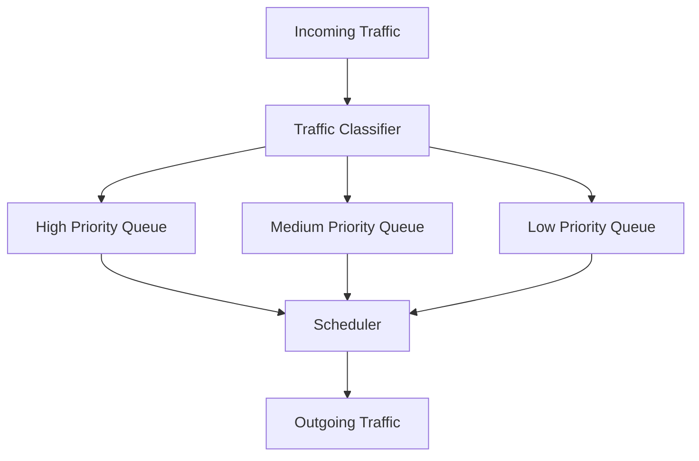
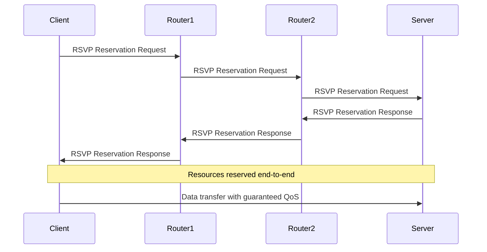
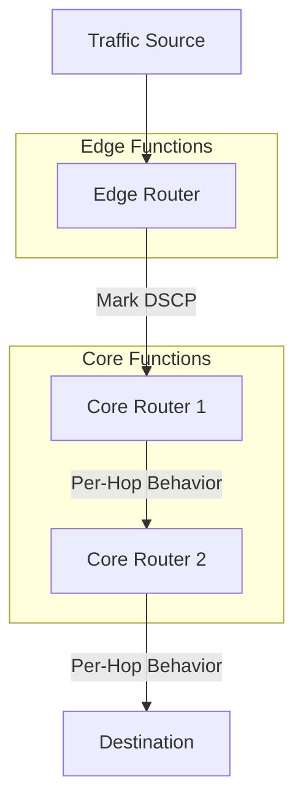

# Networks Quality of Service (QoS)

## Introduction

Quality of Service (QoS) refers to the set of technologies and mechanisms that allow networks to efficiently manage their traffic based on priorities and requirements. In today's interconnected world, networks must handle diverse applications with varying performance needs – from delay-sensitive video conferencing to bandwidth-hungry file transfers. QoS provides the framework to ensure that each type of traffic receives appropriate treatment.

In this tutorial, we'll explore how QoS works at the transport layer, its key mechanisms, and how it enables networks to deliver consistent performance for critical applications even under constrained conditions.

## Why QoS Matters

Imagine a hospital network carrying both life-critical patient monitoring data and staff watching YouTube videos. Without QoS, both traffic types would compete equally for bandwidth. With proper QoS implementation, the network can prioritize patient data over video streaming during congestion.

## Key QoS Parameters

QoS mechanisms focus on controlling several critical network parameters:

1. **Bandwidth** - The maximum data transfer rate
2. **Latency** - Delay between sending and receiving data
3. **Jitter** - Variation in packet delay
4. **Packet Loss** - Percentage of packets that fail to reach their destination

Different applications have different requirements for these parameters:

| Application Type | Bandwidth | Latency | Jitter | Packet Loss Tolerance |
|------------------|-----------|---------|--------|------------------------|
| Voice/Video      | Moderate  | Low     | Low    | Very Low              |
| Web Browsing     | Moderate  | Medium  | Medium | Medium                |
| File Transfer    | High      | High    | High   | Low                   |
| Gaming           | Low       | Very Low| Low    | Very Low              |

## How QoS Works at the Transport Layer

The transport layer plays a crucial role in QoS implementation through several mechanisms:

### 1. Traffic Classification and Marking

Before traffic can be prioritized, it must be identified and classified. The transport layer helps with this by:

- Examining port numbers (HTTP uses port 80, VoIP might use port 5060)
- Looking at protocol information (TCP vs. UDP)
- Analyzing traffic patterns

Once classified, packets are marked with priority information using fields like:
- Type of Service (ToS) in IPv4
- Traffic Class in IPv6
- Differentiated Services Code Point (DSCP)

Let's see how we might mark packets in a Python network application:

```python
import socket

# Create a socket
s = socket.socket(socket.AF_INET, socket.SOCK_STREAM)

# Set ToS (Type of Service) for QoS - this sets the DSCP field
# 0x68 corresponds to Expedited Forwarding (EF) - highest priority
s.setsockopt(socket.IPPROTO_IP, socket.IP_TOS, 0x68)

# Now any traffic sent through this socket will be marked as high priority
s.connect(("example.com", 80))
```

### 2. Queue Management

Once traffic is classified, it needs to be queued appropriately:



The transport layer implements different queuing strategies:

- **Priority Queuing (PQ)**: Highest priority traffic is always sent first
- **Weighted Fair Queuing (WFQ)**: Allocates bandwidth proportionally
- **Class-Based Queuing (CBQ)**: Divides bandwidth among traffic classes

### 3. Traffic Shaping and Policing

The transport layer can control traffic flow using:

**Traffic Shaping**: Buffering and delaying packets to control output rate
**Traffic Policing**: Dropping packets that exceed defined limits

Here's a simplified example of traffic shaping logic:

```python
def traffic_shaper(packet, token_bucket, rate):
    # Check if we have enough tokens (bandwidth) to send the packet
    if token_bucket >= packet.size:
        # We have enough tokens, send the packet
        token_bucket -= packet.size
        send_packet(packet)
    else:
        # Not enough tokens, delay the packet
        queue.add(packet)
    
    # Replenish tokens at the specified rate
    token_bucket += rate
    
    # If we have enough tokens now, send queued packets
    while queue and token_bucket >= queue.peek().size:
        delayed_packet = queue.pop()
        token_bucket -= delayed_packet.size
        send_packet(delayed_packet)
```

## QoS Mechanisms in TCP vs. UDP

TCP and UDP handle QoS differently due to their fundamental designs:

### TCP QoS Features

TCP inherently provides some QoS through:

- **Flow Control**: Preventing sender from overwhelming receiver
- **Congestion Control**: Reducing sending rate when network is congested
- **Reliable Delivery**: Retransmitting lost packets

Let's look at how TCP's congestion window adapts to network conditions:

```python
def tcp_congestion_control():
    # Initial values
    cwnd = 1  # Congestion window in segments
    ssthresh = 65535  # Slow start threshold
    
    # Loop for each ACK received
    while receiving_data:
        if ack_received:
            if cwnd < ssthresh:
                # Slow start phase - exponential growth
                cwnd *= 2
            else:
                # Congestion avoidance phase - linear growth
                cwnd += 1/cwnd
        elif timeout or duplicate_acks == 3:
            # Congestion detected
            ssthresh = cwnd / 2
            cwnd = 1
            # Retransmit lost segment
```

### UDP QoS Challenges

UDP lacks built-in QoS mechanisms, but it's often used for real-time applications because:

- Lower overhead (no connection setup, smaller headers)
- No retransmission delays
- Application control over sending rate

When using UDP for QoS-sensitive applications, developers must implement QoS at the application layer:

```python
import socket
import time

def send_real_time_data(data, destination, priority):
    sock = socket.socket(socket.AF_INET, socket.SOCK_DGRAM)
    
    # Set QoS priority in IP header
    sock.setsockopt(socket.IPPROTO_IP, socket.IP_TOS, priority)
    
    # Add timestamp to check jitter
    timestamped_data = f"{time.time()}:{data}"
    
    # Send the data
    sock.sendto(timestamped_data.encode(), destination)
    
# Usage example for high-priority voice data
send_real_time_data("voice_packet_data", ("10.0.0.1", 5060), 0x68)  # EF DSCP marking
```

## QoS Implementation Examples

### Example 1: Differentiated Web Services

Imagine running a web service with both free and premium tiers:

```python
def handle_request(request, client_ip):
    # Check if client is premium
    if client_ip in premium_subscribers:
        # Mark as high priority
        request.set_priority(HIGH_PRIORITY)
        # Allocate from premium bandwidth pool
        bandwidth_pool = premium_pool
    else:
        # Mark as standard priority
        request.set_priority(STANDARD_PRIORITY)
        # Allocate from standard bandwidth pool
        bandwidth_pool = standard_pool
    
    # Process request with appropriate resources
    response = process_with_qos(request, bandwidth_pool)
    return response
```

### Example 2: Video Streaming with Adaptive QoS

Modern video streaming services implement adaptive QoS:

```javascript
function setupAdaptiveStreaming(videoElement) {
  const player = new AdaptivePlayer({
    videoElement: videoElement,
    initialQuality: 'auto'
  });
  
  player.on('bandwidth-change', (availableBandwidth) => {
    // Switch video quality based on available bandwidth
    if (availableBandwidth > 5000000) { // 5 Mbps
      player.setQuality('high');
    } else if (availableBandwidth > 1500000) { // 1.5 Mbps
      player.setQuality('medium');
    } else {
      player.setQuality('low');
    }
    
    console.log(`Bandwidth: ${availableBandwidth} bps, Quality: ${player.currentQuality}`);
  });
  
  player.on('buffer-health', (bufferTime) => {
    // Adjust playback based on buffer health
    if (bufferTime < 2) { // Less than 2 seconds buffered
      // Reduce quality to prevent stalling
      player.setMaxQuality('low');
    } else if (bufferTime > 10) { // More than 10 seconds buffered
      // Allow higher quality
      player.setMaxQuality('high');
    }
  });
}
```

## Real-World QoS Architectures

Two main QoS architectures are used in modern networks:

### 1. Integrated Services (IntServ)

IntServ provides guaranteed service quality by reserving resources end-to-end:



### 2. Differentiated Services (DiffServ)

DiffServ scales better by classifying traffic into service classes:



## Transport Layer Protocols with QoS Support

Several specialized transport protocols provide enhanced QoS:

### 1. Real-time Transport Protocol (RTP)

RTP provides end-to-end delivery services for real-time data:

```python
import rtplib  # Hypothetical library

# Create RTP session
session = rtplib.RTPSession()

# Configure QoS parameters
session.set_qos(jitter_buffer_ms=50, priority=rtplib.PRIORITY_REALTIME)

# Send audio packet with timestamp
session.send_packet(audio_data, timestamp=current_time_ms)

# Receive and handle incoming packets
def handle_incoming(packet):
    # Check packet delay
    delay = current_time_ms - packet.timestamp
    if delay > MAX_ACCEPTABLE_DELAY:
        # Too late to be useful, discard
        return
    
    # Process packet
    play_audio(packet.data)

session.on_receive(handle_incoming)
```

### 2. Stream Control Transmission Protocol (SCTP)

SCTP provides multi-streaming and multi-homing for improved reliability:

```python
import socket
import sctp  # Hypothetical SCTP library

# Create SCTP socket
s = sctp.SCTPSocket()

# Configure SCTP for QoS
s.configure(
    max_streams=5,  # Support 5 independent streams
    partial_reliability=True,  # Allow timed reliability
    priority_enabled=True  # Enable stream priorities
)

# Connect with multi-homing (multiple network paths)
s.connect(("server.example.com", 9000), 
          alternate_addresses=["10.0.0.1", "192.168.1.1"])

# Send on different streams with priorities
s.send(critical_data, stream=0, priority=10)  # High priority
s.send(normal_data, stream=1, priority=5)     # Medium priority
s.send(bulk_data, stream=2, priority=1)       # Low priority

# Set time-based reliability for some data
s.send(time_sensitive_data, stream=3, lifetime_ms=100)
# If not delivered within 100ms, packet will be abandoned
```

## Measuring and Monitoring QoS

To ensure QoS is working effectively, continuous monitoring is essential:

```python
def monitor_network_qos():
    # Initialize metrics
    metrics = {
        'latency': [],
        'jitter': [],
        'packet_loss': [],
        'throughput': []
    }
    
    while True:
        # Measure round-trip time
        start_time = time.time()
        response = send_probe_packet()
        if response:
            rtt = time.time() - start_time
            metrics['latency'].append(rtt)
            
            # Calculate jitter (variation in latency)
            if len(metrics['latency']) > 1:
                jitter = abs(metrics['latency'][-1] - metrics['latency'][-2])
                metrics['jitter'].append(jitter)
            
            # Measure throughput
            bytes_received = len(response)
            metrics['throughput'].append(bytes_received / rtt)
        else:
            # Packet was lost
            metrics['packet_loss'].append(1)
        
        # Sleep before next measurement
        time.sleep(1)
        
        # Analyze metrics periodically
        if len(metrics['latency']) % 60 == 0:
            analyze_qos_metrics(metrics)
```

## Common QoS Challenges and Solutions

| Challenge | Solution |
|-----------|----------|
| Limited bandwidth | Traffic prioritization and bandwidth allocation |
| High latency | Path optimization and traffic engineering |
| Bursty traffic | Traffic shaping and buffer management |
| Mixed traffic types | Classification and appropriate queuing strategies |
| Encrypted traffic | Machine learning for traffic classification |

## Summary

Quality of Service is an essential set of mechanisms that enables networks to deliver consistent performance for diverse applications with different requirements. At the transport layer, QoS relies on:

1. Traffic classification and marking
2. Queue management techniques
3. Traffic shaping and policing
4. Specialized transport protocols

By implementing effective QoS strategies, network administrators can ensure:
- Critical applications receive necessary resources
- Users experience consistent performance
- Network resources are utilized efficiently

## Exercises

1. Configure a simple Python socket to set the DSCP field for different types of traffic.
2. Implement a basic token bucket algorithm for traffic shaping.
3. Create a program that measures and reports on network QoS parameters (latency, jitter, packet loss).
4. Research how your home router implements QoS and experiment with its settings.
5. Compare the performance of TCP vs. UDP for real-time applications under constrained network conditions.

## Additional Resources

- RFC 2474: Definition of the Differentiated Services Field
- RFC 3550: RTP: A Transport Protocol for Real-Time Applications
- RFC 4960: Stream Control Transmission Protocol
- RFC 2205: Resource ReSerVation Protocol (RSVP)
- Books: "Computer Networks" by Andrew S. Tanenbaum