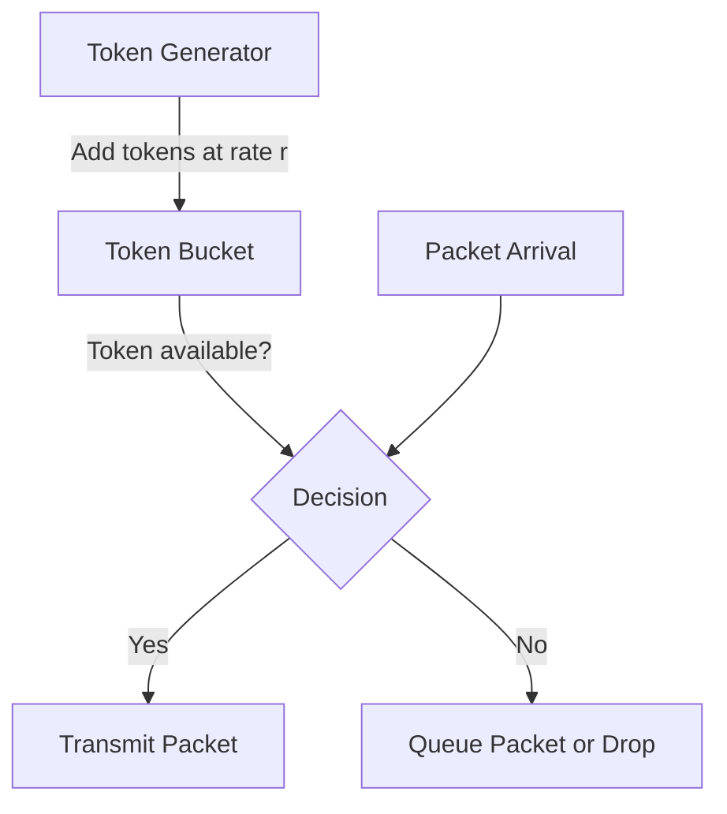
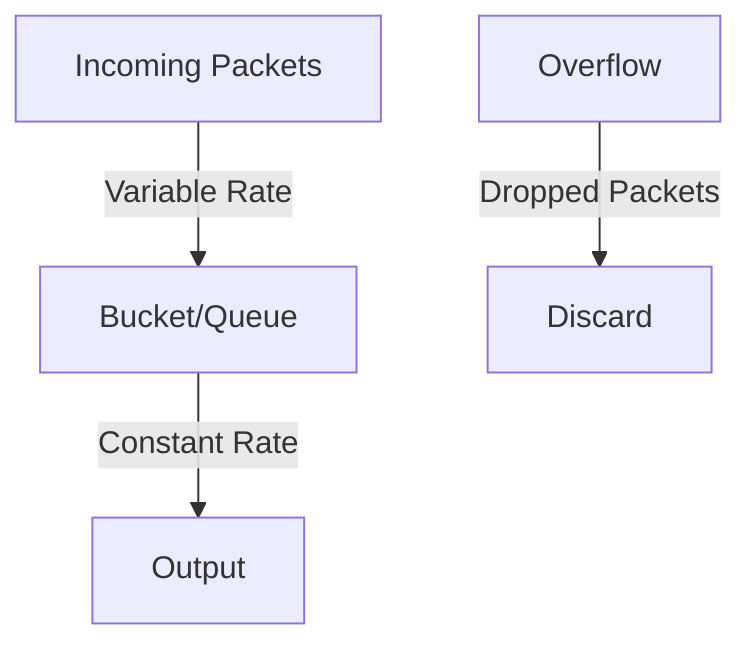

# Networks Traffic Shaping

## Introduction

Traffic shaping is a critical technique in network management that controls the volume of data traffic sent into a network in a specified time period. It essentially regulates network data transfer to ensure consistent network performance and improve latency. Think of traffic shaping as similar to how highway metering lights regulate the flow of vehicles onto busy freeways during rush hour - without it, network congestion can cause poor performance for all users.

In this tutorial, we'll explore how traffic shaping works at the transport layer, various mechanisms used to implement it, and real-world applications that demonstrate its importance in modern networks.

## What is Traffic Shaping?

Traffic shaping is the practice of regulating network data transfer to ensure a certain level of performance, reliability, and latency. Unlike traffic policing (which simply drops packets exceeding defined limits), traffic shaping temporarily stores packets in queues and schedules their transmission according to configurable rules.

### Key Objectives of Traffic Shaping

- **Control network congestion**: Prevent network overload
- **Reduce packet loss**: Buffer packets rather than dropping them
- **Manage bandwidth allocation**: Prioritize critical applications
- **Ensure Quality of Service (QoS)**: Maintain predictable performance
- **Delay less time-sensitive packets**: Prioritize real-time traffic

## Traffic Shaping Mechanisms

Let's look at the common mechanisms used to implement traffic shaping:

### 1. Token Bucket Algorithm

The token bucket algorithm is one of the most popular traffic shaping mechanisms. Here's how it works:



In this algorithm:
- Tokens are generated at a constant rate and placed in a bucket
- Each token represents permission to send a certain amount of data (usually 1 byte)
- When a packet arrives, it needs to collect enough tokens to be transmitted
- If sufficient tokens are available, the packet is transmitted immediately
- If not enough tokens are available, the packet is either queued or dropped

Here's a simple Python implementation of the token bucket algorithm:

```python
class TokenBucket:
    def __init__(self, token_rate, bucket_size):
        self.token_rate = token_rate  # tokens per second
        self.bucket_size = bucket_size  # maximum bucket capacity
        self.tokens = bucket_size  # start with a full bucket
        self.last_update = time.time()
        
    def update_tokens(self):
        now = time.time()
        time_passed = now - self.last_update
        new_tokens = time_passed * self.token_rate
        
        # Update token count and timestamp
        self.tokens = min(self.bucket_size, self.tokens + new_tokens)
        self.last_update = now
        
    def can_send(self, packet_size):
        self.update_tokens()
        if packet_size <= self.tokens:
            self.tokens -= packet_size
            return True
        return False
        
    def queue_packet(self, packet):
        # Implementation for queuing packets
        pass
```

### 2. Leaky Bucket Algorithm

The leaky bucket algorithm works similar to how a leaky bucket handles water - packets "leak" out at a constant rate regardless of input flow:



The leaky bucket:
- Outputs packets at a fixed rate
- Has a finite queue capacity
- Drops packets when the queue is full
- Maintains a consistent output regardless of input bursts

### 3. Rate Limiting

Rate limiting simply restricts the number of requests or data volume within a specified time window. Common implementations include:

- **Fixed Window**: Counts events in fixed time intervals
- **Sliding Window**: Uses a rolling time window
- **Sliding Window Counter**: Combines fixed windows with weighted values

## Configuring Traffic Shaping in Practice

Let's look at how traffic shaping might be configured in different environments:

### Linux Traffic Control (tc)

Linux provides powerful traffic control capabilities through the `tc` command. Here's an example of configuring a token bucket filter:

```bash
# Configure a token bucket with rate of 1Mbps and burst of 10KB
tc qdisc add dev eth0 root tbf rate 1mbit burst 10kb latency 50ms
```

This command:
- Adds a queuing discipline to network interface eth0
- Uses token bucket filter (tbf)
- Sets rate limit to 1 megabit per second
- Sets burst size to 10 kilobytes
- Sets maximum latency to 50ms before packets are dropped

### Cisco Router Configuration

On Cisco routers, traffic shaping can be configured with commands like:

```
Router(config)# policy-map SHAPE-POLICY
Router(config-pmap)# class class-default
Router(config-pmap-c)# shape average 512000 5120 0
Router(config)# interface GigabitEthernet0/1
Router(config-if)# service-policy output SHAPE-POLICY
```

This configuration:
- Creates a policy named SHAPE-POLICY
- Applies it to the default traffic class
- Shapes traffic to an average of 512 kbps
- Sets burst size to 5120 bytes
- Applies the policy to outgoing traffic on GigabitEthernet0/1

## Real-World Applications

### Video Streaming Services

Video streaming platforms use traffic shaping to provide smooth playback even under varying network conditions:

```javascript
const videoStream = {
  setQualityBasedOnBandwidth: function(availableBandwidth) {
    if (availableBandwidth > 5000) {  // 5 Mbps
      return "HD";
    } else if (availableBandwidth > 2000) {  // 2 Mbps
      return "SD";
    } else {
      return "LOW";
    }
  },
  
  adaptiveBitrate: function(networkCondition) {
    // Monitor network conditions and adjust video quality
    setInterval(() => {
      const currentBandwidth = measureBandwidth();
      const newQuality = this.setQualityBasedOnBandwidth(currentBandwidth);
      changeVideoQuality(newQuality);
    }, 5000);
  }
};
```

### ISP Bandwidth Management

Internet Service Providers often employ traffic shaping to:
- Limit bandwidth consumption of high-volume applications
- Prioritize time-sensitive services like VoIP
- Implement fair usage policies during peak hours
- Provide different service tiers to customers

### Enterprise Network QoS

In enterprise networks, traffic shaping helps IT departments:
- Prioritize business-critical applications
- Limit bandwidth for recreational usage
- Ensure VoIP and video conferencing quality
- Prevent a single department from consuming all available bandwidth

## Implementing a Basic Traffic Shaper

Let's create a basic traffic shaper in Python that simulates network packet transmission with rate limiting:

```python
import time
import queue
import threading

class BasicTrafficShaper:
    def __init__(self, rate_limit_bps):
        self.rate_limit_bps = rate_limit_bps  # bits per second
        self.queue = queue.Queue()
        self.running = False
        
    def start(self):
        self.running = True
        self.thread = threading.Thread(target=self._process_queue)
        self.thread.daemon = True
        self.thread.start()
        
    def stop(self):
        self.running = False
        self.thread.join()
        
    def send_packet(self, packet):
        self.queue.put(packet)
        
    def _process_queue(self):
        while self.running:
            if not self.queue.empty():
                packet = self.queue.get()
                
                # Calculate how long to wait based on packet size and rate limit
                packet_size_bits = len(packet) * 8
                delay = packet_size_bits / self.rate_limit_bps
                
                # Sleep to enforce the rate limit
                time.sleep(delay)
                
                # Simulate sending the packet
                print(f"Sent packet of size {len(packet)} bytes")
            else:
                time.sleep(0.01)  # Small sleep when queue is empty

# Example usage
if __name__ == "__main__":
    shaper = BasicTrafficShaper(rate_limit_bps=8000)  # 1 KB/s
    shaper.start()
    
    # Send some packets
    for i in range(10):
        packet = b'X' * 1000  # 1000 byte packet
        print(f"Queuing packet {i}")
        shaper.send_packet(packet)
    
    # Let all packets get processed
    time.sleep(15)
    shaper.stop()
```

Output:
```
Queuing packet 0
Queuing packet 1
Queuing packet 2
Queuing packet 3
Queuing packet 4
Queuing packet 5
Queuing packet 6
Queuing packet 7
Queuing packet 8
Queuing packet 9
Sent packet of size 1000 bytes
Sent packet of size 1000 bytes
Sent packet of size 1000 bytes
Sent packet of size 1000 bytes
Sent packet of size 1000 bytes
Sent packet of size 1000 bytes
Sent packet of size 1000 bytes
Sent packet of size 1000 bytes
Sent packet of size 1000 bytes
Sent packet of size 1000 bytes
```

Notice how the packets are queued immediately but sent at a controlled rate.

## Traffic Shaping vs. Traffic Policing

It's important to understand the difference between traffic shaping and traffic policing:

| Feature | Traffic Shaping | Traffic Policing |
|---------|----------------|-----------------|
| Method | Delays excess packets | Drops excess packets |
| Buffer | Uses queues | No buffering |
| Burst handling | Smooths traffic | Allows bursts up to limit |
| Impact on TCP | Minimal impact | Can cause retransmissions |
| Delay | Introduces delay | No added delay |
| Application | Outbound traffic | Inbound or outbound |

## Challenges and Considerations

When implementing traffic shaping, consider these challenges:

1. **Buffer Bloat**: Excessive buffering can lead to high latency
2. **Fairness**: Ensuring equitable resource allocation among users
3. **Overhead**: Traffic shaping adds processing overhead
4. **Configuration Complexity**: Proper configuration requires network expertise
5. **Dynamic Adaptation**: Networks with variable conditions need adaptive approaches

## Summary

Traffic shaping is an essential technique for managing network resources effectively. By controlling the rate and volume of data transmitted across networks, it helps prevent congestion, reduce packet loss, and maintain service quality.

Key takeaways from this tutorial:
- Traffic shaping regulates data flow to ensure consistent network performance
- Common algorithms include token bucket and leaky bucket
- Traffic shaping differs from policing by delaying rather than dropping packets
- Practical applications include streaming services, ISP management, and enterprise QoS
- Implementation requires consideration of various factors like buffer sizes and rate limits

## Exercises

1. Implement a leaky bucket algorithm in Python and compare its behavior to the token bucket algorithm.
2. Create a traffic shaper that can dynamically adjust its rate based on current network conditions.
3. Design a QoS system that prioritizes different types of network traffic (e.g., VoIP, web browsing, file downloads).
4. Research how different streaming platforms implement adaptive bitrate streaming and traffic shaping.
5. Experiment with the Linux `tc` command to shape traffic on a test network and measure the effects.

## Additional Resources

- RFC 2475: "An Architecture for Differentiated Services"
- RFC 3290: "An Informal Management Model for Diffserv Routers"
- Books on network management and QoS techniques
- Open-source traffic control projects like Linux tc and OpenWrt QoS