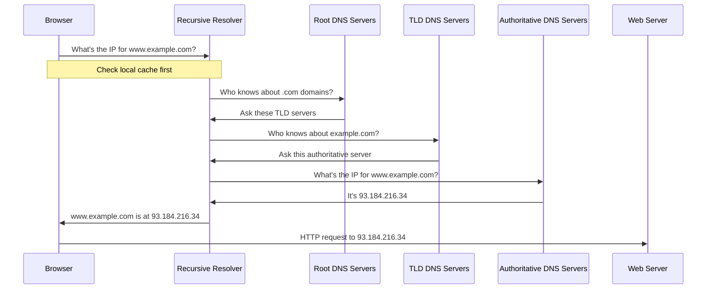

# Domain Name System (DNS)

## Introduction

The Domain Name System (DNS) is often described as the "phone book of the Internet." It's a fundamental component of how we navigate online, allowing us to use human-readable domain names (like `example.com`) instead of numerical IP addresses (like `93.184.216.34`). 

Imagine having to remember IP addresses for every website you visit! DNS is the crucial service that translates the domain names we can easily remember into the numerical addresses that computers use to identify each other on the network.

## How DNS Works

At its core, DNS is a hierarchical, distributed database that translates domain names to IP addresses and vice versa. Let's break down how this process works step by step:

### The DNS Resolution Process

When you type a URL like `www.example.com` into your browser, a series of steps occur:

1. **Local DNS Cache Check**: Your computer first checks if it already knows the IP address from a previous visit by looking in its local DNS cache.

2. **Recursive DNS Server Query**: If the information isn't cached, your computer asks a recursive DNS server (typically provided by your ISP) for help.

3. **Root Server Query**: If the recursive server doesn't have the answer cached, it asks a root DNS server.

4. **TLD Server Query**: The root server directs the query to the appropriate Top-Level Domain (TLD) server (like `.com`, `.org`, etc.).

5. **Authoritative Server Query**: The TLD server points to the authoritative DNS server for the specific domain.

6. **Resolution**: The authoritative server returns the IP address to your recursive server, which passes it back to your computer.

7. **Connection**: Your browser can now connect to the web server at that IP address.

Let's visualize this process:



This entire process typically takes just milliseconds to complete!

## DNS Components and Hierarchy

The DNS system consists of several key components:

### Domain Name Space

The domain name space is organized in a hierarchical, inverted tree structure:

- **Root Domain**: Represented as a dot `.` at the top of the hierarchy
- **Top-Level Domains (TLDs)**: Such as `.com`, `.org`, `.net`, `.gov`, or country codes like `.uk`, `.jp`
- **Second-Level Domains**: The main part of the domain name (e.g., `example` in `example.com`)
- **Subdomains**: Additional levels (e.g., `blog` in `blog.example.com`)

### DNS Servers

Several types of servers work together to make DNS function:

- **Root Servers**: 13 sets of root name servers distributed worldwide
- **TLD Servers**: Manage domains for specific TLDs
- **Authoritative Servers**: Provide the actual mapping of domain names to IP addresses
- **Recursive Resolvers**: Servers that query the DNS hierarchy on behalf of clients

### Resource Records

DNS databases store different types of records:

- **A Record**: Maps a domain name to an IPv4 address
- **AAAA Record**: Maps a domain name to an IPv6 address
- **CNAME Record**: Creates an alias from one domain to another
- **MX Record**: Specifies mail servers for the domain
- **TXT Record**: Stores text information (often used for verification)
- **NS Record**: Indicates which name servers are authoritative for a domain

## Working with DNS in Practice

Let's look at some practical examples of interacting with DNS:

### Querying DNS with Command Line Tools

#### Using `nslookup`

The `nslookup` command is a simple way to query DNS records:

```bash
$ nslookup example.com
Server:    192.168.1.1
Address:   192.168.1.1#53

Non-authoritative answer:
Name:    example.com
Address: 93.184.216.34
```

#### Using `dig`

`dig` provides more detailed DNS information:

```bash
$ dig example.com

; <<>> DiG 9.16.1-Ubuntu <<>> example.com
;; global options: +cmd
;; Got answer:
;; ->>HEADER<<- opcode: QUERY, status: NOERROR, id: 31589
;; flags: qr rd ra; QUERY: 1, ANSWER: 1, AUTHORITY: 0, ADDITIONAL: 1

;; OPT PSEUDOSECTION:
; EDNS: version: 0, flags:; udp: 65494
;; QUESTION SECTION:
;example.com.                   IN      A

;; ANSWER SECTION:
example.com.            86400   IN      A       93.184.216.34

;; Query time: 52 msec
;; SERVER: 192.168.1.1#53(192.168.1.1)
;; WHEN: Mon Mar 15 15:00:00 EDT 2025
;; MSG SIZE  rcvd: 56
```

### Programming with DNS

#### DNS Lookup in Python

Here's how to perform a DNS lookup in Python using the `socket` module:

```python
import socket

# Get IPv4 address
ip_address = socket.gethostbyname("example.com")
print(f"IPv4 Address: {ip_address}")

# Get more detailed information
try:
    host_info = socket.getaddrinfo("example.com", 80)
    for info in host_info:
        print(f"Family: {info[0]}, Type: {info[1]}, Protocol: {info[2]}")
        print(f"Canonical name: {info[3]}")
        print(f"Socket address: {info[4]}")
except socket.gaierror as e:
    print(f"Error resolving hostname: {e}")
```

Output:
```
IPv4 Address: 93.184.216.34
Family: 2, Type: 1, Protocol: 6
Canonical name: 
Socket address: ('93.184.216.34', 80)
Family: 2, Type: 2, Protocol: 17
Canonical name: 
Socket address: ('93.184.216.34', 80)
```

#### DNS Lookup in JavaScript (Node.js)

Using the built-in `dns` module in Node.js:

```javascript
const dns = require('dns');

// Lookup IPv4 address
dns.lookup('example.com', (err, address, family) => {
  if (err) throw err;
  console.log(`Address: ${address}, Family: IPv${family}`);
});

// Resolve all records
dns.resolve('example.com', (err, addresses) => {
  if (err) throw err;
  console.log('Addresses:', addresses);
});

// Get specific record types
dns.resolve4('example.com', (err, addresses) => {
  if (err) throw err;
  console.log('IPv4 addresses:', addresses);
});

// MX records
dns.resolveMx('example.com', (err, addresses) => {
  if (err) throw err;
  console.log('Mail servers:', addresses);
});
```

Output:
```
Address: 93.184.216.34, Family: IPv4
IPv4 addresses: [ '93.184.216.34' ]
Addresses: [ '93.184.216.34' ]
Mail servers: [ { priority: 10, exchange: 'mail.example.com' } ]
```

## DNS in the Real World

### Use Cases and Applications

1. **Load Balancing**: DNS can distribute traffic across multiple servers for better performance and reliability.

2. **Content Delivery Networks (CDNs)**: DNS helps route users to the nearest CDN edge server.

3. **Geolocation Services**: DNS can direct users to servers based on their geographic location.

4. **Service Discovery**: Used in microservices architectures to locate services dynamically.

5. **Email Routing**: MX records ensure emails reach the correct mail servers.

### DNS Security Concerns

DNS has several security concerns that network professionals need to address:

1. **DNS Spoofing/Cache Poisoning**: Attackers can corrupt DNS caches to redirect users to malicious sites.

2. **DNS Amplification Attacks**: DNS servers can be used in DDoS attacks.

3. **DNS Tunneling**: Malicious actors can use DNS queries to exfiltrate data.

### DNS Security Extensions (DNSSEC)

DNSSEC adds an additional layer of security to DNS:

- It digitally signs DNS records to ensure authenticity
- Helps prevent cache poisoning attacks
- Validates that the DNS response came from the correct server

## Setting Up Your Own DNS Server

For educational purposes or small networks, you might want to set up your own DNS server. Here's a basic example using BIND9, a popular DNS server software:

### Basic BIND9 Configuration

The following is a simplified configuration for a local DNS server:

```bash
# Install BIND9 on Ubuntu/Debian
$ sudo apt update
$ sudo apt install bind9

# Main configuration file: /etc/bind/named.conf.local
# Add a zone:
zone "example.local" {
    type master;
    file "/etc/bind/zones/db.example.local";
};

# Create zone file: /etc/bind/zones/db.example.local
$TTL    604800
@       IN      SOA     ns1.example.local. admin.example.local. (
                  3     ; Serial
             604800     ; Refresh
              86400     ; Retry
            2419200     ; Expire
             604800 )   ; Negative Cache TTL
;
@       IN      NS      ns1.example.local.
@       IN      A       192.168.1.10
ns1     IN      A       192.168.1.10
www     IN      A       192.168.1.20
mail    IN      A       192.168.1.30
mail    IN      MX 10   mail.example.local.
```

After making changes, restart the service:

```bash
$ sudo systemctl restart bind9
```

## DNS Best Practices

When working with DNS in professional settings:

1. **Implement Redundancy**: Have multiple DNS servers to avoid single points of failure.

2. **Manage TTL Values**: Set appropriate Time-To-Live values for DNS records.

3. **Use DNSSEC**: Implement DNS Security Extensions for sensitive domains.

4. **Monitor DNS Performance**: Keep track of resolution times and failures.

5. **Regularly Audit DNS Records**: Ensure all records are current and necessary.

6. **Document DNS Architecture**: Maintain clear documentation of your DNS setup.

## Summary

DNS is a critical component of the Internet's infrastructure that:

- Translates human-readable domain names to IP addresses
- Operates as a hierarchical, distributed database
- Functions through a series of queries between different types of servers
- Provides various record types for different purposes
- Supports the foundation for many Internet services and applications

Understanding DNS is essential for anyone working with networks, web development, or system administration. It's one of the fundamental services that makes the Internet usable for everyday people.

## Further Learning

To deepen your understanding of DNS:

- Experiment with DNS lookup tools like `dig`, `nslookup`, and `whois`
- Set up a local DNS server for practice
- Explore advanced topics like DNSSEC, DNS over HTTPS (DoH), and DNS over TLS (DoT)

## Exercises

1. Use command line tools to look up different types of DNS records (A, MX, CNAME, TXT) for a popular website.

2. Write a small program in your preferred language that performs DNS lookups and displays the results.

3. Set up a local DNS server and configure it to resolve custom domain names within your network.

4. Research how DNS is used in your favorite online services or applications.

5. Diagram the DNS resolution process for a domain with multiple subdomains.