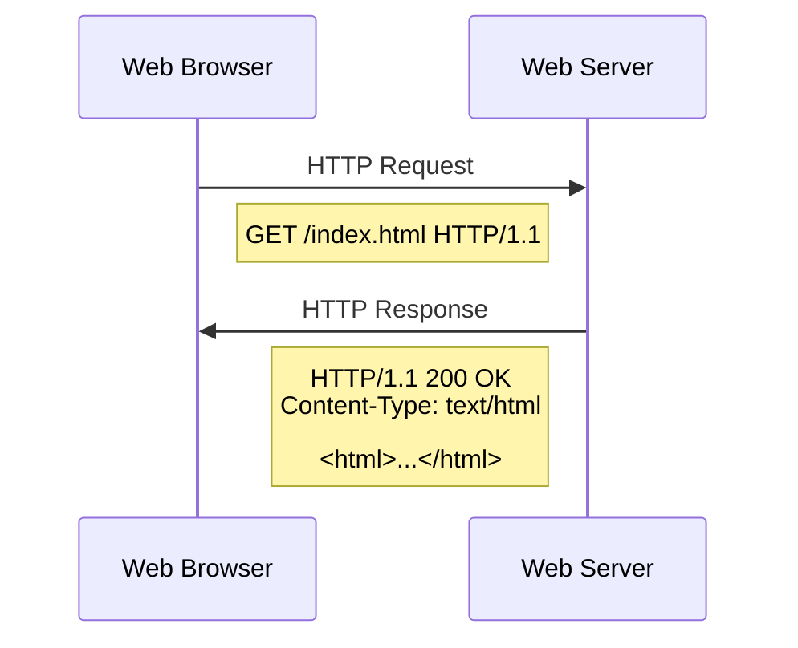

# HTTP: The Foundation of Web Communication

## Introduction

Hypertext Transfer Protocol (HTTP) is the backbone of data communication on the World Wide Web. Whenever you visit a website, your browser uses HTTP to request web pages from servers across the internet. As a beginner programmer, understanding HTTP is crucial because it forms the foundation of modern web applications.

In this tutorial, we'll explore how HTTP works, its key features, and how you can use it in your own programming projects. By the end, you'll have a solid understanding of this fundamental protocol that powers the web.

## What is HTTP?

HTTP (Hypertext Transfer Protocol) is an application layer protocol designed for distributed, collaborative, hypermedia information systems. In simpler terms, it's a set of rules that governs how web browsers and web servers communicate with each other.

### Key Characteristics of HTTP

- **Client-Server Model**: HTTP follows a client-server architecture where the client (usually a web browser) initiates requests, and the server responds to those requests.
- **Stateless**: Each request is independent and has no knowledge of previous requests.
- **Text-Based**: HTTP messages are human-readable, making debugging easier.
- **Media Independent**: HTTP can transfer any type of data as long as both client and server understand how to process the content type.

## HTTP Request/Response Cycle

At its core, HTTP is a request-response protocol. Let's break down how it works:



1. **The Client Sends a Request**: When you type a URL in your browser or click a link, your browser creates an HTTP request.
2. **The Server Processes the Request**: The web server receives the request, processes it, and prepares a response.
3. **The Server Sends a Response**: The server sends back an HTTP response containing the requested data and a status code.
4. **The Client Processes the Response**: Your browser renders the HTML, loads images, executes JavaScript, etc.

## HTTP Methods

HTTP defines several request methods that indicate the desired action to be performed on the resource. The most common ones are:

| Method | Purpose | Idempotent | Safe |
|--------|---------|------------|------|
| GET | Retrieve data from the server | Yes | Yes |
| POST | Submit data to be processed | No | No |
| PUT | Update a resource on the server | Yes | No |
| DELETE | Remove a resource from the server | Yes | No |
| HEAD | Same as GET but only fetches headers | Yes | Yes |
| OPTIONS | Describes communication options for the resource | Yes | Yes |
| PATCH | Apply partial modifications to a resource | No | No |

> **Note**: A method is considered "safe" if it doesn't alter the state of the server. A method is "idempotent" if the result of multiple identical requests is the same as a single request.

### Example of a Simple GET Request

```
GET /index.html HTTP/1.1
Host: www.example.com
User-Agent: Mozilla/5.0
Accept: text/html
```

### Example of a POST Request with Data

```
POST /login HTTP/1.1
Host: www.example.com
Content-Type: application/x-www-form-urlencoded
Content-Length: 32

username=johndoe&password=secretpass
```

## HTTP Status Codes

When a server responds to an HTTP request, it includes a status code that indicates the outcome of the request:

| Category | Description |
|----------|-------------|
| 1xx (Informational) | Request received, continuing process |
| 2xx (Success) | The action was successfully received, understood, and accepted |
| 3xx (Redirection) | Further action needs to be taken to complete the request |
| 4xx (Client Error) | The request contains bad syntax or cannot be fulfilled |
| 5xx (Server Error) | The server failed to fulfill a valid request |

### Common Status Codes

- **200 OK**: The request has succeeded.
- **201 Created**: The request has been fulfilled and a new resource has been created.
- **301 Moved Permanently**: The requested resource has been moved permanently.
- **400 Bad Request**: The server cannot understand the request due to invalid syntax.
- **401 Unauthorized**: Authentication is required and has failed or not been provided.
- **404 Not Found**: The server cannot find the requested resource.
- **500 Internal Server Error**: The server encountered an unexpected condition.

## HTTP Headers

Headers provide additional information about the request or response, or about the object sent in the message body.

### Request Headers Example

```
GET /index.html HTTP/1.1
Host: www.example.com
User-Agent: Mozilla/5.0
Accept: text/html,application/xhtml+xml
Accept-Language: en-US,en;q=0.5
Accept-Encoding: gzip, deflate, br
Connection: keep-alive
```

### Response Headers Example

```
HTTP/1.1 200 OK
Date: Mon, 23 May 2023 22:38:34 GMT
Server: Apache/2.4.6 (CentOS)
Last-Modified: Wed, 8 Jan 2023 23:11:55 GMT
Content-Type: text/html; charset=UTF-8
Content-Length: 1653
Connection: close
```

## Creating a Simple HTTP Server in Node.js

Let's create a basic HTTP server to better understand how HTTP works:

```javascript
const http = require('http');

// Create HTTP server
const server = http.createServer((req, res) => {
  // Set HTTP status code and headers
  res.statusCode = 200;
  res.setHeader('Content-Type', 'text/plain');
  
  // Log request details
  console.log(`Received ${req.method} request for: ${req.url}`);
  
  // Send a response based on the URL
  if (req.url === '/') {
    res.end('Welcome to our homepage!
');
  } else if (req.url === '/about') {
    res.end('This is the about page.
');
  } else {
    res.statusCode = 404;
    res.end('404 Not Found
');
  }
});

// Listen on port 3000
server.listen(3000, 'localhost', () => {
  console.log('Server running at http://localhost:3000/');
});
```

To run this server:
1. Save the code to a file named `server.js`
2. Run `node server.js` in your terminal
3. Open your browser and navigate to `http://localhost:3000`

## Making HTTP Requests in JavaScript

### Using Fetch API (Modern Method)

```javascript
// Basic GET request
fetch('https://api.example.com/data')
  .then(response => {
    if (!response.ok) {
      throw new Error(`HTTP error! Status: ${response.status}`);
    }
    return response.json();
  })
  .then(data => {
    console.log('Data received:', data);
  })
  .catch(error => {
    console.error('Fetch error:', error);
  });

// POST request with data
fetch('https://api.example.com/submit', {
  method: 'POST',
  headers: {
    'Content-Type': 'application/json',
  },
  body: JSON.stringify({
    name: 'John',
    email: 'john@example.com'
  })
})
  .then(response => response.json())
  .then(data => console.log('Success:', data))
  .catch(error => console.error('Error:', error));
```

### Using XMLHttpRequest (Traditional Method)

```javascript
// Basic GET request
const xhr = new XMLHttpRequest();
xhr.open('GET', 'https://api.example.com/data', true);
xhr.onload = function() {
  if (xhr.status >= 200 && xhr.status < 300) {
    const data = JSON.parse(xhr.responseText);
    console.log('Data received:', data);
  } else {
    console.error('Request failed with status', xhr.status);
  }
};
xhr.onerror = function() {
  console.error('Network error occurred');
};
xhr.send();
```

## HTTP Versions

HTTP has evolved over the years to meet the changing needs of the web:

### HTTP/1.0 (1996)
- Basic functionality
- New connection for each request/response pair
- Limited header fields

### HTTP/1.1 (1997)
- Connection reuse (persistent connections)
- Chunked transfers
- Cache control mechanisms
- Content negotiation

### HTTP/2 (2015)
- Binary protocol instead of text
- Multiplexing (multiple requests over a single connection)
- Header compression
- Server push

### HTTP/3 (2022)
- Uses QUIC instead of TCP
- Improved performance on unreliable networks
- Better multiplexing
- Reduced connection establishment time

## HTTP Cookies

Cookies are small pieces of data stored on the client side that help overcome HTTP's stateless nature:

```javascript
// Setting a cookie in a server response (Node.js)
res.setHeader('Set-Cookie', 'username=john; Max-Age=3600; Path=/');

// Reading cookies in a server request (Node.js)
const cookies = req.headers.cookie;
console.log(cookies); // "username=john"
```

### Basic Cookie Properties

- **Name/Value**: The data stored in the cookie
- **Expires/Max-Age**: When the cookie should be deleted
- **Domain**: Which domains can receive the cookie
- **Path**: Which paths within the domain can use the cookie
- **Secure**: Only sent over HTTPS connections
- **HttpOnly**: Cannot be accessed via JavaScript
- **SameSite**: Controls when cookies are sent with cross-site requests

## Real-World Applications

### RESTful APIs

Most modern web services use HTTP as the foundation for RESTful APIs:

```javascript
// Example of a RESTful API client
async function getUserData(userId) {
  try {
    const response = await fetch(`https://api.example.com/users/${userId}`);
    if (!response.ok) {
      throw new Error(`HTTP error! Status: ${response.status}`);
    }
    return await response.json();
  } catch (error) {
    console.error('Error fetching user data:', error);
  }
}

// Creating a new resource
async function createUser(userData) {
  try {
    const response = await fetch('https://api.example.com/users', {
      method: 'POST',
      headers: {
        'Content-Type': 'application/json',
      },
      body: JSON.stringify(userData)
    });
    return await response.json();
  } catch (error) {
    console.error('Error creating user:', error);
  }
}
```

### Web Forms

HTTP is crucial for handling form submissions on websites:

```html
<form action="/submit" method="post">
  <label for="name">Name:</label>
  <input type="text" id="name" name="name" required /><br />
  
  <label for="email">Email:</label>
  <input type="email" id="email" name="email" required /><br />
  
  <label for="message">Message:</label>
  <textarea id="message" name="message" rows="4" required></textarea><br />
  
  <button type="submit">Submit</button>
</form>
```

## Security Considerations

### HTTPS

HTTPS is HTTP over TLS/SSL, which provides:
- Encryption (data privacy)
- Data integrity
- Authentication

### Common Security Headers

- **Content-Security-Policy**: Helps prevent cross-site scripting (XSS) attacks
- **Strict-Transport-Security**: Forces browsers to use HTTPS
- **X-Content-Type-Options**: Prevents MIME type sniffing
- **X-Frame-Options**: Protects against clickjacking
- **X-XSS-Protection**: Provides some XSS protection in older browsers

Example of setting security headers in a Node.js server:

```javascript
const http = require('http');

const server = http.createServer((req, res) => {
  // Security headers
  res.setHeader('Content-Security-Policy', "default-src 'self'");
  res.setHeader('Strict-Transport-Security', 'max-age=31536000; includeSubDomains');
  res.setHeader('X-Content-Type-Options', 'nosniff');
  res.setHeader('X-Frame-Options', 'DENY');
  res.setHeader('X-XSS-Protection', '1; mode=block');
  
  // Regular response
  res.statusCode = 200;
  res.setHeader('Content-Type', 'text/plain');
  res.end('Hello, secure world!
');
});

server.listen(3000);
```

## Summary

HTTP is the foundation of web communication, enabling browsers and servers to exchange data in a standardized way. Key points to remember:

- HTTP follows a client-server model where clients make requests and servers provide responses
- It's stateless, meaning each request is independent
- HTTP methods (GET, POST, PUT, DELETE) define the desired action
- Status codes indicate the result of the request (200 OK, 404 Not Found, etc.)
- Headers provide additional information about requests and responses
- Modern web development heavily relies on HTTP for APIs, form handling, and more

Understanding HTTP is essential for any web developer, as it underpins everything from simple static websites to complex web applications.

## Exercises

1. Create a simple HTTP server using Node.js that responds differently to different URL paths.
2. Write a client-side script that fetches data from a public API using the Fetch API.
3. Implement a basic form that submits data to a server and displays the response.
4. Use browser developer tools to analyze the HTTP requests and responses when visiting a website.
5. Create a simple RESTful API with endpoints for CRUD operations (Create, Read, Update, Delete).

## Additional Resources

- [MDN Web Docs: HTTP](https://developer.mozilla.org/en-US/docs/Web/HTTP)
- [HTTP Working Group](https://httpwg.org/)
- [REST API Design Best Practices](https://restfulapi.net/)
- [HTTP Status Codes](https://httpstatuses.com/)
- [Postman: API Development Tool](https://www.postman.com/)