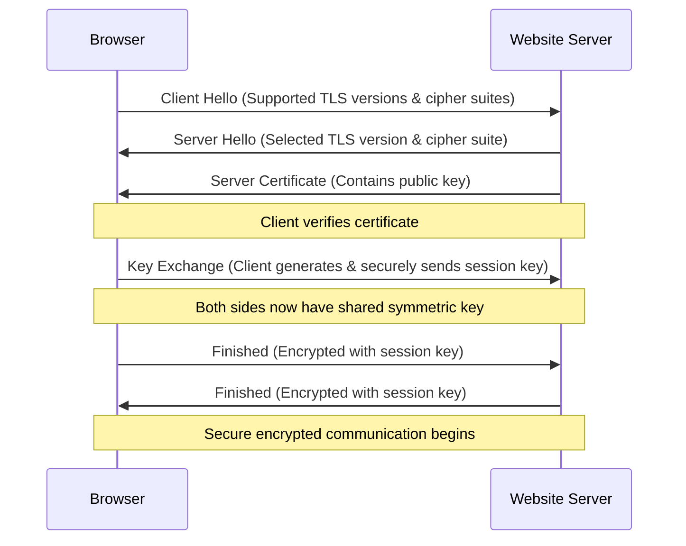

# Understanding HTTPS

## Introduction

Have you ever noticed the small padlock icon in your browser's address bar when visiting websites? That's HTTPS in action! HTTPS (Hypertext Transfer Protocol Secure) is a fundamental protocol that secures the connection between your browser and the websites you visit. In this guide, we'll explore how HTTPS works, why it's crucial for modern web applications, and how you can implement it in your own projects.

## What is HTTPS?

HTTPS is the secure version of HTTP (Hypertext Transfer Protocol), which is the primary protocol used for transferring data between a web browser and a website. While HTTP sends data in plaintext, HTTPS encrypts this communication, providing:

- **Data confidentiality**: Encrypts data so only the intended recipient can read it
- **Data integrity**: Ensures data hasn't been modified during transmission
- **Authentication**: Verifies you're communicating with the intended website

HTTPS accomplishes this by adding a security layer through SSL/TLS (Secure Sockets Layer/Transport Layer Security) protocols.

## How HTTPS Works

HTTPS works by establishing a secure encrypted connection between the client (browser) and the server using a process known as the "TLS handshake."



Let's break down this process:

1. **Client Hello**: The browser connects to the HTTPS server and sends a list of supported cipher suites and TLS versions.
2. **Server Hello & Certificate**: The server chooses the strongest cipher suite that both parties support and sends its SSL/TLS certificate.
3. **Certificate Verification**: The browser verifies the certificate's validity by checking if it's signed by a trusted Certificate Authority (CA).
4. **Key Exchange**: The browser and server establish a shared symmetric encryption key for the session.
5. **Secure Communication**: All subsequent data is encrypted using this shared key.

## Why HTTPS is Essential

### 1. Security Benefits

- **Protection from eavesdropping**: Prevents attackers from reading sensitive data
- **Defense against man-in-the-middle attacks**: Ensures you're talking to the legitimate website
- **Data integrity**: Detects if data has been tampered with during transmission

### 2. Trust and Compliance

- **User trust**: The padlock icon gives users confidence in your website
- **SEO advantage**: Google gives ranking preference to HTTPS websites
- **Regulatory requirements**: Many regulations (like GDPR, PCI DSS) require secure transmission of data

### 3. Enabling Modern Web Features

Many modern web features only work with HTTPS, including:

- **Service Workers** for offline functionality
- **Progressive Web Apps (PWAs)**
- **HTTP/2** for improved performance
- **Browser geolocation**

## HTTPS in Action: Practical Examples

### Example 1: Inspecting HTTPS in the Browser

You can examine a website's HTTPS connection in most browsers:

1. Click the padlock icon in the address bar
2. View certificate information

### Example 2: Making a Secure API Request

Here's how you'd make a secure HTTPS request in JavaScript:

```javascript
// Making a secure API request using the Fetch API
fetch('https://api.example.com/data', {
  method: 'POST',
  headers: {
    'Content-Type': 'application/json'
  },
  body: JSON.stringify({
    username: 'user123',
    action: 'getData'
  })
})
.then(response => response.json())
.then(data => console.log('Secure data received:', data))
.catch(error => console.error('Error:', error));
```

### Example 3: Simple HTTPS Server with Node.js

Here's how to create a basic HTTPS server in Node.js:

```javascript
const https = require('https');
const fs = require('fs');

// SSL certificate files
const options = {
  key: fs.readFileSync('private-key.pem'),
  cert: fs.readFileSync('certificate.pem')
};

// Create HTTPS server
https.createServer(options, (req, res) => {
  res.writeHead(200, {'Content-Type': 'text/plain'});
  res.end('Hello World! This connection is secure.
');
}).listen(443, () => {
  console.log('HTTPS server running on port 443');
});
```

## Implementing HTTPS in Your Projects

### 1. Obtaining an SSL/TLS Certificate

There are several types of certificates:

- **Domain Validated (DV)**: Basic verification of domain ownership
- **Organization Validated (OV)**: Additional verification of organization details
- **Extended Validation (EV)**: Rigorous verification process (shows organization name in browser)

You can obtain certificates from:

- **Free options**: Let's Encrypt, CloudFlare SSL
- **Commercial CAs**: DigiCert, Comodo, GlobalSign

### 2. Setting Up HTTPS on Different Platforms

#### For a Static Website (e.g., GitHub Pages)

GitHub Pages automatically provisions HTTPS certificates when you use the github.io domain.

#### For a Web Server

For Apache:

```apache
<VirtualHost *:443>
    ServerName example.com
    DocumentRoot /var/www/html
    
    SSLEngine on
    SSLCertificateFile /path/to/certificate.crt
    SSLCertificateKeyFile /path/to/private.key
    SSLCertificateChainFile /path/to/chain.crt
</VirtualHost>
```

For Nginx:

```nginx
server {
    listen 443 ssl;
    server_name example.com;
    
    ssl_certificate /path/to/certificate.crt;
    ssl_certificate_key /path/to/private.key;
    
    # SSL configuration
    ssl_protocols TLSv1.2 TLSv1.3;
    ssl_prefer_server_ciphers on;
    ssl_ciphers ECDHE-RSA-AES256-GCM-SHA512:DHE-RSA-AES256-GCM-SHA512:ECDHE-RSA-AES256-GCM-SHA384;
    
    # Site configuration
    root /var/www/html;
    index index.html;
}
```

### 3. HTTPS Best Practices

- **Use HTTP Strict Transport Security (HSTS)** to ensure your site is always accessed via HTTPS
- **Keep certificates up to date** - they typically expire after 1-2 years
- **Implement certificate auto-renewal** to avoid expiration
- **Configure secure cipher suites** and disable outdated protocols (like SSL 3.0, TLS 1.0/1.1)
- **Use Content Security Policy (CSP)** headers to prevent mixed content issues

## Common HTTPS Issues and Solutions

### Mixed Content

One common issue is **mixed content**, where a secure HTTPS page loads resources (like images or scripts) over insecure HTTP connections.

Problem:
```html
<!-- This will cause a mixed content warning -->

```

Solution:
```html
<!-- Use protocol-relative URLs or HTTPS -->

<!-- Or -->

```

### Certificate Errors

If users see certificate errors, check:

1. Has your certificate expired?
2. Is the certificate issued to the correct domain?
3. Is the certificate chain complete?
4. Is your server configured to use the right certificate?

## HTTP vs. HTTPS Comparison

Let's compare HTTP and HTTPS:

| Feature | HTTP | HTTPS |
|---------|------|-------|
| Port | 80 | 443 |
| Data Encryption | None (plaintext) | Encrypted |
| Authentication | None | Server (always), Client (optional) |
| Performance | Slightly faster | Minimal overhead with HTTP/2 |
| Security | Vulnerable to eavesdropping | Protected |
| URL Structure | http:// | https:// |
| Modern Web Features | Limited access | Full access |

## Summary

HTTPS is essential for modern web applications, providing:

1. **Security** through encryption and authentication
2. **Trust** for your users and better SEO rankings
3. **Access** to modern web features

By implementing HTTPS, you're not just securing your website—you're creating a better, more reliable experience for your users while meeting industry standards for security.

## Exercises and Further Learning

### Exercises

1. Use browser developer tools to examine the TLS handshake process on popular websites
2. Set up a local HTTPS server using a self-signed certificate
3. Audit a website for mixed content issues
4. Configure HSTS headers on a test server

### Additional Resources

- [MDN Web Docs: HTTPS](https://developer.mozilla.org/en-US/docs/Web/HTTP/HTTPS)
- [Let's Encrypt Documentation](https://letsencrypt.org/docs/)
- [SSL Labs Server Test](https://www.ssllabs.com/ssltest/) - Test your HTTPS implementation
- [Web.dev HTTPS Guide](https://web.dev/secure/)