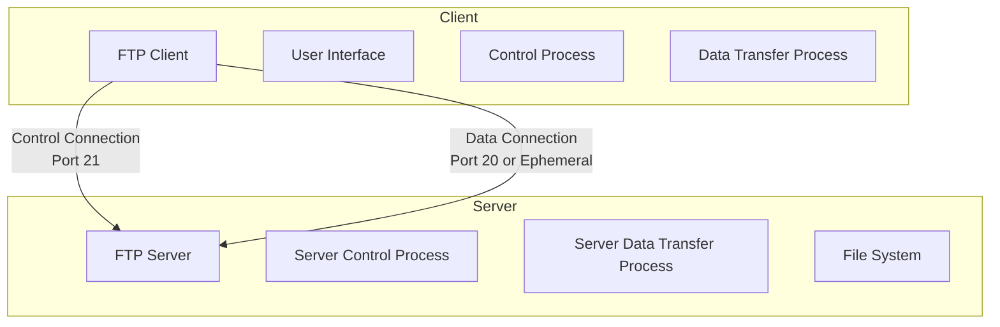
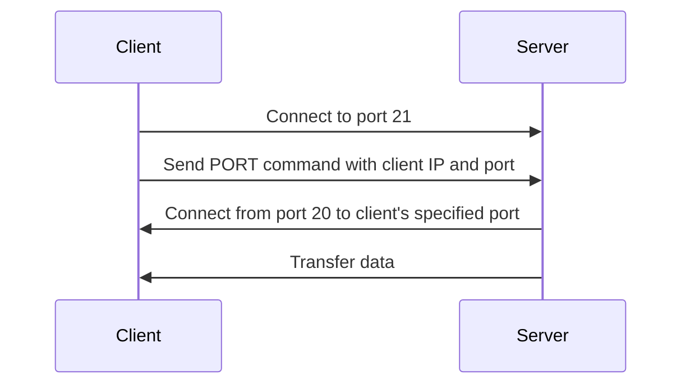
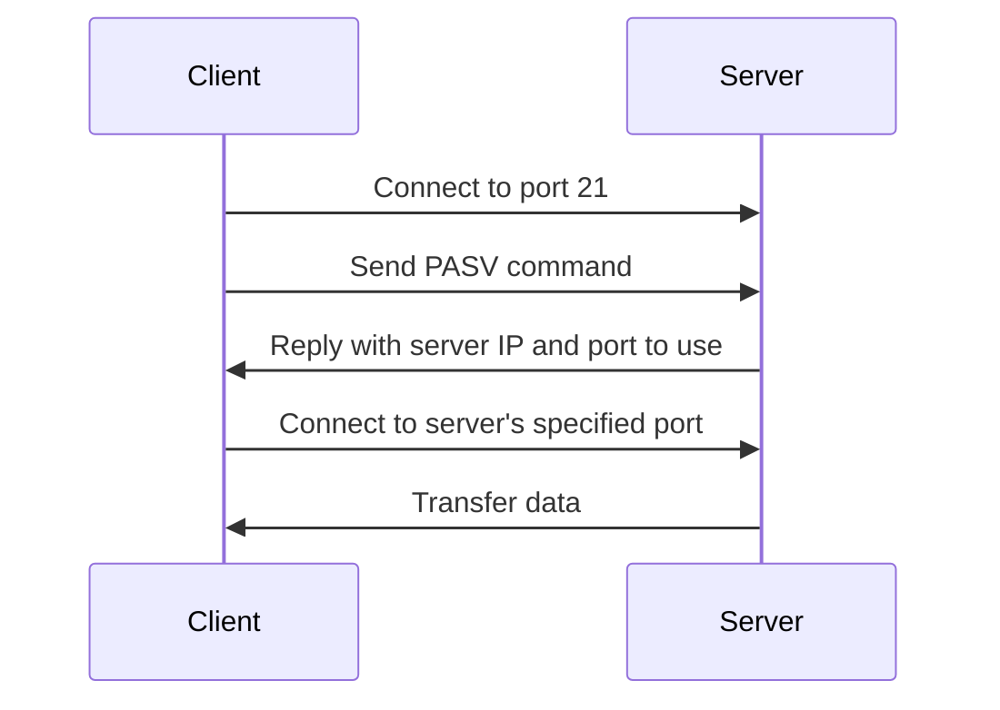

# File Transfer Protocol (FTP)

## Introduction

The File Transfer Protocol (FTP) is one of the oldest and most widely used protocols for transferring files between computers over a network. Developed in the early 1970s, FTP remains relevant today despite the emergence of newer technologies. As part of the Application Layer in the TCP/IP model, FTP provides a standardized way to upload, download, and manage files on remote servers.

In this guide, we'll explore how FTP works, its fundamental components, common commands, and practical applications. We'll also look at some code examples to help you understand how to implement FTP functionality in your applications.

## What is FTP?

FTP is a client-server protocol that establishes **two separate connections** between clients and servers:

1. **Control Connection**: Used for sending commands and receiving responses
2. **Data Connection**: Used for actual file transfers

This dual-connection design is one of FTP's distinctive features, separating command traffic from data traffic.

### Key Features of FTP

- **Reliable File Transfer**: Built on TCP for guaranteed delivery
- **Authentication**: Requires username and password (in basic form)
- **File Operations**: Supports uploading, downloading, renaming, and deleting files
- **Directory Operations**: Allows navigation and manipulation of directory structures
- **Transfer Modes**: Supports ASCII (text) and binary transfer modes
- **Resumable Transfers**: Allows interrupted transfers to be resumed
- **Active and Passive Modes**: Different connection establishment methods to accommodate various network configurations

Let's visualize the FTP architecture:



## How FTP Works

### FTP Connection Types

FTP uses two distinct connection types:

#### 1. Active Mode (Default)

In active mode:
1. Client connects to server's port 21 for control connection
2. Client informs server which client port to connect to
3. Server initiates data connection from its port 20 to client's specified port

#### 2. Passive Mode

In passive mode:
1. Client connects to server's port 21 for control connection
2. Client requests passive mode
3. Server provides an IP and port for the client to connect to
4. Client initiates data connection to server's specified port

Passive mode is often preferred in modern networks because it works better with firewalls and NAT devices.

### FTP Connection Process

Here's the typical flow of an FTP session:

1. **Establish Control Connection**: Client connects to server port 21
2. **Authentication**: Client sends username and password
3. **Navigate Directories**: Client browses remote directories
4. **Set Transfer Mode**: Client selects ASCII or binary mode
5. **Establish Data Connection**: Using either active or passive mode
6. **Transfer Files**: Upload or download files
7. **Close Connections**: Close data and control connections when done

### FTP Commands and Response Codes

FTP uses simple text-based commands on the control connection. Here are some common FTP commands:

| Command | Description |
|---------|-------------|
| `USER` | Specify username |
| `PASS` | Specify password |
| `LIST` | List files in current directory |
| `CWD` | Change working directory |
| `PWD` | Print working directory |
| `RETR` | Retrieve (download) file |
| `STOR` | Store (upload) file |
| `DELE` | Delete file |
| `MKD` | Make directory |
| `RMD` | Remove directory |
| `QUIT` | End session |

The server responds with three-digit codes to indicate success or failure:

- **1xx**: Positive Preliminary reply
- **2xx**: Positive Completion reply
- **3xx**: Positive Intermediate reply
- **4xx**: Transient Negative Completion reply
- **5xx**: Permanent Negative Completion reply

For example:
- `230` - User logged in successfully
- `331` - Username OK, need password
- `550` - Requested action not taken (file not found, no access)

## Using FTP with Code Examples

Let's see how to use FTP programmatically in different languages:

### Python Example

Python has a built-in `ftplib` module that makes it easy to work with FTP:

```python
from ftplib import FTP

# Connect to FTP server
ftp = FTP('ftp.example.com')
ftp.login(user='username', passwd='password')

# Print current directory
print(f"Current directory: {ftp.pwd()}")

# List files in current directory
print("
Files in current directory:")
files = ftp.nlst()
for file in files:
    print(f" - {file}")

# Download a file
with open('downloaded_file.txt', 'wb') as local_file:
    ftp.retrbinary('RETR example.txt', local_file.write)
    
# Upload a file
with open('local_file.txt', 'rb') as upload_file:
    ftp.storbinary('STOR remote_file.txt', upload_file)
    
# Close connection
ftp.quit()
```

### Node.js Example

For Node.js, we can use the `basic-ftp` package:

```javascript
const ftp = require('basic-ftp');

async function example() {
    const client = new ftp.Client();
    client.ftp.verbose = true;
    
    try {
        await client.access({
            host: "ftp.example.com",
            user: "username",
            password: "password",
            secure: false
        });
        
        console.log("Current directory:", await client.pwd());
        
        // List directory contents
        const list = await client.list();
        console.log("Directory listing:", list);
        
        // Download file
        await client.downloadTo("local_file.txt", "remote_file.txt");
        
        // Upload file
        await client.uploadFrom("upload_file.txt", "destination.txt");
        
    } catch(err) {
        console.error(err);
    }
    
    client.close();
}

example();
```

## Active vs. Passive Mode: A Deeper Look

The choice between active and passive mode can significantly impact your FTP experience, especially in modern network environments.

### Active Mode Flow



### Passive Mode Flow



Passive mode is generally recommended because:
- It works better with client-side firewalls
- It avoids issues with Network Address Translation (NAT)
- It places connection responsibility on the client, which typically has fewer restrictions

## FTP Security Considerations

Standard FTP has several significant security limitations:

1. **Credentials in Plaintext**: Username and password are sent unencrypted
2. **Unencrypted Data**: All transferred data is unencrypted and susceptible to eavesdropping
3. **Vulnerability to Attacks**: Susceptible to man-in-the-middle attacks

For these reasons, secure alternatives to standard FTP have been developed:

- **FTPS (FTP Secure)**: FTP with SSL/TLS encryption
- **SFTP (SSH File Transfer Protocol)**: Not actually FTP, but a secure file transfer protocol that runs over SSH
- **SCP (Secure Copy Protocol)**: Another secure alternative based on SSH

For any sensitive data, you should always use one of these secure alternatives rather than standard FTP.

## FTP in the Real World

Despite its age, FTP is still widely used in many real-world scenarios:

### Web Development

Web developers often use FTP to upload website files to hosting servers. Even though more modern alternatives exist, many hosting providers still support FTP as a primary file transfer method.

### Content Distribution

Media companies and content creators use FTP to transfer large files like videos, images, and audio recordings between production facilities and distribution centers.

### Data Backup

Organizations sometimes use FTP for scheduled backups, transferring important data to backup servers or storage systems.

### Software Distribution

Software companies may use FTP servers to distribute updates, patches, and new releases to users or distribution partners.

## Example: Setting Up a Simple FTP Server

For educational purposes, let's look at how to set up a simple FTP server using Python's `pyftpdlib`:

```python
from pyftpdlib.authorizers import DummyAuthorizer
from pyftpdlib.handlers import FTPHandler
from pyftpdlib.servers import FTPServer

# Create a dummy authorizer for managing users
authorizer = DummyAuthorizer()

# Add user with read/write permissions to a specific directory
authorizer.add_user("user", "password", "./ftp_home", perm="elradfmwMT")

# Anonymous user with read-only access
authorizer.add_anonymous("./ftp_home/public", perm="elr")

# Instantiate FTP handler class
handler = FTPHandler
handler.authorizer = authorizer

# Define welcome message
handler.banner = "Welcome to my FTP server!"

# Instantiate FTP server class with a specific address and port
address = ("0.0.0.0", 2121)
server = FTPServer(address, handler)

# Set maximum connections
server.max_cons = 256
server.max_cons_per_ip = 5

# Start the FTP server
server.serve_forever()
```

Running this script would create a simple FTP server accessible on port 2121.

## Common FTP Client Software

Here are some popular FTP client applications you might use:

- **FileZilla**: Free, open-source client for Windows, macOS, and Linux
- **WinSCP**: Windows client with support for multiple protocols
- **Cyberduck**: User-friendly client for macOS and Windows
- **CuteFTP**: Commercial FTP client with advanced features
- **Command Line FTP**: Built into most operating systems

Many modern code editors and IDEs also include FTP functionality for direct file editing and deployment.

## Summary

The File Transfer Protocol (FTP) is a foundational technology in networking that provides a standardized way to transfer files between computers. While it has limitations, particularly in security, FTP remains widely used due to its simplicity, compatibility, and established infrastructure.

Key takeaways:
- FTP uses separate control and data connections
- It supports various file operations, including upload, download, and directory management
- Active and passive modes accommodate different network configurations
- Standard FTP is not secure; use FTPS, SFTP, or SCP for sensitive data
- Many programming languages provide libraries for FTP operations

## Exercises

1. Set up a local FTP server using Python's `pyftpdlib` and connect to it using an FTP client like FileZilla.
2. Write a script that backs up a specific folder to an FTP server on a schedule.
3. Modify the Python example to recursively download all files from a directory on an FTP server.
4. Compare the performance of transferring a large file using FTP's ASCII mode versus Binary mode. What differences do you observe?
5. Analyze an FTP session using a packet capture tool like Wireshark. Can you identify the control commands and data transfers?

## Additional Resources

- [RFC 959](https://tools.ietf.org/html/rfc959) - The official FTP specification
- [Python ftplib Documentation](https://docs.python.org/3/library/ftplib.html)
- [FileZilla Client](https://filezilla-project.org/) - Popular free FTP client
- [ProFTPD](http://www.proftpd.org/) - Feature-rich FTP server implementation
- [FTPS vs. SFTP Comparison](https://www.jscape.com/blog/ftps-vs-sftp-understanding-the-difference)