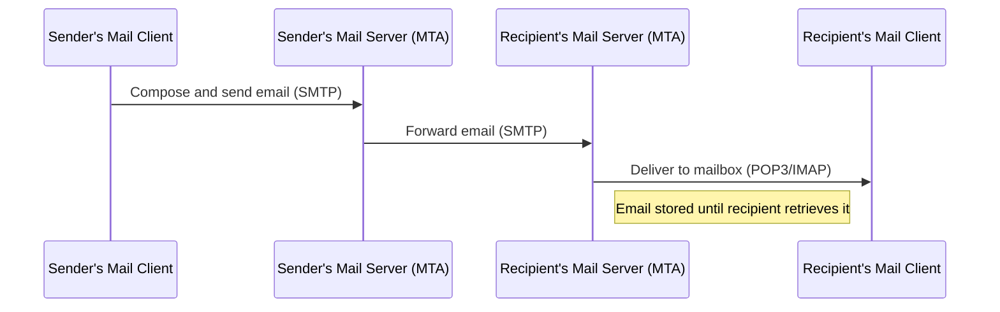
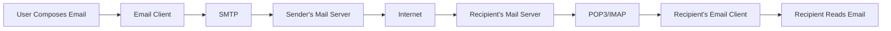

# Understanding SMTP: Email Delivery in the Application Layer

## Introduction

Email remains one of the most widely used communication methods on the internet. But have you ever wondered how your message travels from your computer to someone on the other side of the world? The Simple Mail Transfer Protocol (SMTP) is the behind-the-scenes technology that makes this possible.

SMTP is a text-based protocol in the application layer of the TCP/IP suite that handles the transmission of electronic mail. Developed in the early 1980s, it has evolved but maintained its core functionality, making it one of the internet's most enduring protocols.

## What is SMTP?

SMTP (Simple Mail Transfer Protocol) is a communication protocol used for transmitting electronic mail to mail servers. In simpler terms, when you send an email, SMTP is responsible for getting that email from your computer to the recipient's mail server.

### Key Characteristics of SMTP

- **Text-Based**: SMTP commands and responses are in human-readable ASCII text
- **Connection-Oriented**: Uses TCP (Transmission Control Protocol) on port 25 (or 587 for secured submissions)
- **Push Protocol**: The sending server "pushes" the message to the receiving server
- **Store and Forward**: Messages can be stored temporarily at intermediate servers if the destination is not immediately available

## How SMTP Works

SMTP operates through a series of commands and responses between the client (sender) and server (receiver). Let's break down the basic workflow:



### The SMTP Conversation

A typical SMTP conversation follows these steps:

1. **Establish Connection**: The client connects to the server on port 25 (or 587)
2. **Greeting**: Server sends a greeting message
3. **Introduction**: Client identifies itself with the `HELO` or `EHLO` command
4. **Mail Transaction**: Client specifies sender, recipient(s), and message content
5. **Termination**: Client ends the session with the `QUIT` command

## SMTP Commands and Responses

SMTP uses a simple command-response model. Here are the core commands:

| Command | Description | Example |
|---------|-------------|---------|
| `HELO`/`EHLO` | Client introduces itself | `EHLO client.example.com` |
| `MAIL FROM` | Specifies sender | `MAIL FROM:<sender@example.com>` |
| `RCPT TO` | Specifies recipient | `RCPT TO:<recipient@example.com>` |
| `DATA` | Indicates start of message content | `DATA` |
| `QUIT` | Ends the session | `QUIT` |

Server responses consist of a three-digit code followed by descriptive text:

- `2xx` - Success
- `3xx` - Additional action needed
- `4xx` - Temporary failure
- `5xx` - Permanent failure

## SMTP in Action: A Practical Example

Let's look at a real SMTP conversation between a client and server:

```
S: 220 mail.example.com ESMTP Server Ready
C: EHLO client.example.com
S: 250-mail.example.com
S: 250-SIZE 14680064
S: 250-8BITMIME
S: 250 HELP
C: MAIL FROM:<alice@client.example.com>
S: 250 OK
C: RCPT TO:<bob@example.com>
S: 250 OK
C: DATA
S: 354 Start mail input; end with <CRLF>.<CRLF>
C: From: "Alice" <alice@client.example.com>
C: To: "Bob" <bob@example.com>
C: Subject: Test Message
C: 
C: Hello Bob,
C: This is a test message.
C: Best regards,
C: Alice
C: .
S: 250 OK: message accepted
C: QUIT
S: 221 mail.example.com Service closing transmission channel
```

## Implementing Basic SMTP Communication in Python

Here's a simple Python example that connects to an SMTP server and sends an email:

```python
import smtplib
from email.mime.text import MIMEText

# Create the message
msg = MIMEText("Hello, this is a test email sent using SMTP in Python!")
msg['Subject'] = 'SMTP Test'
msg['From'] = 'sender@example.com'
msg['To'] = 'recipient@example.com'

# Connect to the server
try:
    server = smtplib.SMTP('smtp.example.com', 587)
    server.starttls()  # Secure the connection
    server.login('username', 'password')
    
    # Send the email
    server.send_message(msg)
    print("Email sent successfully!")
    
    # Close the connection
    server.quit()
except Exception as e:
    print(f"Error: {e}")
```

When executed, this script connects to an SMTP server, authenticates, and sends a simple email message.

## SMTP Extensions

The original SMTP protocol has been extended over time to add functionality:

### ESMTP (Extended SMTP)

ESMTP added capabilities like:

- **Authentication**: Supporting login credentials for sending mail
- **TLS/SSL**: Encrypting the SMTP connection for security
- **Size limits**: Defining maximum message sizes
- **8BITMIME**: Support for 8-bit content (allowing non-ASCII characters)

### Example of SMTP with Authentication and TLS

```python
import smtplib
from email.mime.text import MIMEText
from email.mime.multipart import MIMEMultipart

# Create message
msg = MIMEMultipart()
msg['From'] = 'sender@example.com'
msg['To'] = 'recipient@example.com'
msg['Subject'] = 'Secure SMTP Test'

# Add body to email
body = "This email was sent using SMTP with TLS encryption and authentication!"
msg.attach(MIMEText(body, 'plain'))

# Setup the SMTP server with TLS
try:
    server = smtplib.SMTP('smtp.example.com', 587)
    server.ehlo()  # Can be omitted
    server.starttls()  # Enable TLS encryption
    server.ehlo()  # Can be omitted
    server.login('username', 'password')  # Authentication
    
    # Send the email
    text = msg.as_string()
    server.sendmail(msg['From'], msg['To'], text)
    print("Email sent successfully!")
    
    # Close the connection
    server.quit()
except Exception as e:
    print(f"Error: {e}")
```

## Common SMTP Error Codes

Understanding SMTP error codes can help diagnose email delivery issues:

| Code | Description | Troubleshooting |
|------|-------------|-----------------|
| 250 | Requested action completed | Success! No action needed |
| 421 | Service not available | Try again later; server might be down |
| 450 | Requested action not taken | Mailbox busy or temporarily unavailable |
| 501 | Syntax error | Check your command format |
| 550 | Requested action not taken | Mailbox unavailable (might not exist) |
| 553 | Requested action not taken | Invalid mailbox name |

## SMTP in the Email Ecosystem

SMTP is just one part of the email delivery system:



- **SMTP**: Used to send and transfer emails between servers
- **POP3/IMAP**: Used to retrieve emails from servers to clients
- **MUA (Mail User Agent)**: Email clients like Outlook, Gmail
- **MTA (Mail Transfer Agent)**: Server software that routes emails

## SMTP Security Considerations

Email security is crucial in today's internet. SMTP has evolved to include:

- **STARTTLS**: Upgrades an insecure connection to a secure one
- **SMTPS**: SMTP secured with SSL/TLS from the beginning of the connection
- **SPF (Sender Policy Framework)**: Verifies sender IP addresses
- **DKIM (DomainKeys Identified Mail)**: Adds a digital signature to verify email authenticity
- **DMARC (Domain-based Message Authentication, Reporting, and Conformance)**: Policy framework building on SPF and DKIM

### Secure vs. Insecure SMTP

| Feature | Insecure SMTP | Secure SMTP |
|---------|--------------|-------------|
| Port | 25 | 587 (STARTTLS) or 465 (SMTPS) |
| Authentication | Optional | Required |
| Encryption | None | TLS/SSL |
| Password Protection | No | Yes |
| Compatibility | Maximum | Some limitations |

## Practical Applications and Examples

### Setting Up a Mail Server with Postfix (Linux)

Postfix is a popular MTA (Mail Transfer Agent) that implements SMTP:

1. Install Postfix:
```bash
sudo apt-get update
sudo apt-get install postfix
```

2. Basic configuration in `/etc/postfix/main.cf`:
```
myhostname = mail.example.com
mydomain = example.com
myorigin = $mydomain
inet_interfaces = all
mydestination = $myhostname, localhost.$mydomain, $mydomain
```

3. Start the service:
```bash
sudo systemctl start postfix
```

### Testing SMTP Manually with Telnet

You can manually communicate with an SMTP server using telnet:

```bash
telnet smtp.example.com 25
```

Then enter SMTP commands:
```
EHLO client.example.com
MAIL FROM:<sender@example.com>
RCPT TO:<recipient@example.com>
DATA
Subject: Test Email

This is a test email sent manually via SMTP.
.
QUIT
```

## Summary

SMTP is the backbone of email communication on the internet. It provides a standardized way for email messages to be transmitted from sender to recipient through a series of well-defined commands and responses.

Key takeaways from this lesson:

1. SMTP is a text-based, connection-oriented protocol that operates on ports 25, 587, or 465
2. The protocol follows a client-server model with clear commands and response codes
3. Modern SMTP implementations include extensions for authentication and encryption
4. SMTP works alongside other protocols like POP3 and IMAP to form the complete email ecosystem
5. Understanding SMTP is crucial for diagnosing email delivery issues and implementing email functionality in applications

## Exercises

1. **Basic SMTP Client**: Write a simple Python script that sends an email using the `smtplib` library.
2. **SMTP Server Exploration**: Use telnet to connect to a public SMTP server and observe the welcome message and available ESMTP extensions.
3. **Error Handling**: Modify the Python example to handle different SMTP error codes appropriately.
4. **Mail Server Setup**: Set up a simple mail server using Postfix in a virtual machine and send emails between local accounts.
5. **SMTP Debugging**: Write a script that captures and displays the full SMTP conversation between client and server.

## Further Resources

- [RFC 5321](https://tools.ietf.org/html/rfc5321) - The Simple Mail Transfer Protocol
- [RFC 3207](https://tools.ietf.org/html/rfc3207) - SMTP Service Extension for Secure SMTP over TLS
- [Python smtplib documentation](https://docs.python.org/3/library/smtplib.html)
- "Internet Email Protocols: A Developer's Guide" by Kevin Johnson
- "TCP/IP Network Administration" by Craig Hunt