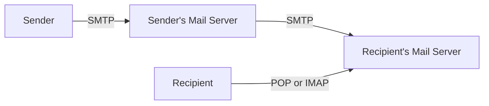
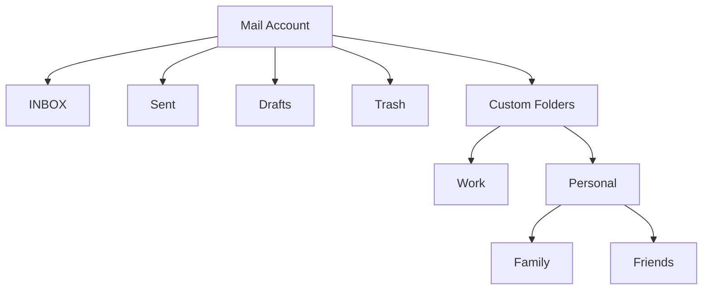

# Email Protocols: POP and IMAP

## Introduction

Email remains one of the most widely used applications on the Internet. To retrieve emails from a mail server, email clients use one of two primary protocols: **Post Office Protocol (POP)** or **Internet Message Access Protocol (IMAP)**. These protocols operate at the application layer of the TCP/IP model and define how email clients interact with mail servers to retrieve, organize, and manage messages.

In this tutorial, we'll explore both protocols in depth, understand their differences, and see how they're implemented in real-world applications. Whether you're building an email client or just want to understand how your email works behind the scenes, this guide will provide you with essential knowledge about these critical email retrieval protocols.

## Email System Architecture

Before diving into POP and IMAP, let's understand the basic architecture of email systems:



1. A sender composes an email and sends it using SMTP (Simple Mail Transfer Protocol)
2. The email travels to the recipient's mail server
3. The recipient retrieves the email using either POP or IMAP

Now, let's explore these retrieval protocols in detail.

## Post Office Protocol (POP)

### What is POP?

Post Office Protocol (POP, currently in version POP3) is a simple protocol designed to download emails from a remote server to a local client. After downloading, emails are typically deleted from the server, making POP ideal for single-device access.

### How POP Works

POP follows a simple download-and-delete model:

1. The client connects to the POP server (usually on port 110, or 995 for POP3S).
2. The client authenticates with username and password.
3. The client retrieves messages from the server.
4. The client typically deletes messages from the server after downloading.
5. The client disconnects from the server.

### POP3 Command Sequence

Here's a typical POP3 command sequence:

```
C: <Establishes connection>
S: +OK POP3 server ready
C: USER username
S: +OK
C: PASS password
S: +OK user successfully logged on
C: STAT
S: +OK 3 345910
C: LIST
S: +OK 3 messages:
S: 1 1205
S: 2 305
S: 3 344400
S: .
C: RETR 1
S: +OK 1205 octets
S: <message content>
S: .
C: DELE 1
S: +OK message 1 deleted
C: QUIT
S: +OK POP3 server signing off
```

### POP3 Commands

Here are the main POP3 commands:

| Command | Description |
|---------|-------------|
| `USER` | Specifies the username |
| `PASS` | Specifies the password |
| `STAT` | Gets mailbox statistics |
| `LIST` | Lists message numbers and sizes |
| `RETR` | Retrieves a message by number |
| `DELE` | Marks a message for deletion |
| `NOOP` | No operation, server responds with OK |
| `RSET` | Resets any marked deletions |
| `QUIT` | Ends the session |

### Advantages of POP

- **Simple and efficient**: Designed for offline access
- **Minimal server resources**: Emails are stored locally, not on the server
- **Works well with limited connectivity**: Download once, read offline
- **Privacy**: Emails are stored only on your device

### Disadvantages of POP

- **Single device access**: Difficult to access emails from multiple devices
- **No synchronization**: Actions taken on one device aren't reflected elsewhere
- **Risk of data loss**: If your device fails, emails can be lost

## Internet Message Access Protocol (IMAP)

### What is IMAP?

Internet Message Access Protocol (IMAP, currently in version IMAP4) is designed for online access to email, allowing users to manage emails directly on the mail server. It synchronizes email access across multiple devices and keeps messages on the server.

### How IMAP Works

IMAP provides a rich, client-server interaction model:

1. The client connects to the IMAP server (usually on port 143, or 993 for IMAPS).
2. The client authenticates with username and password.
3. The client can browse folder structures on the server.
4. The client can fetch message headers or bodies selectively.
5. The client can perform operations like moving, flagging, or searching messages.
6. Changes are synchronized back to the server.

### IMAP Command Sequence

Here's a typical IMAP command sequence:

```
C: <Establishes connection>
S: * OK IMAP4 server ready
C: A001 LOGIN username password
S: A001 OK LOGIN completed
C: A002 SELECT INBOX
S: * 3 EXISTS
S: * 0 RECENT
S: * FLAGS (\Answered \Flagged \Deleted \Seen \Draft)
S: * OK [UIDVALIDITY 1256789012] UIDs valid
S: A002 OK [READ-WRITE] SELECT completed
C: A003 FETCH 1 ALL
S: * 1 FETCH (FLAGS (\Seen) INTERNALDATE "17-Jul-2022 16:08:12 +0200" RFC822.SIZE 2324 ENVELOPE ("Tue, 17 Jul 2022 16:08:12 +0200" "Meeting Tomorrow" (("Sender" NIL "sender" "example.com")) (("Sender" NIL "sender" "example.com")) (("Sender" NIL "sender" "example.com")) (("Recipient" NIL "recipient" "example.org")) NIL NIL NIL "<unique-id@example.com>"))
S: A003 OK FETCH completed
C: A004 LOGOUT
S: * BYE IMAP4 server terminating connection
S: A004 OK LOGOUT completed
```

### IMAP Commands

Here are the main IMAP commands:

| Command | Description |
|---------|-------------|
| `LOGIN` | Authenticates the user |
| `SELECT` | Selects a mailbox to access |
| `EXAMINE` | Selects a mailbox in read-only mode |
| `CREATE` | Creates a new mailbox |
| `DELETE` | Deletes a mailbox |
| `RENAME` | Renames a mailbox |
| `FETCH` | Retrieves data about a message |
| `STORE` | Changes message flags |
| `SEARCH` | Searches for messages matching criteria |
| `LOGOUT` | Ends the session |

### IMAP Folder Structure

Unlike POP, IMAP supports server-side folder organization:



### Advantages of IMAP

- **Multi-device access**: Access emails from any device
- **Synchronization**: Actions are synchronized across all devices
- **Server-side organization**: Folders and flags are maintained on the server
- **Selective downloading**: Can download only headers or specific parts of messages
- **Bandwidth efficient**: Only retrieves what you need

### Disadvantages of IMAP

- **Requires constant connection**: Best performance with steady internet access
- **Server storage limitations**: You may hit storage quotas
- **Server dependency**: If the server goes down, you can't access emails
- **More complex**: Requires more server resources and maintenance

## POP vs. IMAP: Comparison

Let's compare the key differences between POP and IMAP:

| Feature | POP3 | IMAP4 |
|---------|------|-------|
| **Storage Location** | Client device | Server (with local caching options) |
| **Multiple Device Support** | Limited | Excellent |
| **Synchronization** | No | Yes |
| **Offline Access** | Excellent | Limited (unless using caching) |
| **Server Storage Usage** | Minimal | High |
| **Bandwidth Usage** | Higher initially, then none | Lower but continuous |
| **Folder Management** | Local only | Server-side |
| **Ideal Use Case** | Single device, limited connectivity | Multiple devices, good connectivity |
| **Default Port** | 110 (995 with SSL) | 143 (993 with SSL) |

## Implementing Email Clients

### Simple POP3 Client in Python

Here's a basic example of how to retrieve emails using POP3 in Python:

```python
import poplib
from email import parser

# Connect to the server
pop_conn = poplib.POP3_SSL('pop.example.com', 995)

# Authenticate
pop_conn.user('username')
pop_conn.pass_('password')

# Get information about the mailbox
mailbox_stats = pop_conn.stat()
print(f"Messages in inbox: {mailbox_stats[0]}, Total size: {mailbox_stats[1]} bytes")

# Retrieve the latest message
message_num = mailbox_stats[0]
resp, lines, octets = pop_conn.retr(message_num)

# Convert the message from bytes to a string
message_content = b'\r
'.join(lines).decode('utf-8')

# Parse the message
email_parser = parser.Parser()
email_message = email_parser.parsestr(message_content)

# Print message details
print(f"From: {email_message['From']}")
print(f"Subject: {email_message['Subject']}")
print(f"Date: {email_message['Date']}")

# Print the body if it's a simple message
if email_message.is_multipart():
    for part in email_message.walk():
        if part.get_content_type() == "text/plain":
            print("Body:", part.get_payload())
else:
    print("Body:", email_message.get_payload())

# Close connection
pop_conn.quit()
```

### Simple IMAP Client in Python

Here's how to retrieve emails using IMAP in Python:

```python
import imaplib
import email
from email.header import decode_header

# Connect to the server
imap = imaplib.IMAP4_SSL('imap.example.com', 993)

# Authenticate
imap.login('username', 'password')

# Select a mailbox (in this case, the inbox)
status, messages = imap.select('INBOX')

# Get the number of messages
messages = int(messages[0])
print(f"Total messages in INBOX: {messages}")

# Fetch the latest message
status, msg_data = imap.fetch(str(messages), '(RFC822)')
raw_email = msg_data[0][1]

# Parse the raw email
email_message = email.message_from_bytes(raw_email)

# Decode the email subject
subject = decode_header(email_message["Subject"])[0][0]
if isinstance(subject, bytes):
    subject = subject.decode()
    
print(f"From: {email_message['From']}")
print(f"Subject: {subject}")
print(f"Date: {email_message['Date']}")

# Get email body
if email_message.is_multipart():
    for part in email_message.walk():
        content_type = part.get_content_type()
        if content_type == "text/plain":
            body = part.get_payload(decode=True).decode()
            print("Body:", body)
            break
else:
    body = email_message.get_payload(decode=True).decode()
    print("Body:", body)

# Close connection
imap.close()
imap.logout()
```

## Real-World Applications

### Mail Clients Configuration

Here's how you typically configure email clients:

**For POP3:**
- Server: pop.example.com
- Port: 995 (with SSL/TLS)
- Username: your_username
- Password: your_password
- Options: "Delete messages on server after retrieving" (optional)

**For IMAP:**
- Server: imap.example.com
- Port: 993 (with SSL/TLS)
- Username: your_username
- Password: your_password
- Options: "Leave messages on server"

### When to Use Which Protocol

**Choose POP3 when:**
- You access email from a single device
- You have limited server storage
- You need to access emails offline
- You want to keep your emails private and local

**Choose IMAP when:**
- You access email from multiple devices
- You want synchronized access across devices
- You have reliable internet connectivity
- You want server-based organization and search

### Security Considerations

Both protocols have secure versions:
- **POP3S**: POP3 over SSL/TLS (port 995)
- **IMAPS**: IMAP over SSL/TLS (port 993)

Always use these secure versions to protect your email credentials and content from interception.

## Summary

POP and IMAP are two fundamental protocols for retrieving emails:

- **POP** is designed for single-device access with a download-and-delete model, making it ideal for offline usage and minimal server storage.
- **IMAP** is designed for multi-device access with server-side storage and synchronization, making it ideal for users who access their email from multiple devices.

Understanding these protocols helps you make informed decisions about email client configuration and develop applications that interact with email servers effectively.

## Exercises

1. Configure a mail client (like Thunderbird or Outlook) to use both POP3 and IMAP. Compare the differences in how emails are stored and accessed.

2. Modify the provided Python code to download all unread messages using POP3.

3. Extend the IMAP Python example to search for emails containing specific keywords in the subject line.

4. Create a simple command-line email client that can switch between POP and IMAP protocols based on user preference.

5. Investigate how modern webmail interfaces like Gmail implement IMAP features in their web interfaces.

## Additional Resources

- [RFC 1939](https://tools.ietf.org/html/rfc1939) - Post Office Protocol Version 3 (POP3)
- [RFC 3501](https://tools.ietf.org/html/rfc3501) - Internet Message Access Protocol Version 4rev1 (IMAP4rev1)
- [Python's `imaplib` documentation](https://docs.python.org/3/library/imaplib.html)
- [Python's `poplib` documentation](https://docs.python.org/3/library/poplib.html)
- Advanced email handling with Python's `email` package