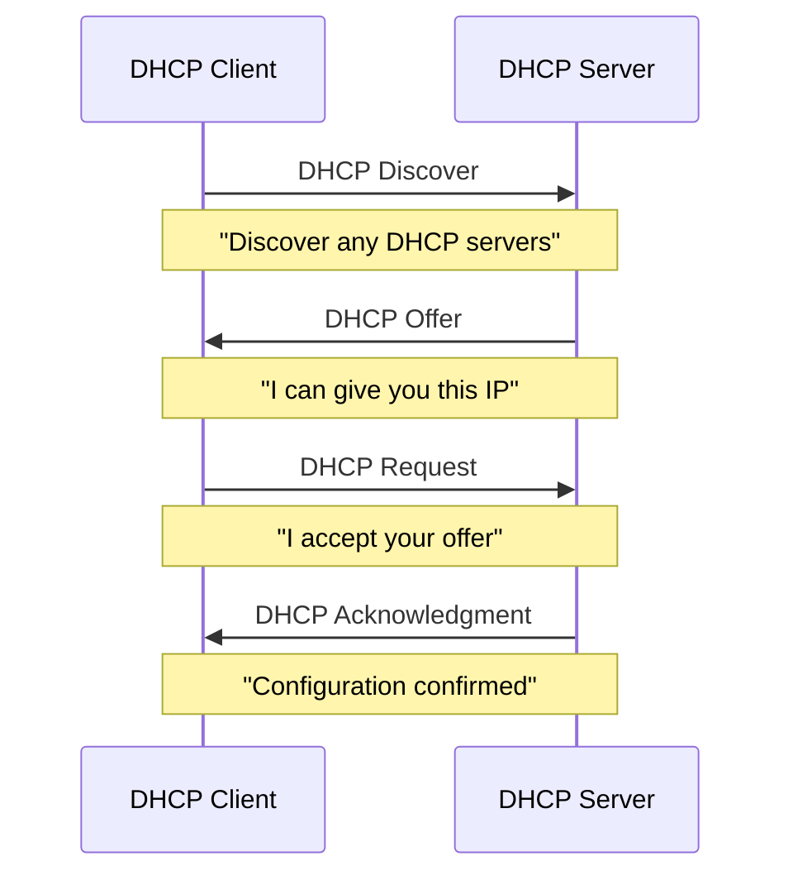
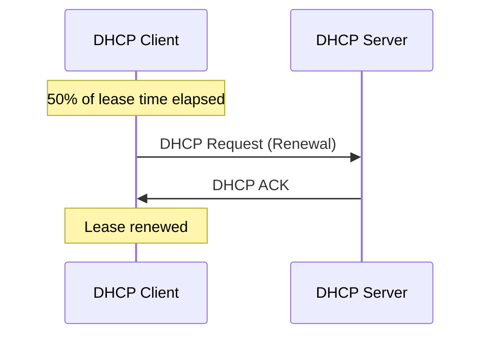

# Dynamic Host Configuration Protocol (DHCP)

## Introduction

Have you ever wondered how your computer or smartphone automatically gets an IP address when you connect to a network? This seemingly magical process is handled by the Dynamic Host Configuration Protocol (DHCP), a crucial component of modern networks.

DHCP automates the assignment of IP addresses, subnet masks, default gateways, and other network configuration parameters to devices on a network. Without DHCP, network administrators would need to manually configure every device that connects to their network—a tedious and error-prone process in today's world of numerous connected devices.

## What is DHCP?

DHCP is an application layer protocol that enables a server to automatically assign an IP address (and other network configuration information) to a computer or device from a defined range of numbers configured for a given network.

### Key Benefits of DHCP

- **Automatic configuration**: Eliminates the need for manual IP configuration
- **Address reuse**: Reclaims IP addresses when devices disconnect
- **Centralized management**: Provides a central point for network configuration
- **Error reduction**: Minimizes configuration errors compared to manual setup
- **Mobility support**: Easily accommodates mobile devices moving between networks

## The DHCP Process

The DHCP process, often called the "DHCP conversation" or "DHCP handshake," typically involves four steps, sometimes referred to as DORA:



Let's break down each step:

### 1. DHCP Discover

When a device connects to a network, it begins by broadcasting a DHCP Discover message to find available DHCP servers.

```
DHCP Discover Message (sent as broadcast to 255.255.255.255):
- Message Type: DHCP Discover
- Client MAC: 00:11:22:33:44:55
- Client Identifier: <unique identifier>
- Requested Parameters: IP address, subnet mask, router, DNS server
```

### 2. DHCP Offer

DHCP servers respond with a DHCP Offer message that includes an available IP address and other configuration information.

```
DHCP Offer Message:
- Message Type: DHCP Offer
- Your IP: 192.168.1.100
- Subnet Mask: 255.255.255.0
- Router: 192.168.1.1
- DNS Servers: 8.8.8.8, 8.8.4.4
- Lease Time: 24 hours
- DHCP Server Identifier: 192.168.1.254
```

### 3. DHCP Request

The client responds to the DHCP Offer by sending a DHCP Request message, formally requesting the offered IP address.

```
DHCP Request Message:
- Message Type: DHCP Request
- Client MAC: 00:11:22:33:44:55
- Requested IP: 192.168.1.100
- DHCP Server Identifier: 192.168.1.254
- Client Identifier: <unique identifier>
```

### 4. DHCP Acknowledgment

The DHCP server confirms the assignment with a DHCP Acknowledgment (ACK) message.

```
DHCP Acknowledgment Message:
- Message Type: DHCP ACK
- Your IP: 192.168.1.100
- Subnet Mask: 255.255.255.0
- Router: 192.168.1.1
- DNS Servers: 8.8.8.8, 8.8.4.4
- Lease Time: 24 hours
- DHCP Server Identifier: 192.168.1.254
```

## DHCP Lease Lifecycle

IP addresses assigned by DHCP are not permanent. They're "leased" for a specified period.

### Lease Time

The lease time determines how long a client can use an assigned IP address before it needs to renew or request a new one. Typical lease times range from a few hours to several days.

### Lease Renewal

Before a lease expires, the client will attempt to renew it, typically when 50% of the lease time has elapsed:



If renewal fails, the client will try again at 87.5% of the lease time. If the lease expires without renewal, the client must start the DHCP process again with a Discover message.

## DHCP Message Format

DHCP messages follow a standard format:

| Field | Description |
|-------|-------------|
| Operation | Request (1) or Reply (2) |
| Hardware Type | Ethernet (1) or other network type |
| Hardware Address Length | Length of hardware address (6 for Ethernet) |
| Hops | Used by relay agents |
| Transaction ID | Random number to match requests with responses |
| Seconds | Seconds elapsed since client began process |
| Flags | Broadcast flag and reserved fields |
| Client IP Address | Only filled in if client already has an IP |
| Your IP Address | IP address assigned to client |
| Server IP Address | IP address of the DHCP server |
| Gateway IP Address | IP address of relay agent, if used |
| Client Hardware Address | MAC address of client |
| Server Name | Optional server hostname |
| Boot Filename | Boot filename (used for network booting) |
| Options | Variable-length field for parameters and options |

## Implementing a Simple DHCP Client in Python

Here's a simplified example of how to implement a DHCP client in Python using the `scapy` library:

```python
from scapy.all import *

def dhcp_discover():
    # Create Ethernet frame
    eth = Ether(dst="ff:ff:ff:ff:ff:ff")
    
    # Create IP packet
    ip = IP(src="0.0.0.0", dst="255.255.255.255")
    
    # Create UDP datagram
    udp = UDP(sport=68, dport=67)
    
    # Create BOOTP message
    bootp = BOOTP(chaddr=get_if_hwaddr(conf.iface), xid=RandInt())
    
    # Create DHCP options
    dhcp_opts = DHCP(options=[("message-type", "discover"), "end"])
    
    # Combine all layers
    dhcp_discover_packet = eth / ip / udp / bootp / dhcp_opts
    
    # Send packet and wait for response
    response = srp1(dhcp_discover_packet, timeout=10)
    
    return response

# Send DHCP Discover and receive response
response = dhcp_discover()
if response:
    print("Received DHCP Offer!")
    print(f"Offered IP: {response[BOOTP].yiaddr}")
    
    # Here you would continue with Request and Acknowledgment
else:
    print("No DHCP Offer received")
```

> Note: This is a simplified example for educational purposes. In a real implementation, you would need to handle all steps of the DHCP process and properly manage leases.

## DHCP Server Types

DHCP servers come in various forms:

### 1. Dedicated DHCP Servers

These are standalone servers running dedicated DHCP server software, often used in large enterprise networks.

### 2. Integrated DHCP Services

DHCP functionality built into:
- Routers
- Network appliances
- Network operating systems

### 3. Cloud-Based DHCP

DHCP services provided through cloud networking platforms.

## DHCP Configuration Options

DHCP can provide many configuration parameters beyond just IP addresses:

- **Subnet Mask**: Defines the network portion of an IP address
- **Default Gateway**: The router IP for accessing other networks
- **DNS Servers**: For domain name resolution
- **Domain Name**: Local domain name for the network
- **NTP Servers**: For time synchronization
- **WINS Servers**: For NetBIOS name resolution (legacy)
- **Vendor-Specific Options**: Custom options for specific equipment

## DHCP in the Real World

### Home Networks

In a typical home network, your Internet Service Provider's router or your personal router serves as a DHCP server. When you connect a new device to your Wi-Fi or wired network, the router automatically assigns it an IP address from a predefined pool (often in the 192.168.0.x or 192.168.1.x range).

### Enterprise Networks

In enterprise environments, DHCP is more complex:

- **DHCP Scopes**: Different IP ranges for different network segments
- **Reservations**: Specific IP addresses reserved for certain devices based on MAC address
- **DHCP Relay**: Forwarding DHCP requests across network boundaries
- **High Availability**: Multiple DHCP servers for redundancy
- **Integration with DNS**: Dynamic DNS updates based on DHCP assignments

### Example DHCP Configuration on a Router

Here's what a typical DHCP configuration might look like on a home router's admin interface:

- DHCP Server: Enabled
- Start IP Address: 192.168.1.100
- End IP Address: 192.168.1.199
- Lease Time: 24 hours
- DNS Servers: Automatic (ISP provided)
- Default Gateway: 192.168.1.1 (Router IP)

## DHCP Security Considerations

DHCP has several security vulnerabilities to be aware of:

### DHCP Snooping

DHCP snooping is a security feature that acts like a firewall between untrusted DHCP servers and clients.

### Rogue DHCP Servers

Unauthorized DHCP servers can provide incorrect network information, potentially enabling man-in-the-middle attacks.

### IP Address Exhaustion

Attackers can request all available IP addresses, causing a denial of service for legitimate clients.

### MAC Spoofing

Attackers can impersonate legitimate clients to steal their IP addresses or intercept their traffic.

## DHCPv6

With the transition to IPv6, a new version of DHCP was developed: DHCPv6.

### Key Differences from DHCP for IPv4

- Uses different message types
- Can work alongside IPv6 Stateless Address Autoconfiguration (SLAAC)
- Uses different ports (UDP port 546 for clients, 547 for servers)
- Offers both stateful and stateless configuration options

## Summary

DHCP is a fundamental network protocol that automates the configuration of IP addresses and other network parameters. Its four-step process (Discover, Offer, Request, Acknowledge) makes it possible for devices to join networks seamlessly without manual configuration.

As networks grow in complexity and the number of connected devices increases, DHCP becomes even more critical for efficient network management. Understanding how DHCP works gives you insight into one of the core protocols that makes modern networking possible.

## Exercises

1. **Basic Understanding**: Explain in your own words the four steps of the DHCP process.

2. **Practical Analysis**: Use Wireshark to capture DHCP traffic when your computer connects to a network. Identify each of the four DHCP messages.

3. **Configuration Exercise**: Using a virtual machine, configure a static IP address, then switch to DHCP. Document the differences in the configuration process.

4. **Problem Solving**: What would happen if two DHCP servers on the same network offered different IP configurations? How might this be resolved?

5. **Research Task**: Investigate how DHCP works with VLANs. How does a DHCP request from a client on one VLAN reach a DHCP server on another VLAN?

## Additional Resources

- **RFC 2131**: The official DHCP specification
- **RFC 3315**: DHCPv6 specification
- **Network Analysis Tools**: Wireshark for DHCP packet capture and analysis
- **DHCP Server Implementations**: ISC DHCP, Microsoft DHCP, Infoblox
- **Online DHCP Simulators**: For practicing DHCP configuration without real hardware