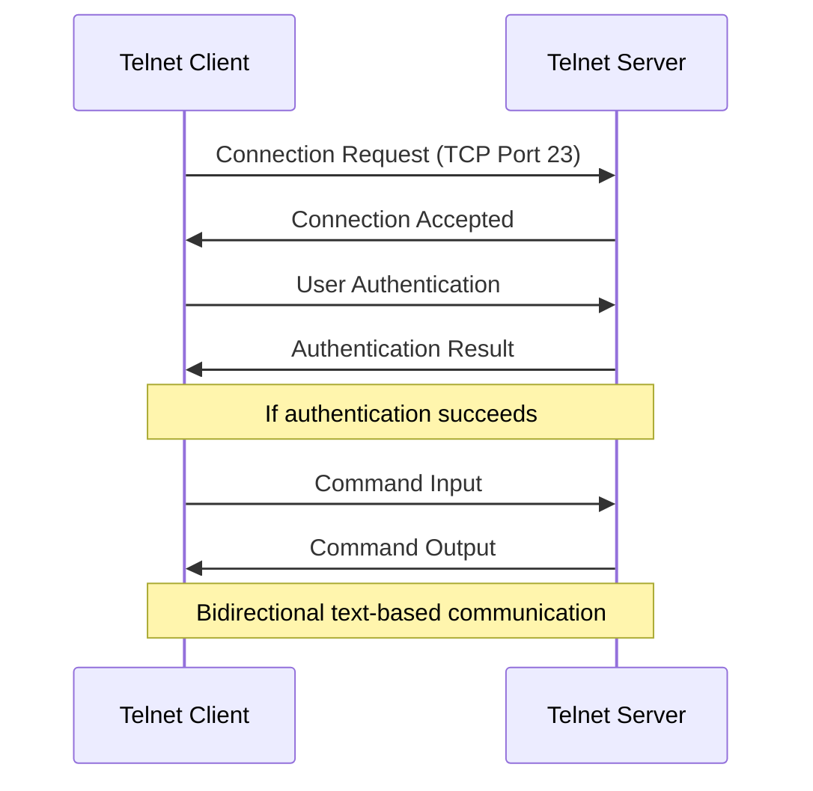
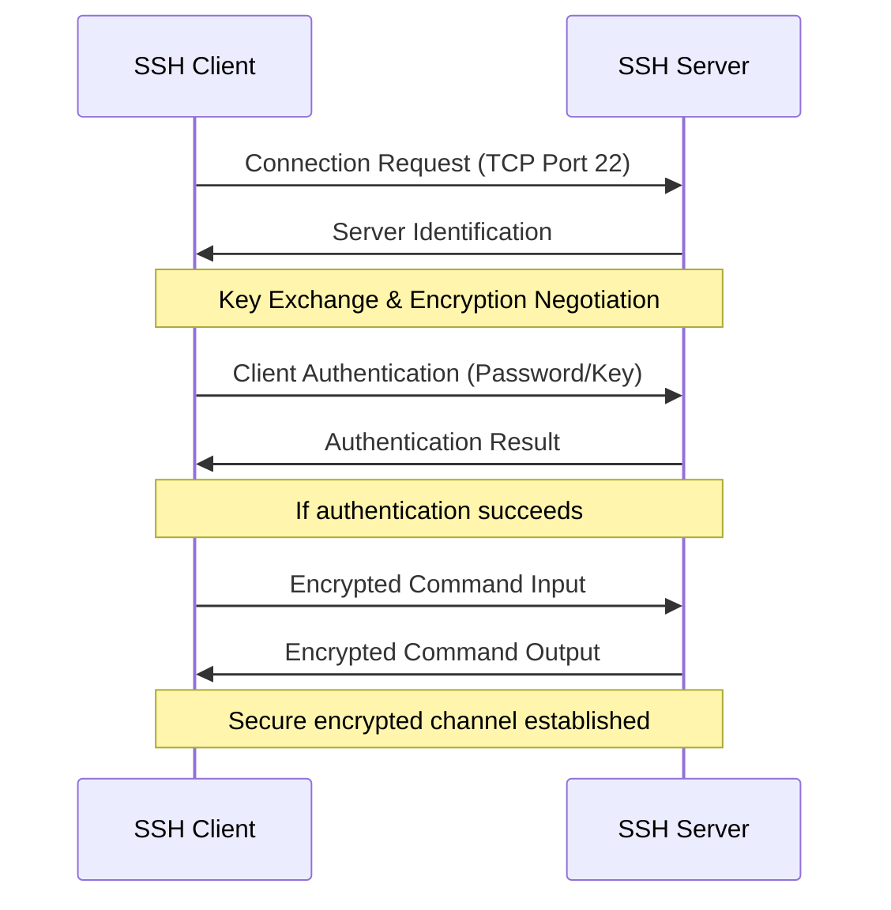

# Networks: Telnet and SSH

## Introduction

When managing networks and servers, administrators often need to access and control devices remotely. Two common protocols for remote terminal access are **Telnet** (Telecommunication Network) and **SSH** (Secure Shell). Both allow users to connect to remote systems and execute commands as if they were sitting in front of them, but they differ significantly in terms of security and features.

In this article, we'll explore both protocols, understand their differences, and learn how to use them effectively for network management and remote access.

## Telnet: The Original Remote Access Protocol

### What is Telnet?

Telnet is one of the oldest network protocols, developed in 1969 and standardized as part of the TCP/IP suite. It operates on **port 23** and provides a bidirectional interactive text-oriented communication facility using a virtual terminal connection.

### How Telnet Works

Telnet uses a client-server model:

1. A Telnet client establishes a connection with a Telnet server
2. The client sends keystrokes to the server
3. The server processes these commands as if they were entered locally
4. The server sends the output back to the client



### Using Telnet

Here's how to use Telnet from a command line:

```bash
telnet hostname_or_ip port
```

Example connecting to a server:

```bash
telnet 192.168.1.1 23
```

Output:
```
Trying 192.168.1.1...
Connected to 192.168.1.1.
Escape character is '^]'.

login: admin
Password: 
Welcome to RouterOS!
[admin@MikroTik] >
```

### Telnet Security Issues

The major drawback of Telnet is its lack of security:

- **No encryption**: All data, including usernames and passwords, is transmitted in plain text
- **No authentication** of the server (vulnerable to man-in-the-middle attacks)
- **No data integrity** checking

Due to these security concerns, Telnet has largely been replaced by SSH for most remote administration tasks. However, it's still used for:

- Simple network debugging
- Accessing legacy systems
- Internal networks where security is less of a concern
- Connecting to network devices that don't support SSH

## SSH: The Secure Alternative

### What is SSH?

SSH (Secure Shell) was developed in 1995 specifically to address the security flaws in protocols like Telnet. It operates on **port 22** by default and provides:

- Encrypted communications
- Strong authentication
- Data integrity verification
- Port forwarding capabilities

### How SSH Works

SSH also uses a client-server model but adds encryption and security:

1. Client and server establish a connection and negotiate encryption parameters
2. They exchange encryption keys using secure key exchange algorithms
3. All subsequent communication is encrypted
4. The client authenticates to the server (password, key-based, or other methods)
5. Upon successful authentication, a secure shell session is established



### SSH Authentication Methods

SSH supports multiple authentication methods:

1. **Password Authentication**: Simple username/password authentication (encrypted)
2. **Public Key Authentication**: Uses a pair of cryptographic keys for authentication
3. **Host-Based Authentication**: Authentication based on the host rather than the user
4. **Keyboard-Interactive**: Can include multi-factor authentication methods

### Using SSH

Basic SSH command syntax:

```bash
ssh username@hostname_or_ip -p port_number
```

Example of connecting to a server:

```bash
ssh admin@192.168.1.1
```

Output:
```
The authenticity of host '192.168.1.1' can't be established.
RSA key fingerprint is SHA256:uNiVztksCsDhcc0u9e8BujQXVUpKZIDTMczCvj3tD2s.
Are you sure you want to continue connecting (yes/no)? yes
Warning: Permanently added '192.168.1.1' (RSA) to the list of known hosts.
admin@192.168.1.1's password: 
Welcome to Ubuntu 20.04.2 LTS
admin@server:~$ 
```

### Generating SSH Keys

To use public key authentication, you need to generate a key pair:

```bash
ssh-keygen -t rsa -b 4096
```

Output:
```
Generating public/private rsa key pair.
Enter file in which to save the key (/home/user/.ssh/id_rsa): 
Enter passphrase (empty for no passphrase): 
Enter same passphrase again: 
Your identification has been saved in /home/user/.ssh/id_rsa
Your public key has been saved in /home/user/.ssh/id_rsa.pub
The key fingerprint is:
SHA256:l4Ue3f+6fBEIdhvKcLYjDR90ZQGw9q0LY2XP2GgIbZ0 user@localhost
```

Then, copy your public key to the server:

```bash
ssh-copy-id username@remote_host
```

### SSH Advanced Features

SSH offers several advanced features beyond basic remote terminal access:

#### 1. Secure File Transfer with SCP

SCP (Secure Copy) uses SSH for file transfers:

```bash
scp source_file username@hostname:/path/to/destination
```

Example:
```bash
scp report.pdf admin@192.168.1.100:/home/admin/documents/
```

#### 2. Port Forwarding

SSH can create encrypted tunnels for other applications:

```bash
# Local port forwarding
ssh -L local_port:destination_host:destination_port username@ssh_server

# Remote port forwarding
ssh -R remote_port:destination_host:destination_port username@ssh_server
```

Example of accessing a remote web server securely:
```bash
ssh -L 8080:internal-server:80 admin@gateway-server
```

#### 3. SSH Configuration File

Create an `~/.ssh/config` file to simplify SSH connections:

```
Host webserver
    HostName 192.168.1.100
    User admin
    Port 2222
    IdentityFile ~/.ssh/webserver_key
```

Then simply use:
```bash
ssh webserver
```

## Telnet vs SSH: Comparison

| Feature | Telnet | SSH |
|---------|--------|-----|
| Default Port | 23 | 22 |
| Data Encryption | None (plaintext) | Strong encryption |
| Authentication | Basic (plaintext) | Multiple secure methods |
| Data Integrity | No verification | Yes (integrity checking) |
| Server Authentication | No | Yes |
| File Transfer | No (requires FTP) | Yes (SCP/SFTP) |
| Port Forwarding | No | Yes |
| Developed | 1969 | 1995 |
| Security | Very low | High |
| Modern Usage | Legacy systems, debugging | Standard for remote administration |

## Practical Examples

### Example 1: Using Telnet for Network Debugging

One common use of Telnet today is to test if a specific port is open on a server:

```bash
telnet google.com 80
```

If the connection succeeds, you can send HTTP commands:

```
GET / HTTP/1.1
Host: google.com

```

(Type the commands followed by two enters)

This allows you to directly interact with web servers and other network services for debugging purposes.

### Example 2: Securing SSH Further

For production environments, you can enhance SSH security:

1. Disable password authentication in `/etc/ssh/sshd_config`:
```
PasswordAuthentication no
```

2. Restrict SSH access to specific users:
```
AllowUsers admin maintainer
```

3. Change the default port:
```
Port 2222
```

4. Configure fail2ban to protect against brute force attacks:
```bash
sudo apt-get install fail2ban
```

### Example 3: Automating Tasks with SSH

SSH enables secure automation of remote tasks:

```bash
# Run a remote command
ssh user@server "ls -la /var/log | grep error"

# Run multiple commands
ssh user@server "cd /var/www && git pull && systemctl restart apache2"

# Execute a local script on a remote server
ssh user@server 'bash -s' < local_script.sh
```

## Security Best Practices

Whether using Telnet (only in secure environments) or SSH, follow these best practices:

1. **Always use SSH over Telnet** when security matters
2. Use **key-based authentication** instead of passwords when possible
3. **Keep software updated** with security patches
4. Use **strong passwords** and passphrases
5. **Limit login attempts** and implement account lockouts
6. **Restrict access** to authorized IPs when possible
7. **Use non-standard ports** for public-facing services
8. **Audit and log** all remote access attempts
9. **Disable root login** over SSH when possible
10. **Use SSH version 2** (SSHv1 has security vulnerabilities)

## Summary

Telnet and SSH are both protocols for remote terminal access, but they serve different purposes in modern networks:

- **Telnet** is a legacy protocol with no built-in security, useful primarily for network debugging and accessing legacy systems in secure environments.

- **SSH** is the secure modern alternative, providing encrypted communications, strong authentication, and additional features like secure file transfers and port forwarding.

For almost all remote administration tasks, SSH is the recommended protocol due to its security features. Understanding both protocols helps network administrators manage different systems effectively and securely.

## Additional Resources and Exercises

### Resources

- [OpenSSH Documentation](https://www.openssh.com/manual.html)
- [IETF RFC 4251-4254](https://tools.ietf.org/html/rfc4251) (SSH Protocol Specifications)
- [IETF RFC 854](https://tools.ietf.org/html/rfc854) (Telnet Protocol Specification)

### Exercises

1. Install an SSH server on your local machine and connect to it from another device.
2. Set up key-based authentication and disable password login for your SSH server.
3. Use SSH to create a secure tunnel for accessing a web interface on a remote server.
4. Compare the network traffic of Telnet and SSH using Wireshark to observe the differences in encryption.
5. Write a shell script that uses SSH to back up files from multiple remote servers to a central location.