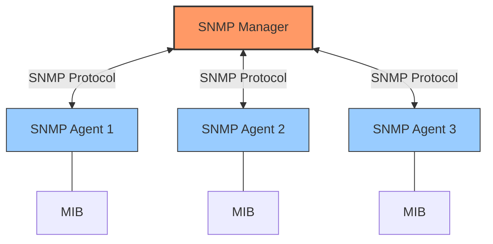
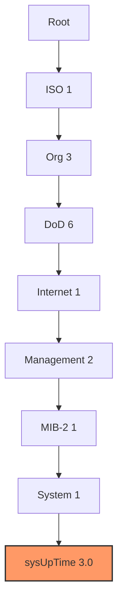

# Simple Network Management Protocol (SNMP)

## Introduction

The Simple Network Management Protocol (SNMP) is a widely used protocol for network management and monitoring. Despite having "Simple" in its name, SNMP is a powerful tool that allows network administrators to monitor and manage network devices such as routers, switches, servers, printers, and more from a central location. 

SNMP operates at the Application Layer of the OSI model and uses UDP as its transport protocol. It was designed to be lightweight, easy to implement, and capable of running on various devices regardless of their hardware or software configurations.

## SNMP Architecture

SNMP follows a manager-agent architecture consisting of three main components:

1. **SNMP Manager**: A central system that monitors and controls the network
2. **SNMP Agent**: Software that runs on managed network devices
3. **Management Information Base (MIB)**: A hierarchical database of information about the device



### How SNMP Works

1. The SNMP manager sends requests to agents to retrieve information or set values
2. SNMP agents respond to these requests with the requested information
3. Agents can also send unsolicited alerts (called traps) to the manager when certain events occur

## SNMP Versions

SNMP has evolved through several versions:

| Version | Key Features | Security |
|---------|-------------|----------|
| SNMPv1  | Basic functionality, simple authentication | Community strings (plaintext) |
| SNMPv2c | Enhanced performance, bulk retrieval | Community strings (plaintext) |
| SNMPv3  | Advanced security features | Authentication, encryption, message integrity |

For beginners, it's important to understand that SNMPv3 provides much stronger security and is recommended for most implementations today.

## SNMP Operations

SNMP supports several types of operations:

- **GET**: Retrieve a specific value from an agent
- **GETNEXT**: Retrieve the next value in a sequence
- **GETBULK**: Retrieve multiple values efficiently (introduced in SNMPv2)
- **SET**: Modify a value on an agent
- **TRAP**: Send an alert from agent to manager
- **INFORM**: Enhanced traps with acknowledgment (introduced in SNMPv2)

## Understanding MIBs and OIDs

The Management Information Base (MIB) is a hierarchical database that organizes all manageable objects on a device. Each object is identified by an Object Identifier (OID), which is a sequence of numbers separated by dots.

For example, the OID `1.3.6.1.2.1.1.3.0` refers to the system uptime of a device.

The structure of OIDs follows a tree-like format:



## Practical Example: Using SNMP in Python

Let's look at a simple example of using SNMP to retrieve system information using Python:

```python
# First, install the pysnmp library:
# pip install pysnmp

from pysnmp.hlapi import *

def get_system_info(host, community):
    # OIDs for system information
    system_name = '1.3.6.1.2.1.1.1.0'  # sysDescr
    system_uptime = '1.3.6.1.2.1.1.3.0'  # sysUpTime
    
    # Create an SNMP GET request for system name
    error_indication, error_status, error_index, var_binds = next(
        getCmd(SnmpEngine(),
               CommunityData(community),
               UdpTransportTarget((host, 161)),
               ContextData(),
               ObjectType(ObjectIdentity(system_name)))
    )
    
    if error_indication:
        print(f"Error: {error_indication}")
    else:
        for var_bind in var_binds:
            print(f"System Description: {var_bind[1]}")
    
    # Create an SNMP GET request for system uptime
    error_indication, error_status, error_index, var_binds = next(
        getCmd(SnmpEngine(),
               CommunityData(community),
               UdpTransportTarget((host, 161)),
               ContextData(),
               ObjectType(ObjectIdentity(system_uptime)))
    )
    
    if error_indication:
        print(f"Error: {error_indication}")
    else:
        for var_bind in var_binds:
            # Uptime is in hundredths of a second
            uptime_seconds = int(var_bind[1]) / 100
            days, remainder = divmod(uptime_seconds, 86400)
            hours, remainder = divmod(remainder, 3600)
            minutes, seconds = divmod(remainder, 60)
            
            print(f"System Uptime: {int(days)}d {int(hours)}h {int(minutes)}m {int(seconds)}s")

# Example usage
get_system_info('192.168.1.1', 'public')
```

**Output Example**:
```
System Description: SomeCorp Router v4.2.1 running on Linux 4.19.0
System Uptime: 14d 7h 32m 45s
```

## Setting Up an SNMP Agent

If you want to set up an SNMP agent on a Linux system, you can use the `snmpd` service:

```bash
# Install the SNMP daemon
sudo apt-get install snmpd

# Edit the configuration file
sudo nano /etc/snmp/snmpd.conf

# Basic configuration:
# Replace "public" with your desired community string
# rocommunity public  # read-only access with community string "public"

# Restart the service
sudo systemctl restart snmpd
```

## Real-World Applications

SNMP is used in various real-world scenarios:

1. **Network Monitoring Systems**: Tools like Nagios, Zabbix, and PRTG use SNMP to collect data from network devices.

2. **Bandwidth Monitoring**: SNMP can retrieve interface statistics to monitor bandwidth usage.

3. **Automated Alerting**: Network administrators can set up alerts for various conditions like high CPU usage, disk space issues, or network interface problems.

4. **Network Inventory**: SNMP can be used to discover and inventory devices on a network.

## Example: Monitoring Router CPU Using SNMP

Here's a more practical example of monitoring CPU usage on a Cisco router:

```python
from pysnmp.hlapi import *

def monitor_cisco_cpu(host, community):
    # OID for Cisco CPU usage (5 second average)
    cpu_usage_oid = '1.3.6.1.4.1.9.2.1.58.0'
    
    # Create an SNMP GET request
    error_indication, error_status, error_index, var_binds = next(
        getCmd(SnmpEngine(),
               CommunityData(community),
               UdpTransportTarget((host, 161)),
               ContextData(),
               ObjectType(ObjectIdentity(cpu_usage_oid)))
    )
    
    if error_indication:
        print(f"Error: {error_indication}")
    elif error_status:
        print(f"Error: {error_status.prettyPrint()}")
    else:
        for var_bind in var_binds:
            cpu_percent = var_bind[1]
            print(f"CPU Usage: {cpu_percent}%")
            
            # Alert if CPU usage is high
            if cpu_percent > 80:
                print("ALERT: High CPU usage detected!")

# Example usage
monitor_cisco_cpu('192.168.1.1', 'public')
```

**Sample Output**:
```
CPU Usage: 37%
```

## SNMP Best Practices

When implementing SNMP in your network, consider these best practices:

1. **Use SNMPv3 whenever possible**: It provides authentication and encryption, which are absent in earlier versions.

2. **Change default community strings**: Never use the default "public" and "private" community strings.

3. **Implement access control**: Restrict SNMP access to specific IP addresses.

4. **Minimize SNMP traffic**: Use GETBULK operations when retrieving multiple values.

5. **Monitor SNMP traffic**: Keep an eye on SNMP traffic patterns to detect potential security issues.

## Common Issues and Troubleshooting

Here are some common SNMP issues and how to troubleshoot them:

1. **Connection Timeouts**
   - Check if the SNMP service is running on the device
   - Verify firewall settings (SNMP uses UDP port 161 by default)
   - Confirm the community string is correct

2. **No Data Returned**
   - Ensure the OID you're querying exists on the device
   - Check that you have the right permissions to access the OID

3. **High CPU Usage**
   - Too many SNMP requests can overload devices
   - Consider using bulk operations or increasing the polling interval

## Summary

SNMP is a powerful protocol that allows for effective network monitoring and management. We've covered:

- The basic architecture of SNMP (manager, agent, MIB)
- Different SNMP versions and their security implications
- SNMP operations (GET, SET, TRAP, etc.)
- MIBs and OIDs structure
- Practical examples using Python
- Real-world applications and best practices

SNMP is an essential skill for network administrators and a valuable tool in maintaining network health and performance.

## Exercises

1. Install an SNMP daemon on your local machine and configure it with a custom community string.
2. Write a Python script that retrieves the system description and contact information from your local SNMP agent.
3. Set up an SNMP trap sender and receiver to practice receiving alerts.
4. Create a simple network map by using SNMP to discover devices on your network.
5. Research and try to implement SNMPv3 with authentication and encryption.

## Additional Resources

- [RFC 1157](https://tools.ietf.org/html/rfc1157) - Simple Network Management Protocol (SNMPv1)
- [RFC 3411-3418](https://tools.ietf.org/html/rfc3411) - Simple Network Management Protocol (SNMPv3)
- [Net-SNMP](http://www.net-snmp.org/) - A popular open-source SNMP implementation
- [PySNMP Documentation](https://pysnmp.readthedocs.io/) - Documentation for the Python SNMP library