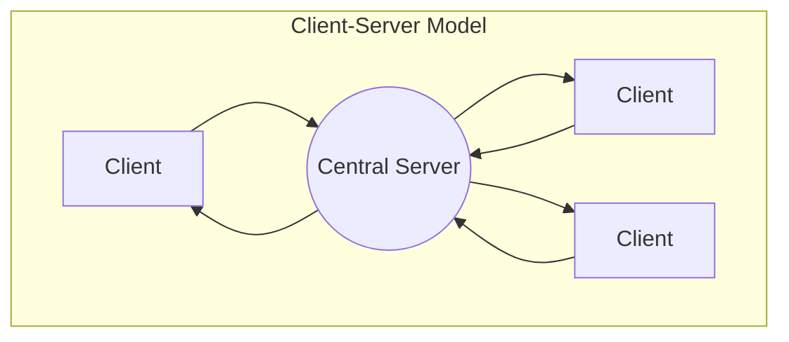
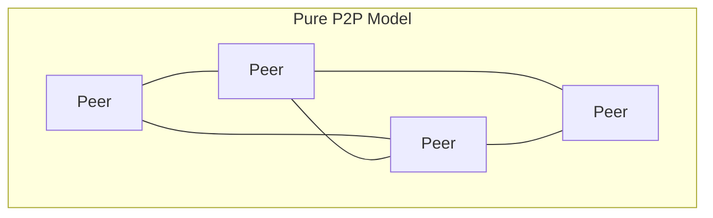

# Peer-to-Peer (P2P) Applications

## Introduction

When you think of network applications, you might first imagine client-server models like web browsers connecting to websites. However, there's another powerful paradigm called **peer-to-peer (P2P)** networking that has revolutionized how we share data, collaborate, and build resilient systems.

In P2P applications, computers (peers) communicate directly with each other without requiring a central server. Each participant in the network can function as both a client and a server, requesting and providing resources simultaneously. This creates a distributed network where responsibility and control are spread across all participants.

## Core Concepts of P2P Networks

### Decentralization vs. Centralization

To understand P2P better, let's compare it with the traditional client-server model:





In the client-server model, all communication passes through a central server, creating a potential single point of failure. If the server goes down, the entire system becomes unavailable.

In contrast, P2P networks distribute responsibility among peers. This provides several advantages:

- **Resilience**: The network can continue functioning even if some peers disconnect
- **Scalability**: Additional users add resources to the network instead of only consuming them
- **Reduced infrastructure costs**: No need for powerful central servers

### Types of P2P Architectures

P2P networks come in several varieties:

1. **Pure P2P**: No central coordination; peers discover each other directly
2. **Hybrid P2P**: Uses central servers for functions like peer discovery, but direct communication for data transfer
3. **Structured P2P**: Organizes peers in specific topology (often using Distributed Hash Tables)
4. **Unstructured P2P**: Peers connect randomly to form an organic network structure

## P2P Protocols and Mechanisms

### Peer Discovery

For peers to communicate, they must first find each other. Common methods include:

- **Centralized directories**: A server maintains a list of active peers (hybrid approach)
- **Bootstrap nodes**: Special peers that help new peers join the network
- **Local network discovery**: Using multicast/broadcast to find peers on the same network
- **Distributed Hash Tables (DHTs)**: A structured approach to locate resources across the network

### Example: Simple Peer Discovery in Python

Here's a basic example of local network peer discovery using UDP broadcasts:

```python
import socket
import time

# Peer discovery function
def discover_peers(port=12345):
    # Create UDP socket for broadcasting
    s = socket.socket(socket.AF_INET, socket.SOCK_DGRAM)
    s.setsockopt(socket.SOL_SOCKET, socket.SO_BROADCAST, 1)
    s.bind(('', port))
    
    # Listen for peers while broadcasting our presence
    print("Starting peer discovery...")
    
    # Start a listener thread
    peers = set()
    
    try:
        # Broadcast our presence
        s.sendto(b"PEER_DISCOVERY", ('<broadcast>', port))
        
        # Set socket timeout to make it non-blocking
        s.settimeout(2)
        
        # Listen for responses
        for _ in range(5):  # Try a few times
            try:
                data, addr = s.recvfrom(1024)
                if data == b"PEER_DISCOVERY" or data == b"PEER_RESPONSE":
                    peer_ip = addr[0]
                    if peer_ip != socket.gethostbyname(socket.gethostname()):
                        peers.add(peer_ip)
                        # Respond to let them know we exist too
                        s.sendto(b"PEER_RESPONSE", addr)
            except socket.timeout:
                pass
            
            # Broadcast again
            s.sendto(b"PEER_DISCOVERY", ('<broadcast>', port))
            time.sleep(1)
            
    finally:
        s.close()
        
    return peers

# Usage
if __name__ == "__main__":
    discovered_peers = discover_peers()
    print(f"Discovered peers: {discovered_peers}")
```

**Output example:**
```
Starting peer discovery...
Discovered peers: {'192.168.1.5', '192.168.1.10'}
```

This simple example broadcasts UDP packets on the local network and listens for responses from other peers running the same code.

### Data Transfer and Resource Sharing

P2P applications often split large files into smaller chunks that can be downloaded from multiple peers simultaneously. This approach offers several benefits:

- **Parallel downloading**: Getting different pieces from different peers increases speed
- **Resilience**: If one peer disconnects, only their chunks need to be re-sourced
- **Fair distribution**: Peers can implement "tit-for-tat" policies to ensure cooperative sharing

## Popular P2P Applications and Systems

### File Sharing

The most widely known P2P applications are file-sharing systems:

1. **BitTorrent**

BitTorrent revolutionized file sharing with its efficient protocol for distributing large files. Key concepts include:

- **Trackers**: Servers that help peers find each other (hybrid P2P)
- **Seeders**: Peers with complete files
- **Leechers**: Peers still downloading
- **Swarms**: Groups of peers sharing the same file
- **Distributed Hash Tables (DHT)**: Enables "trackerless" torrents

### Example: Simple BitTorrent-like Chunking

```python
def split_file_into_chunks(filename, chunk_size=1024*1024):
    """Split a file into chunks of specified size."""
    chunks = []
    chunk_index = 0
    
    with open(filename, 'rb') as f:
        while True:
            chunk_data = f.read(chunk_size)
            if not chunk_data:
                break
            
            # In a real implementation, we would calculate a hash for each chunk
            chunk_hash = hash(chunk_data)
            
            # Save chunk to disk
            chunk_filename = f"{filename}.part{chunk_index}"
            with open(chunk_filename, 'wb') as chunk_file:
                chunk_file.write(chunk_data)
            
            # Add chunk info to our list
            chunks.append({
                'index': chunk_index,
                'filename': chunk_filename,
                'size': len(chunk_data),
                'hash': chunk_hash
            })
            
            chunk_index += 1
    
    return chunks

# Example usage
if __name__ == "__main__":
    chunks = split_file_into_chunks("large_video.mp4")
    print(f"Split file into {len(chunks)} chunks")
    for i, chunk in enumerate(chunks[:3]):  # Print first 3 chunks
        print(f"Chunk {i}: {chunk['size']} bytes, hash: {chunk['hash']}")
    if len(chunks) > 3:
        print("...")
```

**Example output:**
```
Split file into 15 chunks
Chunk 0: 1048576 bytes, hash: 8763421508967
Chunk 1: 1048576 bytes, hash: 3240891509833
Chunk 2: 1048576 bytes, hash: 9870134598711
...
```

2. **Other File Sharing P2P Systems**

- **eMule/Gnutella**: Earlier P2P file-sharing systems
- **IPFS (InterPlanetary File System)**: Modern content-addressed storage system

### Communication and Collaboration

P2P isn't just for file sharing; it's also used for:

1. **Real-time Communication**
   - **WebRTC**: Enables browser-to-browser communication for video calls and file sharing
   - **Secure messaging apps**: Many use P2P techniques for direct encrypted messaging

2. **Collaborative Editing**
   - **Conflict-Free Replicated Data Types (CRDTs)**: Allow simultaneous editing without central coordination

### Blockchain and Cryptocurrencies

Blockchain networks are among the most influential modern P2P systems:

1. **Bitcoin and Cryptocurrencies**
   - Distributed ledger maintained by a network of peers
   - Consensus algorithms (like Proof of Work) used to agree on transaction order
   - No central authority controlling the currency

2. **Smart Contract Platforms**
   - Ethereum and similar platforms enable decentralized applications (dApps)
   - Code executes across the P2P network instead of on central servers

## Implementing a Simple P2P Application

Let's build a very simple P2P chat application to demonstrate the key concepts:

```python
import socket
import threading
import json
import time
import random
import sys

class SimplePeerChat:
    def __init__(self, username, port=55555):
        self.username = username
        self.port = port
        self.peers = {}  # {address: last_seen_timestamp}
        self.messages = []
        
        # UDP socket for peer discovery
        self.discovery_socket = socket.socket(socket.AF_INET, socket.SOCK_DGRAM)
        self.discovery_socket.setsockopt(socket.SOL_SOCKET, socket.SO_BROADCAST, 1)
        self.discovery_socket.setsockopt(socket.SOL_SOCKET, socket.SO_REUSEADDR, 1)
        self.discovery_socket.bind(('', port))
        
        # TCP socket for messages
        self.msg_socket = socket.socket(socket.AF_INET, socket.SOCK_STREAM)
        self.msg_socket.setsockopt(socket.SOL_SOCKET, socket.SO_REUSEADDR, 1)
        self.msg_socket.bind(('', port+1))
        self.msg_socket.listen(5)
        
        # Start threads
        threading.Thread(target=self.discover_peers, daemon=True).start()
        threading.Thread(target=self.accept_connections, daemon=True).start()
        threading.Thread(target=self.cleanup_peers, daemon=True).start()
        
        print(f"Started P2P chat as {username}")
        
    def discover_peers(self):
        """Broadcast peer discovery messages and handle responses"""
        while True:
            # Broadcast our presence
            discovery_msg = json.dumps({
                "type": "discovery",
                "username": self.username,
                "msg_port": self.port+1
            }).encode()
            
            try:
                self.discovery_socket.sendto(discovery_msg, ('<broadcast>', self.port))
            except Exception as e:
                print(f"Broadcast error: {e}")
            
            # Check for other peers
            self.discovery_socket.settimeout(1)
            try:
                data, addr = self.discovery_socket.recvfrom(1024)
                try:
                    msg = json.loads(data.decode())
                    if msg.get("type") == "discovery":
                        # New peer discovered
                        if addr[0] != socket.gethostbyname(socket.gethostname()):
                            peer_info = (addr[0], msg.get("msg_port"))
                            if peer_info not in self.peers:
                                print(f"Discovered peer: {msg.get('username')} at {peer_info}")
                            self.peers[peer_info] = {
                                "username": msg.get("username"),
                                "last_seen": time.time()
                            }
                            
                            # Send acknowledgment
                            ack_msg = json.dumps({
                                "type": "ack",
                                "username": self.username,
                                "msg_port": self.port+1
                            }).encode()
                            self.discovery_socket.sendto(ack_msg, addr)
                    
                    elif msg.get("type") == "ack":
                        # Acknowledgment from a peer
                        peer_info = (addr[0], msg.get("msg_port"))
                        self.peers[peer_info] = {
                            "username": msg.get("username"),
                            "last_seen": time.time()
                        }
                except json.JSONDecodeError:
                    pass
            except socket.timeout:
                pass
            
            time.sleep(random.uniform(2, 5))  # Randomize to prevent flood
            
    def accept_connections(self):
        """Accept incoming TCP connections for chat messages"""
        while True:
            try:
                client_socket, addr = self.msg_socket.accept()
                threading.Thread(target=self.handle_message, 
                                args=(client_socket, addr), daemon=True).start()
            except Exception as e:
                print(f"Connection accept error: {e}")
    
    def handle_message(self, client_socket, addr):
        """Handle incoming message from a peer"""
        try:
            data = client_socket.recv(1024)
            if data:
                try:
                    msg = json.loads(data.decode())
                    if msg.get("type") == "chat":
                        print(f"
[{msg.get('username')}] {msg.get('content')}")
                        self.messages.append(msg)
                except json.JSONDecodeError:
                    pass
        except Exception as e:
            print(f"Error handling message: {e}")
        finally:
            client_socket.close()
    
    def send_message(self, content):
        """Send a message to all known peers"""
        msg = json.dumps({
            "type": "chat",
            "username": self.username,
            "content": content,
            "timestamp": time.time()
        }).encode()
        
        for peer, info in list(self.peers.items()):
            try:
                s = socket.socket(socket.AF_INET, socket.SOCK_STREAM)
                s.settimeout(2)
                s.connect(peer)
                s.send(msg)
                s.close()
            except Exception as e:
                print(f"Failed to send to {peer}: {e}")
    
    def cleanup_peers(self):
        """Remove peers that haven't been seen recently"""
        while True:
            now = time.time()
            for peer, info in list(self.peers.items()):
                if now - info["last_seen"] > 15:  # 15 seconds timeout
                    print(f"Peer {info['username']} at {peer} timed out")
                    del self.peers[peer]
            time.sleep(5)

# Usage example
if __name__ == "__main__":
    username = input("Enter your username: ")
    chat = SimplePeerChat(username)
    
    try:
        while True:
            msg = input(f"[{username}] ")
            if msg.lower() == "exit":
                break
            if msg:
                chat.send_message(msg)
                # Also display your own message locally
                print(f"[{username}] {msg}")
    except KeyboardInterrupt:
        pass
    
    print("Exiting chat...")
```

**Example interaction when running on two computers:**

Computer 1:
```
Enter your username: Alice
Started P2P chat as Alice
Discovered peer: Bob at ('192.168.1.10', 55556)
[Alice] Hello from my computer!
[Bob] Hi Alice, I received your message!
```

Computer 2:
```
Enter your username: Bob
Started P2P chat as Bob
Discovered peer: Alice at ('192.168.1.5', 55556)
[Alice] Hello from my computer!
[Bob] Hi Alice, I received your message!
```

This simple chat application demonstrates several key P2P concepts:
- Peer discovery via UDP broadcasts
- Direct messaging between peers
- Decentralized operation (no central server)
- Handling peer connections and disconnections

## Challenges in P2P Systems

While P2P systems offer many advantages, they also face significant challenges:

### 1. NAT Traversal and Connectivity

Most home networks use Network Address Translation (NAT), which can make direct connections between peers difficult. Solutions include:

- **STUN/TURN servers**: Help peers establish connections through NATs
- **Hole punching techniques**: Methods to create direct connections through firewalls
- **Relay servers**: Fall back to routing traffic through servers when direct connections fail

### 2. Security Concerns

P2P systems face unique security challenges:

- **Sybil attacks**: Malicious actors creating many fake identities
- **Eclipse attacks**: Isolating a peer by surrounding it with malicious peers
- **Data validation**: Ensuring received data is legitimate
- **Privacy concerns**: Direct connections can expose IP addresses

### 3. Fairness and Free-riding

In resource-sharing P2P systems, some users may:

- **Free-ride**: Download resources without contributing back
- **Selfish behavior**: Modify clients to get better service at others' expense

BitTorrent addresses this with tit-for-tat mechanisms that prioritize peers who share.

## Real-World Applications and Case Studies

### 1. Content Delivery Networks (CDNs) with P2P Components

Some content delivery systems incorporate P2P techniques to reduce server load:

- **Peer5**: Uses WebRTC for browser-based P2P streaming
- **Akamai NetSession**: Combines traditional CDN with P2P delivery

### 2. Decentralized Social Networks

Platforms exploring alternatives to centralized social media:

- **Mastodon**: Federated rather than pure P2P, but shares similar goals
- **Secure Scuttlebutt**: True P2P social networking platform

### 3. Distributed Computing Projects

P2P principles power scientific distributed computing:

- **BOINC** (Berkeley Open Infrastructure for Network Computing): Powers projects like SETI@home
- **Folding@home**: Distributed protein folding simulations

## Summary

Peer-to-peer (P2P) networks represent a powerful alternative to traditional client-server architectures. By distributing responsibility across all participants, P2P systems can achieve greater resilience, scalability, and sometimes performance compared to centralized alternatives.

Key takeaways:
1. P2P networks eliminate single points of failure by distributing responsibility
2. Different P2P architectures (pure, hybrid, structured, unstructured) suit different needs
3. Core challenges include peer discovery, NAT traversal, and security
4. P2P principles power diverse applications from file sharing to cryptocurrencies
5. Implementing P2P requires handling network complexities, but modern tools make it increasingly accessible

## Exercises

1. **Basic P2P Chat**: Extend our simple P2P chat application to include private messaging between specific peers.

2. **File Sharing**: Implement a basic P2P file sharing system that can split files into chunks and reassemble them.

3. **DHT Implementation**: Research and implement a simple Distributed Hash Table for more efficient peer and resource discovery.

4. **WebRTC Experiment**: Use WebRTC to create a browser-based P2P application (video chat or file sharing).

5. **Security Analysis**: Analyze a popular P2P protocol for potential security vulnerabilities and propose improvements.

## Additional Resources

- **Books**:
  - "Peer-to-Peer: Building Secure, Scalable, and Manageable Networks" by Dana Moore and John Hebeler
  - "Bitcoin and Cryptocurrency Technologies" by Arvind Narayanan et al.

- **Open Source Projects**:
  - [libp2p](https://libp2p.io/) - Modular P2P networking stack
  - [IPFS](https://ipfs.io/) - InterPlanetary File System documentation
  - [Kademlia DHT](https://github.com/bmuller/kademlia) - Python implementation of Kademlia DHT

- **Online Courses**:
  - Princeton's Bitcoin and Cryptocurrency Technologies course
  - MIT's Distributed Systems lectures