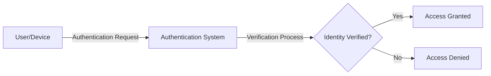
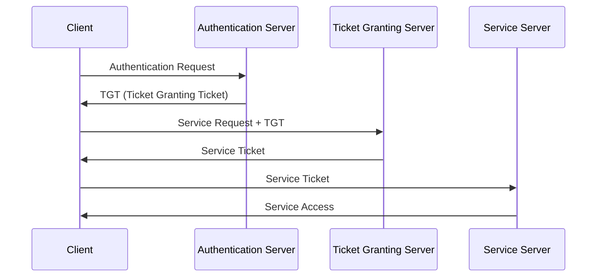
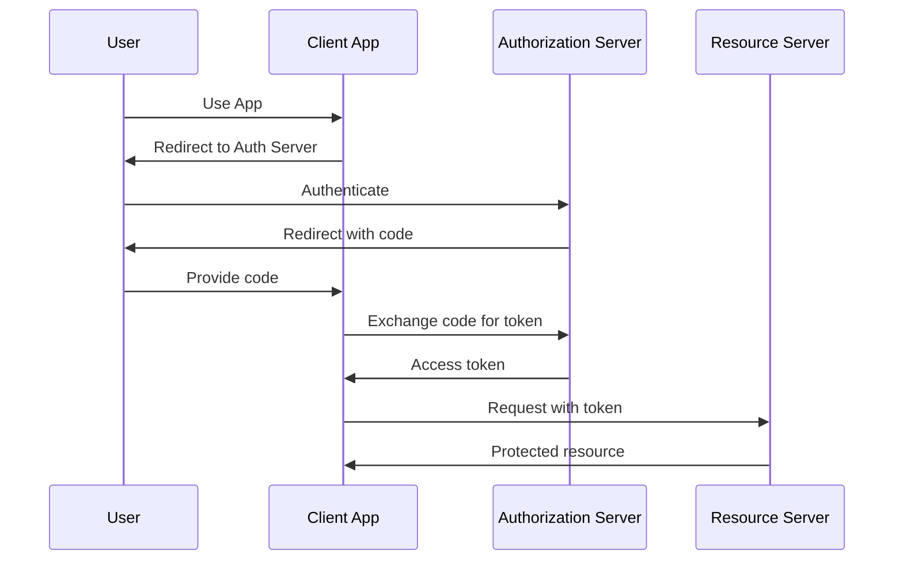
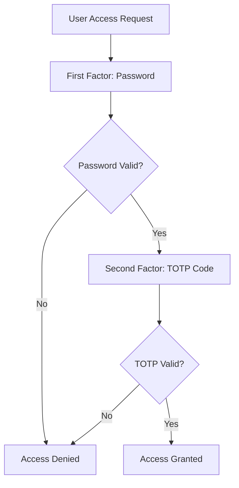
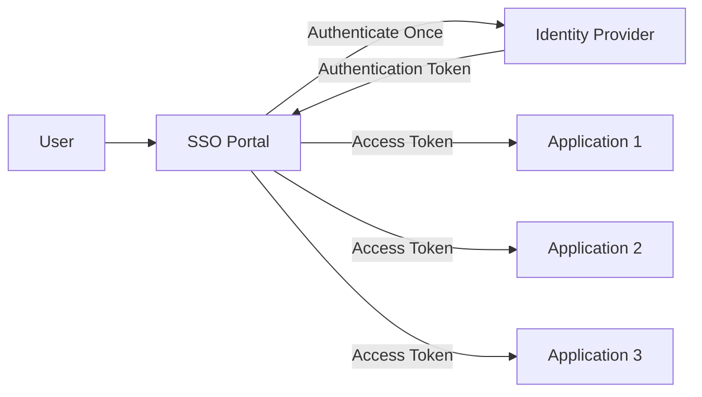

# Networks Authentication

## Introduction

Authentication is a fundamental security concept that verifies the identity of users, devices, or systems attempting to access a network. It serves as the first line of defense against unauthorized access by ensuring that only legitimate entities can connect to and utilize network resources.

In today's interconnected world, where cyber threats are constantly evolving, implementing robust authentication mechanisms is crucial for protecting sensitive information and maintaining network integrity. This guide will walk you through the essential concepts, protocols, and best practices of network authentication.

## What is Network Authentication?

Network authentication is the process of verifying the identity of users or devices requesting access to a network or network resources. It answers the fundamental security question: "Are you who you claim to be?"



Authentication differs from authorization, which determines what an authenticated user is permitted to do once they've gained access. Together, these processes form the cornerstone of network security.

## Authentication Factors

Authentication systems typically rely on one or more of the following factors:

1. **Something you know** - Knowledge factors such as passwords or PINs
2. **Something you have** - Possession factors like security tokens or smart cards
3. **Something you are** - Inherence factors including biometrics (fingerprints, retinal scans)
4. **Somewhere you are** - Location factors based on geographic position
5. **Something you do** - Behavior factors such as typing patterns or gestures

Authentication that uses more than one factor is called multi-factor authentication (MFA) and provides significantly stronger security than single-factor authentication.

## Common Network Authentication Protocols

### Password-Based Authentication

The most basic form of authentication uses passwords to verify identity.

```python
# Basic pseudocode for password authentication
def authenticate_user(username, password):
    stored_password_hash = database.get_password_hash(username)
    
    if stored_password_hash is None:
        return "User not found"
    
    # Hash the provided password
    provided_password_hash = hash_function(password)
    
    if provided_password_hash == stored_password_hash:
        return "Authentication successful"
    else:
        return "Authentication failed"

# Example usage
result = authenticate_user("alice", "secureP@ssw0rd")
print(result)  # Output: Authentication successful
```

#### Limitations of Password Authentication:
- Vulnerable to brute force attacks
- Susceptible to phishing
- Weak if users choose simple passwords
- Reuse across multiple services

### Kerberos

Kerberos is a network authentication protocol that uses tickets to allow nodes to prove their identity securely over non-secure networks.



Key features of Kerberos:
- Mutual authentication (client and server verify each other)
- Uses symmetric key cryptography
- Time-sensitive tickets prevent replay attacks
- Single sign-on capabilities

### RADIUS (Remote Authentication Dial-In User Service)

RADIUS is a client-server protocol that provides centralized authentication, authorization, and accounting for network access.

```javascript
// Example of RADIUS authentication flow in pseudocode
function radiusAuthentication(username, password, clientIP) {
  // 1. Network access device (e.g., WiFi access point) receives credentials
  const accessRequest = {
    type: "Access-Request",
    username: username,
    password: password,
    nasIP: clientIP
  };
  
  // 2. Forward request to RADIUS server
  const radiusResponse = sendToRadiusServer(accessRequest);
  
  // 3. Process response
  if (radiusResponse.type === "Access-Accept") {
    return {
      status: "authenticated",
      sessionAttributes: radiusResponse.attributes
    };
  } else if (radiusResponse.type === "Access-Reject") {
    return {
      status: "rejected",
      reason: radiusResponse.rejectReason
    };
  } else if (radiusResponse.type === "Access-Challenge") {
    return {
      status: "challenge",
      challengeData: radiusResponse.challengeData
    };
  }
}

// Example output:
// { status: "authenticated", sessionAttributes: { role: "user", vlan: "10", timeout: "3600" } }
```

### LDAP (Lightweight Directory Access Protocol)

LDAP is a protocol used for accessing and maintaining distributed directory information services.

```python
# Python example of LDAP authentication
import ldap

def ldap_authenticate(username, password, ldap_server):
    try:
        # Initialize connection to LDAP server
        ldap_connection = ldap.initialize(ldap_server)
        
        # Construct the user DN (Distinguished Name)
        user_dn = f"uid={username},ou=people,dc=example,dc=com"
        
        # Attempt to bind with the provided credentials
        ldap_connection.simple_bind_s(user_dn, password)
        
        # If bind is successful, authentication is successful
        print("Authentication successful")
        return True
        
    except ldap.INVALID_CREDENTIALS:
        print("Invalid credentials")
        return False
    except ldap.LDAPError as e:
        print(f"LDAP error: {e}")
        return False
    finally:
        # Always unbind when done
        if 'ldap_connection' in locals():
            ldap_connection.unbind_s()

# Example usage
ldap_authenticate("jsmith", "secretpass", "ldap://ldap.example.com")
```

### OAuth and OpenID Connect

OAuth 2.0 is an authorization framework that enables third-party applications to obtain limited access to a user's account, while OpenID Connect extends OAuth 2.0 to provide authentication.



OAuth is commonly used for:
- Social login (Sign in with Google, Facebook, etc.)
- API authorization
- Server-to-server authentication

### Certificate-Based Authentication (TLS/SSL)

Certificate-based authentication uses digital certificates to identify users, machines, or devices.

```javascript
// Node.js example of setting up TLS server with client certificate authentication
const https = require('https');
const fs = require('fs');

const options = {
  // Server's own certificate and key
  key: fs.readFileSync('server-key.pem'),
  cert: fs.readFileSync('server-cert.pem'),
  
  // Request client certificate
  requestCert: true,
  
  // Reject connections without valid certificate
  rejectUnauthorized: true,
  
  // Trusted CA certificates
  ca: [fs.readFileSync('ca-cert.pem')]
};

https.createServer(options, (req, res) => {
  // If we get here, the client certificate was valid
  const clientCert = req.socket.getPeerCertificate();
  
  if (req.client.authorized) {
    res.writeHead(200);
    res.end(`Hello ${clientCert.subject.CN}, your certificate was issued by ${clientCert.issuer.CN}!`);
  } else {
    res.writeHead(401);
    res.end("Sorry, your certificate was not valid.");
  }
}).listen(443);

console.log('Server running on port 443');
```

## Multi-Factor Authentication (MFA)

Multi-factor authentication significantly improves security by requiring users to provide two or more verification factors to gain access.



### Implementing TOTP (Time-based One-Time Password)

```python
# Python example of TOTP verification using pyotp
import pyotp
import qrcode
from io import BytesIO
import base64

def setup_mfa(username):
    # Generate a secret key for the user
    secret = pyotp.random_base32()
    
    # Create a TOTP object
    totp = pyotp.TOTP(secret)
    
    # Generate provisioning URI for QR code
    uri = totp.provisioning_uri(username, issuer_name="Your App Name")
    
    # Save the secret key to the user's profile in your database
    # database.save_user_totp_secret(username, secret)
    
    # Generate a QR code
    qr = qrcode.make(uri)
    buffered = BytesIO()
    qr.save(buffered, format="PNG")
    qr_base64 = base64.b64encode(buffered.getvalue()).decode()
    
    return {
        "secret": secret,
        "qr_code": f"data:image/png;base64,{qr_base64}"
    }

def verify_totp(username, token):
    # Retrieve the user's secret from the database
    # secret = database.get_user_totp_secret(username)
    secret = "BASE32SECRET3232"  # Example only
    
    # Create a TOTP object with the secret
    totp = pyotp.TOTP(secret)
    
    # Verify the provided token
    return totp.verify(token)

# Example usage
# First-time setup:
# setup_info = setup_mfa("alice@example.com")
# print("Scan this QR code with your authenticator app:", setup_info["qr_code"])

# During login:
is_valid = verify_totp("alice@example.com", "123456")
print("Authentication token is valid:", is_valid)
```

## Single Sign-On (SSO)

Single Sign-On allows users to authenticate once and gain access to multiple applications without having to log in separately to each one.



### Benefits of SSO:
- Reduced password fatigue
- Simplified user experience
- Centralized authentication policy
- Lower support costs

## Zero Trust Authentication

Zero Trust is a security model that assumes no user or device should be trusted by default, regardless of whether they are inside or outside the network perimeter.

Core principles of Zero Trust:
1. Verify explicitly
2. Use least privilege access
3. Assume breach

```javascript
// Pseudocode example of Zero Trust authentication flow
function zeroTrustAuthenticate(request) {
  // 1. Verify user identity with strong authentication
  const userAuth = authenticateUser(request.credentials);
  if (!userAuth.isValid) return denyAccess("Invalid credentials");
  
  // 2. Verify device health and compliance
  const deviceCompliance = checkDeviceCompliance(request.deviceId);
  if (!deviceCompliance.compliant) return denyAccess("Device not compliant");
  
  // 3. Assess risk based on context
  const riskScore = calculateRiskScore({
    user: userAuth.userId,
    device: request.deviceId,
    location: request.geoLocation,
    time: request.timestamp,
    resource: request.targetResource,
    behavior: getUserBehaviorProfile(userAuth.userId)
  });
  
  // 4. Apply conditional access policies
  if (riskScore > RISK_THRESHOLD) {
    // Require additional verification or limit access
    return requireAdditionalVerification(userAuth.userId);
  }
  
  // 5. Grant least-privilege access for limited time
  return grantTemporaryAccess({
    userId: userAuth.userId,
    resource: request.targetResource,
    permissions: getLeastPrivilegePermissions(userAuth.userId, request.targetResource),
    expiresIn: "1h"
  });
}
```

## Best Practices for Network Authentication

### Password Policies

Implement strong password requirements:

- Minimum length (at least 12 characters)
- Complexity (mix of uppercase, lowercase, numbers, symbols)
- Regular password changes
- Password history to prevent reuse
- Account lockout after failed attempts

### Secure Storage

```javascript
// Example of secure password hashing using bcrypt in Node.js
const bcrypt = require('bcrypt');

async function hashPassword(plainTextPassword) {
  // Generate salt with cost factor 12
  const salt = await bcrypt.genSalt(12);
  
  // Hash password with salt
  const hashedPassword = await bcrypt.hash(plainTextPassword, salt);
  
  return hashedPassword;
}

async function verifyPassword(plainTextPassword, storedHash) {
  // Compare provided password with stored hash
  const isMatch = await bcrypt.compare(plainTextPassword, storedHash);
  
  return isMatch;
}

// Example usage
async function example() {
  const password = "SecureP@ssw0rd!";
  
  // When user creates account or changes password
  const hash = await hashPassword(password);
  // Store hash in database
  
  // When user tries to log in
  const isValid = await verifyPassword(password, hash);
  console.log("Password valid:", isValid);  // Output: Password valid: true
}

example();
```

### Additional Security Measures

1. **Implement MFA** for all network access
2. **Use HTTPS** for all authentication traffic
3. **Monitor and alert** on suspicious authentication attempts
4. **Educate users** about security practices
5. **Regularly audit** authentication systems
6. **Implement timeout** for inactive sessions
7. **Use secure protocols** and deprecate insecure ones

## Practical Implementation Examples

### Securing SSH Access with Public Key Authentication

```bash
# Generate SSH key pair
$ ssh-keygen -t ed25519 -C "your_email@example.com"

# Copy public key to server
$ ssh-copy-id username@remote_host

# SSH config to use key authentication
$ cat ~/.ssh/config
Host myserver
    HostName server.example.com
    User admin
    IdentityFile ~/.ssh/id_ed25519
    IdentitiesOnly yes
```

### Setting Up RADIUS Authentication for Network Devices

```bash
# Install FreeRADIUS on Ubuntu
$ sudo apt update
$ sudo apt install freeradius

# Configure clients (network devices)
$ sudo nano /etc/freeradius/3.0/clients.conf

client 192.168.1.0/24 {
    secret = "SharedSecretKey"
    shortname = "internal-network"
}

# Add users
$ sudo nano /etc/freeradius/3.0/users

jane Cleartext-Password := "password123"
     Service-Type = Administrative-User,
     Reply-Message = "Welcome Jane"

# Test configuration
$ sudo freeradius -X
```

### Implementing JWT-Based Authentication in a Web Application

```javascript
// Node.js/Express example with JSON Web Tokens (JWT)
const express = require('express');
const jwt = require('jsonwebtoken');
const bodyParser = require('body-parser');

const app = express();
const SECRET_KEY = 'your-secret-key'; // In production, use environment variables

app.use(bodyParser.json());

// Login endpoint
app.post('/login', (req, res) => {
  const { username, password } = req.body;
  
  // In a real app, verify against database
  if (username === 'admin' && password === 'password123') {
    // Create token
    const token = jwt.sign(
      { id: 1, username: 'admin', role: 'admin' },
      SECRET_KEY,
      { expiresIn: '1h' }
    );
    
    res.json({ success: true, token });
  } else {
    res.status(401).json({ success: false, message: 'Invalid credentials' });
  }
});

// Middleware to verify token
function authenticateToken(req, res, next) {
  const authHeader = req.headers['authorization'];
  const token = authHeader && authHeader.split(' ')[1];
  
  if (!token) return res.status(401).json({ message: 'No token provided' });
  
  jwt.verify(token, SECRET_KEY, (err, user) => {
    if (err) return res.status(403).json({ message: 'Invalid token' });
    req.user = user;
    next();
  });
}

// Protected route
app.get('/protected', authenticateToken, (req, res) => {
  res.json({
    message: 'Protected data',
    user: req.user
  });
});

app.listen(3000, () => {
  console.log('Server running on port 3000');
});
```

## Common Attacks and Mitigations

### Brute Force Attacks

Attackers attempt to gain access by trying many passwords.

**Mitigations:**
- Account lockout policies
- Rate limiting
- CAPTCHA
- Increasing password complexity
- Implementing MFA

### Phishing

Attackers trick users into revealing their credentials.

**Mitigations:**
- User education
- Email filtering
- Multi-factor authentication
- DMARC, SPF, and DKIM email security
- Security awareness training

### Man-in-the-Middle (MitM) Attacks

Attackers intercept communication between the user and the authentication system.

**Mitigations:**
- TLS/SSL for all authentication traffic
- Certificate pinning
- VPNs for remote access
- Mutual authentication

### Credential Stuffing

Attackers use stolen credentials from one service to access other services.

**Mitigations:**
- Encourage unique passwords
- Implement MFA
- Monitor for unusual login patterns
- Use secure password hashing

## Summary

Network authentication is the foundation of network security, serving as the first line of defense against unauthorized access. Key takeaways from this guide include:

1. **Authentication verifies identity** and differs from authorization
2. **Multiple factors** significantly enhance security
3. **Various protocols** serve different authentication needs
4. **Proper implementation** is crucial for effective security
5. **Continuous monitoring** helps detect and prevent attacks

As networks grow more complex and threats evolve, combining multiple authentication methods and following best practices is essential for maintaining robust security posture.

## Additional Resources

For further learning, consider exploring these resources:

- NIST Special Publication 800-63: Digital Identity Guidelines
- The Open Web Application Security Project (OWASP) Authentication Cheat Sheet
- Books:
  - "Identity and Access Management: Business Performance Through Connected Intelligence"
  - "Computer Security: Principles and Practice"

## Exercises

1. **Basic Setup:** Configure password-based authentication with proper hashing for a sample application.
2. **Advanced Implementation:** Implement TOTP-based multi-factor authentication.
3. **Security Analysis:** Analyze an existing authentication system and identify potential vulnerabilities.
4. **Protocol Comparison:** Compare Kerberos, LDAP, and OAuth for a specific use case.
5. **Attack Simulation:** Set up a controlled environment to simulate and defend against common authentication attacks.