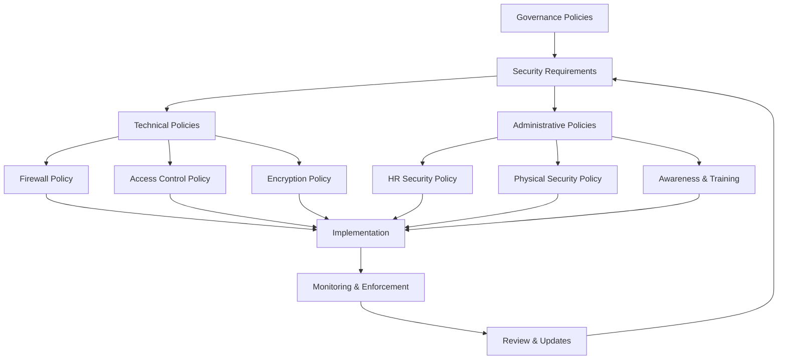
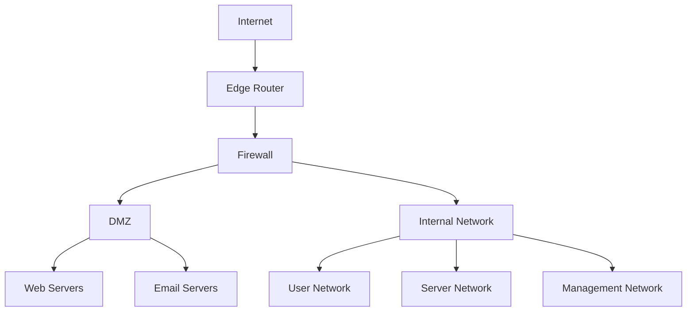

# Network Security Policies

## Introduction

Network security policies are the backbone of any organization's cybersecurity strategy. These documented rules and guidelines define how a network should be protected, who can access what resources, and what actions are permitted within the network infrastructure. Think of them as the "constitution" of your network security framework—they establish the principles that all other security measures follow.

For beginners in programming and network security, understanding these policies is crucial. They provide the context for why certain security implementations exist and guide the development of secure applications and systems.

## What Are Network Security Policies?

Network security policies are formal documents that outline an organization's rules, guidelines, and standards for protecting network resources. They serve several key purposes:

- Define acceptable use of network resources
- Establish security requirements and standards
- Provide a framework for implementing security controls
- Set procedures for responding to security incidents
- Create accountability for security responsibilities

## Types of Network Security Policies

### 1. Acceptable Use Policy (AUP)

This policy defines how users may use organization networks, systems, and data. It specifies:

- Permitted and prohibited activities
- Personal use guidelines
- Email and internet usage rules
- Software installation restrictions

**Example AUP Statement:**

```
All employees must use company network resources solely for business purposes. Personal use is permitted only during breaks and must not interfere with network performance or violate any other security policies. Downloading or installing unauthorized software is strictly prohibited.
```

### 2. Access Control Policy

This policy determines who can access what resources and under what conditions. It typically includes:

- User account management procedures
- Authentication requirements
- Privilege levels and authorization
- Remote access rules

Let's see a practical implementation of access control using a simplified firewall rule:

```bash
# Example Firewall Rule (iptables)
# Allow SSH access only from specific IP range
iptables -A INPUT -p tcp --dport 22 -s 192.168.1.0/24 -j ACCEPT
iptables -A INPUT -p tcp --dport 22 -j DROP
```

### 3. Password Policy

This specifies requirements for strong passwords and their management:

- Minimum length and complexity
- Password expiration periods
- Account lockout thresholds
- Multi-factor authentication requirements

Here's a code example showing how to implement password validation in JavaScript:

```javascript
function isPasswordValid(password) {
  // Minimum 8 characters with at least one uppercase, lowercase, number, and special character
  const regex = /^(?=.*[a-z])(?=.*[A-Z])(?=.*\d)(?=.*[@$!%*?&])[A-Za-z\d@$!%*?&]{8,}$/;
  
  return regex.test(password);
}

// Usage example
const userPassword = "Weak123!";
console.log(`Password is valid: ${isPasswordValid(userPassword)}`);

// Output: Password is valid: true
```

### 4. Data Classification Policy

This policy categorizes data based on sensitivity and defines how each category should be handled:

- Public data
- Internal data
- Confidential data
- Restricted data

### 5. Incident Response Policy

Defines procedures for handling security breaches:

- Roles and responsibilities
- Detection and reporting procedures
- Containment strategies
- Recovery processes
- Post-incident analysis

## Network Security Policy Framework

A comprehensive network security policy framework can be visualized as follows:



## Creating Effective Network Security Policies

### Step 1: Risk Assessment

Before creating policies, identify and assess potential threats to your network:

```javascript
// Example Risk Assessment Matrix (simplified representation)
const risks = [
  { threat: "Unauthorized access", likelihood: 0.8, impact: 0.9, score: 0 },
  { threat: "Malware infection", likelihood: 0.6, impact: 0.7, score: 0 },
  { threat: "Data breach", likelihood: 0.4, impact: 1.0, score: 0 }
];

// Calculate risk scores
risks.forEach(risk => {
  risk.score = risk.likelihood * risk.impact;
});

// Sort risks by score
risks.sort((a, b) => b.score - a.score);

// Output highest risks first
console.log("Prioritized Risks:");
risks.forEach(risk => {
  console.log(`${risk.threat}: ${risk.score.toFixed(2)}`);
});

/* Output:
Prioritized Risks:
Unauthorized access: 0.72
Malware infection: 0.42
Data breach: 0.40
*/
```

### Step 2: Policy Development

Create policies that address the identified risks. Key principles include:

- Align with business objectives
- Be clear and specific
- Consider technical limitations
- Ensure compliance with regulations
- Be realistic and implementable

### Step 3: Implementation

Translate policies into technical controls and procedures. For example, implementing a firewall policy:

```python
# Example Python script to implement a simple firewall rule using scapy
from scapy.all import *

def packet_filter(packet):
    # Block all telnet traffic (port 23)
    if TCP in packet and packet[TCP].dport == 23:
        print("Blocked telnet attempt!")
        return
    
    # Forward all other packets
    send(packet)

# Start packet capture and filtering
sniff(prn=packet_filter)
```

### Step 4: Monitoring and Enforcement

Monitor compliance and enforce policies. This often involves security logging:

```python
# Example logging implementation
import logging

# Configure logging
logging.basicConfig(
    filename='security.log',
    level=logging.INFO,
    format='%(asctime)s - %(levelname)s - %(message)s'
)

def log_access_attempt(user, resource, success):
    if success:
        logging.info(f"User {user} successfully accessed {resource}")
    else:
        logging.warning(f"User {user} failed to access {resource}")

# Example usage
log_access_attempt("user123", "financial_database", False)
```

### Step 5: Review and Update

Security policies need regular review and updates:

```python
# Example policy review scheduling
import datetime

class PolicyReview:
    def __init__(self, policy_name, last_review):
        self.policy_name = policy_name
        self.last_review = last_review
        self.review_interval = datetime.timedelta(days=180)  # 6 months
    
    def is_review_needed(self):
        today = datetime.datetime.now()
        next_review = self.last_review + self.review_interval
        return today >= next_review
    
    def days_until_review(self):
        today = datetime.datetime.now()
        next_review = self.last_review + self.review_interval
        return (next_review - today).days

# Example usage
firewall_policy = PolicyReview(
    "Firewall Policy",
    datetime.datetime(2023, 6, 15)
)

print(f"Review needed: {firewall_policy.is_review_needed()}")
print(f"Days until review: {firewall_policy.days_until_review()}")
```

## Common Network Security Policy Components

### 1. Network Architecture Security

Defines how the network infrastructure should be secured:



### 2. Network Access Controls

Specifies controls for accessing network resources:

```python
# Role-based access control example
def check_access(user, resource, action):
    # Define role-based permissions
    permissions = {
        "admin": {
            "servers": ["read", "write", "configure"],
            "network_devices": ["read", "write", "configure"]
        },
        "developer": {
            "servers": ["read", "write"],
            "network_devices": ["read"]
        },
        "user": {
            "servers": ["read"],
            "network_devices": []
        }
    }
    
    # Get user's role (simplified example)
    user_role = get_user_role(user)
    
    # Check if the user's role allows the requested action on the resource
    if user_role in permissions:
        if resource in permissions[user_role]:
            if action in permissions[user_role][resource]:
                return True
    
    return False

def get_user_role(username):
    # This would normally query a database
    user_roles = {
        "john": "admin",
        "sarah": "developer",
        "mike": "user"
    }
    return user_roles.get(username, "guest")

# Usage example
access_granted = check_access("sarah", "servers", "write")
print(f"Access granted: {access_granted}")  # Output: Access granted: True
```

### 3. Remote Access Security

Defines how remote access to the network should be secured:

```bash
# OpenVPN Server Configuration Example (simplified)
port 1194
proto udp
dev tun
ca ca.crt
cert server.crt
key server.key
dh dh2048.pem
server 10.8.0.0 255.255.255.0
push "redirect-gateway def1 bypass-dhcp"
push "dhcp-option DNS 8.8.8.8"
push "dhcp-option DNS 8.8.4.4"
keepalive 10 120
tls-auth ta.key 0
cipher AES-256-CBC
user nobody
group nogroup
persist-key
persist-tun
status openvpn-status.log
verb 3
```

## Real-World Example: Implementing a Comprehensive Firewall Policy

Let's see how multiple policy elements come together in a real-world firewall implementation:

```bash
#!/bin/bash
# Comprehensive Firewall Policy Implementation

# Flush existing rules
iptables -F
iptables -X

# Set default policies
iptables -P INPUT DROP
iptables -P FORWARD DROP
iptables -P OUTPUT ACCEPT

# Allow loopback traffic
iptables -A INPUT -i lo -j ACCEPT
iptables -A OUTPUT -o lo -j ACCEPT

# Allow established and related connections
iptables -A INPUT -m conntrack --ctstate ESTABLISHED,RELATED -j ACCEPT

# Allow SSH only from internal network
iptables -A INPUT -p tcp -s 192.168.1.0/24 --dport 22 -j ACCEPT

# Allow HTTP and HTTPS for everyone
iptables -A INPUT -p tcp --dport 80 -j ACCEPT
iptables -A INPUT -p tcp --dport 443 -j ACCEPT

# Allow DNS queries
iptables -A INPUT -p udp --dport 53 -j ACCEPT
iptables -A INPUT -p tcp --dport 53 -j ACCEPT

# Log dropped packets
iptables -A INPUT -j LOG --log-prefix "DROPPED: " --log-level 4

# Save rules
iptables-save > /etc/iptables/rules.v4

echo "Firewall rules have been applied and saved."
```

## Best Practices for Network Security Policies

1. **Keep policies simple and clear**: Avoid technical jargon and complex sentences.

2. **Educate users**: Make sure everyone understands the policies and why they're important.

3. **Use a layered approach**: Implement multiple security controls to provide defense in depth.

4. **Regular testing**: Conduct penetration testing and security audits to identify vulnerabilities.

5. **Enforce consistently**: Apply policies uniformly across the organization.

6. **Document thoroughly**: Maintain detailed documentation of all security policies and procedures.

7. **Stay current**: Regularly update policies to address new threats and technologies.

## Implementing Network Security Policies in Your Code

As a developer, you need to ensure your applications adhere to organization security policies. Here's a simple example of implementing a policy-compliant authentication system:

```javascript
// Example: Policy-compliant authentication implementation
class SecurityCompliantAuth {
  constructor() {
    this.MAX_LOGIN_ATTEMPTS = 5;
    this.PASSWORD_MIN_LENGTH = 12;
    this.loginAttempts = {};
  }
  
  validatePassword(password) {
    // Check password length
    if (password.length < this.PASSWORD_MIN_LENGTH) {
      return { valid: false, reason: "Password too short" };
    }
    
    // Check for complexity requirements (uppercase, lowercase, number, special char)
    const hasUppercase = /[A-Z]/.test(password);
    const hasLowercase = /[a-z]/.test(password);
    const hasNumber = /[0-9]/.test(password);
    const hasSpecial = /[^A-Za-z0-9]/.test(password);
    
    if (!(hasUppercase && hasLowercase && hasNumber && hasSpecial)) {
      return { valid: false, reason: "Password not complex enough" };
    }
    
    return { valid: true };
  }
  
  attemptLogin(username, password, ipAddress) {
    // Check if account is locked
    const key = `${username}:${ipAddress}`;
    if (this.loginAttempts[key] && this.loginAttempts[key] >= this.MAX_LOGIN_ATTEMPTS) {
      this.logSecurityEvent(`Account locked due to multiple failed attempts: ${username}`);
      return { success: false, message: "Account locked. Contact administrator." };
    }
    
    // Verify credentials (simplified)
    const isValid = this.verifyCredentials(username, password);
    
    if (!isValid) {
      // Increment failed attempt counter
      this.loginAttempts[key] = (this.loginAttempts[key] || 0) + 1;
      this.logSecurityEvent(`Failed login attempt for ${username} from ${ipAddress}`);
      return { success: false, message: "Invalid credentials" };
    }
    
    // Reset counter on successful login
    delete this.loginAttempts[key];
    this.logSecurityEvent(`Successful login: ${username}`);
    return { success: true, message: "Login successful" };
  }
  
  verifyCredentials(username, password) {
    // This would normally check against a database
    // Simplified for example
    return username === "secureUser" && password === "Secure@Password123";
  }
  
  logSecurityEvent(message) {
    const timestamp = new Date().toISOString();
    console.log(`[SECURITY EVENT] ${timestamp}: ${message}`);
    // In a real system, this would write to a secure log
  }
}

// Usage example
const auth = new SecurityCompliantAuth();
const password = "Short123";
const validationResult = auth.validatePassword(password);
console.log(`Password validation: ${validationResult.valid ? "Passed" : "Failed - " + validationResult.reason}`);

const loginResult = auth.attemptLogin("testUser", "Wrong@Password123", "192.168.1.100");
console.log(`Login attempt: ${loginResult.message}`);
```

## Summary

Network security policies form the foundation of a secure network environment. They define the rules, procedures, and guidelines that govern how network resources should be protected and used. Key takeaways include:

- Policies should be comprehensive, covering all aspects of network security
- They must be regularly reviewed and updated to address evolving threats
- Effective implementation requires both technical controls and user education
- Documentation and enforcement are crucial for policy effectiveness
- As a developer, understanding and implementing these policies in your code is essential for building secure applications

## Exercises

1. Create a simple firewall policy for a small business network with the following requirements:
   - Web server accessible from the internet
   - Internal file server accessible only from the LAN
   - Remote worker access via VPN

2. Develop a basic password validation function that enforces:
   - Minimum 12 characters
   - At least one uppercase, lowercase, number, and special character
   - No common dictionary words

3. Write a data classification policy for a fictional e-commerce company that handles customer payment information.

## Additional Resources

- NIST Special Publication 800-53: Security and Privacy Controls for Federal Information Systems and Organizations
- ISO/IEC 27001: Information Security Management
- OWASP Application Security Verification Standard
- The Center for Internet Security (CIS) Controls
- "Network Security Policies and Procedures" by Douglas W. Frye

Remember, security is a continuous process, not a one-time implementation. Keep learning, stay vigilant, and always follow best practices in your network security journey.