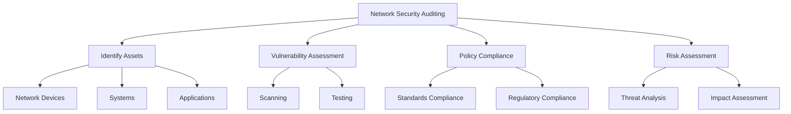
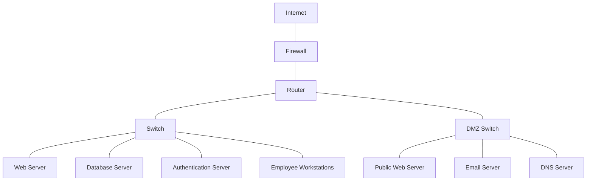

# Network Security Auditing

## Introduction

Network security auditing is a systematic process of evaluating the security of a computer network by measuring how well it conforms to established security standards and best practices. As organizations increasingly rely on interconnected systems, ensuring the security of these networks has become critical to protecting sensitive data and maintaining business continuity.

In this guide, we'll explore the fundamentals of network security auditing, providing you with the knowledge necessary to identify vulnerabilities, assess risks, and implement effective security controls for your network infrastructure.

## What is Network Security Auditing?

Network security auditing is a comprehensive evaluation of your network's security posture. It involves examining network devices, systems, applications, and procedures to identify weaknesses that could be exploited by attackers.

A thorough network security audit answers several critical questions:

- Are your network resources adequately protected?
- Do your security controls align with industry standards and best practices?
- Are there any vulnerabilities that could be exploited?
- Is your network compliant with relevant regulations?
- How effective are your current security measures?



## Key Components of Network Security Auditing

### 1. Planning and Preparation

Before conducting a network security audit, proper planning is essential. This involves:

- **Defining scope and objectives**: Determine which network segments, systems, and applications will be included in the audit.
- **Gathering documentation**: Collect network diagrams, inventory lists, security policies, and previous audit reports.
- **Obtaining authorization**: Ensure you have proper approval to conduct the audit, especially for invasive testing.

```javascript
// Example scope definition (JSON format)
const auditScope = {
  networkSegments: ["192.168.1.0/24", "10.0.0.0/16"],
  criticalSystems: ["authentication-server", "database-server", "file-server"],
  excludedSystems: ["production-environment"],
  testingLevel: "non-invasive",
  timeframe: {
    startDate: "2025-03-20",
    endDate: "2025-04-05"
  }
};
```

### 2. Network Asset Discovery and Mapping

The first technical step in a network security audit is identifying all assets connected to the network. This creates an inventory of systems that need to be secured.

#### Tools for Network Discovery:

- **Nmap**: A powerful open-source network scanner
- **Wireshark**: Network protocol analyzer
- **Angry IP Scanner**: Fast IP scanner

Here's an example of using Nmap for network discovery:

```bash
# Basic network scan to discover hosts
nmap -sn 192.168.1.0/24

# Output might look like:
# Nmap scan report for 192.168.1.1
# Host is up (0.0087s latency).
# Nmap scan report for 192.168.1.5
# Host is up (0.0091s latency).
# Nmap scan report for 192.168.1.10
# Host is up (0.013s latency).
```

After discovery, create a network map that shows the relationships between systems:



### 3. Vulnerability Scanning and Assessment

Once you've identified all network assets, the next step is to scan them for vulnerabilities. Vulnerability scanning tools can automatically detect security weaknesses in your systems and applications.

#### Popular Vulnerability Scanners:

- **OpenVAS**: Open Vulnerability Assessment System
- **Nessus**: Commercial vulnerability scanner
- **Nexpose**: Vulnerability management solution

Here's an example of running an OpenVAS scan:

```bash
# Start OpenVAS
sudo gvm-start

# Create a target
omp -u admin -w password -X "<create_target><name>Web Server</name><hosts>192.168.1.10</hosts></create_target>"

# Create a task
omp -u admin -w password -X "<create_task><name>Web Server Scan</name><target id='TARGET_ID'></target><config id='SCAN_CONFIG_ID'></config></create_task>"

# Start the scan
omp -u admin -w password -X "<start_task task_id='TASK_ID'/>"
```

The output would include a list of vulnerabilities with their severity levels and recommendations for remediation.

### 4. Configuration Review

A critical part of network security auditing is reviewing the configurations of network devices, servers, and applications to ensure they follow security best practices.

#### Areas to focus on:

- **Firewall rules**: Ensure rules follow the principle of least privilege
- **Router configurations**: Check for secure routing protocols and access control
- **Switch security**: Review VLAN configuration and port security
- **Server hardening**: Verify that unnecessary services are disabled

Example checklist for firewall configuration review:

```javascript
const firewallChecklist = [
  "Default deny policy for inbound traffic",
  "Explicit rules for required services only",
  "No direct access to database servers from public networks",
  "Management interfaces accessible only from admin networks",
  "Logging enabled for denied traffic",
  "Regular rule review and cleanup process",
  "No overly permissive rules (any:any)",
  "NAT properly configured for internal hosts"
];
```

### 5. Penetration Testing

Penetration testing goes beyond vulnerability scanning by actively attempting to exploit identified vulnerabilities to determine if they can be used to gain unauthorized access.

**Note:** Penetration testing should only be performed with proper authorization and by qualified professionals.

#### Types of Penetration Testing:

- **Black box**: Tester has no prior knowledge of the network
- **White box**: Tester has complete information about the network
- **Gray box**: Tester has partial knowledge of the network

A simple example of a basic penetration test using Metasploit:

```bash
# Start the Metasploit Framework
msfconsole

# Search for exploits for a vulnerable service
msf > search cve:2021-44228

# Use a specific exploit
msf > use exploit/multi/http/log4shell_header_injection

# Set the target
msf > set RHOSTS 192.168.1.10
msf > set RPORT 8080

# Run the exploit
msf > exploit
```

### 6. Compliance Checking

Many industries have specific regulations regarding network security. A network security audit should verify compliance with relevant standards:

- **PCI DSS**: For organizations handling credit card data
- **HIPAA**: For healthcare organizations
- **NIST 800-53**: For federal information systems
- **ISO 27001**: International standard for information security

Example of a compliance checking script for password policies:

```python
import re
import os

def check_password_policy(password_file):
    compliant = True
    issues = []
    
    with open(password_file, 'r') as f:
        for line in f:
            username, password_hash = line.strip().split(':')
            
            # Check if password hashing algorithm is secure
            if not password_hash.startswith('$6$'):  # Check for SHA-512
                issues.append(f"User {username} is not using a secure hashing algorithm")
                compliant = False
    
    return compliant, issues

# Example usage
is_compliant, policy_issues = check_password_policy('/etc/shadow')
print(f"Password policy compliance: {is_compliant}")
if not is_compliant:
    for issue in policy_issues:
        print(f"- {issue}")
```

### 7. Wireless Network Security Assessment

If your organization uses wireless networks, your security audit should include an assessment of their security:

- Verify that WPA3 or WPA2-Enterprise is used instead of older protocols
- Check for rogue access points
- Ensure proper segmentation of guest networks
- Test for unauthorized access attempts

```bash
# Scan for wireless networks
sudo airodump-ng wlan0

# Check for rogue access points by comparing with authorized list
# Output might show:
# BSSID              PWR  Beacons  #Data  CH   MB   ENC  CIPHER AUTH  ESSID
# 00:11:22:33:44:55  -67  10       0      6    54e  WPA2 CCMP   PSK   CompanyWiFi
# AA:BB:CC:DD:EE:FF  -78  8        0      1    54   WPA2 CCMP   PSK   RogueNetwork
```

### 8. Report Generation and Remediation Planning

After completing the technical aspects of the audit, compile your findings into a comprehensive report that includes:

- **Executive summary**: Overview of the audit findings and risk level
- **Detailed findings**: Specific vulnerabilities and configuration issues
- **Risk assessment**: Impact and likelihood of each finding
- **Remediation recommendations**: Steps to address the identified issues
- **Timeline**: Suggested schedule for implementing fixes

```javascript
// Example report structure in JSON format
const securityAuditReport = {
  executiveSummary: {
    overallRiskLevel: "Medium",
    criticalIssues: 2,
    highIssues: 5,
    mediumIssues: 12,
    lowIssues: 8
  },
  findings: [
    {
      id: "F-001",
      title: "Outdated SSL/TLS version on web server",
      description: "The web server is configured to accept TLS 1.0 connections, which is considered insecure.",
      riskLevel: "High",
      affectedSystems: ["web-server-01", "web-server-02"],
      remediationSteps: [
        "Disable TLS 1.0 and TLS 1.1 in server configuration",
        "Enable TLS 1.2 and TLS 1.3 only",
        "Update cipher suites to use strong encryption"
      ],
      recommendedTimeframe: "Within 30 days"
    },
    // Additional findings would be listed here
  ]
};
```

## Practical Example: Conducting a Basic Network Security Audit

Let's walk through a simplified example of conducting a network security audit for a small business network:

### Step 1: Define the audit scope

```javascript
const smallBusinessAudit = {
  scope: "Full network assessment",
  assets: [
    "Firewall (pfsense)",
    "Switch (Cisco)",
    "Wireless Access Point (Ubiquiti)",
    "File Server (Windows)",
    "Web Server (Apache on Linux)",
    "10 Workstations (Windows)"
  ],
  objectives: [
    "Identify vulnerabilities in network infrastructure",
    "Assess compliance with security best practices",
    "Review access control mechanisms",
    "Test wireless network security"
  ]
};
```

### Step 2: Network discovery and mapping

```bash
# Discover hosts on the network
sudo nmap -sn 192.168.1.0/24

# Result shows:
# 192.168.1.1 - Firewall
# 192.168.1.2 - Switch
# 192.168.1.5 - Wireless Access Point
# 192.168.1.10 - File Server
# 192.168.1.15 - Web Server
# 192.168.1.101-110 - Workstations
```

### Step 3: Vulnerability scanning

```bash
# Perform detailed scan of the file server
sudo nmap -A -T4 -p- 192.168.1.10

# Output excerpt:
# PORT     STATE SERVICE     VERSION
# 445/tcp  open  microsoft-ds Windows Server 2016
# 3389/tcp open  ms-wbt-server Microsoft Terminal Services
# Warning: SMBv1 is enabled on this server
```

### Step 4: Configuration review

Review firewall rules and find an issue:

```text
# Current firewall rule:
allow from any to 192.168.1.10 port 3389

# Issue: RDP is accessible from any source
# Recommendation: Restrict RDP access to internal IPs only
allow from 192.168.1.0/24 to 192.168.1.10 port 3389
```

### Step 5: Prepare audit findings and recommendations

Based on our example audit, the findings might include:

1. SMBv1 is enabled on the file server (High Risk)
   - Recommendation: Disable SMBv1 and use SMBv3 only

2. RDP is accessible from any source (High Risk)
   - Recommendation: Restrict RDP access to internal IPs only

3. Wireless network using outdated WPA encryption (Medium Risk)
   - Recommendation: Upgrade to WPA2-Enterprise or WPA3

4. Web server running outdated Apache version (Medium Risk)
   - Recommendation: Update to latest stable version

## Automating Network Security Audits

For ongoing security monitoring, you can automate parts of your network security audit process. Here's a simple Bash script that performs basic security checks and runs on a schedule:

```bash
#!/bin/bash
# Basic automated security audit script
# Save as security_audit.sh and run regularly via cron

# Set network range
NETWORK="192.168.1.0/24"
REPORT_FILE="/var/log/security_audit_$(date +%Y%m%d).log"

echo "Network Security Audit - $(date)" > $REPORT_FILE
echo "=================================" >> $REPORT_FILE

# 1. Check for new hosts on the network
echo "* Checking for new hosts on the network..." >> $REPORT_FILE
nmap -sn $NETWORK | grep "Nmap scan report" > /tmp/current_hosts.txt

if [ -f /tmp/previous_hosts.txt ]; then
  diff /tmp/previous_hosts.txt /tmp/current_hosts.txt > /tmp/hosts_diff.txt
  if [ -s /tmp/hosts_diff.txt ]; then
    echo "! New hosts detected on the network:" >> $REPORT_FILE
    cat /tmp/hosts_diff.txt >> $REPORT_FILE
  else
    echo "  No new hosts detected." >> $REPORT_FILE
  fi
else
  echo "  First run - establishing baseline." >> $REPORT_FILE
fi

mv /tmp/current_hosts.txt /tmp/previous_hosts.txt

# 2. Check for open ports on critical systems
echo "* Checking for unauthorized open ports on critical systems..." >> $REPORT_FILE
CRITICAL_SYSTEMS="192.168.1.10 192.168.1.15"

for system in $CRITICAL_SYSTEMS; do
  echo "  Scanning $system..." >> $REPORT_FILE
  nmap -F $system >> $REPORT_FILE
done

# 3. Check firewall status
echo "* Checking firewall status..." >> $REPORT_FILE
if sudo ufw status | grep -q "Status: active"; then
  echo "  Firewall is active." >> $REPORT_FILE
else
  echo "! WARNING: Firewall is not active!" >> $REPORT_FILE
fi

# 4. Check for failed login attempts
echo "* Checking for failed login attempts..." >> $REPORT_FILE
grep "Failed password" /var/log/auth.log | tail -10 >> $REPORT_FILE

echo "=================================" >> $REPORT_FILE
echo "End of audit report." >> $REPORT_FILE

# Send email notification with report
mail -s "Network Security Audit Report $(date +%Y-%m-%d)" admin@example.com < $REPORT_FILE
```

## Tools for Network Security Auditing

Here's a summary of essential tools for network security auditing:

| Tool | Purpose | Type |
|------|---------|------|
| Nmap | Network discovery and security scanning | Free & Open Source |
| Wireshark | Network protocol analyzer | Free & Open Source |
| OpenVAS | Vulnerability scanning | Free & Open Source |
| Metasploit | Penetration testing | Free & Commercial |
| Nessus | Vulnerability scanning | Commercial |
| Aircrack-ng | Wireless network security assessment | Free & Open Source |
| Lynis | Security auditing for Linux systems | Free & Open Source |
| OSSEC | Host-based intrusion detection system | Free & Open Source |
| Nikto | Web server scanner | Free & Open Source |
| Kali Linux | Security-focused Linux distribution | Free & Open Source |

## Summary

Network security auditing is an essential practice for maintaining a secure network infrastructure. By systematically evaluating your network's security controls, configurations, and vulnerabilities, you can identify weaknesses before attackers exploit them.

Key takeaways from this guide:

1. Network security auditing involves a structured approach to evaluating your network's security posture.
2. A comprehensive audit includes asset discovery, vulnerability scanning, configuration reviews, and penetration testing.
3. Automated tools can help identify vulnerabilities, but manual analysis is still necessary for a thorough assessment.
4. Regular audits are essential to maintain security as networks evolve and new threats emerge.
5. Documentation and remediation planning are critical to ensuring identified issues are addressed.

By implementing regular network security audits, you can significantly reduce your organization's risk of security breaches and ensure compliance with industry regulations.

## Exercises

1. **Basic Network Mapping**:
   Map your home or lab network using Nmap and draw a network diagram showing all connected devices.

2. **Vulnerability Scanning Practice**:
   Set up a vulnerable virtual machine (like Metasploitable) in a safe environment and scan it for vulnerabilities using OpenVAS.

3. **Firewall Rule Analysis**:
   Review a set of firewall rules and identify any overly permissive rules that should be restricted.

4. **Security Baseline Creation**:
   Create a security baseline document for a network with one server and five workstations, detailing the minimum security requirements.

5. **Automated Audit Script**:
   Modify the example audit script provided in this guide to include additional checks specific to your environment.

## Additional Resources

1. **Industry Standards**:
   - NIST Special Publication 800-115: Technical Guide to Information Security Testing and Assessment
   - ISO/IEC 27001: Information Security Management

2. **Online Courses**:
   - Offensive Security Certified Professional (OSCP)
   - CompTIA Security+
   - Certified Ethical Hacker (CEH)

3. **Security Communities**:
   - OWASP (Open Web Application Security Project)
   - SANS Internet Storm Center