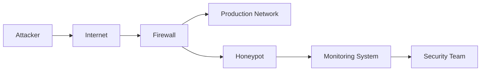

# Network Honeypots

## Introduction

A honeypot is a security mechanism designed to look like a legitimate part of a site or network but is actually isolated and monitored. Its purpose is not to provide any production service or hold valuable data—instead, it's intentionally vulnerable, designed to detect, deflect, or study hacking attempts and unauthorized system access.

Think of honeypots like bait. Just as a bear might be attracted to honey, cybercriminals are drawn to what appears to be vulnerable systems with valuable data. When they take the bait, security professionals can observe their techniques, collect information about their methods, and strengthen their overall security posture.

## How Honeypots Work

Honeypots work on a simple principle: **no one should be accessing them legitimately**. Therefore, any interaction with a honeypot is, by definition, unauthorized and potentially malicious.



When the honeypot is accessed, it logs the activity and alerts security personnel. The data collected can provide invaluable insights into:

- Attack vectors (how attackers gain access)
- Exploitation techniques
- Post-compromise behavior
- Attack origins
- Attacker objectives

## Types of Honeypots

Honeypots can be classified by their level of interaction, deployment purpose, or implementation type.

### By Level of Interaction

#### Low-Interaction Honeypots

Low-interaction honeypots simulate only certain services and applications. They don't provide a full operating system for attackers to interact with, limiting the information that can be gathered but also reducing risk.

```python
# Simple Python low-interaction honeypot that emulates an SSH server
import socket
import threading
import datetime

def handle_client(client_socket, addr):
    print(f"[{datetime.datetime.now()}] Connection from {addr[0]}:{addr[1]}")
    # Send SSH banner
    client_socket.send(b"SSH-2.0-OpenSSH_7.9\r
")
    
    # Log login attempts
    with open("ssh_attempts.log", "a") as log_file:
        try:
            # Receive username and password attempts
            data = client_socket.recv(1024).decode('utf-8', errors='ignore')
            log_file.write(f"[{datetime.datetime.now()}] {addr[0]}:{addr[1]} - {data}
")
            
            # Simulate failed login
            client_socket.send(b"Authentication failed\r
")
            
        except Exception as e:
            print(f"Error: {e}")
        finally:
            client_socket.close()

def start_honeypot():
    server = socket.socket(socket.AF_INET, socket.SOCK_STREAM)
    server.bind(('0.0.0.0', 2222))  # Bind to port 2222 instead of 22
    server.listen(5)
    print(f"[*] Listening on 0.0.0.0:2222")
    
    while True:
        client, addr = server.accept()
        client_handler = threading.Thread(target=handle_client, args=(client, addr))
        client_handler.start()

if __name__ == "__main__":
    start_honeypot()
```

**Output example:**
```
[*] Listening on 0.0.0.0:2222
[2023-07-14 15:23:45.121] Connection from 192.168.1.15:51432
[2023-07-14 15:23:46.342] Connection from 192.168.1.15:51433
```

**Log file content (ssh_attempts.log):**
```
[2023-07-14 15:23:45.182] 192.168.1.15:51432 - SSH-2.0-OpenSSH_8.2
[2023-07-14 15:23:46.550] 192.168.1.15:51433 - admin:password123
```

#### Medium-Interaction Honeypots

Medium-interaction honeypots provide more functionality than low-interaction ones but still don't offer a full operating system. They might simulate vulnerabilities and allow more complex interactions.

#### High-Interaction Honeypots

High-interaction honeypots are complete systems with real operating systems and applications. They provide attackers with a full environment to interact with, allowing security teams to observe their behavior in detail.

```bash
# Setting up a high-interaction honeypot requires a complete system
# Here's a conceptual deployment process using virtualization

# 1. Create an isolated virtual machine
# 2. Install a standard operating system
# 3. Configure network isolation
# 4. Set up comprehensive logging
# 5. Install monitoring tools

# Example: Setting up network monitoring with tcpdump
sudo tcpdump -i eth0 -w honeypot_traffic.pcap
```

### By Purpose

#### Research Honeypots

Research honeypots are designed to gather information about the tactics, techniques, and procedures (TTPs) of attackers, particularly new and emerging threats.

#### Production Honeypots

Production honeypots are deployed alongside production systems to improve security by detecting attacks early and diverting attackers from actual valuable assets.

### By Implementation

#### Physical Honeypots

Dedicated physical machines configured as honeypots.

#### Virtual Honeypots

Honeypots running in virtual machines, allowing for easier management and containment.

#### Honeynets

Networks of honeypots designed to simulate a complex network infrastructure, providing a more realistic environment for attackers.

## Setting Up a Basic Honeypot

Let's walk through setting up a simple HTTP honeypot using Python. This honeypot will log all HTTP requests, making it useful for detecting web application scanning and exploitation attempts.

```python
from http.server import HTTPServer, BaseHTTPRequestHandler
import datetime
import json

class HoneypotHandler(BaseHTTPRequestHandler):
    def _set_headers(self):
        self.send_response(200)
        self.send_header('Content-type', 'text/html')
        self.end_headers()
        
    def do_GET(self):
        self._set_headers()
        self.wfile.write(b"<html><body><h1>Welcome to the server</h1></body></html>")
        self._log_request("GET")
        
    def do_POST(self):
        content_length = int(self.headers['Content-Length'])
        post_data = self.rfile.read(content_length)
        self._set_headers()
        self.wfile.write(b"<html><body><h1>POST request received</h1></body></html>")
        self._log_request("POST", post_data)
        
    def _log_request(self, method, data=None):
        log_entry = {
            "timestamp": datetime.datetime.now().isoformat(),
            "client_address": self.client_address[0],
            "client_port": self.client_address[1],
            "method": method,
            "path": self.path,
            "headers": dict(self.headers),
        }
        
        if data:
            try:
                log_entry["data"] = data.decode('utf-8')
            except:
                log_entry["data"] = str(data)
                
        with open("http_honeypot.log", "a") as log_file:
            log_file.write(json.dumps(log_entry) + "
")
            
        print(f"[{log_entry['timestamp']}] {method} request from {log_entry['client_address']}:{log_entry['client_port']} to {self.path}")

def run_server(server_class=HTTPServer, handler_class=HoneypotHandler, port=8080):
    server_address = ('', port)
    httpd = server_class(server_address, handler_class)
    print(f"Starting honeypot on port {port}...")
    httpd.serve_forever()

if __name__ == "__main__":
    run_server()
```

**To run the honeypot:**
```bash
python http_honeypot.py
```

**Output example:**
```
Starting honeypot on port 8080...
[2023-07-14T16:45:23.456789] GET request from 192.168.1.15:52341 to /
[2023-07-14T16:45:30.123456] GET request from 192.168.1.15:52342 to /admin
[2023-07-14T16:45:35.789123] POST request from 192.168.1.15:52343 to /login
```

## Real-World Applications

### Case Study 1: Detecting Reconnaissance Activity

A small e-commerce company deployed a honeypot that mimicked their database server. Within days, they detected scanning activity targeting SQL injection vulnerabilities. By analyzing the logs, they identified specific SQL injection techniques being used and patched their production systems against these attacks.

### Case Study 2: Analyzing Malware

A research team set up a high-interaction honeypot designed to capture malware samples. When the honeypot was compromised, it automatically isolated the malware in a secure environment, allowing researchers to analyze its behavior, communication patterns, and tactics without risking actual systems.

### Case Study 3: Early Warning System

A financial institution implemented a honeynet that mirrored their network structure. When attackers began targeting a specific service, the honeypot alerted the security team, providing them with valuable time to harden the actual service before it was targeted.

## Common Honeypot Tools

Several ready-to-use honeypot solutions are available:

1. **Cowrie** - SSH/Telnet honeypot that logs brute force attacks and shell interactions
2. **Dionaea** - Captures malware by emulating vulnerable services
3. **HoneyDrive** - A honeypot Linux distro with many pre-installed honeypot tools
4. **T-Pot** - Multi-honeypot platform based on Docker
5. **Honeyd** - Creates virtual hosts on a network

## Honeypot Considerations and Challenges

### Legal Considerations

Before deploying a honeypot, consider:

- Entrapment laws in your jurisdiction
- Privacy regulations regarding data collection
- Liability if your honeypot is used to attack others

### Technical Challenges

Honeypots face several technical challenges:

- **Fingerprinting** - Sophisticated attackers can identify honeypots
- **Risk of compromise** - High-interaction honeypots can be fully compromised
- **Maintenance** - Honeypots require regular updates and monitoring
- **False positives** - Legitimate traffic might accidentally reach honeypots

### Best Practices

To maximize the effectiveness of honeypots:

1. **Isolate honeypots** from production networks
2. **Implement strict monitoring** for all honeypot activity
3. **Regularly update** honeypot configurations to remain convincing
4. **Plan for compromise** and have containment procedures ready
5. **Analyze collected data** systematically to extract actionable intelligence

## Advanced Honeypot Techniques

### Honeytokens

Honeytokens are pieces of data that have no legitimate use but might be attractive to attackers. Examples include:

- Fake database credentials embedded in configuration files
- Decoy documents with tracking capabilities
- Fake API keys that trigger alerts when used

### Adaptive Honeypots

Adaptive honeypots modify their behavior based on attacker actions, presenting increasingly convincing environments to sophisticated attackers.

```python
# Conceptual pseudo-code for an adaptive SSH honeypot
def handle_connection(connection):
    # Start with basic emulation
    interaction_level = "low"
    
    # Analyze initial connection
    initial_commands = get_first_commands(connection)
    
    # If sophisticated attack patterns detected
    if detect_advanced_techniques(initial_commands):
        # Increase interaction level
        interaction_level = "medium"
        deploy_more_convincing_environment()
        
    # If targeted, specific attacks detected
    if detect_targeted_attack(connection.history):
        # Maximum interaction level
        interaction_level = "high"
        deploy_full_interactive_environment()
    
    # Log data with context
    log_activity(connection, interaction_level)
```

## Summary

Honeypots are powerful security tools that serve multiple purposes in network defense:

- **Detection** of unauthorized access and new attack methods
- **Diversion** of attackers away from valuable systems
- **Intelligence gathering** about attacker tactics and techniques
- **Research** into emerging threats and vulnerabilities

By understanding how honeypots work and implementing them strategically, organizations can add a valuable layer to their defense-in-depth security strategy, turning the tables on attackers by using their own offensive actions as a source of defensive intelligence.

## Exercises for Practice

1. **Set up a basic HTTP honeypot** using the Python code provided in this guide and analyze the logs after exposing it to the internet for 24 hours (in a controlled environment).

2. **Design a honeytoken strategy** for a hypothetical web application that would help detect unauthorized data access.

3. **Research and compare** three different honeypot tools, evaluating their strengths, weaknesses, and appropriate use cases.

4. **Create a honeypot deployment plan** for a small business, including network placement, monitoring strategy, and response procedures.

## Additional Resources

- **Projects and Tools**
  - The Honeynet Project (https://www.honeynet.org/)
  - SANS Internet Storm Center (https://isc.sans.edu/)
  
- **Books**
  - "Virtual Honeypots: From Botnet Tracking to Intrusion Detection" by Niels Provos and Thorsten Holz
  - "Honeypots for Windows" by Roger A. Grimes
  
- **Online Courses**
  - SANS SEC550: Cyber Deception
  - Offensive Security's Penetration Testing courses