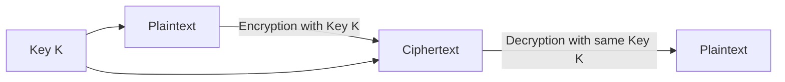
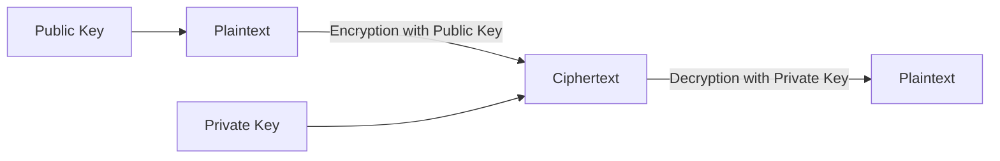
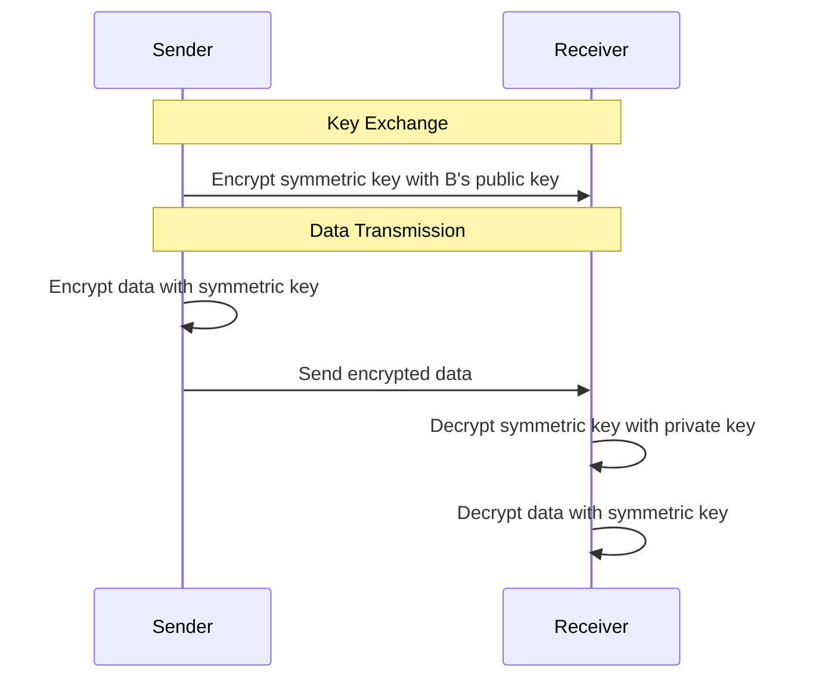
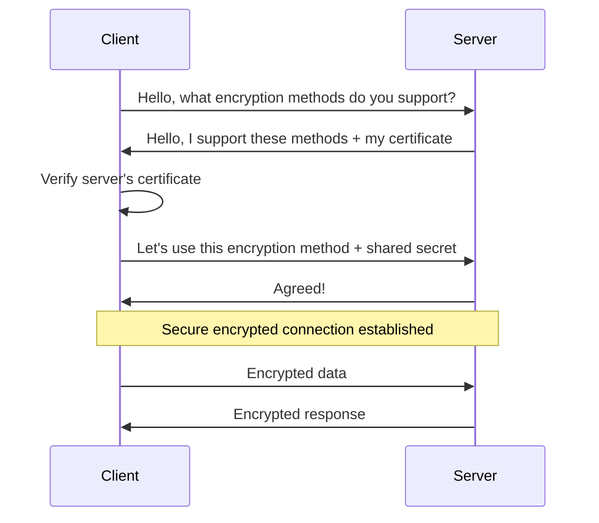
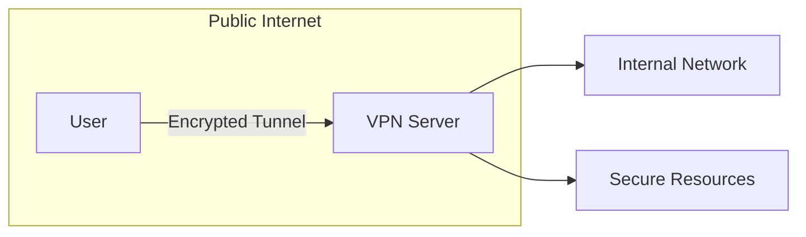

# Networks Encryption

## Introduction

Encryption is the backbone of secure communications across networks. In our increasingly connected world, protecting sensitive data as it travels from one point to another is not just important—it's essential. Whether you're logging into your bank account, sending a private message, or making an online purchase, encryption works silently in the background to keep your information safe from prying eyes.

In its simplest form, encryption transforms readable data (plaintext) into an unreadable format (ciphertext) using mathematical algorithms and secret keys. Only those with the proper key can decrypt the data back to its original form.

This guide will introduce you to the core concepts of network encryption, explore common encryption methods, and demonstrate how these techniques are implemented in real-world applications.

## Basics of Encryption in Networks

### Why Encryption Matters

Before diving into the technical aspects, let's understand why encryption is crucial for network security:

- **Confidentiality**: Ensures that only authorized parties can read the information
- **Integrity**: Verifies that data hasn't been altered during transmission
- **Authentication**: Confirms the identity of the communicating parties
- **Non-repudiation**: Prevents senders from denying they sent a message

### Key Encryption Terms

Let's familiarize ourselves with some fundamental terminology:

- **Plaintext**: The original, readable data before encryption
- **Ciphertext**: The scrambled, unreadable result after encryption
- **Encryption Algorithm**: The mathematical formula used to convert plaintext to ciphertext
- **Key**: A secret value used by the encryption algorithm
- **Encryption**: The process of converting plaintext to ciphertext
- **Decryption**: The process of converting ciphertext back to plaintext

## Types of Encryption

Network encryption methods generally fall into two main categories:

### Symmetric Encryption

In symmetric encryption, the same key is used for both encryption and decryption.



#### Examples of Symmetric Algorithms

1. **AES (Advanced Encryption Standard)**
   - Block cipher with key sizes of 128, 192, or 256 bits
   - Current industry standard for symmetric encryption
   
2. **DES (Data Encryption Standard)**
   - Older algorithm with 56-bit key (now considered insecure)
   - Replaced by AES for most applications

3. **3DES (Triple DES)**
   - Applies DES algorithm three times to each data block
   - More secure than DES but slower than AES

#### Simple AES Example in Python

```python
from cryptography.fernet import Fernet

# Generate a key
key = Fernet.generate_key()
print(f"Encryption Key: {key.decode()}")

# Create a Fernet instance
cipher = Fernet(key)

# Message to encrypt
message = "This is a secret message"
print(f"Original message: {message}")

# Encrypt the message
encrypted_message = cipher.encrypt(message.encode())
print(f"Encrypted message: {encrypted_message.decode()}")

# Decrypt the message
decrypted_message = cipher.decrypt(encrypted_message).decode()
print(f"Decrypted message: {decrypted_message}")
```

**Output:**
```
Encryption Key: 9P_oXZkjKLKuKeGxw9ELNaq4Khq1QNuZecF2qY-wVhA=
Original message: This is a secret message
Encrypted message: gAAAAABltWdjpSeJWLf3A7UBkYi9QF4NJmqV2P2QA2TZpqw2bdxyeX4tKlXOhRhIHFP-Lz9RvDTGVSt6gP1Tx_O6Fj8EaLzLfA==
Decrypted message: This is a secret message
```

### Asymmetric Encryption (Public Key Encryption)

Asymmetric encryption uses a pair of mathematically related keys: a public key for encryption and a private key for decryption.



#### Examples of Asymmetric Algorithms

1. **RSA (Rivest-Shamir-Adleman)**
   - Based on the difficulty of factoring large prime numbers
   - Used for secure data transmission and digital signatures
   
2. **ECC (Elliptic Curve Cryptography)**
   - Uses algebraic structure of elliptic curves
   - Provides same security level as RSA with smaller keys
   
3. **Diffie-Hellman**
   - Not used for encryption directly, but for secure key exchange
   - Allows two parties to establish a shared secret over an insecure channel

#### RSA Example in Python

```python
from cryptography.hazmat.primitives.asymmetric import rsa, padding
from cryptography.hazmat.primitives import hashes
import base64

# Generate RSA key pair
private_key = rsa.generate_private_key(
    public_exponent=65537,
    key_size=2048
)
public_key = private_key.public_key()

# Message to encrypt
message = "This is a secret message for asymmetric encryption"
print(f"Original message: {message}")

# Encrypt with public key
ciphertext = public_key.encrypt(
    message.encode(),
    padding.OAEP(
        mgf=padding.MGF1(algorithm=hashes.SHA256()),
        algorithm=hashes.SHA256(),
        label=None
    )
)
encrypted = base64.b64encode(ciphertext).decode()
print(f"Encrypted message: {encrypted}")

# Decrypt with private key
decrypted = private_key.decrypt(
    base64.b64decode(encrypted),
    padding.OAEP(
        mgf=padding.MGF1(algorithm=hashes.SHA256()),
        algorithm=hashes.SHA256(),
        label=None
    )
).decode()
print(f"Decrypted message: {decrypted}")
```

**Output:**
```
Original message: This is a secret message for asymmetric encryption
Encrypted message: KLjF8Z2v5h1iQvN+jH7Xdf9TgJZoQxm7f2B+PEzUhDvr1w3mL3NsFqe3yY9p6zKl...
Decrypted message: This is a secret message for asymmetric encryption
```

### Hybrid Encryption

In practice, most network encryption systems use a hybrid approach that combines the strengths of both symmetric and asymmetric encryption:

1. Use asymmetric encryption to securely exchange a symmetric key
2. Use that symmetric key for the actual data encryption/decryption

This approach provides both the security of asymmetric encryption and the performance of symmetric encryption.



## SSL/TLS: Encryption in Practice

One of the most common implementations of network encryption is the SSL/TLS protocol, which secures web communications.

### How SSL/TLS Works



### SSL/TLS Handshake Example

Let's look at a simplified programmatic example of establishing a TLS connection:

```python
import socket
import ssl

# Create a context with strong encryption settings
context = ssl.create_default_context()

# Connect to a secure server
with socket.create_connection(('www.example.com', 443)) as sock:
    with context.wrap_socket(sock, server_hostname='www.example.com') as ssock:
        print(f"Connected to {ssock.server_hostname}")
        
        # Get certificate info
        cert = ssock.getpeercert()
        print(f"Server certificate issued by: {cert['issuer']}")
        
        # Now you can send/receive encrypted data
        ssock.send(b"GET / HTTP/1.1\r
Host: www.example.com\r
\r
")
        response = ssock.recv(1024)
        print(f"Response: {response[:100]}...")
```

### Digital Certificates and Certificate Authorities

Digital certificates are a crucial part of network encryption, providing a way to verify the authenticity of public keys.

#### Components of a Digital Certificate

- **Subject**: The entity (person, server, organization) the certificate was issued to
- **Issuer**: The Certificate Authority (CA) that issued the certificate
- **Public Key**: The subject's public key
- **Digital Signature**: The CA's signature, verifying the certificate's authenticity
- **Validity Period**: Start and end dates for certificate validity

#### Certificate Authorities (CAs)

CAs are trusted third parties that issue and manage digital certificates. Common CAs include:

- Digicert
- Let's Encrypt
- Comodo
- GlobalSign

## Implementing Network Encryption: Best Practices

When implementing encryption in your network applications, follow these best practices:

### 1. Choose Strong Algorithms and Key Sizes

```
✓ Use AES-256 for symmetric encryption
✓ Use RSA with 2048+ bit keys or ECC with 256+ bit keys for asymmetric encryption
✓ Avoid deprecated algorithms like MD5, SHA-1, DES, or RC4
```

### 2. Implement Perfect Forward Secrecy

Perfect Forward Secrecy ensures that session keys will not be compromised even if the long-term private key is compromised.

```python
# Example of implementing forward secrecy with Diffie-Hellman in Python
from cryptography.hazmat.primitives.asymmetric import dh
from cryptography.hazmat.primitives import serialization

# Generate parameters
parameters = dh.generate_parameters(generator=2, key_size=2048)

# Generate keys for Alice
alice_private_key = parameters.generate_private_key()
alice_public_key = alice_private_key.public_key()

# Generate keys for Bob
bob_private_key = parameters.generate_private_key()
bob_public_key = bob_private_key.public_key()

# Compute shared key
alice_shared_key = alice_private_key.exchange(bob_public_key)
bob_shared_key = bob_private_key.exchange(alice_public_key)

# Both shared keys should be identical
print(f"Keys match: {alice_shared_key == bob_shared_key}")
```

### 3. Use Authenticated Encryption

Always use encryption modes that provide both confidentiality and integrity, such as AES-GCM or ChaCha20-Poly1305.

```python
from cryptography.hazmat.primitives.ciphers.aead import AESGCM

# Generate a random 256-bit key
key = AESGCM.generate_key(bit_length=256)

# Create an AESGCM object
aesgcm = AESGCM(key)

# Generate a random 96-bit IV (nonce)
nonce = os.urandom(12)

# Data to encrypt
data = b"Authenticated encryption protects both confidentiality and integrity"

# Additional data to authenticate but not encrypt
aad = b"Additional authenticated data"

# Encrypt and authenticate
ciphertext = aesgcm.encrypt(nonce, data, aad)

# Decrypt and verify
plaintext = aesgcm.decrypt(nonce, ciphertext, aad)
print(f"Decrypted: {plaintext.decode()}")
```

### 4. Properly Manage Keys

- Store private keys securely
- Implement key rotation policies
- Use hardware security modules (HSMs) for critical applications
- Never hardcode keys in your application

## Real-World Applications

### 1. Secure Web Browsing (HTTPS)

When you see `https://` in your browser, it means the website is using TLS encryption to protect your connection.

```python
# Simple HTTPS web server in Python
from http.server import HTTPServer, BaseHTTPRequestHandler
import ssl

class SimpleHTTPRequestHandler(BaseHTTPRequestHandler):
    def do_GET(self):
        self.send_response(200)
        self.send_header('Content-type', 'text/plain')
        self.end_headers()
        self.wfile.write(b'Hello, secure world!')

httpd = HTTPServer(('localhost', 4443), SimpleHTTPRequestHandler)

# Create SSL context
context = ssl.SSLContext(ssl.PROTOCOL_TLS_SERVER)
context.load_cert_chain('server.crt', 'server.key')  # Load certificate and key

# Wrap the socket
httpd.socket = context.wrap_socket(httpd.socket, server_side=True)

print('Server running on https://localhost:4443')
httpd.serve_forever()
```

### 2. Virtual Private Networks (VPNs)

VPNs use encryption to create secure tunnels across public networks.



### 3. Secure Email with PGP/GPG

PGP (Pretty Good Privacy) and its open-source implementation GPG (GNU Privacy Guard) provide end-to-end encryption for email communications.

```python
# Basic example of using GPG in Python with python-gnupg
import gnupg

# Initialize GPG
gpg = gnupg.GPG(gnupghome='/path/to/.gnupg')

# Encrypt a message
encrypted_data = gpg.encrypt("This is a secret email message", 
                             recipients=['recipient@example.com'])

# Send the encrypted message
print(f"Encrypted message: {str(encrypted_data)}")

# On recipient side, decrypt the message
decrypted_data = gpg.decrypt(str(encrypted_data))
print(f"Decrypted message: {str(decrypted_data)}")
```

### 4. Secure File Transfer with SFTP/SCP

SFTP (SSH File Transfer Protocol) and SCP (Secure Copy Protocol) use SSH encryption for secure file transfers.

```python
# Example using paramiko to implement SFTP
import paramiko

# Set up the connection
ssh = paramiko.SSHClient()
ssh.set_missing_host_key_policy(paramiko.AutoAddPolicy())
ssh.connect('sftp.example.com', username='user', password='password')

# Open an SFTP session
sftp = ssh.open_sftp()

# Upload a file
sftp.put('local_file.txt', 'remote_file.txt')
print("File uploaded securely")

# Download a file
sftp.get('remote_file.txt', 'downloaded_file.txt')
print("File downloaded securely")

# Close the connection
sftp.close()
ssh.close()
```

## Common Encryption Vulnerabilities and Pitfalls

Even with encryption in place, network security can be compromised if not implemented correctly:

1. **Weak Key Generation**
   - Always use cryptographically secure random number generators

2. **Padding Oracle Attacks**
   - Use modern padding schemes and authenticated encryption

3. **Man-in-the-Middle (MITM) Attacks**
   - Properly validate certificates and use certificate pinning

4. **Implementation Flaws**
   - Use well-tested libraries rather than implementing encryption yourself
   - Keep encryption libraries updated to address known vulnerabilities

5. **Key Management Issues**
   - Implement secure key storage, distribution, and rotation

## Summary

Network encryption is the foundation of secure digital communications, transforming readable data into protected ciphertext that can only be accessed by authorized parties. We've explored:

- **Basic Encryption Concepts**: How encryption works and why it's important
- **Types of Encryption**: Symmetric, asymmetric, and hybrid approaches
- **SSL/TLS**: The backbone of secure web communications
- **Digital Certificates**: How we verify the authenticity of encryption keys
- **Implementation Best Practices**: Guidelines for secure implementation
- **Real-World Applications**: How encryption is used in everyday scenarios

By understanding and properly implementing network encryption, developers can protect sensitive data, maintain privacy, and build trust in their applications.

## Additional Resources

### Books
- "Cryptography Engineering" by Niels Ferguson, Bruce Schneier, and Tadayoshi Kohno
- "Serious Cryptography" by Jean-Philippe Aumasson

### Online Resources
- [Cryptography I](https://www.coursera.org/learn/crypto) - Stanford University course on Coursera
- [Mozilla Developer Network: HTTPS](https://developer.mozilla.org/en-US/docs/Web/HTTP/HTTPS)
- [OWASP Cryptographic Storage Cheat Sheet](https://cheatsheetseries.owasp.org/cheatsheets/Cryptographic_Storage_Cheat_Sheet.html)

### Python Libraries
- [cryptography](https://cryptography.io/en/latest/) - Modern cryptography library for Python
- [PyCryptodome](https://pycryptodome.readthedocs.io/) - Self-contained Python package of low-level cryptographic primitives

## Exercises

1. **Basic Encryption**
   - Implement a simple AES encryption and decryption function
   - Experiment with different key sizes and see how they affect performance

2. **Key Exchange**
   - Create a simple program that implements the Diffie-Hellman key exchange protocol
   - Visualize how the shared secret is generated without ever being transmitted

3. **Certificate Inspection**
   - Write a script to connect to various HTTPS websites and examine their certificates
   - Compare certificate details like key size, signature algorithm, and issuing CA

4. **Secure Chat Application**
   - Build a simple encrypted chat application using symmetric encryption
   - Extend it to use asymmetric encryption for the initial key exchange