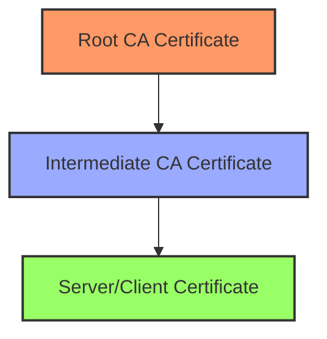
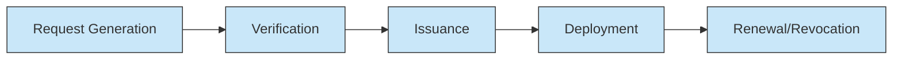
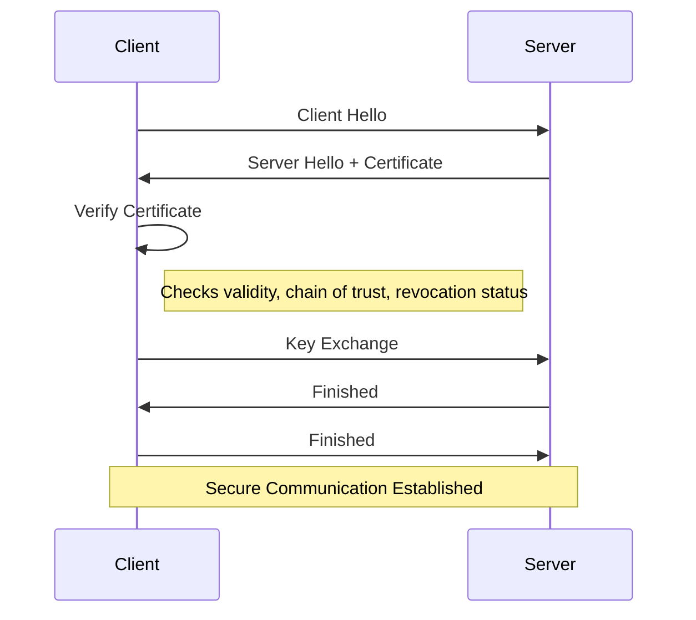

# Networks Digital Certificates

## Introduction

Digital certificates are electronic credentials that establish the identity of entities (people, servers, or organizations) in the digital world. They function similarly to identification cards like passports or driver's licenses, but for the internet. Digital certificates play a fundamental role in network security by enabling secure communications, verifying identities, and establishing trust between parties that may never physically meet.

In this guide, we'll explore what digital certificates are, how they work, their various types, and their practical applications in network security. By the end of this guide, you'll have a solid understanding of digital certificates and their importance in securing digital communications.

## What Are Digital Certificates?

A digital certificate is an electronic document that uses a digital signature to bind a public key with an identity. This identity could be the name of a person, organization, server, or other entity. The certificate can be used to verify that a public key belongs to the specified entity.

Digital certificates typically contain:

1. The public key being certified
2. Information about the identity of the entity (subject)
3. Validity period (start and expiration dates)
4. Digital signature of the Certificate Authority (CA) that issued the certificate
5. Serial number and version information
6. Information about the CA
7. Certificate policies and usage restrictions

## Certificate Authorities and the Chain of Trust

### What is a Certificate Authority?

A Certificate Authority (CA) is a trusted third party that issues digital certificates. The CA verifies the identity of an entity requesting a certificate and, if the verification is successful, digitally signs and issues a certificate binding the entity's identity to its public key.

### The Chain of Trust

Digital certificates rely on a hierarchical system called the "chain of trust" or "certificate chain":



1. **Root CA Certificates**: These are self-signed certificates representing the highest level of trust. Your browsers and operating systems come pre-installed with trusted root CA certificates.

2. **Intermediate CA Certificates**: Root CAs typically issue certificates to intermediate CAs, which in turn issue certificates to end entities. This adds a layer of security.

3. **End-Entity Certificates**: These are issued to specific entities like websites, individuals, or devices.

When your browser encounters a certificate, it verifies the entire chain back to a trusted root CA to establish trust.

## Types of Digital Certificates

Several types of digital certificates serve different purposes:

1. **SSL/TLS Certificates**: Used to secure communications between web servers and browsers. They enable HTTPS connections.

2. **Code Signing Certificates**: Used by software developers to digitally sign applications, ensuring users that the software hasn't been tampered with.

3. **Email Certificates**: Used to sign and encrypt email messages (S/MIME).

4. **Client Certificates**: Used to authenticate individual users to servers or services.

5. **Root Certificates**: Self-signed certificates that establish the root of trust.

## How Digital Certificates Work

### The Basics of Public Key Infrastructure (PKI)

Digital certificates are a key component of Public Key Infrastructure (PKI), which is a framework for managing digital certificates and public key encryption.

PKI uses a pair of keys for each entity:
- **Public Key**: Freely distributed and used to encrypt messages or verify signatures
- **Private Key**: Kept secret and used to decrypt messages or create signatures

### Certificate Lifecycle



1. **Certificate Request**: An entity generates a key pair and creates a Certificate Signing Request (CSR) containing the public key and entity information.

2. **Verification**: The CA verifies the entity's identity through various means depending on the certificate type.

3. **Certificate Issuance**: Once verified, the CA signs the certificate with its private key and issues it to the entity.

4. **Certificate Deployment**: The entity installs the certificate on their server, device, or application.

5. **Certificate Renewal or Revocation**: Certificates have an expiration date and must be renewed. They can also be revoked if compromised.

## X.509 Standard

Most digital certificates follow the X.509 standard, which defines the format for public key certificates. Let's look at the structure of an X.509 certificate:

```
Certificate:
    Data:
        Version: 3 (0x2)
        Serial Number: 12345 (0x3039)
    Signature Algorithm: sha256WithRSAEncryption
    Issuer: C=US, O=Example CA, CN=Example CA
    Validity
        Not Before: Jan 1 00:00:00 2023 GMT
        Not After : Dec 31 23:59:59 2023 GMT
    Subject: C=US, O=Example Inc, CN=example.com
    Subject Public Key Info:
        Public Key Algorithm: rsaEncryption
            Public-Key: (2048 bit)
            Modulus: [...]
            Exponent: 65537 (0x10001)
    X509v3 extensions:
        X509v3 Key Usage: 
            Digital Signature, Key Encipherment
        X509v3 Extended Key Usage: 
            TLS Web Server Authentication, TLS Web Client Authentication
        X509v3 Subject Alternative Name: 
            DNS:example.com, DNS:www.example.com
```

## Practical Example: Creating and Viewing Certificates

### Generating a Self-Signed Certificate with OpenSSL

Let's create a self-signed certificate using OpenSSL, a widely used cryptography toolkit:

```bash
# Generate a private key
openssl genrsa -out server.key 2048

# Create a Certificate Signing Request (CSR)
openssl req -new -key server.key -out server.csr -subj "/C=US/ST=State/L=City/O=Organization/CN=example.com"

# Generate a self-signed certificate valid for 365 days
openssl x509 -req -days 365 -in server.csr -signkey server.key -out server.crt
```

The above commands will:
1. Generate a 2048-bit RSA private key
2. Create a CSR with specific identity information
3. Create a self-signed certificate valid for one year

### Viewing Certificate Information

You can examine the contents of a certificate using OpenSSL:

```bash
# View certificate information
openssl x509 -in server.crt -text -noout
```

Example output:

```
Certificate:
    Data:
        Version: 1 (0x0)
        Serial Number: 12345 (0x3039)
    Signature Algorithm: sha256WithRSAEncryption
    Issuer: C=US, ST=State, L=City, O=Organization, CN=example.com
    Validity
        Not Before: Jan 1 00:00:00 2023 GMT
        Not After : Dec 31 23:59:59 2023 GMT
    Subject: C=US, ST=State, L=City, O=Organization, CN=example.com
    Subject Public Key Info:
        Public Key Algorithm: rsaEncryption
            Public-Key: (2048 bit)
            Modulus: [...]
            Exponent: 65537 (0x10001)
    [...]
```

## Certificate Verification in TLS Handshake

When you visit a secure website (HTTPS), a certificate verification process occurs as part of the TLS handshake:



The steps include:
1. The client (browser) connects to the server.
2. The server presents its certificate.
3. The client validates the certificate:
   - Is it issued by a trusted CA?
   - Is it still valid (not expired)?
   - Does the domain name match?
   - Has it been revoked?
4. If validation succeeds, secure communication is established.

## Practical Example: Implementing a Certificate in a Node.js HTTPS Server

Here's how to create a simple HTTPS server in Node.js using a digital certificate:

```javascript
const https = require('https');
const fs = require('fs');

// Read the private key and certificate
const options = {
  key: fs.readFileSync('server.key'),
  cert: fs.readFileSync('server.crt')
};

// Create an HTTPS server
const server = https.createServer(options, (req, res) => {
  res.writeHead(200);
  res.end('Hello, secure world!
');
});

// Listen on port 443
server.listen(443, () => {
  console.log('HTTPS server running on port 443');
});
```

When a client connects to this server, they'll establish a secure connection using the provided certificate.

## Certificate Validation and Revocation

### Certificate Validation

Clients validate certificates by checking:
1. **Signature verification**: Was it signed by a trusted CA?
2. **Validity period**: Is the certificate still valid?
3. **Domain name verification**: Does the certificate match the domain?
4. **Revocation status**: Has the certificate been revoked?

### Certificate Revocation

Sometimes certificates need to be invalidated before their expiration date, for example, if a private key is compromised. Two main methods for checking revocation status are:

1. **Certificate Revocation Lists (CRLs)**: Lists of revoked certificates published by CAs.
2. **Online Certificate Status Protocol (OCSP)**: A protocol that allows real-time checking of certificate status.

## Common Certificate Issues and Troubleshooting

1. **Certificate Expiration**: Certificates have a limited validity period and must be renewed before expiring.

2. **Name Mismatch**: The domain name in the certificate doesn't match the website's address.

3. **Untrusted CA**: The certificate is issued by a CA that's not trusted by the client.

4. **Self-Signed Certificates**: These aren't signed by a trusted CA and will trigger security warnings in browsers.

5. **Certificate Chain Issues**: Missing intermediate certificates can break the chain of trust.

6. **Revoked Certificates**: Certificates that have been revoked but are still in use.

## Best Practices for Managing Digital Certificates

1. **Maintain an inventory** of all certificates used in your organization.

2. **Monitor expiration dates** and set up alerts for certificates nearing expiration.

3. **Use strong key sizes** (minimum 2048-bit RSA or equivalent).

4. **Protect private keys** with strong access controls.

5. **Implement certificate rotation** procedures.

6. **Use automation** for certificate lifecycle management.

7. **Regularly audit** certificate usage and compliance.

## Summary

Digital certificates are fundamental to network security, providing:

- **Authentication**: Verifying the identity of entities in digital communications
- **Encryption**: Enabling secure data transmission
- **Integrity**: Ensuring data hasn't been tampered with
- **Non-repudiation**: Preventing denial of sent messages or transactions

They work within the Public Key Infrastructure (PKI) framework, which includes Certificate Authorities, certificate chains, and validation mechanisms. Understanding digital certificates is essential for anyone involved in network security, web development, or system administration.

## Exercises and Practice

1. Generate a self-signed certificate using OpenSSL and examine its contents.
2. Set up a simple HTTPS server using Node.js and your self-generated certificate.
3. Examine the certificate chain of a popular website using your browser's developer tools.
4. Research and compare different types of SSL/TLS certificates (DV, OV, EV) and their validation requirements.
5. Practice troubleshooting common certificate errors by deliberately creating scenarios with expired certificates or name mismatches.

## Additional Resources

- [OpenSSL Documentation](https://www.openssl.org/docs/)
- [Let's Encrypt - Free Certificate Authority](https://letsencrypt.org/)
- [Mozilla's Web Security Guidelines](https://infosec.mozilla.org/guidelines/web_security)
- [PKI and Digital Certificates RFC (RFC 5280)](https://tools.ietf.org/html/rfc5280)
- [Certificate Transparency Project](https://certificate.transparency.dev/)

Understanding digital certificates is a critical step in learning network security. As you continue your journey, you'll discover how certificates work together with other security mechanisms to create a comprehensive security strategy for modern networks and applications.