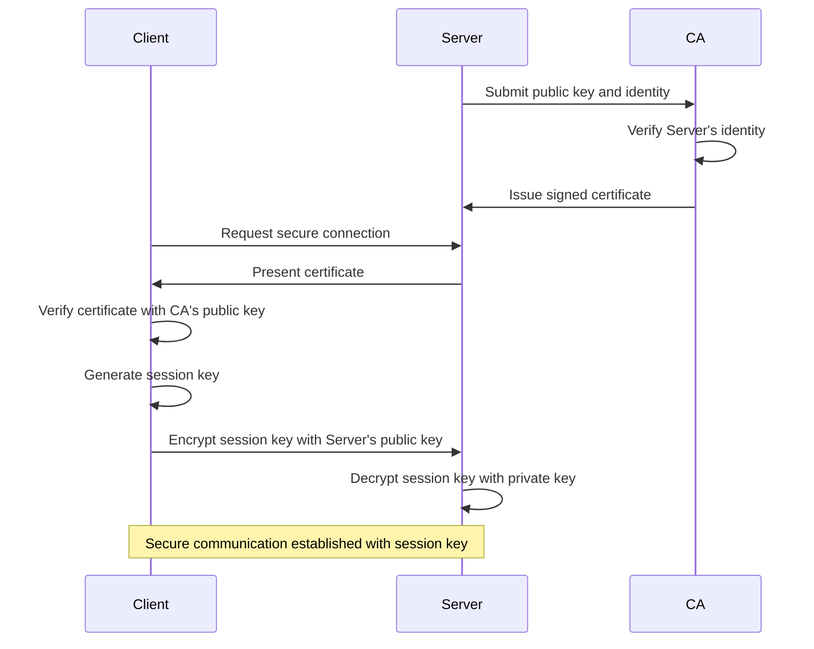
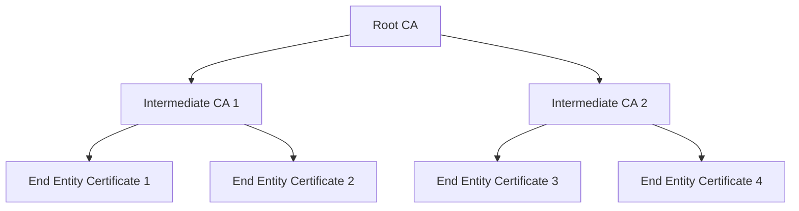

# Public Key Infrastructure (PKI)

## Introduction

Public Key Infrastructure (PKI) is a fundamental framework that enables secure communication in the digital world. Just as we use identification cards in the physical world to prove who we are, PKI provides the digital equivalent through a system of certificates, cryptographic keys, and trusted authorities.

In this guide, we'll explore what PKI is, how it works, why it's crucial for network security, and how it's implemented in real-world applications. By the end, you'll understand how PKI serves as the backbone of secure internet transactions, from online banking to secure web browsing.

## What is Public Key Infrastructure?

Public Key Infrastructure (PKI) is a set of roles, policies, hardware, software, and procedures needed to create, manage, distribute, use, store, and revoke digital certificates and manage public-key encryption.

At its core, PKI addresses four essential security concerns:

- **Authentication**: Verifying that users and systems are who they claim to be
- **Confidentiality**: Ensuring that only authorized parties can read sensitive information
- **Integrity**: Confirming that data hasn't been altered during transmission
- **Non-repudiation**: Preventing users from denying their actions

## Core Components of PKI

PKI consists of several key components working together:

```mermaid
graph TD
    A[Certificate Authority (CA)] --> B[Digital Certificates]
    A --> C[Certificate Revocation Lists]
    D[Registration Authority (RA)] --> A
    B --> E[End Entity/Users]
    F[Public & Private Keys] --> B
    G[Certificate Store] --> B
    H[Certificate Policy] --> A
```

### Certificate Authority (CA)

The Certificate Authority is the trusted third party that issues digital certificates. The CA verifies the identity of entities (users, servers, organizations) before issuing certificates that bind their identity to their public keys.

Think of a CA as a digital notary public that everyone trusts to verify identities.

Examples of well-known CAs include:
- DigiCert
- Let's Encrypt
- Comodo (now Sectigo)
- GlobalSign

### Registration Authority (RA)

The Registration Authority works under the CA and handles the verification of user identities before certificate issuance. The RA performs the initial validation but doesn't issue certificates itself.

### Digital Certificates

Digital certificates are electronic documents that bind a public key to an identity (individual, server, or organization). The certificate contains:

- Subject's name
- Subject's public key
- Certificate's validity period
- Issuer's name (the CA)
- Issuer's digital signature

The most common standard for digital certificates is X.509.

Here's a simplified view of what an X.509 certificate contains:

```
Version: 3
Serial Number: 4c:0b:1d:19:bf:55:81:04
Signature Algorithm: sha256WithRSAEncryption
Issuer: CN=Example CA, O=Example Organization, C=US
Validity:
    Not Before: Jan 1 00:00:00 2023 GMT
    Not After: Dec 31 23:59:59 2023 GMT
Subject: CN=example.com, O=Example Inc., C=US
Subject Public Key Info:
    Public Key Algorithm: rsaEncryption
    RSA Public Key: (2048 bit)
        Modulus: 00:c4:6e:a4:... (abbreviated)
        Exponent: 65537 (0x10001)
X509v3 extensions:
    X509v3 Subject Alternative Name:
        DNS:example.com, DNS:www.example.com
    X509v3 Basic Constraints:
        CA:FALSE
    X509v3 Key Usage:
        Digital Signature, Key Encipherment
    X509v3 Extended Key Usage:
        TLS Web Server Authentication, TLS Web Client Authentication
```

### Public and Private Keys

PKI relies on asymmetric cryptography (also called public-key cryptography), which uses two mathematically related keys:

- **Public Key**: Shared openly with everyone
- **Private Key**: Kept secret by the owner

These keys work together: what is encrypted with one key can only be decrypted with its corresponding pair.

### Certificate Store

A certificate store is a database or directory that stores certificates and their associated public keys. Operating systems maintain certificate stores to keep track of trusted certificates.

### Certificate Revocation List (CRL)

A Certificate Revocation List is a list of certificates that have been revoked before their expiration date. When a private key is compromised or an employee leaves an organization, the corresponding certificate can be revoked and added to the CRL.

### Online Certificate Status Protocol (OCSP)

OCSP provides real-time verification of a certificate's status, checking if it's been revoked. This is more efficient than downloading entire CRLs.

## How PKI Works

Let's walk through a simplified example of how PKI enables secure communication:

1. **Certificate Issuance**:
   - An organization wants to secure its website.
   - The organization generates a public/private key pair.
   - It submits its public key and identity information to a CA.
   - The CA verifies the organization's identity.
   - The CA creates a digital certificate containing the organization's public key and identity, signed with the CA's private key.

2. **Secure Communication**:
   - When a user connects to the organization's website, the website presents its certificate.
   - The user's browser checks if the certificate was issued by a trusted CA.
   - The browser verifies the CA's signature on the certificate using the CA's public key.
   - If valid, the browser trusts that the public key in the certificate belongs to the website.
   - The browser and website can now establish a secure connection using the trusted keys.

Here's a diagram illustrating the process:



## PKI Trust Models

PKI systems implement different trust models:

### Hierarchical (Root) Trust Model

This is the most common model, where trust flows from a root CA down through intermediate CAs to end-entity certificates.



### Web of Trust

Used in systems like PGP (Pretty Good Privacy), where users sign each other's keys, creating a decentralized network of trust without a central authority.

### Bridge CA Model

Used to connect different PKI domains, allowing organizations with their own PKI systems to trust each other through a bridge CA.

## Practical Implementation of PKI

Let's look at some practical examples of how to work with PKI:

### Generating a Self-Signed Certificate with OpenSSL

While self-signed certificates aren't trusted by browsers for public websites, they're useful for testing and development environments:

```bash
# Generate a private key
openssl genrsa -out server.key 2048

# Create a Certificate Signing Request (CSR)
openssl req -new -key server.key -out server.csr -subj "/CN=example.com/O=My Organization/C=US"

# Generate a self-signed certificate valid for 365 days
openssl x509 -req -days 365 -in server.csr -signkey server.key -out server.crt
```

### Using Certificates in a Node.js HTTPS Server

Here's how to create a simple HTTPS server using the generated certificates:

```javascript
const https = require('https');
const fs = require('fs');

const options = {
  key: fs.readFileSync('server.key'),
  cert: fs.readFileSync('server.crt')
};

const server = https.createServer(options, (req, res) => {
  res.writeHead(200);
  res.end('Hello secure world!');
});

server.listen(443, () => {
  console.log('Server running at https://localhost:443/');
});
```

### Verifying a Certificate's Validity

You can verify if a certificate is valid using OpenSSL:

```bash
# View certificate details
openssl x509 -in server.crt -text -noout

# Verify a certificate against a CA certificate
openssl verify -CAfile ca.crt server.crt
```

## Real-World Applications of PKI

PKI is fundamental to many security applications we use daily:

### 1. Secure Web Browsing (HTTPS)

When you visit a secure website (https://), PKI is working behind the scenes:
- The website presents its SSL/TLS certificate.
- Your browser verifies the certificate was issued by a trusted CA.
- This ensures you're connected to the legitimate website, not an impostor.

### 2. Email Encryption and Digital Signatures

Systems like S/MIME use PKI to:
- Encrypt emails so only the intended recipient can read them.
- Digitally sign emails to prove they came from you and weren't altered.

### 3. Code Signing

Software developers use PKI to sign their code, allowing users to verify:
- The code hasn't been tampered with since signing.
- The code comes from the legitimate developer.

### 4. Virtual Private Networks (VPNs)

VPNs use certificates to:
- Authenticate the VPN server to clients.
- Establish encrypted tunnels for secure communication.

### 5. Internet of Things (IoT) Security

IoT devices can use certificates to:
- Authenticate to cloud services.
- Ensure secure firmware updates.
- Prevent unauthorized devices from connecting to networks.

## Common PKI Challenges

While PKI provides robust security, it's not without challenges:

### Certificate Management

Large organizations may need to manage thousands of certificates with different expiration dates and purposes. Forgetting to renew a critical certificate can cause service outages.

### Private Key Protection

The security of the entire system depends on keeping private keys secure. If a private key is compromised, all certificates associated with it become untrustworthy.

### Trust Issues

Users must implicitly trust the CAs installed in their browsers or operating systems. If a CA is compromised (as has happened in the past), attackers can issue fraudulent certificates.

### Validation Methods

Different CAs use different methods to validate identities before issuing certificates:
- Domain Validation (DV): Verifies only domain ownership
- Organization Validation (OV): Verifies organization details
- Extended Validation (EV): Performs thorough verification of legal identity

## Best Practices for PKI Implementation

To implement PKI effectively:

1. **Maintain a Certificate Inventory**: Keep track of all certificates, their purposes, and expiration dates.

2. **Implement Certificate Lifecycle Management**: Automate certificate renewals and revocations.

3. **Protect Private Keys**: Store private keys in secure hardware (HSMs) when possible.

4. **Use Strong Cryptographic Algorithms**: Stay updated with current standards and avoid deprecated algorithms.

5. **Plan for Disaster Recovery**: Have procedures in place for compromised keys or certificates.

6. **Audit Regularly**: Periodically review your PKI implementation for vulnerabilities.

7. **Consider Certificate Transparency**: Participate in certificate transparency logs to detect misissued certificates.

## Summary

Public Key Infrastructure (PKI) provides the trust framework that secures much of our digital world. Through a system of certificates, cryptographic keys, and trusted authorities, PKI enables secure communications, authentication, and data integrity.

Key takeaways:
- PKI uses asymmetric cryptography with public and private key pairs
- Certificate Authorities (CAs) serve as trusted third parties that verify identities
- Digital certificates bind public keys to verified identities
- PKI enables secure web browsing, email encryption, code signing, and more
- Proper management of certificates and private keys is crucial for security

By understanding the principles and components of PKI, you're now equipped to implement and work with this fundamental security technology in your own applications and systems.

## Additional Resources and Exercises

### Further Learning Resources

- [RFC 5280: Internet X.509 Public Key Infrastructure](https://tools.ietf.org/html/rfc5280)
- [Let's Encrypt Documentation](https://letsencrypt.org/docs/)
- [OpenSSL Documentation](https://www.openssl.org/docs/)

### Exercises to Reinforce Learning

1. **Certificate Exploration**:
   - Download the certificate from a popular website using your browser's developer tools.
   - Examine its properties, including the certificate chain, issuer, and validity period.

2. **Create Your Own PKI**:
   - Set up a simple PKI with a root CA and issue certificates for a test website.
   - Configure a web server to use your certificates.

3. **Certificate Revocation Test**:
   - Create a certificate, then revoke it and create a CRL.
   - Test verification against your CRL.

4. **Code Project**:
   - Develop a simple application that uses certificate-based authentication.
   - Implement certificate validation in your code.

By completing these exercises, you'll gain practical experience with PKI concepts and be better prepared to implement secure systems in real-world scenarios.