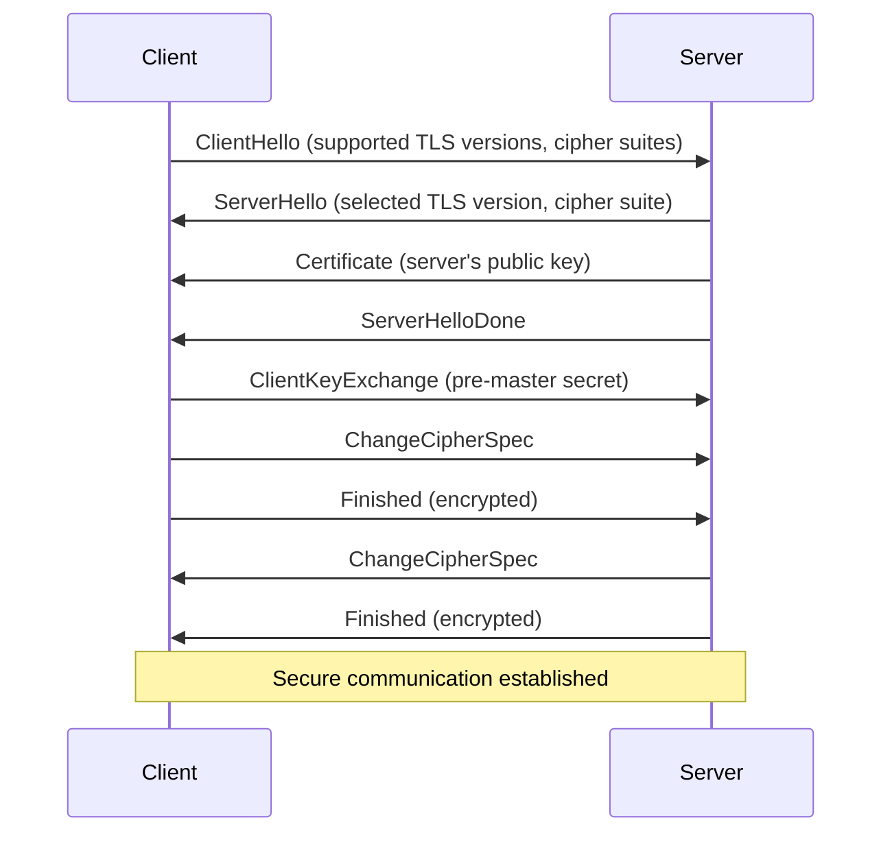
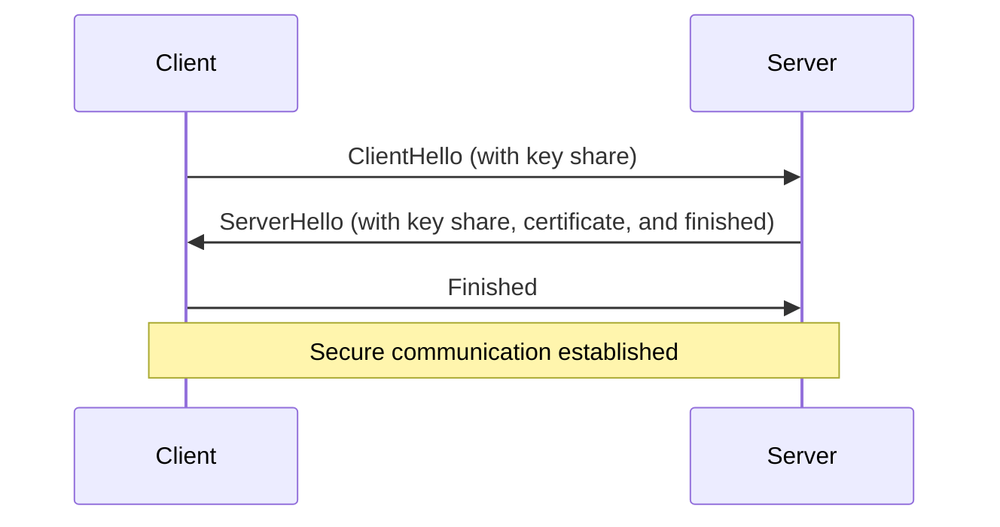

# Understanding SSL and TLS

## Introduction

When you visit a website and see a padlock icon in your browser's address bar, you're experiencing SSL/TLS in action. These protocols are the backbone of secure communication on the internet, protecting your sensitive information from eavesdroppers and attackers.

In this guide, we'll explore Secure Sockets Layer (SSL) and its successor, Transport Layer Security (TLS) - the cryptographic protocols that provide secure communication over computer networks. By the end, you'll understand how these protocols work, why they're essential, and how to implement them in your applications.

## What are SSL and TLS?

SSL (Secure Sockets Layer) and TLS (Transport Layer Security) are cryptographic protocols designed to provide secure communication over a computer network. 

- **SSL** was developed by Netscape in the mid-1990s but is now deprecated due to security vulnerabilities.
- **TLS** is the successor to SSL, with TLS 1.0 first defined in 1999. The current recommended version is TLS 1.3 (released in 2018).

Despite SSL being technically obsolete, the term "SSL" is still commonly used to refer to both protocols. For accuracy, we'll use "TLS" when referring to modern implementations.

## How SSL/TLS Works

TLS operates through a combination of cryptographic techniques that provide:

1. **Authentication**: Verifying the identity of communicating parties
2. **Confidentiality**: Ensuring data privacy through encryption
3. **Integrity**: Detecting any tampering with transmitted data

Let's visualize the TLS handshake process:



### The TLS Handshake Explained

1. **ClientHello**: The client initiates a connection, sending supported TLS versions and cipher suites.
2. **ServerHello**: The server selects the highest TLS version and strongest cipher suite both support.
3. **Certificate**: The server sends its digital certificate containing its public key.
4. **ServerHelloDone**: The server signals it's done with its part of the handshake.
5. **ClientKeyExchange**: The client generates a pre-master secret, encrypts it with the server's public key, and sends it to the server.
6. **ChangeCipherSpec**: Both parties tell each other they'll start using the negotiated encryption.
7. **Finished**: Both sides send an encrypted hash of all handshake messages to verify nothing was tampered with.

After this handshake, both client and server have established a secure, encrypted connection.

## TLS 1.3 Improvements

TLS 1.3 (the latest version) streamlined the handshake process to just one round-trip (1-RTT) instead of two in previous versions, improving performance while maintaining security:



## Digital Certificates and Certificate Authorities

A critical component of TLS is the **digital certificate**. Digital certificates are electronic documents that:

1. Contain the public key of a server
2. Verify the identity of the server
3. Are issued by trusted Certificate Authorities (CAs)

Certificate Authorities are trusted third parties that verify the identity of certificate applicants before issuing certificates. Your browser comes with a pre-installed list of trusted CAs.

### X.509 Certificate Structure

X.509 is the standard format for digital certificates. Here's what a typical certificate contains:

- Version
- Serial Number
- Signature Algorithm
- Issuer Name (the CA)
- Validity Period (Not Before, Not After)
- Subject Name (who the certificate belongs to)
- Subject Public Key
- Extensions
- Certificate Signature

## Implementing TLS in Your Applications

### Web Servers

Here's how to configure a basic HTTPS server in Node.js:

```javascript
const https = require('https');
const fs = require('fs');

// Read the certificate and private key
const options = {
  key: fs.readFileSync('private-key.pem'),
  cert: fs.readFileSync('certificate.pem')
};

// Create an HTTPS server
https.createServer(options, (req, res) => {
  res.writeHead(200);
  res.end('Hello secure world!
');
}).listen(443, () => {
  console.log('Server running at https://localhost:443/');
});
```

### Making HTTPS Requests

Here's how to make secure requests in Node.js:

```javascript
const https = require('https');

https.get('https://example.com', (res) => {
  console.log('statusCode:', res.statusCode);
  
  res.on('data', (d) => {
    process.stdout.write(d);
  });
}).on('error', (e) => {
  console.error(e);
});
```

### Generating Self-Signed Certificates for Development

While not suitable for production, self-signed certificates are useful for development:

```bash
# Generate a private key
openssl genrsa -out private-key.pem 2048

# Generate a Certificate Signing Request (CSR)
openssl req -new -key private-key.pem -out csr.pem

# Generate a self-signed certificate (valid for 365 days)
openssl x509 -req -days 365 -in csr.pem -signkey private-key.pem -out certificate.pem
```

## Common TLS Attacks and Mitigations

### 1. Man-in-the-Middle (MITM) Attacks

**Attack**: An attacker positions themselves between client and server to intercept communications.

**Mitigation**:
- Certificate validation
- HTTP Strict Transport Security (HSTS)
- Certificate Transparency (CT)

### 2. Downgrade Attacks

**Attack**: Forcing the use of weaker cryptographic protocols.

**Mitigation**:
- Disable older, insecure protocols
- Implement TLS_FALLBACK_SCSV to prevent protocol downgrade

### 3. Certificate Issues

**Attack**: Using fraudulent certificates to impersonate legitimate sites.

**Mitigation**:
- Certificate pinning
- Extended Validation (EV) certificates
- Online Certificate Status Protocol (OCSP)

## Best Practices for TLS Implementation

1. **Use the latest TLS version** (currently TLS 1.3)
2. **Disable older protocols** (SSL 2.0, SSL 3.0, TLS 1.0, TLS 1.1)
3. **Implement secure cipher suites**
4. **Configure proper certificate validation**
5. **Enable HSTS** (HTTP Strict Transport Security)
6. **Use proper certificate management** (renewal, revocation)
7. **Regularly scan for vulnerabilities**

## Testing Your TLS Implementation

You can use online tools and command-line utilities to test your TLS configuration:

### Using OpenSSL

```bash
# Check TLS handshake and certificate information
openssl s_client -connect example.com:443 -tls1_3

# Verify which TLS versions are supported
openssl s_client -connect example.com:443 -tls1_2
openssl s_client -connect example.com:443 -tls1_3
```

### Online Testing Tools

Several reputable online services can test your TLS configuration:
- SSL Labs Server Test
- ImmuniWeb SSL Security Test
- Observatory by Mozilla

## Real-World Applications of TLS

### 1. E-commerce

TLS is essential for securing:
- Payment information
- User credentials
- Personal data

### 2. Banking and Finance

Financial institutions use TLS to protect:
- Online banking sessions
- Financial transactions
- Account information

### 3. Healthcare

TLS helps healthcare providers maintain HIPAA compliance by securing:
- Patient records
- Medical data exchanges
- Telemedicine sessions

## Summary

SSL/TLS protocols are fundamental to secure communications on the internet. We've explored:

- The evolution from SSL to modern TLS
- How the TLS handshake establishes secure connections
- Digital certificates and their role in authentication
- Practical implementation in web applications
- Common attacks and security best practices

By properly implementing TLS in your applications, you contribute to a more secure internet for everyone.

## Additional Resources

Here are some resources to deepen your understanding:

1. **RFC Documents**:
   - TLS 1.2: RFC 5246
   - TLS 1.3: RFC 8446

2. **Practice Exercises**:
   1. Set up a local web server with HTTPS using self-signed certificates
   2. Analyze a TLS handshake using Wireshark or similar tools
   3. Create a client application that validates certificates properly
   4. Configure TLS on different web servers (Nginx, Apache, etc.)

3. **Advanced Topics to Explore**:
   - Certificate Transparency
   - Public Key Infrastructure (PKI)
   - Quantum-resistant cryptography