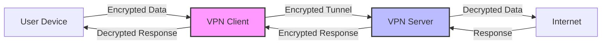
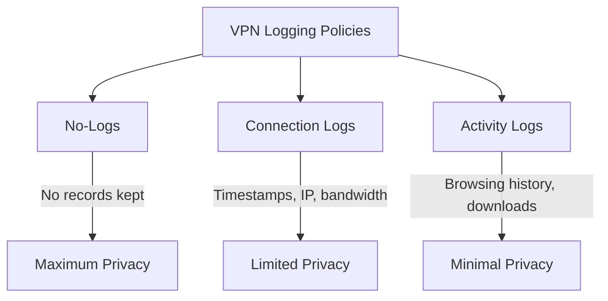

# Understanding VPNs (Virtual Private Networks)

## Introduction

A Virtual Private Network (VPN) is a technology that creates a secure, encrypted connection over a less secure network, such as the public internet. VPNs provide a crucial layer of security and privacy by establishing protected network connections when using public networks. They essentially create a "tunnel" through which your data travels, shielded from outside view.

In today's digital landscape where data breaches and privacy concerns are increasingly common, understanding VPNs has become essential for everyone from casual internet users to IT professionals.

## What is a VPN?

A VPN extends a private network across a public network, enabling users to send and receive data across shared or public networks as if their computing devices were directly connected to the private network.

<div className="info-box">
  <strong>Key Point:</strong> VPNs create a secure connection between your device and the internet, protecting your data and privacy.
</div>

### Core Benefits of VPNs

1. **Privacy**: Hides your IP address and encrypts your internet traffic
2. **Security**: Protects your data when using public Wi-Fi networks
3. **Access**: Bypasses geographical restrictions and censorship
4. **Remote Access**: Allows secure connections to private networks from remote locations

## How VPNs Work

To understand how VPNs work, let's break down the process:



1. **Connection Establishment**: When you connect to a VPN, the client on your device establishes a secure connection to the VPN server.
2. **Authentication**: The server authenticates you, ensuring only authorized users access the VPN.
3. **Tunneling**: A secure "tunnel" is created between your device and the VPN server.
4. **Encryption**: All data traveling through this tunnel is encrypted, making it unreadable to anyone who might intercept it.
5. **IP Masking**: Your original IP address is masked with one from the VPN provider, adding another layer of anonymity.

## VPN Protocols

VPN protocols are sets of rules that determine how data is transmitted between your device and the VPN server. Each protocol offers different features and levels of security.

| Protocol | Security | Speed | Stability | Use Case |
|----------|----------|-------|-----------|----------|
| OpenVPN  | High     | Moderate | High   | General security |
| WireGuard| High     | Very Fast| High   | Modern performance-focused |
| IPSec/IKEv2 | High  | Fast   | Very High | Mobile devices |
| L2TP/IPSec | Medium | Moderate | High   | Basic security needs |
| SSTP     | Medium   | Moderate | Good   | Windows platforms |

### OpenVPN Example

OpenVPN is one of the most popular and secure VPN protocols. Here's how to set up a basic OpenVPN server configuration:

```bash
# Server configuration file (server.conf)
port 1194
proto udp
dev tun
ca ca.crt
cert server.crt
key server.key
dh dh2048.pem
server 10.8.0.0 255.255.255.0
ifconfig-pool-persist ipp.txt
push "redirect-gateway def1 bypass-dhcp"
push "dhcp-option DNS 208.67.222.222"
push "dhcp-option DNS 208.67.220.220"
keepalive 10 120
cipher AES-256-CBC
user nobody
group nogroup
persist-key
persist-tun
status openvpn-status.log
verb 3
```

A simple client configuration might look like:

```bash
# Client configuration file (client.ovpn)
client
dev tun
proto udp
remote server_ip_address 1194
resolv-retry infinite
nobind
persist-key
persist-tun
ca ca.crt
cert client.crt
key client.key
cipher AES-256-CBC
verb 3
```

## Setting Up Your Own VPN

While there are many commercial VPN services available, you might want to set up your own VPN server for complete control. Here's a simple guide to setting up a VPN server using WireGuard on a Linux system:

### 1. Install WireGuard

```bash
# On Ubuntu/Debian
sudo apt update
sudo apt install wireguard

# On CentOS/RHEL
sudo yum install epel-release
sudo yum install wireguard-tools
```

### 2. Generate Keys

```bash
# Create a directory for WireGuard configuration
mkdir -p ~/wireguard/keys
cd ~/wireguard/keys

# Generate private and public keys for the server
wg genkey | tee server_private.key | wg pubkey > server_public.key

# Generate keys for a client
wg genkey | tee client_private.key | wg pubkey > client_public.key
```

### 3. Configure the Server

Create a server configuration file:

```bash
# Create /etc/wireguard/wg0.conf
sudo nano /etc/wireguard/wg0.conf

# Add the following configuration
[Interface]
PrivateKey = <server_private_key>
Address = 10.0.0.1/24
ListenPort = 51820
PostUp = iptables -A FORWARD -i wg0 -j ACCEPT; iptables -t nat -A POSTROUTING -o eth0 -j MASQUERADE
PostDown = iptables -D FORWARD -i wg0 -j ACCEPT; iptables -t nat -D POSTROUTING -o eth0 -j MASQUERADE

[Peer]
PublicKey = <client_public_key>
AllowedIPs = 10.0.0.2/32
```

### 4. Enable IP Forwarding

```bash
# Edit sysctl.conf
sudo nano /etc/sysctl.conf

# Add or uncomment this line
net.ipv4.ip_forward = 1

# Apply changes
sudo sysctl -p
```

### 5. Start the WireGuard Interface

```bash
sudo wg-quick up wg0
sudo systemctl enable wg-quick@wg0
```

### 6. Configure the Client

Create a client configuration file:

```bash
# Create client configuration (client.conf)
[Interface]
PrivateKey = <client_private_key>
Address = 10.0.0.2/24
DNS = 1.1.1.1, 8.8.8.8

[Peer]
PublicKey = <server_public_key>
Endpoint = <server_public_ip>:51820
AllowedIPs = 0.0.0.0/0
PersistentKeepalive = 25
```

## VPN Security Considerations

While VPNs provide a layer of security, they're not a complete security solution. Consider these important factors:

### 1. VPN Logging Policies

Different VPN providers have different logging policies:



- **No-logs**: The provider doesn't keep any records of your VPN usage
- **Connection logs**: Basic connection data is stored
- **Activity logs**: Detailed records of your online activities are kept

### 2. Encryption Strength

VPNs use different encryption standards. AES-256 is currently considered the gold standard for VPN encryption.

### 3. Kill Switch

A VPN kill switch automatically disconnects your device from the internet if the VPN connection drops, preventing accidental data exposure.

## Practical VPN Applications

### Business Use Cases

1. **Secure Remote Work**

VPNs enable employees to access company resources securely from remote locations:

```javascript
// Example pseudocode for a VPN connection in a corporate application
function connectToCompanyResources() {
  if (!vpnClient.isConnected()) {
    // Connect to VPN before accessing company resources
    const connected = vpnClient.connect({
      server: 'corporate-vpn.example.com',
      port: 443,
      protocol: 'ikev2',
      credentials: getUserCredentials()
    });
    
    if (connected) {
      accessInternalResources();
    } else {
      displayError('Please connect to the corporate VPN to continue');
    }
  } else {
    accessInternalResources();
  }
}
```

2. **Secure Multi-site Connectivity**

Large organizations use site-to-site VPNs to connect multiple office locations securely.

### Personal Use Cases

1. **Public Wi-Fi Security**

When connecting to public Wi-Fi at cafes, airports, or hotels, a VPN encrypts your data, protecting it from potential hackers on the same network.

2. **Privacy Protection**

VPNs help protect your browsing activities from being tracked by your ISP or other entities.

## Implementing VPN Checks in Applications

If you're developing applications that need to verify VPN usage (either to require or block VPN connections), here's how you might implement a basic VPN detection:

```javascript
// Basic VPN detection in JavaScript (front-end)
async function detectVPN() {
  try {
    // Check for WebRTC leaks which might reveal actual IP
    const pc = new RTCPeerConnection({iceServers: []});
    pc.createDataChannel('');
    pc.createOffer().then(offer => pc.setLocalDescription(offer));
    
    let vpnDetected = false;
    
    pc.onicecandidate = (ice) => {
      if (!ice || !ice.candidate || !ice.candidate.candidate) return;
      
      const candidateStr = ice.candidate.candidate;
      const ipRegex = /([0-9]{1,3}(\.[0-9]{1,3}){3})/;
      const ipMatch = candidateStr.match(ipRegex);
      
      if (ipMatch) {
        const ip = ipMatch[1];
        
        // Compare with the known public IP
        // This is simplified - in reality you'd check against known VPN IP ranges
        // or use a service to determine if the IP belongs to a VPN provider
        checkIPAgainstVPNDatabase(ip).then(isVPN => {
          vpnDetected = isVPN;
          console.log(`VPN detected: ${vpnDetected}`);
        });
      }
    };
    
    return vpnDetected;
  } catch (error) {
    console.error('Error detecting VPN:', error);
    return false;
  }
}
```

On the server side, you might implement something like:

```python
# Python example for server-side VPN detection
import requests

def check_if_vpn(ip_address):
    # Using a third-party API service that maintains VPN IP databases
    # This is a hypothetical example - you would need to use a real service
    api_key = "your_api_key"
    response = requests.get(
        f"https://vpn-detection-api.example.com/check?ip={ip_address}&apiKey={api_key}"
    )
    
    if response.status_code == 200:
        result = response.json()
        return result.get("is_vpn", False)
    else:
        # Handle error or fallback to another detection method
        return False

# Usage in a Flask application
from flask import Flask, request

app = Flask(__name__)

@app.route('/api/protected-resource')
def protected_resource():
    client_ip = request.remote_addr
    
    if check_if_vpn(client_ip):
        return {"error": "VPN access not allowed"}, 403
    
    # Process the request normally
    return {"data": "Protected resource content"}
```

## Troubleshooting VPN Connections

When working with VPNs, you may encounter various issues. Here are some common problems and their solutions:

### 1. Connection Failures

If you're unable to connect to a VPN server:

- Verify your internet connection is working
- Check if the VPN server is online
- Ensure your credentials are correct
- Try different VPN protocols
- Check if any firewall is blocking VPN traffic

### 2. Slow Connection Speeds

VPNs can sometimes reduce your connection speed due to the encryption overhead:

```bash
# Test your speed without VPN
speedtest-cli

# Connect to VPN and test again
speedtest-cli

# Compare results to see the impact on performance
```

### 3. DNS Leaks

A DNS leak occurs when your DNS queries bypass the VPN tunnel, potentially revealing your browsing activities:

```bash
# Check for DNS leaks
dig +short myip.opendns.com @resolver1.opendns.com
```

If the returned IP address matches your real IP rather than your VPN's IP, you have a DNS leak.

## Summary

Virtual Private Networks are essential tools for maintaining privacy and security in today's connected world. They provide encrypted tunnels for your data, mask your IP address, and help you access content securely from anywhere.

Key takeaways:
- VPNs encrypt your internet traffic, enhancing privacy and security
- Different VPN protocols offer varying levels of security, speed, and compatibility
- VPNs are crucial for both business and personal use cases
- Setting up your own VPN server gives you complete control over your privacy
- While VPNs provide security, they should be part of a broader security strategy

## Additional Resources and Exercises

### Learning Resources

- OpenVPN's official documentation: [https://openvpn.net/community-resources/](https://openvpn.net/community-resources/)
- WireGuard's official website: [https://www.wireguard.com/](https://www.wireguard.com/)
- IETF IPsec Working Group: [https://datatracker.ietf.org/wg/ipsec/about/](https://datatracker.ietf.org/wg/ipsec/about/)

### Exercises

1. **VPN Protocol Comparison**
   Set up both OpenVPN and WireGuard on test servers and compare their performance, ease of configuration, and security features.

2. **VPN Security Audit**
   Perform a security audit on a VPN setup to identify potential vulnerabilities.

3. **Multi-platform VPN Client**
   Develop a simple cross-platform application that connects to a VPN using a library like OpenVPN's or WireGuard's API.

4. **VPN Traffic Analysis**
   Use tools like Wireshark to analyze encrypted VPN traffic and understand the protection it provides.

5. **Split Tunneling Implementation**
   Configure a VPN to use split tunneling, where only specific traffic goes through the VPN while other traffic uses the regular internet connection.

By understanding and implementing VPNs, you're taking an important step toward securing your digital presence and protecting your privacy online.