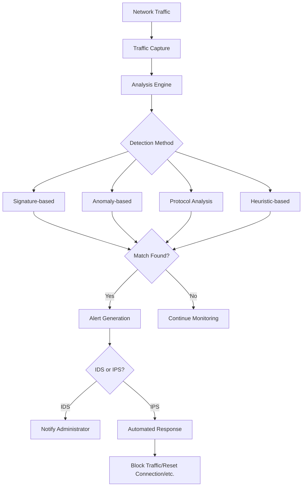

# Understanding Network IDS and IPS Systems

## Introduction

In today's interconnected digital landscape, protecting networks from unauthorized access and malicious activities is paramount. Two critical components in a network security infrastructure are **Intrusion Detection Systems (IDS)** and **Intrusion Prevention Systems (IPS)**. These technologies serve as vigilant guardians of your network, constantly monitoring for suspicious activities and potential security breaches.

This guide will walk you through the fundamentals of IDS and IPS systems, their types, how they work, and their practical applications in real-world scenarios. Whether you're new to network security or looking to enhance your knowledge, this comprehensive overview will provide you with a solid foundation.

## What are IDS and IPS?

### Intrusion Detection System (IDS)

An **Intrusion Detection System (IDS)** is a security technology that monitors network traffic and system activities for suspicious behavior and known threats. When it detects something that matches its criteria for suspicious activity, it generates alerts for security administrators.

Think of an IDS as a security camera in a store. It observes and records suspicious activities but doesn't intervene directly.

### Intrusion Prevention System (IPS)

An **Intrusion Prevention System (IPS)** goes a step further than an IDS. In addition to detecting potential security incidents, an IPS can also take automated actions to prevent or mitigate threats. This could include blocking malicious traffic, resetting connections, or reconfiguring firewall rules.

To extend our analogy, an IPS is like a security guard who not only monitors for suspicious activity but also actively intervenes when a threat is detected.

## How IDS and IPS Work

Both IDS and IPS systems analyze network traffic and system events, looking for patterns that might indicate a security incident. They use several detection methods:

### Detection Methodologies

1. **Signature-based Detection**: Compares observed events against a database of known threat signatures.
2. **Anomaly-based Detection**: Establishes a baseline of normal behavior and flags deviations from this baseline.
3. **Protocol Analysis**: Examines protocol behaviors against predefined profiles of benign protocol activity.
4. **Heuristic-based Detection**: Uses algorithms to identify suspicious behaviors based on various rules and patterns.

Let's visualize the basic workflow of IDS and IPS systems:



## Types of IDS and IPS

IDS and IPS systems can be categorized based on their deployment location and scope:

### Network-based (NIDS/NIPS)

Deployed at strategic points within a network to monitor traffic to and from all devices on the network. They analyze network, transport, and application protocols for suspicious activity.

### Host-based (HIDS/HIPS)

Installed on specific hosts or devices to monitor activities occurring within the individual system. They can detect changes to critical system files, suspicious process behavior, and local policy violations.

### Wireless (WIDS/WIPS)

Specialized systems designed to monitor wireless network traffic for unauthorized access attempts and potential attacks specific to wireless networks.

### Network Behavior Analysis (NBA)

Examines network traffic to identify threats that generate unusual traffic flows, such as DDoS attacks, certain forms of malware, and policy violations.

## Implementation Examples

Let's look at some practical examples of how IDS and IPS systems work in real-world scenarios:

### Example 1: Detecting an SQL Injection Attack

When a malicious actor attempts to inject SQL code into a web application's input fields, a properly configured IDS/IPS can detect this attack by recognizing patterns typical of SQL injection.

```
// Example of SQL Injection attempt in a web request
GET /products.php?id=15; DROP TABLE users; --

// IDS Alert Output
[Alert] SQL Injection attempt detected
Source IP: 192.168.1.100
Destination: web-server.example.com
Signature matched: SQL-Injection-Attempt
Severity: High
Timestamp: 2025-03-15 14:22:05
```

In an IPS configuration, the system would not only generate this alert but also automatically block the request from reaching the web server.

### Example 2: Detecting Unusual Network Behavior

An anomaly-based IDS/IPS monitors network traffic and establishes baseline behavior for each user and system. When it detects anomalies, it can alert or prevent potential threats.

```
// Normal baseline for User A
Average daily data transfer: 200 MB
Working hours: 9:00 AM - 6:00 PM
Common protocols: HTTP, HTTPS, SMTP

// IDS Alert Output for anomalous behavior
[Alert] Unusual network behavior detected
User: User A
Activity: 2.5 GB data transfer at 3:15 AM using FTP protocol
Deviation from baseline: High
Potential threat: Data exfiltration
Timestamp: 2025-03-15 03:15:22
```

An IPS might temporarily restrict the user's network access or block the FTP transfer until a security administrator can investigate.

## Practical Implementation: Setting Up a Basic IDS

Let's walk through a simplified example of setting up a basic IDS using Snort, one of the most popular open-source IDS/IPS solutions:

### 1. Installation (on a Linux system)

```bash
# Install Snort
sudo apt update
sudo apt install snort

# Verify installation
snort -V
```

### 2. Basic Configuration

The main configuration file for Snort is typically located at `/etc/snort/snort.conf`. Here's a simplified configuration example:

```
# Define home network
ipvar HOME_NET 192.168.1.0/24

# Define external network (everything not in HOME_NET)
ipvar EXTERNAL_NET !$HOME_NET

# Define rule paths
var RULE_PATH /etc/snort/rules

# Include rules
include $RULE_PATH/local.rules

# Configure detection engine
config detection: search-method ac-bnfa max_queue_events 5

# Set up output plugins
output alert_syslog: LOG_AUTH LOG_ALERT
output log_tcpdump: tcpdump.log
```

### 3. Creating Basic Detection Rules

Create a file called `local.rules` in the rules directory with some basic detection rules:

```
# Alert on ICMP ping attempts
alert icmp any any -> $HOME_NET any (msg:"ICMP Ping detected"; sid:1000001; rev:1;)

# Alert on potential port scan
alert tcp any any -> $HOME_NET any (msg:"Potential port scan detected"; flags:S; threshold: type threshold, track by_src, count 5, seconds 1; sid:1000002; rev:1;)

# Alert on potential SQL injection
alert tcp any any -> $HOME_NET 80 (msg:"SQL Injection attempt detected"; content:"%27"; http_uri; sid:1000003; rev:1;)
```

### 4. Running Snort in IDS Mode

```bash
# Run Snort in IDS mode using the configuration file
sudo snort -c /etc/snort/snort.conf -i eth0 -A console
```

This command runs Snort in IDS mode, using the configuration file, monitoring the eth0 interface, and displaying alerts on the console.

## IDS vs. IPS: Key Differences

While IDS and IPS systems share many similarities, there are important differences to consider when choosing which to implement:

| Feature | IDS | IPS |
|---------|-----|-----|
| **Placement** | Usually out-of-band (traffic copy) | In-line (all traffic passes through) |
| **Response** | Passive (detection and alerting only) | Active (can block or prevent threats) |
| **Latency** | Minimal impact on network performance | May introduce slight latency |
| **Risk of false positives** | Less critical (only generates alerts) | More critical (can block legitimate traffic) |
| **Primary function** | Monitoring and detection | Prevention and protection |

## Best Practices for Deploying IDS/IPS

1. **Define clear security policies** before implementing IDS/IPS solutions
2. **Start in monitoring mode** to understand normal network behavior before enabling prevention features
3. **Tune and customize rules** to minimize false positives and false negatives
4. **Implement in layers** as part of a defense-in-depth strategy
5. **Regularly update signatures** to protect against new threats
6. **Monitor and analyze logs** to identify patterns and improve detection capabilities
7. **Conduct regular testing** to ensure the system is functioning properly
8. **Document response procedures** for different types of alerts

## Limitations of IDS/IPS

While IDS and IPS systems are powerful security tools, they have limitations:

1. **Encrypted traffic** can't be inspected without additional measures
2. **Resource intensive** - requires adequate hardware to avoid performance issues
3. **False positives/negatives** - requires tuning and expertise to minimize
4. **Unknown attacks** (zero-day vulnerabilities) may not be detected by signature-based systems
5. **High-speed networks** may challenge the processing capabilities of some systems

## Summary

Intrusion Detection Systems (IDS) and Intrusion Prevention Systems (IPS) are critical components of a robust network security infrastructure. They provide valuable monitoring, detection, and prevention capabilities against a wide range of cyber threats.

- **IDS** focuses on detecting and alerting about potential security incidents
- **IPS** provides active prevention capabilities in addition to detection
- Both systems use various methods including signature-based, anomaly-based, protocol analysis, and heuristic-based detection
- They can be deployed as network-based, host-based, wireless, or behavior analysis systems
- Effective implementation requires proper planning, configuration, and ongoing maintenance

By understanding how these systems work and how to implement them effectively, you can significantly enhance your network's security posture and protect your digital assets from malicious activities.

## Exercises

1. Set up a basic Snort IDS on a test system and create custom rules to detect specific types of traffic.
2. Compare the features of two different commercial IDS/IPS solutions and identify their strengths and weaknesses.
3. Design a network security architecture that incorporates both NIDS and HIDS components. Explain your design choices.
4. Create a response plan for different types of alerts that might be generated by an IDS/IPS system.
5. Research and write a brief report on how machine learning and AI are being incorporated into modern IDS/IPS systems.

## Additional Resources

- [NIST Guide to Intrusion Detection and Prevention Systems (IDPS)](https://nvlpubs.nist.gov/nistpubs/Legacy/SP/nistspecialpublication800-94.pdf)
- [The Snort Project Documentation](https://www.snort.org/documents)
- [SANS Institute: Intrusion Detection FAQ](https://www.sans.org/security-resources/idfaq/)
- [Open Web Application Security Project (OWASP)](https://owasp.org/)
- [Wireshark Network Protocol Analyzer](https://www.wireshark.org/) - Useful for learning about network traffic analysis