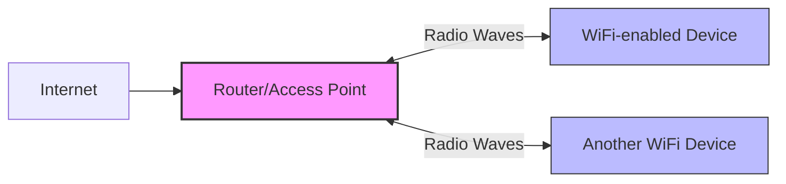
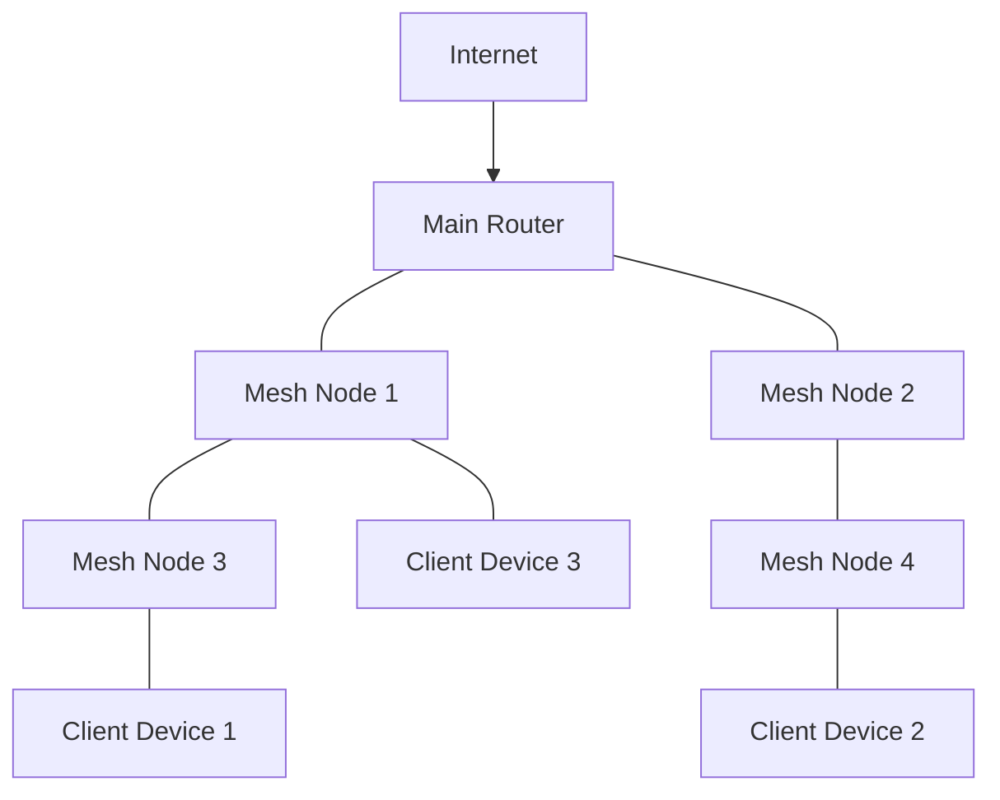

# Understanding WiFi Networks

## Introduction

WiFi (Wireless Fidelity) has revolutionized the way we connect to networks by eliminating the need for physical cables. It allows devices to connect to the internet and local networks wirelessly, providing flexibility and mobility that wasn't possible with traditional wired connections. Whether you're browsing at a coffee shop, streaming videos at home, or working in an office, WiFi is likely powering your connectivity.

In this guide, we'll explore how WiFi works, the standards that govern it, security considerations, and how to implement WiFi connectivity in your own programming projects.

## How WiFi Works

At its core, WiFi is a technology that uses radio waves to provide wireless high-speed internet and network connections. Here's a simplified explanation of how it works:

1. **Radio Signal Transmission**: A wireless router or access point converts data into radio signals and transmits them.
2. **Device Reception**: WiFi-enabled devices receive these signals through their wireless adapters.
3. **Signal Conversion**: The wireless adapter converts the radio signals back into data that your device can understand.
4. **Two-Way Communication**: This process works both ways, enabling bidirectional communication between your device and the network.



## WiFi Standards and Protocols

WiFi technology has evolved through several standards, each offering improvements in speed, range, and capabilities:

| Standard | Max Speed | Frequency | Range (Indoor) | Year Introduced |
|----------|-----------|-----------|----------------|-----------------|
| 802.11b  | 11 Mbps   | 2.4 GHz   | ~35 meters     | 1999            |
| 802.11a  | 54 Mbps   | 5 GHz     | ~35 meters     | 1999            |
| 802.11g  | 54 Mbps   | 2.4 GHz   | ~38 meters     | 2003            |
| 802.11n  | 600 Mbps  | 2.4/5 GHz | ~70 meters     | 2009            |
| 802.11ac | 1300+ Mbps| 5 GHz     | ~35 meters     | 2014            |
| 802.11ax (Wi-Fi 6) | 9.6 Gbps | 2.4/5/6 GHz | ~35 meters | 2019 |
| 802.11be (Wi-Fi 7) | 40+ Gbps | 2.4/5/6 GHz | ~35 meters | 2024 |

### WiFi Frequencies

WiFi operates on two main frequency bands:

1. **2.4 GHz**: 
   - Longer range but slower speeds
   - More susceptible to interference (microwave ovens, Bluetooth devices, etc.)
   - More crowded as many devices use this band

2. **5 GHz**:
   - Shorter range but faster speeds
   - Less interference from other devices
   - More available channels for less congestion

Newer standards also utilize the 6 GHz band for even better performance.

## WiFi Security

Security is a critical aspect of WiFi networks. Here are the common security protocols:

1. **WEP (Wired Equivalent Privacy)**:
   - Oldest and least secure
   - Easily cracked in minutes
   - Should never be used today

2. **WPA (WiFi Protected Access)**:
   - Introduced as a quick replacement for WEP
   - More secure than WEP but still vulnerable

3. **WPA2 (WiFi Protected Access 2)**:
   - Uses stronger AES encryption
   - The standard for many years
   - Still secure when properly implemented

4. **WPA3 (WiFi Protected Access 3)**:
   - Latest security protocol
   - Provides stronger encryption and protection against brute force attacks
   - Includes features for easier IoT device connectivity

### Best Practices for WiFi Security

- Use WPA2 or WPA3 encryption
- Create a strong, unique password (12+ characters with a mix of numbers, symbols, and upper/lowercase letters)
- Enable network firewalls
- Disable WPS (WiFi Protected Setup)
- Keep router firmware updated
- Use a guest network for visitors

## Programming with WiFi

Let's explore how to interact with WiFi networks in your programming projects.

### Scanning for WiFi Networks in Python

Here's an example using the `pywifi` library to scan for available networks:

```python
import pywifi
import time
from pywifi import const

def scan_networks():
    wifi = pywifi.PyWiFi()
    interface = wifi.interfaces()[0]  # Get the first wireless interface
    
    # Scan for available networks
    interface.scan()
    time.sleep(2)  # Give some time for scanning
    
    # Get scan results
    scan_results = interface.scan_results()
    
    print("Available WiFi networks:")
    for network in scan_results:
        print(f"SSID: {network.ssid}, Signal: {network.signal}, Security: {network.akm[0] if network.akm else 'Open'}")

if __name__ == "__main__":
    scan_networks()
```

Output example:
```
Available WiFi networks:
SSID: HomeNetwork, Signal: -45, Security: 4
SSID: CoffeeShopWiFi, Signal: -67, Security: 0
SSID: Neighbor_5G, Signal: -72, Security: 4
```

### Connecting to a WiFi Network in Python

```python
import pywifi
import time
from pywifi import const

def connect_to_network(ssid, password):
    wifi = pywifi.PyWiFi()
    interface = wifi.interfaces()[0]
    
    # Create a new profile
    profile = pywifi.Profile()
    profile.ssid = ssid
    profile.auth = const.AUTH_ALG_OPEN
    profile.akm.append(const.AKM_TYPE_WPA2PSK)
    profile.cipher = const.CIPHER_TYPE_CCMP
    profile.key = password
    
    # Remove all profiles
    interface.remove_all_network_profiles()
    
    # Add the new profile
    profile_added = interface.add_network_profile(profile)
    
    # Connect to the network
    interface.connect(profile_added)
    
    # Wait for connection
    time.sleep(5)
    
    # Check if connected
    if interface.status() == const.IFACE_CONNECTED:
        print(f"Successfully connected to {ssid}")
    else:
        print(f"Failed to connect to {ssid}")

if __name__ == "__main__":
    connect_to_network("YourWiFiName", "YourPassword")
```

### Working with ESP8266/ESP32 Microcontrollers

If you're working with IoT devices, here's how to connect an ESP8266 to WiFi using Arduino:

```cpp
#include <ESP8266WiFi.h>

const char* ssid = "YourWiFiName";
const char* password = "YourPassword";

void setup() {
  Serial.begin(115200);
  delay(10);
  
  // Connect to WiFi network
  Serial.println();
  Serial.println();
  Serial.print("Connecting to ");
  Serial.println(ssid);
  
  WiFi.begin(ssid, password);
  
  while (WiFi.status() != WL_CONNECTED) {
    delay(500);
    Serial.print(".");
  }
  
  Serial.println("");
  Serial.println("WiFi connected");
  Serial.println("IP address: ");
  Serial.println(WiFi.localIP());
}

void loop() {
  // Your code here
}
```

## Real-World Applications

### 1. Building a Weather Station

Using WiFi connectivity, you can create a weather station that sends temperature, humidity, and pressure data to a cloud service.

```cpp
#include <ESP8266WiFi.h>
#include <ESP8266HTTPClient.h>
#include <DHT.h>

#define DHTPIN 2
#define DHTTYPE DHT22

const char* ssid = "YourWiFiName";
const char* password = "YourPassword";
const char* serverUrl = "https://yourapi.com/data";

DHT dht(DHTPIN, DHTTYPE);

void setup() {
  Serial.begin(115200);
  WiFi.begin(ssid, password);
  dht.begin();
  
  while (WiFi.status() != WL_CONNECTED) {
    delay(500);
    Serial.print(".");
  }
  
  Serial.println("WiFi connected");
}

void loop() {
  float humidity = dht.readHumidity();
  float temperature = dht.readTemperature();
  
  if (isnan(humidity) || isnan(temperature)) {
    Serial.println("Failed to read from DHT sensor!");
    return;
  }
  
  if (WiFi.status() == WL_CONNECTED) {
    HTTPClient http;
    
    http.begin(serverUrl);
    http.addHeader("Content-Type", "application/json");
    
    String data = "{\"temperature\":" + String(temperature) + 
                  ",\"humidity\":" + String(humidity) + "}";
    
    int httpResponseCode = http.POST(data);
    
    if (httpResponseCode > 0) {
      String response = http.getString();
      Serial.println(httpResponseCode);
      Serial.println(response);
    } else {
      Serial.print("Error on sending POST: ");
      Serial.println(httpResponseCode);
    }
    
    http.end();
  }
  
  delay(300000);  // Send data every 5 minutes
}
```

### 2. WiFi Signal Strength Mapper

You can create an application that measures WiFi signal strength throughout your home or office to identify dead zones:

```python
import pywifi
import time
import csv
from pywifi import const

def monitor_signal_strength(ssid, duration_seconds=60, interval_seconds=1):
    wifi = pywifi.PyWiFi()
    interface = wifi.interfaces()[0]
    
    # Prepare CSV file
    with open('wifi_signal_map.csv', 'w', newline='') as file:
        writer = csv.writer(file)
        writer.writerow(["Time", "Signal Strength (dBm)"])
        
        start_time = time.time()
        end_time = start_time + duration_seconds
        
        while time.time() < end_time:
            # Scan for networks
            interface.scan()
            time.sleep(interval_seconds)
            scan_results = interface.scan_results()
            
            # Find our target network
            for network in scan_results:
                if network.ssid == ssid:
                    current_time = time.strftime("%H:%M:%S", time.localtime())
                    writer.writerow([current_time, network.signal])
                    print(f"Time: {current_time}, Signal: {network.signal} dBm")
                    break
            
            time.sleep(interval_seconds)
    
    print(f"Signal mapping complete. Data saved to wifi_signal_map.csv")

if __name__ == "__main__":
    monitor_signal_strength("YourWiFiName", 60, 2)  # Monitor for 1 minute, every 2 seconds
```

## Advanced Topics

### 1. WiFi Mesh Networks

Mesh networks use multiple access points that work together to provide seamless coverage throughout large areas. Each node in the mesh network communicates with other nodes to extend the network's range and provide redundancy.



### 2. WiFi Direct

WiFi Direct allows devices to connect directly to each other without requiring a traditional access point, useful for applications like file sharing or multiplayer games.

### 3. WiFi Positioning System

WiFi can be used for indoor positioning by triangulating signal strengths from multiple access points to determine a device's location within a building.

## Troubleshooting WiFi Connections

When developing WiFi-enabled applications, you might encounter issues. Here are some common problems and solutions:

1. **Connection Failures**:
   - Check credentials
   - Verify the device is within range
   - Ensure the router is operational

2. **Intermittent Connectivity**:
   - Implement reconnection logic
   - Check for interference sources
   - Consider using a more reliable frequency band

3. **Security Errors**:
   - Verify you're using the correct security protocol
   - Check for firmware updates
   - Ensure your encryption implementation is correct

## Summary

WiFi has become an essential technology in our connected world, allowing for wireless communication between devices and networks. In this guide, we've covered:

- The fundamentals of how WiFi works using radio signals
- Various WiFi standards and protocols (802.11a/b/g/n/ac/ax)
- Security considerations and best practices
- Programming examples for working with WiFi in Python and for IoT devices
- Real-world applications and advanced topics

Understanding WiFi is crucial for developing modern applications, especially as we move toward a more connected world with IoT devices, smart homes, and wireless everything.

## Exercises

1. Write a program that continuously monitors and logs the signal strength of your home WiFi network.
2. Create a simple web server on an ESP8266 or ESP32 that displays sensor data accessible from any device on your WiFi network.
3. Implement a WiFi scanner that categorizes networks by security type and signal strength.
4. Build a system that sends you an alert when a new device connects to your WiFi network.
5. Develop a program that creates a heat map of WiFi signal strength throughout your home or office.

## Additional Resources

- [IEEE 802.11 Standards](https://www.ieee802.org/11/)
- [PyWiFi Documentation](https://github.com/awkman/pywifi)
- [ESP8266 WiFi Library Documentation](https://arduino-esp8266.readthedocs.io/en/latest/esp8266wifi/readme.html)
- [WiFi Security Best Practices](https://www.wi-fi.org/discover-wi-fi/security)
- Online courses on networking fundamentals