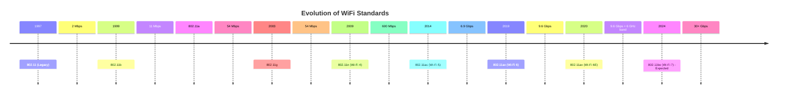

# Networks WiFi Standards

## Introduction

WiFi has become an essential part of our daily lives, connecting our devices to the internet and each other without physical cables. However, behind this seemingly simple technology lies a complex set of standards that have evolved over decades. This guide will walk you through the various WiFi standards, their capabilities, and how they affect your everyday networking experience.

WiFi technology is based on the IEEE 802.11 family of standards, with each new generation offering improvements in speed, range, security, and efficiency. Understanding these standards is crucial for anyone working with networks or developing applications that rely on wireless connectivity.

## Evolution of WiFi Standards

### The Early Days: 802.11 Legacy

The original 802.11 standard was released in 1997 and offered very modest speeds by today's standards.

| Feature | Specification |
| ------- | ------------- |
| Frequency | 2.4 GHz |
| Maximum Speed | 2 Mbps |
| Range | ~20 meters indoors |

This initial standard laid the groundwork for all future WiFi technologies but was quickly superseded by more capable versions.

### 802.11b (1999)

The first widely adopted WiFi standard improved speed significantly while maintaining the same frequency band.

| Feature | Specification |
| ------- | ------------- |
| Frequency | 2.4 GHz |
| Maximum Speed | 11 Mbps |
| Range | ~35 meters indoors |

Code example for checking if a device supports 802.11b:

```javascript
function checkWifiStandard() {
  if (navigator.connection && navigator.connection.type) {
    console.log("Connection type:", navigator.connection.type);
    // Basic check - not 100% accurate as browsers limit this information
    if (navigator.connection.downlinkMax <= 11) {
      console.log("Possibly using 802.11b or slower connection");
    }
  } else {
    console.log("Connection information not available");
  }
}
```

### 802.11a (1999)

Released alongside 802.11b, this standard took a different approach by using the 5 GHz frequency band.

| Feature | Specification |
| ------- | ------------- |
| Frequency | 5 GHz |
| Maximum Speed | 54 Mbps |
| Range | ~10-15 meters indoors (shorter due to higher frequency) |

While 802.11a offered faster speeds, its shorter range and higher cost limited its adoption compared to 802.11b.

### 802.11g (2003)

This standard combined the best of both worlds - the speed of 802.11a with the range of 802.11b.

| Feature | Specification |
| ------- | ------------- |
| Frequency | 2.4 GHz |
| Maximum Speed | 54 Mbps |
| Range | ~38 meters indoors |

802.11g was backward compatible with 802.11b, allowing for a smoother transition as networks upgraded.

### 802.11n (Wi-Fi 4, 2009)

This standard marked a significant leap forward with the introduction of MIMO (Multiple Input, Multiple Output) technology.

| Feature | Specification |
| ------- | ------------- |
| Frequency | 2.4 GHz and 5 GHz (dual-band) |
| Maximum Speed | 600 Mbps (theoretical) |
| Range | ~70 meters indoors |
| Key Features | MIMO technology, channel bonding |

802.11n introduced several important concepts:

- **MIMO**: Using multiple antennas to transmit and receive data simultaneously
- **Channel Bonding**: Combining two 20 MHz channels for a 40 MHz channel, effectively doubling the data rate
- **Frame Aggregation**: Combining multiple data frames into a single larger frame, reducing overhead

Here's a simple way to detect if your network supports 802.11n in Node.js:

```javascript
const { exec } = require('child_process');

function checkWifiStandard() {
  exec('netsh wlan show interfaces', (error, stdout, stderr) => {
    if (error) {
      console.error(`Error: ${error.message}`);
      return;
    }
    
    if (stdout.includes('802.11n')) {
      console.log('Your network supports 802.11n (Wi-Fi 4)');
    } else {
      console.log('Your network does not support 802.11n');
    }
    
    console.log('Full details:');
    console.log(stdout);
  });
}

checkWifiStandard();
```

### 802.11ac (Wi-Fi 5, 2014)

The next major evolution focused on increasing throughput in the 5 GHz band.

| Feature | Specification |
| ------- | ------------- |
| Frequency | 5 GHz (primarily) |
| Maximum Speed | 6.9 Gbps (theoretical) |
| Range | ~35 meters indoors |
| Key Features | MU-MIMO, wider channels (up to 160 MHz), higher-order modulation |

802.11ac introduced:
- **MU-MIMO**: Multiple-User MIMO, allowing simultaneous transmission to multiple devices
- **Wider Channels**: Support for 80 MHz and 160 MHz channels
- **256-QAM Modulation**: Higher data density per transmission

### 802.11ax (Wi-Fi 6, 2019) and 802.11ax (Wi-Fi 6E, 2020)

The latest widely available standards focus on efficiency in high-density environments.

| Feature | Specification (Wi-Fi 6) | Specification (Wi-Fi 6E) |
| ------- | ----------------------- | ------------------------ |
| Frequency | 2.4 GHz and 5 GHz | 2.4 GHz, 5 GHz, and 6 GHz |
| Maximum Speed | 9.6 Gbps (theoretical) | 9.6 Gbps (theoretical) |
| Range | Similar to 802.11ac | Similar to Wi-Fi 6, with 6 GHz having shorter range |
| Key Features | OFDMA, improved MU-MIMO, Target Wake Time | Same as Wi-Fi 6 plus 6 GHz support |

Key innovations include:
- **OFDMA** (Orthogonal Frequency Division Multiple Access): Enables more efficient spectrum use
- **Target Wake Time**: Improves battery life by allowing devices to "sleep" when not transmitting
- **1024-QAM**: Even higher data density per transmission
- **BSS Coloring**: Reduces interference in congested environments

### Upcoming: 802.11be (Wi-Fi 7)

Expected to be finalized around 2024, Wi-Fi 7 promises even greater capabilities.

| Feature | Expected Specification |
| ------- | ---------------------- |
| Frequency | 2.4 GHz, 5 GHz, and 6 GHz |
| Maximum Speed | 30+ Gbps (theoretical) |
| Key Features | Multi-Link Operation, 320 MHz channels, 4K-QAM |

## WiFi Standards Visualization

Let's visualize the evolution of WiFi standards with a timeline diagram:



## How WiFi Standards Work in Practice

### Channel Selection and Interference

WiFi operates on specific frequency channels within its bands. Understanding channel allocation is crucial for optimizing network performance.

In the 2.4 GHz band, there are typically 14 channels (though not all are available in every country), with channels 1, 6, and 11 being the only non-overlapping channels in North America.

```javascript
// Example of a function that suggests the best WiFi channel based on nearby networks
function suggestBestChannel(nearbyNetworks) {
  // Count networks on each channel
  const channelCounts = {
    1: 0, 2: 0, 3: 0, 4: 0, 5: 0, 6: 0, 7: 0, 8: 0, 9: 0, 10: 0, 11: 0
  };
  
  // Count networks on each channel
  nearbyNetworks.forEach(network => {
    if (channelCounts.hasOwnProperty(network.channel)) {
      channelCounts[network.channel]++;
    }
  });
  
  // Find channel with lowest usage
  let bestChannel = 1;
  let lowestCount = channelCounts[1];
  
  for (const [channel, count] of Object.entries(channelCounts)) {
    if (count < lowestCount) {
      bestChannel = channel;
      lowestCount = count;
    }
  }
  
  return {
    suggestedChannel: bestChannel,
    networkCount: lowestCount,
    message: `Channel ${bestChannel} is recommended with only ${lowestCount} networks`
  };
}

// Example usage
const nearbyNetworks = [
  { ssid: "Network1", channel: 1, signal: -65 },
  { ssid: "Network2", channel: 1, signal: -70 },
  { ssid: "Network3", channel: 6, signal: -72 },
  { ssid: "Network4", channel: 11, signal: -85 }
];

console.log(suggestBestChannel(nearbyNetworks));
// Output: { suggestedChannel: 11, networkCount: 1, message: 'Channel 11 is recommended with only 1 networks' }
```

### Security Evolution Across Standards

WiFi security has evolved alongside the speed and efficiency improvements:

1. **WEP (Wired Equivalent Privacy)** - Original security protocol, now considered completely insecure
2. **WPA (Wi-Fi Protected Access)** - Interim solution after WEP was broken
3. **WPA2** - Introduced with 802.11i, using stronger AES encryption
4. **WPA3** - Latest security protocol, mandatory in Wi-Fi 6 certified devices

Here's how you might implement a basic check for the security protocol of a network in Python:

```python
import subprocess
import re

def check_wifi_security():
    # This works on Linux/macOS systems
    try:
        output = subprocess.check_output(["nmcli", "-f", "SSID,SECURITY", "device", "wifi", "list"]).decode('utf-8')
        networks = []
        
        for line in output.split('
')[1:]:  # Skip header
            if line.strip():
                parts = re.split(r'\s{2,}', line.strip())
                if len(parts) >= 2:
                    ssid, security = parts[0], parts[1]
                    networks.append({
                        'ssid': ssid,
                        'security': security
                    })
        
        return networks
    except Exception as e:
        return f"Error: {str(e)}"

# Example usage
networks = check_wifi_security()
for network in networks:
    print(f"Network: {network['ssid']}, Security: {network['security']}")
```

## Real-World Applications

### Choosing the Right Standard for Different Use Cases

Different environments have different WiFi requirements:

1. **Home Networks**
   - Small area coverage
   - Limited number of devices
   - Mixed usage patterns (streaming, browsing, gaming)
   - Recommendation: Wi-Fi 5 (802.11ac) or Wi-Fi 6 for newer devices

2. **Office Environments**
   - Medium to large area coverage
   - Higher device density
   - File sharing and productivity applications
   - Recommendation: Wi-Fi 6 for efficiency in handling multiple devices

3. **Public Venues (Stadiums, Conferences)**
   - Very large areas
   - Extremely high device density
   - Varied usage patterns
   - Recommendation: Wi-Fi 6 or Wi-Fi 6E with multiple access points

4. **Industrial IoT Deployments**
   - Potentially harsh environments
   - Many low-bandwidth devices
   - Reliability over speed
   - Recommendation: Wi-Fi 6 for efficiency and Target Wake Time

### Network Design Considerations

When designing a network, consider these factors:

1. **Coverage Area**: Higher frequencies (5 GHz, 6 GHz) have shorter range but higher speeds
2. **Device Density**: Newer standards handle more simultaneous connections
3. **Bandwidth Requirements**: Match the standard to your speed needs
4. **Compatibility**: Ensure your devices support the chosen standard
5. **Interference**: Consider the local RF environment

## Implementing a WiFi Scanner

Here's a practical example of a simple WiFi scanner using Node.js and the `node-wifi` package:

```javascript
const wifi = require('node-wifi');

// Initialize wifi module
wifi.init({
  iface: null // network interface, choose a specific interface or null for all
});

async function scanNetworks() {
  try {
    const networks = await wifi.scan();
    
    console.log('Networks found:');
    console.log('--------------');
    
    networks.forEach((network, index) => {
      console.log(`${index + 1}. SSID: ${network.ssid}`);
      console.log(`   BSSID: ${network.bssid}`);
      console.log(`   Channel: ${network.channel}`);
      console.log(`   Signal: ${network.signal_level} dBm`);
      console.log(`   Security: ${network.security}`);
      
      // Estimate standard based on frequency
      if (network.frequency) {
        if (network.frequency > 5000) {
          console.log('   Likely using 5 GHz band (802.11a/n/ac/ax)');
        } else {
          console.log('   Likely using 2.4 GHz band (802.11b/g/n/ax)');
        }
      }
      
      console.log('--------------');
    });
    
    // Basic statistics
    const fiveGHzNetworks = networks.filter(n => n.frequency && n.frequency > 5000).length;
    const twoGHzNetworks = networks.length - fiveGHzNetworks;
    
    console.log(`Statistics: ${networks.length} networks found`);
    console.log(`2.4 GHz: ${twoGHzNetworks} networks`);
    console.log(`5 GHz: ${fiveGHzNetworks} networks`);
    
  } catch (error) {
    console.error(`Error scanning networks: ${error.message}`);
  }
}

scanNetworks();
```

To use this example, you'd need to install the package:

```bash
npm install node-wifi
```

## Summary

WiFi standards have evolved dramatically from the original 802.11 specification:

1. **Early Standards (802.11, 802.11a/b/g)**: Established the foundation with speeds up to 54 Mbps
2. **Mid-Generation (802.11n/ac)**: Introduced MIMO technology and speeds up to several Gbps
3. **Current Generation (802.11ax)**: Focuses on efficiency in dense environments and adds the 6 GHz band
4. **Future (802.11be)**: Will push speeds beyond 30 Gbps with multi-link operation

Understanding these standards helps in:
- Selecting appropriate equipment for different scenarios
- Troubleshooting connectivity issues
- Planning network deployments
- Ensuring compatibility across devices

As wireless technology continues to evolve, keeping up with these standards becomes increasingly important for anyone working in networking, software development, or IT infrastructure.

## Additional Resources

To further your knowledge about WiFi standards, consider exploring these topics:

1. **WiFi Alliance Certification Programs**
2. **Radio Frequency Fundamentals**
3. **Antenna Theory and Design**
4. **Network Security Best Practices**
5. **Wireless Mesh Networking**

## Exercises

1. **Research Exercise**: Compare the real-world performance of Wi-Fi 5 vs. Wi-Fi 6 in a home environment.
2. **Practical Exercise**: Use a WiFi analyzer tool to scan your local environment and identify the channels with the least interference.
3. **Programming Exercise**: Extend the WiFi scanner example to recommend the optimal access point placement based on signal strength readings.
4. **Design Exercise**: Create a network diagram for a small office with 30 devices, specifying the standards and equipment you would use.
5. **Troubleshooting Exercise**: List common WiFi issues and how different standards might address or exacerbate them.