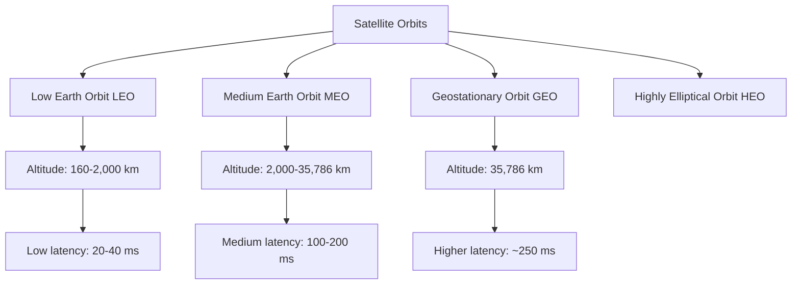
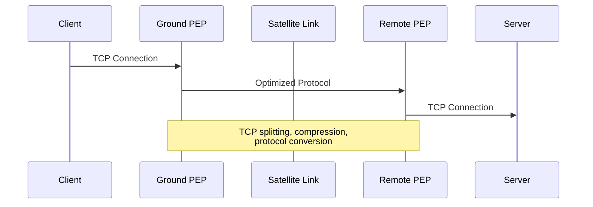
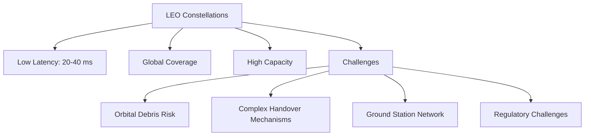

# Networks Satellite Communications

## Introduction

Satellite communications represent a crucial component of modern global telecommunications infrastructure. Unlike terrestrial networks that rely on physical cables or ground-based wireless transmitters, satellite communication systems utilize orbiting spacecraft to relay signals across vast distances. This technology enables connectivity in remote areas, provides backup for terrestrial networks, and supports global broadcasting services.

In this guide, we'll explore the fundamentals of satellite communications, their integration into broader network architectures, and how they enable various applications from internet access to GPS navigation.

## Fundamentals of Satellite Communications

### Satellite Orbits

Satellites operate in different orbital patterns, each with specific characteristics that determine their communication capabilities:



1. **Geostationary Earth Orbit (GEO)**
   - Altitude: 35,786 km above the equator
   - Orbit period: 24 hours (appears stationary relative to Earth)
   - Coverage: Can see approximately 1/3 of Earth's surface
   - Latency: Approximately 250 ms (round trip)
   - Examples: Direct TV, many weather satellites

2. **Medium Earth Orbit (MEO)**
   - Altitude: 2,000 km to 35,786 km
   - Orbit period: 2-24 hours
   - Applications: GPS, navigation systems
   - Latency: 100-200 ms

3. **Low Earth Orbit (LEO)**
   - Altitude: 160 km to 2,000 km
   - Orbit period: ~90 minutes
   - Requires constellations for continuous coverage
   - Latency: 20-40 ms
   - Examples: Starlink, OneWeb, Iridium

### Basic Components of Satellite Communication

A satellite communication system consists of:

1. **Space Segment**: The satellite(s) in orbit
2. **Ground Segment**: Earth stations and control facilities
3. **User Segment**: End-user terminals and devices

## Frequency Bands in Satellite Communications

Satellites operate across various frequency bands, each with different characteristics:

| Band | Frequency Range | Characteristics | Common Applications |
|------|----------------|-----------------|---------------------|
| L-Band | 1-2 GHz | Good penetration, lower bandwidth | Mobile satellite phones, GPS |
| S-Band | 2-4 GHz | Moderate rain fade, medium bandwidth | Weather radar, surface ship radar |
| C-Band | 4-8 GHz | Less affected by rain, moderate bandwidth | TV broadcasting, long-distance telephone |
| X-Band | 8-12 GHz | Military use, moderate bandwidth | Military communications, deep space |
| Ku-Band | 12-18 GHz | Higher bandwidth, affected by rain | Direct TV broadcasting, VSATs |
| Ka-Band | 26-40 GHz | Very high bandwidth, severely affected by rain | High-speed internet, broadband services |

## How Satellite Communication Works

The basic operation of satellite communication can be broken down into several steps:

1. An earth station (uplink) transmits signals to the satellite
2. The satellite receives the signal via its transponder
3. The transponder amplifies the signal and changes its frequency
4. The satellite retransmits the modified signal back to Earth
5. Receiving stations (downlink) capture the signal

Let's look at a simple code example that calculates the signal propagation delay for GEO satellites:

```javascript
function calculatePropagationDelay(distanceKm) {
  const speedOfLight = 299792.458; // km/s
  return distanceKm / speedOfLight * 1000; // convert to milliseconds
}

// Example: GEO satellite at 35,786 km altitude
const geoAltitude = 35786;
// Approximate slant range (distance from Earth station to satellite)
const slantRange = Math.sqrt(Math.pow(geoAltitude, 2) + Math.pow(6371, 2)) - 6371;

const upLinkDelay = calculatePropagationDelay(slantRange);
const downLinkDelay = calculatePropagationDelay(slantRange);
const totalDelay = upLinkDelay + downLinkDelay;

console.log(`Uplink delay: ${upLinkDelay.toFixed(2)} ms`);
console.log(`Downlink delay: ${downLinkDelay.toFixed(2)} ms`);
console.log(`Total propagation delay: ${totalDelay.toFixed(2)} ms`);
```

Example output:
```
Uplink delay: 119.56 ms
Downlink delay: 119.56 ms
Total propagation delay: 239.12 ms
```

This delay is a fundamental limitation of satellite communications, especially for GEO satellites, and affects applications requiring real-time interaction.

## Network Protocols for Satellite Communications

Due to the unique characteristics of satellite links (high latency, potential packet loss, asymmetric bandwidth), several specialized protocols have been developed:

### TCP Modifications

Standard TCP performs poorly over satellite links due to its congestion control mechanisms. Specialized versions include:

```javascript
// Example of TCP window scaling configuration (Linux)
// This increases the maximum TCP window size to better utilize satellite links
function configureTcpForSatellite() {
  // Set TCP window scaling options
  const commands = [
    'echo "net.core.rmem_max=16777216" >> /etc/sysctl.conf',
    'echo "net.core.wmem_max=16777216" >> /etc/sysctl.conf',
    'echo "net.ipv4.tcp_rmem=4096 87380 16777216" >> /etc/sysctl.conf',
    'echo "net.ipv4.tcp_wmem=4096 65536 16777216" >> /etc/sysctl.conf',
    'echo "net.ipv4.tcp_window_scaling=1" >> /etc/sysctl.conf',
    'sysctl -p'
  ];
  
  // Execute each command
  commands.forEach(cmd => {
    console.log(`Executing: ${cmd}`);
    // In a real implementation, you would use child_process.exec here
  });
  
  return "TCP parameters optimized for satellite communications";
}

// Call the function
const result = configureTcpForSatellite();
console.log(result);
```

### Performance Enhancing Proxies (PEPs)

PEPs are network agents designed to improve the performance of Internet protocols on satellite networks:



## Satellite Internet Networking Architecture

Modern satellite internet systems use complex networking architectures:

### Basic Architecture Components

1. **User Terminals**: Dish antennas/modems at customer premises
2. **Gateway Earth Stations**: Connect the satellite network to the Internet backbone
3. **Network Operations Center (NOC)**: Manages the entire network
4. **Satellites**: Act as relays or may include onboard processing

```javascript
// Simplified simulation of satellite network topology
class SatelliteNetwork {
  constructor(numberOfSatellites, numberOfGateways) {
    this.satellites = Array(numberOfSatellites).fill().map((_, i) => ({
      id: `SAT-${i+1}`,
      position: this.calculatePosition(i, numberOfSatellites),
      connectedTo: []
    }));
    
    this.gateways = Array(numberOfGateways).fill().map((_, i) => ({
      id: `GW-${i+1}`,
      location: `Location-${i+1}`,
      connectedSatellites: []
    }));
    
    // Connect satellites to create a mesh network
    this.createInterSatelliteLinks();
    
    // Connect gateways to satellites
    this.connectGatewaysToSatellites();
  }
  
  calculatePosition(index, total) {
    // Simple circular positioning algorithm (in reality would be complex orbital mechanics)
    const angle = (index / total) * 2 * Math.PI;
    return {
      x: Math.cos(angle),
      y: Math.sin(angle),
      z: 0
    };
  }
  
  createInterSatelliteLinks() {
    // Create a simple ring topology for demonstration
    for (let i = 0; i < this.satellites.length; i++) {
      const next = (i + 1) % this.satellites.length;
      this.satellites[i].connectedTo.push(this.satellites[next].id);
      this.satellites[next].connectedTo.push(this.satellites[i].id);
    }
  }
  
  connectGatewaysToSatellites() {
    // Connect each gateway to nearest satellites
    for (let i = 0; i < this.gateways.length; i++) {
      const satelliteIndex = Math.floor(i * this.satellites.length / this.gateways.length);
      this.gateways[i].connectedSatellites.push(this.satellites[satelliteIndex].id);
    }
  }
  
  routePacket(sourceGateway, destinationGateway) {
    console.log(`Routing packet from ${sourceGateway} to ${destinationGateway}`);
    // In reality would implement complex routing algorithms
    return ["Path would be calculated based on network topology"];
  }
}

// Example usage
const network = new SatelliteNetwork(8, 3);
console.log(JSON.stringify(network, null, 2));
console.log(network.routePacket("GW-1", "GW-3"));
```

## Real-World Applications

### 1. Remote Area Internet Access

Satellite communications provide internet connectivity to regions where terrestrial infrastructure is impractical or economically infeasible.

```javascript
// Function to determine appropriate satellite solution based on location
function recommendSatelliteSolution(location) {
  // Sample decision logic
  if (location.latitude > 60 || location.latitude < -60) {
    return {
      recommendedSystem: "LEO Constellation (e.g., Starlink, OneWeb)",
      reason: "High latitude requires LEO satellites for good coverage angle",
      expectedPerformance: {
        bandwidth: "50-150 Mbps",
        latency: "20-40 ms"
      }
    };
  } else if (location.population < 5000 && location.terrain === "mountainous") {
    return {
      recommendedSystem: "VSAT (Very Small Aperture Terminal)",
      reason: "Low population density in difficult terrain",
      expectedPerformance: {
        bandwidth: "5-20 Mbps",
        latency: "600-800 ms"
      }
    };
  } else {
    return {
      recommendedSystem: "Hybrid GEO/Terrestrial Solution",
      reason: "Balance between coverage and performance",
      expectedPerformance: {
        bandwidth: "25-100 Mbps",
        latency: "250-500 ms"
      }
    };
  }
}

// Example usage
const remoteLocation = {
  name: "Arctic Research Station",
  latitude: 78.5,
  longitude: -103.2,
  population: 50,
  terrain: "arctic"
};

console.log(recommendSatelliteSolution(remoteLocation));
```

### 2. Disaster Recovery Networks

When terrestrial infrastructure is damaged, satellite communications provide critical backup:

```javascript
// Simplified disaster recovery network deployment simulator
class DisasterRecoveryNetwork {
  constructor(disasterZone) {
    this.disasterZone = disasterZone;
    this.deployedUnits = [];
  }
  
  deployEmergencyVSAT(location, priority) {
    const vsat = {
      id: `VSAT-${this.deployedUnits.length + 1}`,
      type: "Emergency VSAT",
      location: location,
      priority: priority,
      bandwidth: priority === "high" ? 20 : 10,
      deploymentTime: new Date().toISOString()
    };
    
    this.deployedUnits.push(vsat);
    
    return {
      status: "deployed",
      unit: vsat,
      connectionDetails: {
        satellite: "EmergencySat-3",
        frequency: "Ku-Band (14.0-14.5 GHz uplink)",
        estimatedSetupTime: "45 minutes",
        internetConnectivity: true
      }
    };
  }
  
  deployPortableCellTower(location, backhaul = "satellite") {
    const cellTower = {
      id: `CELL-${this.deployedUnits.length + 1}`,
      type: "Portable Cell Tower",
      location: location,
      backhaul: backhaul,
      coverage: "5 km radius",
      deploymentTime: new Date().toISOString()
    };
    
    this.deployedUnits.push(cellTower);
    
    return {
      status: "deployed",
      unit: cellTower,
      connectionDetails: backhaul === "satellite" ? {
        satellite: "EmergencySat-2",
        frequency: "Ka-Band",
        cellularStandard: "4G LTE Emergency"
      } : {
        connection: "Microwave link to nearest operational infrastructure",
        bandwidth: "Limited"
      }
    };
  }
  
  getNetworkStatus() {
    return {
      disasterZone: this.disasterZone,
      deployedUnits: this.deployedUnits.length,
      coverageEstimate: `${this.deployedUnits.length * 5} km² approximately`,
      maintenanceNeeded: false
    };
  }
}

// Example usage
const hurricaneRecovery = new DisasterRecoveryNetwork({
  name: "Hurricane Aftermath",
  region: "Coastal City",
  infrastructure: "90% damaged",
  priority: "critical"
});

console.log(hurricaneRecovery.deployEmergencyVSAT("Hospital", "high"));
console.log(hurricaneRecovery.deployEmergencyVSAT("Emergency Command Center", "high"));
console.log(hurricaneRecovery.deployPortableCellTower("City Center", "satellite"));
console.log(hurricaneRecovery.getNetworkStatus());
```

### 3. Global Navigation Satellite Systems (GNSS)

Systems like GPS, GLONASS, Galileo, and BeiDou provide positioning, navigation, and timing services:

```javascript
// Simple GNSS position calculation (highly simplified)
function calculatePosition(satelliteSignals) {
  // In reality, this would use trilateration with precise timing
  // This is a very simplified demonstration
  
  if (satelliteSignals.length < 4) {
    return { error: "Need at least 4 satellites for 3D positioning" };
  }
  
  // In a real system, we would solve a system of equations
  // based on satellite positions and signal travel times
  
  // Simulated calculation
  let x = 0, y = 0, z = 0, timeBias = 0;
  
  satelliteSignals.forEach(sat => {
    x += sat.position.x * sat.signalStrength;
    y += sat.position.y * sat.signalStrength;
    z += sat.position.z * sat.signalStrength;
    timeBias += sat.clockBias;
  });
  
  // Normalize
  const totalSignalStrength = satelliteSignals.reduce((sum, sat) => sum + sat.signalStrength, 0);
  x /= totalSignalStrength;
  y /= totalSignalStrength;
  z /= totalSignalStrength;
  timeBias /= satelliteSignals.length;
  
  return {
    position: { x, y, z },
    accuracy: estimateAccuracy(satelliteSignals),
    timeBias: timeBias
  };
}

function estimateAccuracy(satellites) {
  // GDOP (Geometric Dilution of Precision) estimation - simplified
  // In reality, this involves complex matrix operations
  const geometryFactor = Math.random() * 2 + 1; // Simulate geometry factor
  const signalQuality = satellites.reduce((sum, sat) => sum + sat.signalStrength, 0) / satellites.length;
  
  return {
    horizontal: 2.5 / signalQuality * geometryFactor,
    vertical: 4.0 / signalQuality * geometryFactor,
    time: 10.0 / signalQuality
  };
}

// Example usage
const satellites = [
  { id: "GPS-04", position: { x: 15600, y: 9800, z: 19200 }, signalStrength: 0.85, clockBias: 0.00000002 },
  { id: "GPS-11", position: { x: 18700, y: -5200, z: 21000 }, signalStrength: 0.92, clockBias: 0.00000001 },
  { id: "GPS-17", position: { x: -12300, y: 20100, z: 18500 }, signalStrength: 0.78, clockBias: 0.00000003 },
  { id: "GPS-23", position: { x: -8700, y: -22000, z: 17800 }, signalStrength: 0.88, clockBias: 0.00000002 }
];

const position = calculatePosition(satellites);
console.log(position);
```

## Challenges in Satellite Communications

### 1. Latency and Bandwidth Limitations

Latency remains a challenge, especially for GEO satellites:

```javascript
// Function to estimate application viability based on satellite type
function assessApplicationViability(application, satelliteType) {
  const latencies = {
    'GEO': 250,  // ms one-way
    'MEO': 100,  // ms one-way
    'LEO': 25    // ms one-way
  };
  
  const requirements = {
    'video-conferencing': { maxLatency: 150, minBandwidth: 1.5 },
    'VoIP': { maxLatency: 200, minBandwidth: 0.1 },
    'web-browsing': { maxLatency: 300, minBandwidth: 0.5 },
    'online-gaming': { maxLatency: 100, minBandwidth: 1 },
    'email': { maxLatency: 500, minBandwidth: 0.05 },
    'video-streaming': { maxLatency: 1000, minBandwidth: 5 },
    'IoT-telemetry': { maxLatency: 2000, minBandwidth: 0.01 }
  };
  
  if (!requirements[application]) {
    return { error: "Unknown application type" };
  }
  
  if (!latencies[satelliteType]) {
    return { error: "Unknown satellite type" };
  }
  
  const roundTripLatency = latencies[satelliteType] * 2;
  
  const viable = roundTripLatency <= requirements[application].maxLatency;
  
  return {
    application: application,
    satelliteType: satelliteType,
    roundTripLatency: roundTripLatency,
    requirement: requirements[application].maxLatency,
    viable: viable,
    recommendation: viable ? 
      "Suitable for this application" : 
      `Consider ${satelliteType === 'GEO' ? 'LEO' : satelliteType === 'MEO' ? 'LEO' : 'terrestrial'} alternatives`
  };
}

console.log(assessApplicationViability('video-conferencing', 'GEO'));
console.log(assessApplicationViability('web-browsing', 'GEO'));
console.log(assessApplicationViability('online-gaming', 'LEO'));
```

### 2. Weather and Environmental Factors

Higher frequency bands (Ku, Ka) are susceptible to rain fade:

```javascript
// Function to estimate signal attenuation due to rain
function calculateRainAttenuation(frequencyGHz, rainRateMmPerHour, pathLengthKm) {
  // This is a simplified model of the ITU-R P.838 recommendation
  // In reality, the calculation is more complex
  
  // Constants for specific attenuation calculation (simplified)
  let k, alpha;
  
  if (frequencyGHz < 10) {
    k = 0.01;
    alpha = 1.2;
  } else if (frequencyGHz < 15) {
    k = 0.02;
    alpha = 1.1;
  } else if (frequencyGHz < 25) {
    k = 0.1;
    alpha = 0.9;
  } else {
    k = 0.2;
    alpha = 0.8;
  }
  
  // Calculate specific attenuation (dB/km)
  const specificAttenuation = k * Math.pow(rainRateMmPerHour, alpha);
  
  // Total attenuation for the path
  const totalAttenuation = specificAttenuation * pathLengthKm;
  
  return {
    frequencyGHz: frequencyGHz,
    rainRateMmPerHour: rainRateMmPerHour,
    pathLengthKm: pathLengthKm,
    specificAttenuationDbPerKm: specificAttenuation.toFixed(2),
    totalAttenuationDb: totalAttenuation.toFixed(2),
    impact: getRainImpactAssessment(totalAttenuation)
  };
}

function getRainImpactAssessment(attenuationDb) {
  if (attenuationDb < 1) {
    return "Minimal impact, no noticeable degradation";
  } else if (attenuationDb < 5) {
    return "Minor impact, possible slight degradation in service";
  } else if (attenuationDb < 10) {
    return "Moderate impact, noticeable degradation in service";
  } else if (attenuationDb < 20) {
    return "Severe impact, significant service degradation likely";
  } else {
    return "Extreme impact, service outage probable";
  }
}

// Example calculations for different bands during rainfall
console.log(calculateRainAttenuation(4, 50, 5));    // C-band during heavy rain
console.log(calculateRainAttenuation(12, 50, 5));   // Ku-band during heavy rain
console.log(calculateRainAttenuation(30, 50, 5));   // Ka-band during heavy rain
```

## Emerging Trends and Future Developments

### 1. LEO Satellite Constellations

Massive constellations of small LEO satellites are changing the satellite communications landscape:



### 2. Inter-Satellite Links (ISLs)

Modern satellite networks use laser or RF links between satellites to reduce ground infrastructure dependence:

```javascript
// Simulation of inter-satellite link performance
function simulateInterSatelliteLink(satellite1, satellite2, linkType) {
  // Calculate distance between satellites (simplified)
  const distance = calculateDistance(satellite1.position, satellite2.position);
  
  // Determine link characteristics based on type
  let bandwidth, latency, bitErrorRate;
  
  if (linkType === "laser") {
    bandwidth = 10; // Gbps
    latency = distance / 299792.458; // Speed of light in km/s
    bitErrorRate = Math.pow(10, -9) * (1 + distance / 10000);
  } else if (linkType === "RF") {
    bandwidth = 2; // Gbps
    latency = distance / 299792.458; // Speed of light in km/s
    bitErrorRate = Math.pow(10, -7) * (1 + distance / 5000);
  } else {
    return { error: "Unknown link type" };
  }
  
  return {
    satellites: [satellite1.id, satellite2.id],
    linkType: linkType,
    distanceKm: distance.toFixed(2),
    bandwidthGbps: bandwidth,
    latencyMs: (latency * 1000).toFixed(3),
    bitErrorRate: bitErrorRate.toExponential(2),
    maxThroughputGbps: bandwidth * (1 - bitErrorRate)
  };
}

function calculateDistance(pos1, pos2) {
  return Math.sqrt(
    Math.pow(pos1.x - pos2.x, 2) + 
    Math.pow(pos1.y - pos2.y, 2) + 
    Math.pow(pos1.z - pos2.z, 2)
  );
}

// Example satellites
const sat1 = {
  id: "LEO-A",
  position: { x: 6800, y: 2300, z: 0 } // km from Earth center
};

const sat2 = {
  id: "LEO-B",
  position: { x: 6300, y: -1800, z: 1200 } // km from Earth center
};

console.log(simulateInterSatelliteLink(sat1, sat2, "laser"));
console.log(simulateInterSatelliteLink(sat1, sat2, "RF"));
```

### 3. Software-Defined Satellites

The shift towards flexible, software-defined payloads is enabling greater adaptability:

```javascript
// Simplified model of a software-defined satellite beam allocation
class SoftwareDefinedSatellite {
  constructor(name, totalCapacityGbps) {
    this.name = name;
    this.totalCapacityGbps = totalCapacityGbps;
    this.beams = [];
    this.remainingCapacity = totalCapacityGbps;
  }
  
  configureBeam(region, priority, bandwidthPercentage) {
    if (this.remainingCapacity <= 0) {
      return { error: "No remaining capacity available" };
    }
    
    if (bandwidthPercentage > this.remainingCapacity / this.totalCapacityGbps * 100) {
      return { error: "Requested bandwidth exceeds available capacity" };
    }
    
    const allocatedCapacity = this.totalCapacityGbps * bandwidthPercentage / 100;
    
    const beam = {
      id: `BEAM-${this.beams.length + 1}`,
      region: region,
      priority: priority,
      bandwidthPercentage: bandwidthPercentage,
      allocatedCapacityGbps: allocatedCapacity,
      configurationTime: new Date().toISOString()
    };
    
    this.beams.push(beam);
    this.remainingCapacity -= allocatedCapacity;
    
    return {
      status: "configured",
      beam: beam,
      remainingCapacityPercentage: (this.remainingCapacity / this.totalCapacityGbps * 100).toFixed(1)
    };
  }
  
  reconfigureBeams(trafficPattern) {
    console.log(`Reconfiguring beams based on ${trafficPattern} traffic pattern`);
    
    // In a real system, this would redistribute capacity based on actual traffic needs
    // This is a simplified demonstration
    
    if (trafficPattern === "businessHours") {
      return this.configureForBusinessHours();
    } else if (trafficPattern === "evening") {
      return this.configureForEvening();
    } else if (trafficPattern === "emergency") {
      return this.configureForEmergency();
    }
    
    return { error: "Unknown traffic pattern" };
  }
  
  configureForBusinessHours() {
    // Reset configuration
    this.beams = [];
    this.remainingCapacity = this.totalCapacityGbps;
    
    // Configure for business hours (urban areas, business districts)
    this.configureBeam("Business District A", "high", 30);
    this.configureBeam("Urban Area B", "medium", 25);
    this.configureBeam("Business District C", "high", 20);
    this.configureBeam("Rural Areas", "low", 15);
    
    return {
      pattern: "businessHours",
      beams: this.beams,
      remainingCapacity: this.remainingCapacity
    };
  }
  
  configureForEvening() {
    // Reset configuration
    this.beams = [];
    this.remainingCapacity = this.totalCapacityGbps;
    
    // Configure for evening (residential areas, entertainment)
    this.configureBeam("Residential Area A", "high", 35);
    this.configureBeam("Residential Area B", "high", 30);
    this.configureBeam("Entertainment District", "medium", 20);
    this.configureBeam("Business Areas", "low", 10);
    
    return {
      pattern: "evening",
      beams: this.beams,
      remainingCapacity: this.remainingCapacity
    };
  }
  
  configureForEmergency() {
    // Reset configuration
    this.beams = [];
    this.remainingCapacity = this.totalCapacityGbps;
    
    // Configure for emergency (disaster area focus)
    this.configureBeam("Emergency Zone", "critical", 60);
    this.configureBeam("Surrounding Areas", "high", 25);
    this.configureBeam("Other Regions", "low", 10);
    
    return {
      pattern: "emergency",
      beams: this.beams,
      remainingCapacity: this.remainingCapacity
    };
  }
  
  getStatus() {
    return {
      satellite: this.name,
      totalCapacityGbps: this.totalCapacityGbps,
      allocatedCapacityGbps: this.totalCapacityGbps - this.remainingCapacity,
      remainingCapacityGbps: this.remainingCapacity,
      beams: this.beams.length,
      utilizationPercentage: ((this.totalCapacityGbps - this.remainingCapacity) / this.totalCapacityGbps * 100).toFixed(1)
    };
  }
}

// Example usage
const flexSat = new SoftwareDefinedSatellite("FlexSat-1", 100);
console.log(flexSat.configureBeam("North America", "high", 40));
console.log(flexSat.configureBeam("Europe", "medium", 30));
console.log(flexSat.getStatus());

// Reconfigure based on time of day
console.log(flexSat.reconfigureBeams("evening"));
console.log(flexSat.getStatus());
```

## Summary

Satellite communications provide a vital component of global telecommunications infrastructure, enabling connectivity in regions where terrestrial options are unavailable or impract