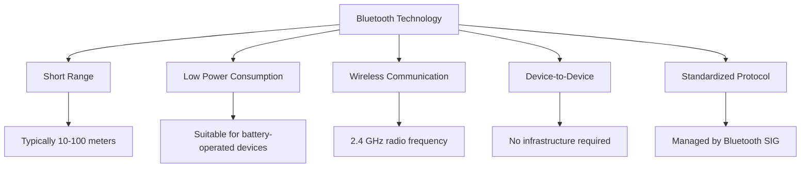
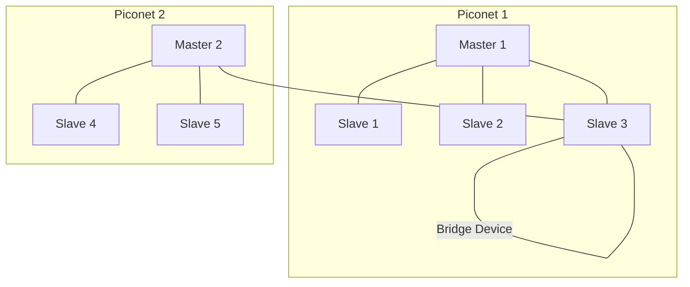

# Understanding Bluetooth Networks

## Introduction

Bluetooth is a ubiquitous wireless technology that enables short-range communication between devices. From wireless headphones to smart home devices, Bluetooth has become an essential part of our connected world. This guide will walk you through the fundamentals of Bluetooth technology, how it works, and how you can implement Bluetooth functionality in your own programming projects.

## What is Bluetooth?

Bluetooth is a standardized wireless communication protocol designed for exchanging data over short distances using radio waves in the ISM band from 2.402 GHz to 2.48 GHz. Named after the 10th-century Danish king Harald "Bluetooth" Gormsson, who was known for uniting disparate Danish tribes, Bluetooth technology similarly unites various digital devices.



## Bluetooth Versions and Evolution

Bluetooth technology has evolved significantly since its first release:

| Version | Year | Data Rate | Range | Key Features |
|---------|------|-----------|-------|-------------|
| 1.0 | 1999 | 1 Mbps | ~10m | Initial release |
| 2.0 + EDR | 2004 | 3 Mbps | ~10m | Enhanced Data Rate |
| 3.0 + HS | 2009 | 24 Mbps | ~10m | High Speed via Wi-Fi |
| 4.0 (BLE) | 2010 | 1 Mbps | ~50m | Bluetooth Low Energy |
| 5.0 | 2016 | 2 Mbps | ~240m | IoT-focused improvements |
| 5.1 | 2019 | 2 Mbps | ~240m | Direction finding |
| 5.2 | 2020 | 2 Mbps | ~240m | Enhanced Audio |
| 5.3 | 2021 | 2 Mbps | ~240m | Power efficiency improvements |

Bluetooth Low Energy (BLE), introduced in version 4.0, was a game-changer that enabled many IoT applications due to its significantly reduced power consumption.

## How Bluetooth Works

Bluetooth operates on a master-slave architecture where one device (the master) can communicate with up to seven active slave devices, forming what's called a "piconet."

### Key Concepts

1. **Pairing**: The process of establishing a trusted relationship between two Bluetooth devices.
2. **Service Discovery**: The mechanism that allows devices to find out what services other devices offer.
3. **Profiles**: Standardized specifications for how devices should communicate for specific applications.

### Bluetooth Communication Process

```mermaid
sequenceDiagram
    participant A as Device A
    participant B as Device B
    
    A->>A: Set to discoverable mode
    B->>B: Start scanning
    B->>A: Discover Device A
    A->>B: Send basic information
    B->>A: Request pairing
    A->>B: Accept and send pairing code
    B->>A: Confirm pairing code
    A->>B: Pairing complete
    B->>A: Request available services
    A->>B: Send service information
    B->>A: Connect to specific service
    A->>B: Connection established
    A<->>B: Data exchange begins
```

## Bluetooth Programming Fundamentals

Let's explore how to work with Bluetooth in different programming contexts:

### Bluetooth Programming with Python

Python offers several libraries for Bluetooth communication, with `PyBluez` being one of the most popular for traditional Bluetooth and `Bleak` for BLE.

Here's a simple example of discovering nearby Bluetooth devices using PyBluez:

```python
import bluetooth

print("Scanning for Bluetooth devices...")
devices = bluetooth.discover_devices(lookup_names=True)
print(f"Found {len(devices)} devices")

for addr, name in devices:
    print(f"Device: {name}")
    print(f"Address: {addr}")
    print()

# Output might look like:
# Scanning for Bluetooth devices...
# Found 3 devices
# Device: JBL Flip 5
# Address: 00:11:22:33:44:55
# 
# Device: iPhone
# Address: AA:BB:CC:DD:EE:FF
# 
# Device: Galaxy Watch
# Address: 12:34:56:78:90:AB
```

### Creating a Simple Bluetooth Server and Client

Here's how to create a basic Bluetooth server in Python:

```python
import bluetooth

server_sock = bluetooth.BluetoothSocket(bluetooth.RFCOMM)
server_sock.bind(("", bluetooth.PORT_ANY))
server_sock.listen(1)

port = server_sock.getsockname()[1]
uuid = "94f39d29-7d6d-437d-973b-fba39e49d4ee"

bluetooth.advertise_service(
    server_sock, 
    "SampleServer",
    service_id=uuid,
    service_classes=[uuid, bluetooth.SERIAL_PORT_CLASS],
    profiles=[bluetooth.SERIAL_PORT_PROFILE]
)

print(f"Waiting for connection on RFCOMM channel {port}")

client_sock, client_info = server_sock.accept()
print(f"Accepted connection from {client_info}")

try:
    while True:
        data = client_sock.recv(1024)
        if not data:
            break
        print(f"Received: {data.decode('utf-8')}")
        client_sock.send("Echo: " + data.decode('utf-8'))
except OSError:
    pass

client_sock.close()
server_sock.close()
```

And a corresponding client:

```python
import bluetooth

server_addr = "00:11:22:33:44:55"  # Replace with actual server address
port = 1  # Match with server port

sock = bluetooth.BluetoothSocket(bluetooth.RFCOMM)
sock.connect((server_addr, port))

message = "Hello, Bluetooth World!"
sock.send(message)
print(f"Sent: {message}")

data = sock.recv(1024)
print(f"Received: {data.decode('utf-8')}")

sock.close()

# Output:
# Sent: Hello, Bluetooth World!
# Received: Echo: Hello, Bluetooth World!
```

## Bluetooth Low Energy (BLE) Programming

BLE is designed for applications requiring periodic small data transfers while maintaining low power consumption. Here's a simple example using the `bleak` library to scan for BLE devices:

```python
import asyncio
from bleak import BleakScanner

async def scan_for_devices():
    devices = await BleakScanner.discover()
    for device in devices:
        print(f"Device: {device.name or 'Unknown'}")
        print(f"Address: {device.address}")
        print(f"RSSI: {device.rssi} dBm")
        print()

asyncio.run(scan_for_devices())

# Output might look like:
# Device: Smart Bulb
# Address: 00:A1:B2:C3:D4:E5
# RSSI: -67 dBm
# 
# Device: Heart Rate Monitor
# Address: 11:22:33:44:55:66
# RSSI: -72 dBm
```

### Reading Data from a BLE Device

Here's how to connect to a BLE device and read a characteristic value:

```python
import asyncio
from bleak import BleakClient

async def read_characteristic(address, char_uuid):
    async with BleakClient(address) as client:
        if not client.is_connected:
            print("Failed to connect")
            return
        
        print("Connected successfully")
        
        value = await client.read_gatt_char(char_uuid)
        print(f"Characteristic value: {value}")
        
        # For battery level example
        if len(value) == 1:
            print(f"Battery level: {int(value[0])}%")

# Example: Read battery level from a device
# Battery level characteristic UUID is standardized as "00002a19-0000-1000-8000-00805f9b34fb"
asyncio.run(read_characteristic(
    "00:11:22:33:44:55",  # Replace with your device address
    "00002a19-0000-1000-8000-00805f9b34fb"
))

# Possible output:
# Connected successfully
# Characteristic value: bytearray(b'\x5f')
# Battery level: 95%
```

## Bluetooth Networking Topologies

Bluetooth devices can form different network topologies:

### Piconet

A piconet is the basic Bluetooth network structure consisting of one master device and up to seven active slave devices.

### Scatternet

A scatternet is formed when a device from one piconet also participates in another piconet, allowing for more complex network structures.



## Practical Applications of Bluetooth

Bluetooth technology enables numerous applications across different domains:

### Consumer Electronics
- Wireless audio (headphones, speakers)
- Wireless input devices (keyboards, mice)
- File transfer between devices

### Internet of Things (IoT)
- Smart home devices
- Wearable fitness trackers
- Location beacons

### Healthcare
- Remote patient monitoring
- Medical device connectivity
- Fitness and health tracking

### Project Example: Building a Simple Bluetooth Temperature Monitor

Let's create a simplified example of a Bluetooth temperature monitoring system using an Arduino with a BLE module and a Python application to read and display the data.

Arduino code (for the temperature sensor device):

```cpp
#include <ArduinoBLE.h>
#include <Wire.h>

// Create a BLE service for environmental sensing
BLEService environmentService("181A");  // Standard UUID for Environmental Sensing

// Create a characteristic for temperature
BLEFloatCharacteristic tempCharacteristic("2A6E", BLERead | BLENotify);  // Standard UUID for temperature

float currentTemperature = 25.0;  // Starting with room temperature

void setup() {
  Serial.begin(9600);
  
  // Initialize BLE
  if (!BLE.begin()) {
    Serial.println("BLE initialization failed!");
    while (1);
  }
  
  // Set the local name and advertised service
  BLE.setLocalName("TempMonitor");
  BLE.setAdvertisedService(environmentService);
  
  // Add the characteristic to the service
  environmentService.addCharacteristic(tempCharacteristic);
  
  // Add the service
  BLE.addService(environmentService);
  
  // Set the initial value
  tempCharacteristic.writeValue(currentTemperature);
  
  // Start advertising
  BLE.advertise();
  Serial.println("BLE Temperature Monitor started");
}

void loop() {
  BLEDevice central = BLE.central();
  
  if (central) {
    Serial.print("Connected to central: ");
    Serial.println(central.address());
    
    while (central.connected()) {
      // Simulate temperature reading (replace with actual sensor reading)
      currentTemperature = 20.0 + (float)(random(0, 100)) / 10.0;  // Random between 20.0-30.0°C
      tempCharacteristic.writeValue(currentTemperature);
      Serial.print("Temperature updated: ");
      Serial.println(currentTemperature);
      delay(1000);  // Update every second
    }
    
    Serial.print("Disconnected from central: ");
    Serial.println(central.address());
  }
}
```

Python code (for the monitoring application):

```python
import asyncio
from bleak import BleakClient, BleakScanner
import struct
import time
import matplotlib.pyplot as plt
from matplotlib.animation import FuncAnimation

# Store temperature readings
timestamps = []
temperatures = []

# Find and connect to our temperature monitor
async def connect_to_device():
    print("Scanning for Temperature Monitor...")
    
    device = await BleakScanner.find_device_by_name("TempMonitor")
    if not device:
        print("Could not find the temperature monitor!")
        return None
    
    print(f"Found device: {device.name} ({device.address})")
    return device

async def monitor_temperature():
    device = await connect_to_device()
    if not device:
        return
    
    # Temperature characteristic UUID (Environmental Sensing service)
    temp_uuid = "00002a6e-0000-1000-8000-00805f9b34fb"
    
    async with BleakClient(device.address) as client:
        print(f"Connected to {device.name}")
        
        # Setup notification handler
        def temp_notification_handler(sender, data):
            # Temperature data is a float (4 bytes)
            temperature = struct.unpack('<f', data)[0]
            print(f"Temperature: {temperature:.1f}°C")
            
            # Store reading
            timestamps.append(time.time())
            temperatures.append(temperature)
        
        # Start notifications
        await client.start_notify(temp_uuid, temp_notification_handler)
        
        print("Monitoring temperature. Press Ctrl+C to stop.")
        try:
            # Keep monitoring for 30 seconds
            await asyncio.sleep(30)
        except asyncio.CancelledError:
            pass
        finally:
            await client.stop_notify(temp_uuid)
            print("Temperature monitoring stopped")

# Run the temperature monitor
asyncio.run(monitor_temperature())

# Plot the temperature data
plt.figure(figsize=(10, 5))
plt.plot(timestamps, temperatures, '-o')
plt.xlabel('Time')
plt.ylabel('Temperature (°C)')
plt.title('Bluetooth Temperature Monitor')
plt.grid(True)
plt.show()

# Sample output:
# Scanning for Temperature Monitor...
# Found device: TempMonitor (AA:BB:CC:DD:EE:FF)
# Connected to TempMonitor
# Monitoring temperature. Press Ctrl+C to stop.
# Temperature: 24.3°C
# Temperature: 25.1°C
# Temperature: 23.8°C
# ...
```

## Security Considerations in Bluetooth Networks

Bluetooth security has evolved over time, but there are still important considerations:

1. **Pairing Methods**: Newer Bluetooth versions use more secure pairing methods like Secure Simple Pairing (SSP).

2. **Vulnerabilities**: Be aware of potential vulnerabilities like BlueBorne and KNOB attacks.

3. **Best Practices**:
   - Keep Bluetooth devices updated
   - Use the highest security mode available
   - Set devices to non-discoverable mode when not pairing
   - Use complex PIN codes for pairing when possible
   - Verify the identity of devices before pairing

## Common Bluetooth Programming Challenges

1. **Connection Stability**: Bluetooth connections can be affected by interference, distance, and obstacles.

2. **Platform Differences**: Different operating systems and devices handle Bluetooth differently.

3. **Power Consumption**: Managing power usage, especially for BLE applications.

4. **Compatibility**: Ensuring compatibility between different Bluetooth versions and profiles.

## Debugging Bluetooth Applications

When troubleshooting Bluetooth applications, consider these approaches:

1. **Use Bluetooth Sniffers**: Hardware or software tools that capture Bluetooth traffic.

2. **Enable Verbose Logging**: Most Bluetooth libraries have debug logging options.

3. **Check Signal Strength**: The RSSI (Received Signal Strength Indicator) can help diagnose connection issues.

4. **Verify Service and Characteristic UUIDs**: A common source of errors is incorrect UUIDs.

Example of enabling debug logging in PyBluez:

```python
import bluetooth
import logging

# Set up logging
logging.basicConfig(level=logging.DEBUG)
logger = logging.getLogger("bluetooth")

# Now perform Bluetooth operations with detailed logging
devices = bluetooth.discover_devices(lookup_names=True, duration=8)
for addr, name in devices:
    logger.debug(f"Found device: {name} ({addr})")
```

## Summary

Bluetooth technology provides a versatile, low-power wireless communication solution for a wide range of applications. In this guide, we've covered:

- The fundamentals of Bluetooth technology and its evolution
- How Bluetooth networks function and their topologies
- Programming with Bluetooth using Python
- Bluetooth Low Energy (BLE) for power-efficient applications
- Practical examples of Bluetooth programming
- Security considerations and debugging techniques

Understanding Bluetooth networking opens up possibilities for creating interconnected devices and IoT applications. As wireless technology continues to evolve, Bluetooth remains a cornerstone for short-range device communication.

## Exercises

1. Write a Python script that scans for nearby Bluetooth devices and sorts them by signal strength.

2. Create a simple Bluetooth chat application that allows two devices to exchange text messages.

3. Implement a BLE service that simulates a heart rate monitor, sending random heart rate values to a connected client.

4. Design a Bluetooth-based home automation system that controls LED lights using commands sent from a smartphone app.

5. Research and document three potential security vulnerabilities in Bluetooth technology and suggest mitigations for each.

## Additional Resources

- [Bluetooth SIG](https://www.bluetooth.com/) - Official Bluetooth specification and resources
- [PyBluez Documentation](https://pybluez.readthedocs.io/) - Documentation for the PyBluez library
- [Bleak Documentation](https://bleak.readthedocs.io/) - Documentation for the Bleak library for BLE
- [Bluetooth Core Specification](https://www.bluetooth.com/specifications/bluetooth-core-specification/) - Technical details of the Bluetooth standard
- [ArduinoBLE Library](https://www.arduino.cc/en/Reference/ArduinoBLE) - Documentation for Arduino BLE programming