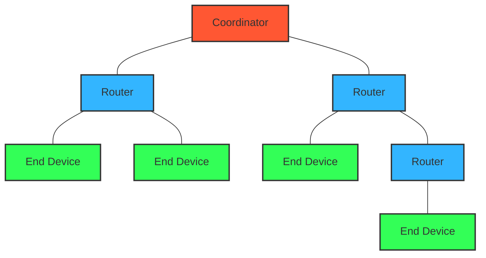
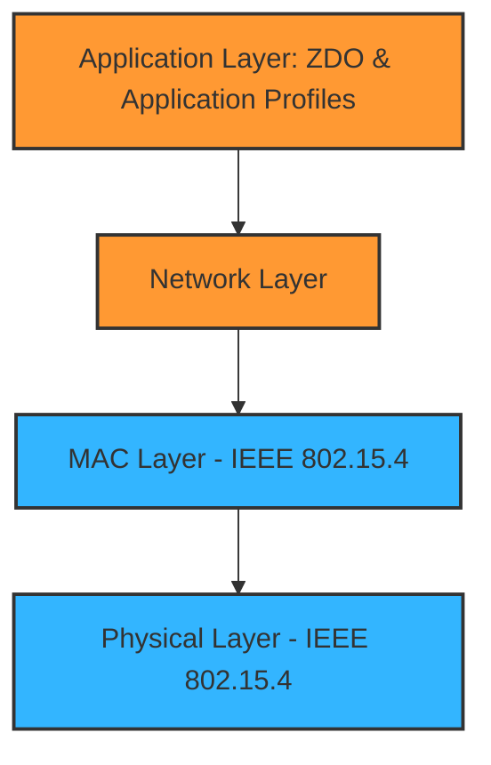

# Zigbee Networks

## Introduction

Zigbee is a low-power, low-data-rate wireless networking technology designed specifically for control and sensor applications. It's an ideal solution for creating personal area networks built from small, low-power digital radios. Zigbee operates on the IEEE 802.15.4 physical radio specification and operates in unlicensed radio frequency bands including 2.4 GHz, 900 MHz, and 868 MHz.

Unlike Wi-Fi which is designed for high-bandwidth applications, Zigbee focuses on:
- Low power consumption
- Lower data rates (250 kbit/s)
- Mesh networking capability
- Self-healing networks
- Secure communications

This makes Zigbee particularly well-suited for Internet of Things (IoT) devices, smart home automation, industrial control systems, and medical device data collection.

## Zigbee Architecture

Zigbee's architecture consists of several key components:

### Network Topology

Zigbee supports three types of network topologies:



1. **Star Topology**: All devices connect to a central coordinator
2. **Tree Topology**: A hierarchical arrangement with the coordinator at the root
3. **Mesh Topology**: The most common and robust, allowing multiple pathways for data

### Node Types

Zigbee networks consist of three types of devices:

1. **Zigbee Coordinator (ZC)**: 
   - The most capable device
   - Forms the root of the network tree
   - Can bridge to other networks
   - There is exactly one coordinator in each network
   - Manages the network security keys

2. **Zigbee Router (ZR)**:
   - Can relay data from other devices
   - Participates in multi-hop routing of messages
   - Typically mains-powered devices

3. **Zigbee End Device (ZED)**:
   - Contains just enough functionality to communicate with its parent node
   - Cannot relay data from other devices
   - Can be battery-operated with sleep capabilities
   - Requires the least amount of memory and processing power

### Zigbee Protocol Stack

The Zigbee protocol stack is built on top of the IEEE 802.15.4 standard:



- **Application Layer**: Consists of the Application Support Sublayer (APS), Zigbee Device Object (ZDO), and application framework
- **Network Layer**: Responsible for network formation, routing, and security
- **MAC Layer**: Handles reliable transmissions, addressing, and channel access
- **Physical Layer**: Manages radio transmissions, frequencies, and modulations

## Key Features of Zigbee

### Mesh Networking

One of Zigbee's most powerful features is its self-forming and self-healing mesh network capability:

- **Self-forming**: Devices can automatically discover and join the network
- **Self-healing**: If a router fails, devices can find alternate routes for communication
- **Extended range**: Data can hop through multiple routers to reach distant devices

### Security Features

Zigbee implements robust security measures:

- **128-bit AES encryption** 
- **Network keys** for securing network-level communications
- **Link keys** for securing application-level communications
- **Trust Center** (typically the coordinator) for managing security keys

### Energy Efficiency

Zigbee is designed for low power consumption:

- End devices can sleep for extended periods
- Battery-powered devices can operate for years on a single battery
- Efficient protocol design minimizes transmission times

## Implementing Zigbee Networks

### Hardware Requirements

To build a Zigbee network, you'll need:

1. **Zigbee Coordinator** - Typically a development board with a Zigbee-capable microcontroller and radio
2. **Zigbee Routers and/or End Devices** - Additional devices that will form your network
3. **Zigbee Module** - Common modules include:
   - Silicon Labs' EFR32MG
   - Texas Instruments' CC2530/CC2531
   - NXP's JN516x series

### Software Implementation Example

Here's a simple example of initializing a Zigbee network using the Texas Instruments Z-Stack:

```c
// Initialize the Zigbee stack
void zb_init() {
  // Register the endpoint
  zclSampleSw_Init(&sampleSw_SimpleDesc);
  
  // Set channels
  uint32_t channelList = (1 << 11); // Channel 11
  
  // Start the device
  zclSampleSw_StartCoordinator(channelList);
}

// Example coordinator initialization
void zclSampleSw_StartCoordinator(uint32_t channelList) {
  zstack_startupReq_t startupReq;
  
  // Set startup parameters
  memset(&startupReq, 0, sizeof(zstack_startupReq_t));
  startupReq.startDelay = 0;
  
  // Send startup request to stack
  Zstackapi_startupReq(appServiceTaskId, &startupReq);
}
```

### Joining a Zigbee Network

End devices need to join the network. Here's how a join process might be implemented:

```c
// Join a network
void joinNetwork() {
  zstack_bdbStartCommissioningReq_t commissioningReq;
  
  // Clear the structure
  memset(&commissioningReq, 0, sizeof(zstack_bdbStartCommissioningReq_t));
  
  // Set commissioning mode to join network
  commissioningReq.commissioning_mode = BDB_COMMISSIONING_MODE_NWK_STEERING;
  
  // Send join request to stack
  Zstackapi_bdbStartCommissioningReq(appServiceTaskId, &commissioningReq);
}
```

### Sending Data Over a Zigbee Network

Here's an example of sending a simple command from one device to another:

```c
// Send a toggle command to a light
void sendToggleCommand(uint16_t dstAddr) {
  zclGeneral_SendOnOff_CmdToggle(SAMPLESW_ENDPOINT, &dstAddr, FALSE, 0);
}
```

## Real-World Applications

### Smart Home Automation

Zigbee is widely used in home automation systems:

1. **Lighting Control**: Philips Hue, IKEA TRÅDFRI, and other smart lighting solutions use Zigbee
2. **Smart Thermostats**: Many heating/cooling systems use Zigbee for communication
3. **Security Systems**: Door/window sensors and motion detectors often use Zigbee
4. **Smart Speakers**: Amazon Echo Plus, Echo Show, and other devices have built-in Zigbee hubs

### Implementation Example: Smart Lighting System

```c
// Handler for incoming On/Off commands
void zclSampleLight_OnOffCB(uint8_t cmd) {
  switch(cmd) {
    case COMMAND_ON:
      // Turn on the LED
      turnOnLED();
      break;
    
    case COMMAND_OFF:
      // Turn off the LED
      turnOffLED();
      break;
    
    case COMMAND_TOGGLE:
      // Toggle the LED
      toggleLED();
      break;
  }
  
  // Update the attribute value
  zclSampleLight_OnOff = (cmd == COMMAND_OFF) ? FALSE : TRUE;
}
```

### Industrial Monitoring

Zigbee is used in industrial settings for:

1. **Environmental Monitoring**: Temperature, humidity, and pressure sensors
2. **Asset Tracking**: Location and status of equipment
3. **Predictive Maintenance**: Monitoring equipment for signs of failure

### Healthcare Applications

Zigbee technology is also used in healthcare:

1. **Patient Monitoring**: Wireless sensors for vital signs
2. **Medication Management**: Smart pill dispensers
3. **Activity Tracking**: Elderly care and assisted living applications

## ZigBee vs. Other Wireless Technologies

### Comparison Table

| Feature | Zigbee | Bluetooth LE | Wi-Fi | Z-Wave |
|---------|--------|--------------|-------|--------|
| Range | 10-100m | 10-30m | 50-100m | 30-100m |
| Battery Life | Years | Months-Years | Hours-Days | Years |
| Network Size | 65,000+ nodes | 8 devices (classic), 32k+ (mesh) | 255 nodes | 232 nodes |
| Data Rate | 250 Kbps | 1-2 Mbps | 150+ Mbps | 100 Kbps |
| Topology | Mesh | Star, Mesh (BLE 5.0+) | Star | Mesh |
| Frequency | 2.4GHz, 915MHz, 868MHz | 2.4GHz | 2.4GHz, 5GHz | 908MHz (US), 868MHz (EU) |

## Zigbee Security Considerations

### Common Security Challenges

1. **Key Management**: Secure distribution and storage of network and link keys
2. **Physical Attacks**: Devices might be physically accessed by attackers
3. **Traffic Analysis**: Even with encryption, patterns can be analyzed
4. **Interference**: Zigbee operates in the crowded 2.4GHz band

### Securing Your Zigbee Implementation

```c
// Example of implementing secure key storage
void secureKeyStorage() {
  // Store the key in a protected memory section
  #pragma DATA_SECTION(networkKey, ".keystore")
  static uint8_t networkKey[16];
  
  // Use hardware encryption when available
  if(HW_AES_AVAILABLE) {
    HW_AES_Encrypt(plaintext, networkKey, ciphertext);
  } else {
    SW_AES_Encrypt(plaintext, networkKey, ciphertext);
  }
}
```

## Debugging Zigbee Networks

### Common Tools

1. **Packet Sniffers**: Hardware devices like TI's CC2531 USB Dongle with appropriate software
2. **Network Analyzers**: Software like Wireshark with Zigbee protocol support
3. **Logic Analyzers**: For examining the physical layer signals

### Troubleshooting Tips

1. **Channel Conflicts**: Change channels if experiencing interference
2. **Network ID Collisions**: Ensure PAN IDs are unique in your area
3. **Range Issues**: Add routers to extend the network range
4. **Join Failures**: Check security settings and network permitJoin state

## Summary

Zigbee is a powerful wireless technology designed specifically for low-power, low-data-rate applications. Its mesh networking capabilities, robust security features, and energy efficiency make it ideal for IoT applications, smart homes, industrial monitoring, and healthcare systems.

Key takeaways:
- Zigbee forms self-healing mesh networks
- It uses minimal power, enabling years of battery life
- It supports secure communications with AES-128 encryption
- It's optimized for command and control applications rather than large data transfers
- It's widely adopted in commercial IoT ecosystems

## Exercises

1. Set up a basic Zigbee network with one coordinator and two end devices.
2. Implement a simple sensor data collection system using Zigbee.
3. Create a lighting control application that uses Zigbee to control multiple lights.
4. Analyze the network traffic in a Zigbee network using a packet sniffer.
5. Implement security best practices in a Zigbee application.

## Additional Resources

- [Zigbee Alliance (Now Connectivity Standards Alliance)](https://csa-iot.org/)
- [IEEE 802.15.4 Standard](https://standards.ieee.org/standard/802_15_4-2020.html)
- Texas Instruments Z-Stack Documentation
- Silicon Labs EmberZNet Documentation
- NXP JN516x Zigbee SDK Documentation