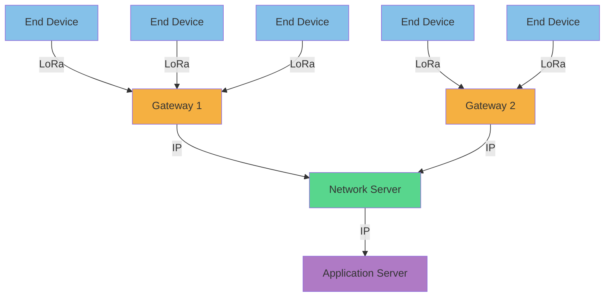
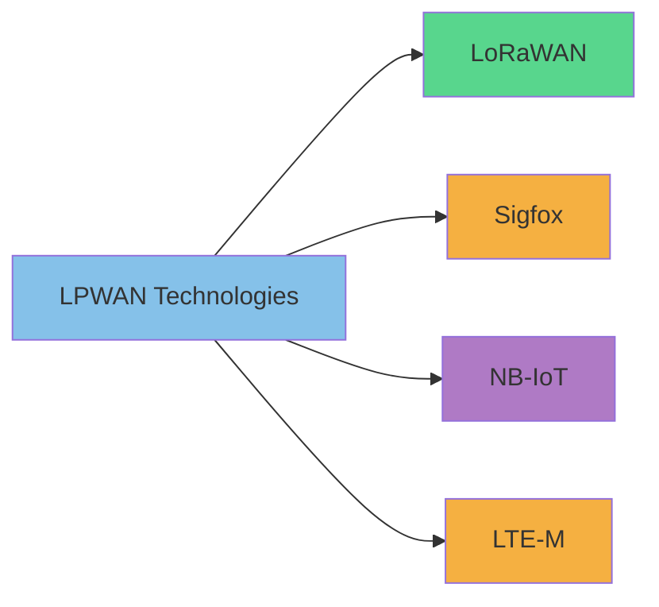

# Networks: LoRaWAN

## Introduction

LoRaWAN (Long Range Wide Area Network) is a low-power, wide-area networking protocol designed specifically for Internet of Things (IoT) applications. It enables long-range communication between battery-powered devices and internet-connected applications, making it ideal for scenarios where devices need to transmit small amounts of data over long distances while conserving energy.

In today's connected world, not all wireless technologies serve the same purpose. While Wi-Fi and Bluetooth excel at high-bandwidth, short-range communication, LoRaWAN addresses a different need: **long-range, low-power, and low-bandwidth communication**. This makes it perfect for IoT deployments in agriculture, smart cities, industrial monitoring, and environmental sensing.

## Key Characteristics of LoRaWAN

- **Long Range**: Can achieve 2-5 km in urban areas and up to 15 km in rural areas
- **Low Power Consumption**: Devices can operate for years on a single battery
- **Low Bandwidth**: Typical data rates between 0.3 kbps and 50 kbps
- **Secure**: Implements end-to-end AES-128 encryption
- **Scalable**: A single gateway can handle thousands of nodes
- **Open Standard**: Managed by the LoRa Alliance

## LoRaWAN Architecture

LoRaWAN operates on a star-of-stars topology, consisting of three main components:

1. **End Devices (Nodes)**: Sensors or actuators equipped with LoRa radio modules
2. **Gateways**: Receive LoRa radio packets and forward them to the network server
3. **Network Server**: Manages the network, handles security, and forwards data to applications



## LoRaWAN Device Classes

LoRaWAN defines three device classes to accommodate different requirements:

- **Class A**: Lowest power consumption, uplink-initiated communication (default)
- **Class B**: Scheduled downlink slots via synchronized beacons
- **Class C**: Continuously listening devices, lowest latency but highest power consumption

## How LoRaWAN Works

### LoRa Physical Layer

LoRaWAN uses LoRa as its physical layer technology. LoRa (Long Range) is a proprietary radio modulation technique based on Chirp Spread Spectrum (CSS). This technique spreads a narrow-band signal over a wider channel bandwidth, making it:

- Resistant to interference
- Capable of being received below the noise floor
- Less susceptible to the Doppler effect

### LoRaWAN MAC Layer

The LoRaWAN protocol defines the Media Access Control (MAC) layer that manages communication between end devices and gateways. Key aspects include:

1. **Adaptive Data Rate (ADR)**: Optimizes data rates, airtime, and energy consumption
2. **Channel Access**: Uses ALOHA-based protocol for simplicity
3. **Message Types**: Join requests, data messages, acknowledgments
4. **Security**: Implements network and application layer encryption

### Device Activation

To join a LoRaWAN network, devices need to be activated through one of two methods:

1. **Activation by Personalization (ABP)**: Device parameters are hardcoded
2. **Over-the-Air Activation (OTAA)**: Secure dynamic join procedure

OTAA is the recommended method as it generates fresh session keys for each activation, enhancing security.

## Code Example: Setting Up a LoRaWAN End Device

Here's an example using Arduino and the MCCI LoRaWAN LMIC library to create a simple LoRaWAN end device:

```cpp
#include <lmic.h>
#include <hal/hal.h>
#include <SPI.h>

// LoRaWAN NwkSKey, network session key
static const PROGMEM u1_t NWKSKEY[16] = { 0x00, 0x00, 0x00, 0x00, 0x00, 0x00, 0x00, 0x00, 0x00, 0x00, 0x00, 0x00, 0x00, 0x00, 0x00, 0x00 };

// LoRaWAN AppSKey, application session key
static const u1_t PROGMEM APPSKEY[16] = { 0x00, 0x00, 0x00, 0x00, 0x00, 0x00, 0x00, 0x00, 0x00, 0x00, 0x00, 0x00, 0x00, 0x00, 0x00, 0x00 };

// LoRaWAN end-device address (DevAddr)
static const u4_t DEVADDR = 0x00000000;

// Pin mapping for your specific board
const lmic_pinmap lmic_pins = {
    .nss = 10,
    .rxtx = LMIC_UNUSED_PIN,
    .rst = 9,
    .dio = {2, 6, 7},
};

// These callbacks are required by the LMIC library
void os_getArtEui (u1_t* buf) { }
void os_getDevEui (u1_t* buf) { }
void os_getDevKey (u1_t* buf) { }

// Payload to send
static uint8_t payload[5] = { 1, 2, 3, 4, 5 };
static osjob_t sendjob;

// Schedule data transmission
void do_send(osjob_t* j) {
    // Check if there is not a current TX/RX job running
    if (LMIC.opmode & OP_TXRXPEND) {
        Serial.println(F("OP_TXRXPEND, not sending"));
    } else {
        // Prepare upstream data transmission at the next possible time.
        LMIC_setTxData2(1, payload, sizeof(payload), 0);
        Serial.println(F("Packet queued"));
    }
}

void onEvent (ev_t ev) {
    Serial.print(os_getTime());
    Serial.print(": ");
    switch(ev) {
        case EV_TXCOMPLETE:
            Serial.println(F("EV_TXCOMPLETE (includes waiting for RX windows)"));
            if (LMIC.txrxFlags & TXRX_ACK)
              Serial.println(F("Received ack"));
            if (LMIC.dataLen) {
              Serial.println(F("Received "));
              Serial.println(LMIC.dataLen);
              Serial.println(F(" bytes of payload"));
            }
            // Schedule next transmission
            os_setTimedCallback(&sendjob, os_getTime()+sec2osticks(60), do_send);
            break;
        default:
            Serial.println(F("Unknown event"));
            break;
    }
}

void setup() {
    Serial.begin(9600);
    Serial.println(F("Starting"));

    // LMIC init
    os_init();
    // Reset the MAC state
    LMIC_reset();

    // Set static session parameters (for ABP activation)
    uint8_t appskey[sizeof(APPSKEY)];
    uint8_t nwkskey[sizeof(NWKSKEY)];
    memcpy_P(appskey, APPSKEY, sizeof(APPSKEY));
    memcpy_P(nwkskey, NWKSKEY, sizeof(NWKSKEY));
    LMIC_setSession (0x13, DEVADDR, nwkskey, appskey);

    // Set up channels
    LMIC_setupChannel(0, 868100000, DR_RANGE_MAP(DR_SF12, DR_SF7),  BAND_CENTI);

    // Disable link check validation
    LMIC_setLinkCheckMode(0);

    // TTN uses SF9 for its RX2 window
    LMIC.dn2Dr = DR_SF9;

    // Set data rate and transmit power for uplink
    LMIC_setDrTxpow(DR_SF7,14);

    // Start job
    do_send(&sendjob);
}

void loop() {
    os_runloop_once();
}
```

**Output Example:**
```
Starting
12345: Packet queued
13457: EV_TXCOMPLETE (includes waiting for RX windows)
```

## Practical Applications

### Smart Agriculture

LoRaWAN is ideal for agricultural applications due to its long range and low power requirements. Here's how it might be used:

1. **Soil Moisture Monitoring**: Sensors placed across fields send periodic readings
2. **Weather Stations**: Monitor local conditions for precise farming decisions
3. **Livestock Tracking**: Track animal location and health with LoRaWAN-enabled collars

Example code snippet for a soil moisture sensor:

```cpp
#include <lmic.h>
#include <hal/hal.h>
#include <SPI.h>

// LoRaWAN configuration (same as previous example)
// ...

// Soil moisture sensor pin
#define MOISTURE_SENSOR_PIN A0

void readAndSendMoisture() {
    int soilMoisture = analogRead(MOISTURE_SENSOR_PIN);
    
    // Prepare payload - convert 10-bit ADC reading to 8-bit value
    uint8_t payload[2];
    payload[0] = soilMoisture >> 8;
    payload[1] = soilMoisture & 0xFF;
    
    // Send if not busy
    if (!(LMIC.opmode & OP_TXRXPEND)) {
        LMIC_setTxData2(1, payload, sizeof(payload), 0);
        Serial.println(F("Sending soil moisture data"));
    }
}
```

### Smart City

LoRaWAN networks are being deployed in cities worldwide to enable various IoT applications:

1. **Smart Parking**: Sensors detect vehicle presence and report availability
2. **Waste Management**: Fill-level sensors in garbage bins optimize collection routes
3. **Street Lighting**: Adaptive lighting based on presence detection and ambient light
4. **Environmental Monitoring**: Air quality sensors throughout the city

### Water Metering

Remote water meter reading exemplifies the power of LoRaWAN:

```cpp
// This example shows how a water meter might send consumption data

#include <lmic.h>
// Standard LoRaWAN setup (omitted for brevity)

// Water meter pulse counter connected to digital pin 3
#define PULSE_PIN 3
volatile unsigned long pulseCount = 0;

void setup() {
    // Standard LoRaWAN setup...
    
    // Setup pulse counter pin with interrupt
    pinMode(PULSE_PIN, INPUT_PULLUP);
    attachInterrupt(digitalPinToInterrupt(PULSE_PIN), countPulse, FALLING);
    
    // Start job
    os_setCallback(&sendjob, sendWaterMeterData);
}

// Interrupt handler for water meter pulses
void countPulse() {
    pulseCount++;
}

void sendWaterMeterData(osjob_t* j) {
    // Disable interrupts while reading the pulse count
    noInterrupts();
    unsigned long currentCount = pulseCount;
    interrupts();
    
    // Prepare 4-byte payload with pulse count (water consumption)
    uint8_t payload[4];
    payload[0] = (uint8_t)(currentCount >> 24);
    payload[1] = (uint8_t)(currentCount >> 16);
    payload[2] = (uint8_t)(currentCount >> 8);
    payload[3] = (uint8_t)(currentCount);
    
    // Send data if not busy
    if (!(LMIC.opmode & OP_TXRXPEND)) {
        LMIC_setTxData2(1, payload, sizeof(payload), 0);
        Serial.println(F("Sending water meter data"));
    }
    
    // Schedule next transmission (every 6 hours)
    os_setTimedCallback(&sendjob, os_getTime() + sec2osticks(6 * 60 * 60), sendWaterMeterData);
}

void loop() {
    os_runloop_once();
}
```

## Deployment Considerations

When deploying a LoRaWAN solution, consider the following factors:

### Network Coverage

- **Gateway Placement**: Prioritize height and line-of-sight
- **Site Survey**: Test signal strength before permanent installation
- **Network Planning**: Consider using radio planning tools

### Security

LoRaWAN implements several security features:

1. **Network Layer Security**: Ensures authenticity of the node in the network
2. **Application Layer Security**: Ensures the network operator cannot access application data
3. **Device-Specific Keys**: Each device has unique encryption keys

### Regional Parameters

LoRaWAN uses different frequency bands depending on the region:

- Europe: 863-870 MHz
- North America: 902-928 MHz
- Asia: Various bands (e.g., 923 MHz in Japan)

Always configure your devices according to local regulations.

## Comparing LoRaWAN to Other LPWAN Technologies



| Technology | Range | Battery Life | Data Rate | Cost | Network Type |
|------------|-------|--------------|-----------|------|--------------|
| LoRaWAN    | 2-15 km | 5-10 years | 0.3-50 kbps | Low | Private/Public |
| Sigfox     | 10-50 km | 5-10 years | 100 bps | Low | Public |
| NB-IoT     | 1-10 km | 5-10 years | 60-250 kbps | Medium | Cellular |
| LTE-M      | 1-10 km | 2-5 years | 1 Mbps | Medium-High | Cellular |

## Working with LoRaWAN in a Development Environment

### Setting Up a Test Network

You can create a local LoRaWAN test environment using:

1. **The Things Network (TTN)**: Open, global LoRaWAN network
2. **ChirpStack**: Open-source LoRaWAN network server

### Development Tools

Some useful tools for LoRaWAN development include:

- **LoRa Server Project**: Open-source LoRaWAN network server implementation
- **Arduino LMIC Library**: For programming end devices with Arduino
- **PyLoRa**: Python library for working with LoRa

### Creating a Simple Gateway with Raspberry Pi

A basic LoRaWAN gateway can be built using a Raspberry Pi and a LoRa concentrator board:

```bash
# Install LoRa Gateway Bridge
sudo apt-get update
sudo apt-get install lora-gateway-bridge

# Configure to connect to your network server
sudo nano /etc/lora-gateway-bridge/lora-gateway-bridge.toml

# Start the service
sudo systemctl enable lora-gateway-bridge
sudo systemctl start lora-gateway-bridge
```

## Summary

LoRaWAN is a powerful wireless technology designed specifically for IoT applications requiring long-range communication, low power consumption, and moderate security. Its architecture enables scalable deployments of battery-powered devices across diverse environments, from agriculture to smart cities.

Key takeaways:

1. LoRaWAN excels in applications requiring long battery life and long-range communication
2. The star-of-stars topology allows for simple network architecture
3. Adaptive data rate optimizes battery life and network capacity
4. Security is implemented at multiple layers
5. Different device classes accommodate various use cases
6. Regional parameters must be considered for regulatory compliance

## Additional Resources

To continue learning about LoRaWAN:

1. Read the [LoRaWAN Specification](https://lora-alliance.org/resource_hub/lorawan-specification-v1-1/)
2. Join the [The Things Network](https://www.thethingsnetwork.org/) community
3. Explore the [ChirpStack](https://www.chirpstack.io/) open-source LoRaWAN network server

## Exercises

1. **Setup Exercise**: Configure a LoRaWAN end device using OTAA and send sensor data to a network server.
2. **Planning Exercise**: Design a LoRaWAN deployment for monitoring water quality in a river system.
3. **Coding Exercise**: Create a data visualization dashboard that displays information from LoRaWAN devices.
4. **Security Exercise**: Implement a secure key management system for your LoRaWAN devices.
5. **Integration Exercise**: Connect your LoRaWAN network to a cloud platform for data analysis.