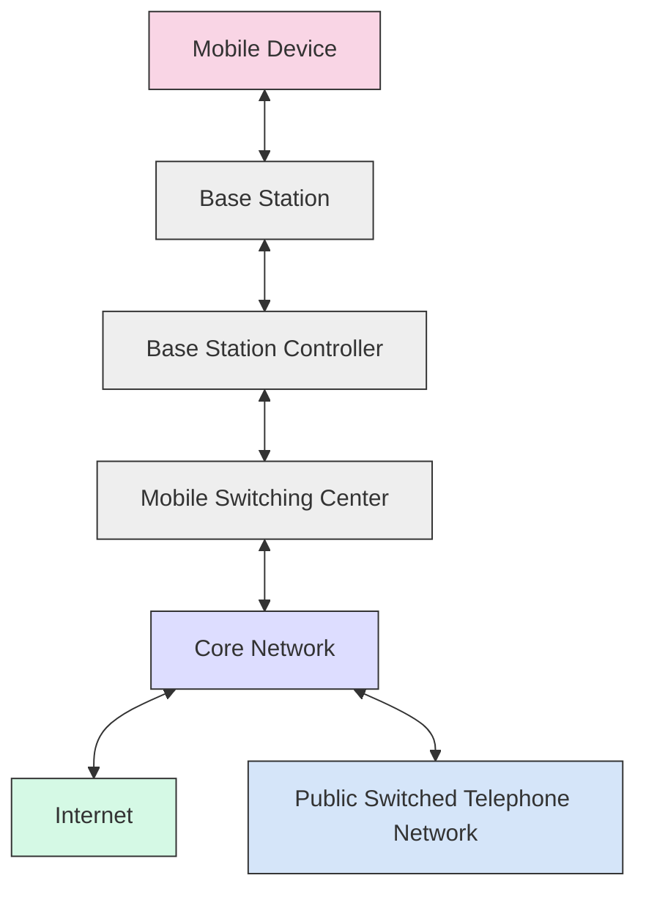

# Cellular Networks

## Introduction

Cellular networks form the backbone of mobile communications worldwide, enabling everything from phone calls and text messages to mobile internet access. These networks get their name from their structure: geographic areas are divided into "cells," each served by a base station. This cellular approach allows for efficient spectrum use, wide coverage, and the ability to handle millions of devices simultaneously.

In this guide, we'll explore how cellular networks function, their evolution through different generations (from 1G to 5G), key components, and how programmers can interact with cellular technologies.

## Cellular Network Architecture

Cellular networks follow a hierarchical architecture designed to provide reliable wireless connectivity across wide geographic areas.

### Key Components

1. **Mobile Devices**: Smartphones, tablets, IoT devices, etc., that connect to the network
2. **Base Stations**: Towers with antennas that communicate directly with mobile devices
3. **Base Station Controllers**: Manage multiple base stations and handle handovers
4. **Mobile Switching Centers**: Route calls and data between different parts of the network
5. **Core Network**: The central part of the system that connects to external networks (internet, PSTN)

Let's visualize this architecture:



### The Cellular Concept

The genius of cellular networks lies in their cell-based design:

- **Frequency Reuse**: The same frequencies can be used in non-adjacent cells, dramatically increasing capacity
- **Handover**: As users move between cells, connections transfer seamlessly from one base station to another
- **Dynamic Resource Allocation**: Network resources adapt to changing demand patterns

## Evolution of Cellular Networks

Cellular technology has evolved through several generations, each bringing significant improvements:

| Generation | Key Features | Max Data Rates | Key Technologies |
|------------|-------------|----------------|------------------|
| 1G (1980s) | Analog voice calls | 2.4 Kbps | AMPS, TACS |
| 2G (1990s) | Digital voice, SMS, basic data | 64 Kbps | GSM, CDMA |
| 3G (2000s) | Mobile internet, video calls | 2 Mbps | UMTS, HSPA |
| 4G (2010s) | High-speed data, VoLTE | 100 Mbps - 1 Gbps | LTE, LTE-Advanced |
| 5G (2020s) | Ultra-low latency, massive IoT connectivity | 10-20 Gbps | 5G NR, mmWave |

### 5G: The Current Generation

5G networks represent a significant leap forward, designed around three core use cases:

1. **Enhanced Mobile Broadband (eMBB)**: Faster speeds for consumers
2. **Ultra-Reliable Low-Latency Communications (URLLC)**: For critical applications like autonomous vehicles
3. **Massive Machine-Type Communications (mMTC)**: Supporting billions of IoT devices

5G achieves these goals through:

- **Millimeter wave (mmWave) spectrum**: Higher frequencies enabling massive bandwidth
- **Massive MIMO**: Using many more antennas for better spectral efficiency
- **Network Slicing**: Creating virtual networks tailored to specific applications
- **Edge Computing**: Moving processing closer to users to reduce latency

## Cellular Communication Basics

### How Cellular Data Transmission Works

When your device sends or receives data over a cellular network, it follows these steps:

1. **Device Registration**: Your device authenticates with the network
2. **Channel Allocation**: The network assigns radio resources
3. **Data Packaging**: Data is broken into packets with necessary headers
4. **Transmission**: Packets are sent via radio waves to the nearest base station
5. **Routing**: Data travels through the core network to its destination
6. **Reassembly**: At the destination, packets are reassembled into the original data

### Cellular Addressing

Each device on a cellular network has several identifiers:

- **IMEI (International Mobile Equipment Identity)**: Identifies the physical device
- **IMSI (International Mobile Subscriber Identity)**: Identifies the subscriber/SIM card
- **Phone Number**: The publicly visible identifier
- **IP Address**: Assigned for data communications

## Programming with Cellular Networks

### Detecting Network Information in Android

Android provides APIs to access cellular network information:

```java
import android.content.Context;
import android.telephony.TelephonyManager;

public class NetworkInfo {
    public static String getCellularNetworkInfo(Context context) {
        TelephonyManager manager = (TelephonyManager) context.getSystemService(Context.TELEPHONY_SERVICE);
        
        StringBuilder info = new StringBuilder();
        
        // Get network type (4G, 5G, etc.)
        int networkType = manager.getNetworkType();
        String networkTypeName = getNetworkTypeName(networkType);
        info.append("Network Type: ").append(networkTypeName).append("
");
        
        // Get carrier name
        String carrierName = manager.getNetworkOperatorName();
        info.append("Carrier: ").append(carrierName).append("
");
        
        // Get signal strength (requires additional code and permissions)
        // ...
        
        return info.toString();
    }
    
    private static String getNetworkTypeName(int type) {
        switch (type) {
            case TelephonyManager.NETWORK_TYPE_LTE:
                return "4G (LTE)";
            case TelephonyManager.NETWORK_TYPE_NR:
                return "5G";
            case TelephonyManager.NETWORK_TYPE_UMTS:
            case TelephonyManager.NETWORK_TYPE_HSDPA:
                return "3G";
            case TelephonyManager.NETWORK_TYPE_GPRS:
            case TelephonyManager.NETWORK_TYPE_EDGE:
                return "2G";
            default:
                return "Unknown";
        }
    }
}
```

**Output Example**:
```
Network Type: 4G (LTE)
Carrier: Verizon
```

### Detecting Network Information in iOS

For iOS development, you can access network information using CoreTelephony:

```swift
import UIKit
import CoreTelephony

class NetworkViewController: UIViewController {
    
    @IBOutlet weak var networkInfoLabel: UILabel!
    
    override func viewDidLoad() {
        super.viewDidLoad()
        
        displayNetworkInfo()
    }
    
    func displayNetworkInfo() {
        let networkInfo = CTTelephonyNetworkInfo()
        
        if let carrier = networkInfo.serviceSubscriberCellularProviders?.values.first {
            var infoText = "Carrier: \(carrier.carrierName ?? "Unknown")
"
            infoText += "ISO Country Code: \(carrier.isoCountryCode ?? "Unknown")
"
            
            // Get current radio technology
            if let radioTech = networkInfo.serviceCurrentRadioAccessTechnology?.values.first {
                infoText += "Radio Technology: \(getRadioTechName(radioTech))"
            }
            
            networkInfoLabel.text = infoText
        } else {
            networkInfoLabel.text = "No cellular service available"
        }
    }
    
    func getRadioTechName(_ radioTech: String) -> String {
        switch radioTech {
            case CTRadioAccessTechnologyLTE:
                return "4G (LTE)"
            case CTRadioAccessTechnologyNRNSA, CTRadioAccessTechnologyNR:
                return "5G"
            case CTRadioAccessTechnologyWCDMA, CTRadioAccessTechnologyHSDPA, CTRadioAccessTechnologyHSUPA:
                return "3G"
            case CTRadioAccessTechnologyGPRS, CTRadioAccessTechnologyEdge:
                return "2G"
            default:
                return "Unknown"
        }
    }
}
```

**Output Example**:
```
Carrier: AT&T
ISO Country Code: US
Radio Technology: 4G (LTE)
```

### Making HTTP Requests with Network Type Awareness

You might want to adjust your app's behavior based on the cellular network type. Here's a simplified example in JavaScript:

```javascript
function fetchDataWithNetworkAwareness() {
    const connection = navigator.connection || navigator.mozConnection || 
                      navigator.webkitConnection || navigator.msConnection;
    
    if (!connection) {
        console.log("Network Information API not supported");
        return fetchWithDefaultSettings();
    }
    
    const networkType = connection.type; // 'cellular' among other values
    const effectiveType = connection.effectiveType; // '2g', '3g', '4g'
    
    console.log(`Network Type: ${networkType}, Effective Type: ${effectiveType}`);
    
    // Adjust timeout and quality based on network type
    let timeout = 10000; // Default 10s
    let quality = 'high';
    
    if (networkType === 'cellular') {
        if (effectiveType === '2g' || effectiveType === 'slow-2g') {
            timeout = 30000; // Longer timeout for slow connections
            quality = 'low';
        } else if (effectiveType === '3g') {
            timeout = 15000;
            quality = 'medium';
        }
    }
    
    return fetchWithCustomSettings(timeout, quality);
}

function fetchWithCustomSettings(timeout, quality) {
    const options = {
        method: 'GET',
        timeout: timeout,
        headers: {
            'Accept': quality === 'low' ? 'application/json' : 'application/json, image/*'
        }
    };
    
    const url = quality === 'low' ? '/api/data?lite=true' : '/api/data';
    
    console.log(`Fetching ${url} with timeout ${timeout}ms and quality ${quality}`);
    
    return fetch(url, options)
        .then(response => response.json())
        .catch(error => {
            console.error('Network request failed:', error);
            return null;
        });
}
```

**Console Output Example**:
```
Network Type: cellular, Effective Type: 3g
Fetching /api/data?lite=true with timeout 15000ms and quality medium
```

## Cellular Network Security

Cellular networks implement several security mechanisms:

### Authentication and Encryption

Each generation has improved security:

- **2G (GSM)**: Used A3 algorithm for authentication and A5 for encryption (relatively weak)
- **3G/4G**: Uses mutual authentication and stronger AKA (Authentication and Key Agreement) protocols
- **5G**: Enhanced subscriber privacy with concealed identifiers and improved encryption

### Practical Security Considerations for Developers

When developing apps that use cellular networks:

1. **Always use HTTPS**: Cellular networks aren't immune to eavesdropping
2. **Implement certificate pinning**: Protects against man-in-the-middle attacks
3. **Be cautious with sensitive data**: Avoid transmitting unencrypted sensitive information
4. **Consider data usage**: Users on cellular networks may have limited data plans

Example of implementing certificate pinning in Android:

```java
private void setupSecureConnection() {
    try {
        // Load your trusted certificates
        CertificateFactory cf = CertificateFactory.getInstance("X.509");
        Certificate trustedCert = cf.generateCertificate(
                getResources().openRawResource(R.raw.my_cert));
        
        // Create a KeyStore containing our trusted certificate
        KeyStore keyStore = KeyStore.getInstance(KeyStore.getDefaultType());
        keyStore.load(null, null);
        keyStore.setCertificateEntry("trusted_cert", trustedCert);
        
        // Create a TrustManager that trusts the certificate in our KeyStore
        TrustManagerFactory tmf = TrustManagerFactory.getInstance(
                TrustManagerFactory.getDefaultAlgorithm());
        tmf.init(keyStore);
        
        // Create an SSLContext that uses our TrustManager
        SSLContext sslContext = SSLContext.getInstance("TLS");
        sslContext.init(null, tmf.getTrustManagers(), null);
        
        // Use the SSLContext to create a socket factory and then use
        // that to create an OkHttpClient
        OkHttpClient client = new OkHttpClient.Builder()
                .sslSocketFactory(sslContext.getSocketFactory(), 
                        (X509TrustManager) tmf.getTrustManagers()[0])
                .build();
                
        // Use this client for your HTTP requests
        
    } catch (Exception e) {
        e.printStackTrace();
    }
}
```

## Real-World Applications

### Location-Based Services

Cellular networks can determine device location through various methods:

1. **Cell ID**: Basic location based on the serving cell tower
2. **Triangulation**: Using signal strength from multiple towers
3. **Assisted GPS**: Combining GPS with cellular data for faster/better positioning

Example of getting a device's location (Android):

```java
import android.Manifest;
import android.content.pm.PackageManager;
import android.location.Location;
import android.os.Bundle;
import android.widget.Toast;
import androidx.annotation.NonNull;
import androidx.appcompat.app.AppCompatActivity;
import androidx.core.app.ActivityCompat;
import com.google.android.gms.location.FusedLocationProviderClient;
import com.google.android.gms.location.LocationServices;
import com.google.android.gms.tasks.OnSuccessListener;

public class LocationActivity extends AppCompatActivity {

    private FusedLocationProviderClient fusedLocationClient;
    private static final int LOCATION_PERMISSION_REQUEST = 1;

    @Override
    protected void onCreate(Bundle savedInstanceState) {
        super.onCreate(savedInstanceState);
        setContentView(R.layout.activity_location);
        
        fusedLocationClient = LocationServices.getFusedLocationProviderClient(this);
        
        if (checkLocationPermission()) {
            getLastLocation();
        } else {
            requestLocationPermission();
        }
    }
    
    private boolean checkLocationPermission() {
        return ActivityCompat.checkSelfPermission(this,
                Manifest.permission.ACCESS_FINE_LOCATION) == PackageManager.PERMISSION_GRANTED;
    }
    
    private void requestLocationPermission() {
        ActivityCompat.requestPermissions(this,
                new String[]{Manifest.permission.ACCESS_FINE_LOCATION},
                LOCATION_PERMISSION_REQUEST);
    }
    
    @Override
    public void onRequestPermissionsResult(int requestCode, @NonNull String[] permissions,
                                          @NonNull int[] grantResults) {
        super.onRequestPermissionsResult(requestCode, permissions, grantResults);
        if (requestCode == LOCATION_PERMISSION_REQUEST) {
            if (grantResults.length > 0 && grantResults[0] == PackageManager.PERMISSION_GRANTED) {
                getLastLocation();
            } else {
                Toast.makeText(this, "Location permission denied", Toast.LENGTH_SHORT).show();
            }
        }
    }
    
    private void getLastLocation() {
        if (ActivityCompat.checkSelfPermission(this, Manifest.permission.ACCESS_FINE_LOCATION) != PackageManager.PERMISSION_GRANTED) {
            return;
        }
        
        fusedLocationClient.getLastLocation()
                .addOnSuccessListener(this, new OnSuccessListener<Location>() {
                    @Override
                    public void onSuccess(Location location) {
                        if (location != null) {
                            double latitude = location.getLatitude();
                            double longitude = location.getLongitude();
                            Toast.makeText(LocationActivity.this, 
                                    "Location: " + latitude + ", " + longitude, 
                                    Toast.LENGTH_LONG).show();
                        } else {
                            Toast.makeText(LocationActivity.this, 
                                    "Location unavailable", 
                                    Toast.LENGTH_SHORT).show();
                        }
                    }
                });
    }
}
```

### IoT Applications on Cellular Networks

Many IoT devices use cellular connectivity, particularly specialized networks like:

- **NB-IoT (Narrowband IoT)**: For low-power, low-data devices with excellent coverage
- **LTE-M**: For medium bandwidth IoT applications with mobility support

Example of an IoT temperature sensor using cellular connection (pseudocode):

```javascript
// Library for cellular IoT communication
const cellularIoT = require('cellular-iot-lib');

// Temperature sensor library
const tempSensor = require('temp-sensor');

// Configuration
const APN = 'iot.provider.com';
const SERVER_URL = 'https://data.myiotplatform.com/api/readings';
const READING_INTERVAL = 3600000; // Every hour (in milliseconds)
const DEVICE_ID = 'TEMP001';

// Initialize the cellular modem
cellularIoT.init({
    apn: APN,
    powerSaving: true,    // Enable power saving mode
    connectionTimeout: 30 // Timeout in seconds
});

// Function to send temperature reading
async function sendTemperatureReading() {
    try {
        // Get temperature reading
        const temperature = tempSensor.readTemperature();
        const timestamp = new Date().toISOString();
        
        // Prepare data payload
        const payload = {
            deviceId: DEVICE_ID,
            timestamp: timestamp,
            temperature: temperature,
            batteryLevel: cellularIoT.getBatteryLevel()
        };
        
        // Connect to cellular network
        console.log('Connecting to cellular network...');
        await cellularIoT.connect();
        
        // Send data
        console.log(`Sending temperature reading: ${temperature}°C`);
        const response = await cellularIoT.post(SERVER_URL, payload);
        
        if (response.status === 200) {
            console.log('Data sent successfully');
        } else {
            console.error(`Error sending data: ${response.status}`);
        }
        
        // Disconnect to save power
        await cellularIoT.disconnect();
        
    } catch (error) {
        console.error('Error in transmission:', error);
        
        // Try to ensure disconnection even if there was an error
        try {
            await cellularIoT.disconnect();
        } catch (e) {
            console.error('Error disconnecting:', e);
        }
    }
}

// Set up regular readings
console.log(`Starting temperature monitoring, sending every ${READING_INTERVAL/60000} minutes`);
setInterval(sendTemperatureReading, READING_INTERVAL);

// Also send an initial reading
sendTemperatureReading();
```

## Challenges and Considerations

When developing applications that use cellular networks, consider these factors:

### Bandwidth and Data Usage

- **Variable speeds**: Cellular data speeds can vary dramatically based on location, network congestion, and signal strength
- **Data caps**: Many users have limited data plans
- **Costs**: International roaming can be extremely expensive

### Battery Consumption

- Cellular radios consume significant power, especially when signal is weak
- Efficient app design should batch network requests when possible
- Consider implementing "airplane mode" detection to pause background operations

### Reliability and Connectivity

- Connections can drop unexpectedly when users enter elevators, tunnels, etc.
- Implement robust error handling and retry mechanisms
- Store critical data locally and sync when connection is available

Example of a robust network request function with retry logic:

```javascript
async function reliableFetch(url, options = {}, maxRetries = 3) {
    let retries = 0;
    
    while (retries < maxRetries) {
        try {
            // Attempt the fetch
            const response = await fetch(url, {
                ...options,
                timeout: options.timeout || 10000 // Default 10s timeout
            });
            
            if (!response.ok) {
                throw new Error(`HTTP error ${response.status}`);
            }
            
            return await response.json();
            
        } catch (error) {
            retries++;
            console.warn(`Request failed (attempt ${retries}/${maxRetries}):`, error.message);
            
            if (retries >= maxRetries) {
                console.error('Max retries reached. Giving up.');
                throw error;
            }
            
            // Exponential backoff: wait longer between each retry
            const backoffTime = Math.min(1000 * Math.pow(2, retries), 30000);
            console.log(`Retrying in ${backoffTime/1000} seconds...`);
            
            await new Promise(resolve => setTimeout(resolve, backoffTime));
        }
    }
}
```

## Summary

Cellular networks have transformed how we communicate and access information. From the analog voice calls of 1G to the high-speed, low-latency connectivity of 5G, these networks continue to evolve and enable new applications and services.

Key takeaways:

1. **Cellular Architecture**: Networks are organized in cells with base stations for efficient coverage and frequency reuse
2. **Evolution**: Each generation (1G-5G) has brought dramatic improvements in speed, capacity, and capabilities
3. **Programming Considerations**: Apps should account for variable speeds, data limits, and potential connectivity issues
4. **Security**: Always implement proper encryption and authentication when transmitting data over cellular networks
5. **Real-world Applications**: Location services, IoT, and mobile communications all rely heavily on cellular infrastructure

As we move further into the 5G era and eventually toward 6G, cellular networks will continue to become faster, more reliable, and more integrated into our daily lives and the devices around us.

## Additional Resources and Exercises

### Further Reading

- "Mobile Communications" by Jochen Schiller
- "Cellular Internet of Things" by Olof Liberg et al.
- [3GPP Specifications](https://www.3gpp.org/specifications) (Technical standards for cellular technologies)
- [GSMA Learning](https://www.gsma.com/learning/) (Mobile industry resources)

### Exercises

1. **Network Detection**:
   Build a simple app that detects and displays the current cellular network type, signal strength, and carrier name.

2. **Adaptive Content Loading**:
   Create a web application that loads different quality images based on the detected cellular network quality.

3. **Offline-First Design**:
   Modify an existing app to cache data locally and synchronize when the network is available.

4. **Data Usage Monitor**:
   Build a tool that estimates how much cellular data would be used by different API calls in your application.

5. **Network Simulation**:
   Use browser devtools to simulate different network conditions (3G, 4G) and test how your application behaves.