# 5G Networks

## Introduction

5G (Fifth Generation) represents the latest evolution in wireless communication technology, offering significantly improved performance over previous generations. As programmers, understanding 5G is increasingly important as it enables new categories of applications that weren't possible with earlier network technologies.

This guide will walk you through the fundamentals of 5G networks, their architecture, key features, and how they're changing the landscape for developers and software engineers.

## What is 5G?

5G is the fifth generation of cellular network technology that succeeds 4G LTE networks. While previous generations focused primarily on mobile connectivity for smartphones, 5G's scope extends far beyond that, aiming to connect virtually everything around us through a unified, more capable wireless network.

### Key Features of 5G

```mermaid
graph TD
    A[5G Networks] --> B[Enhanced Mobile Broadband]
    A --> C[Ultra-Reliable Low Latency]
    A --> D[Massive Machine Type Communications]
    B --> B1[Peak data rates: 20 Gbps]
    B --> B2[User experience data rates: 100+ Mbps]
    C --> C1[Latency: 1-4ms]
    C --> C2[Reliability: 99.999%]
    D --> D1[Connection density: 1 million devices/km²]
    D --> D2[IoT support at scale]
```



#### Enhanced Mobile Broadband (eMBB)
- Peak data rates up to 20 Gbps
- User experience data rates of 100+ Mbps
- Capacity increase of 100x over 4G
- Support for high-definition streaming, AR/VR applications

#### Ultra-Reliable Low Latency Communications (URLLC)
- Latency as low as 1 millisecond (compared to 50ms+ in 4G)
- Reliability of 99.999%
- Critical for autonomous vehicles, remote surgery, industrial automation

#### Massive Machine Type Communications (mMTC)
- Connection density of up to 1 million devices per square kilometer
- Optimized for IoT devices with minimal bandwidth requirements
- Long battery life for sensors and low-power devices

## 5G Network Architecture

5G introduces a more flexible, software-defined architecture compared to previous generations.

### Core Components

1. **Radio Access Network (RAN)**
   - Base stations and antennas
   - Manages radio communications between devices and the core network

2. **5G Core Network**
   - Cloud-native, service-based architecture
   - Network slicing capabilities
   - Edge computing integration

3. **Network Slicing**
   - Allows creation of virtual networks on a shared infrastructure
   - Each slice optimized for specific service requirements

### Frequency Spectrum in 5G

5G operates across three main frequency bands, each with different characteristics:

1. **Low-band (< 1 GHz)**
   - Extended coverage area
   - Better building penetration
   - Lower data rates (100-200 Mbps)
   
2. **Mid-band (1-6 GHz)**
   - Balance of coverage and capacity
   - Most commonly deployed initially
   - Speeds of 100-900 Mbps
   
3. **High-band/mmWave (24-100 GHz)**
   - Extremely high data rates (1-3 Gbps)
   - Very limited range (< 500 meters)
   - Poor penetration through obstacles
   - Requires dense network of small cells

## Programming for 5G Networks

For developers, 5G creates new opportunities and challenges. Let's explore some practical examples of how programming interfaces with 5G technology.

### Example 1: Retrieving Network Information

JavaScript code to detect network type and speed:

```javascript
// Function to check network type and speed
function checkNetworkCapabilities() {
  // Get connection information
  const connection = navigator.connection || 
                     navigator.mozConnection || 
                     navigator.webkitConnection;
  
  if (!connection) {
    console.log('Network Information API not supported');
    return;
  }
  
  // Display network information
  console.log('Network Type:', connection.type);
  console.log('Effective Type:', connection.effectiveType);
  console.log('Downlink Speed (Mbps):', connection.downlink);
  console.log('Round Trip Time (ms):', connection.rtt);
  
  // Check if we're on a 5G connection
  if (connection.effectiveType === '4g' && connection.downlink > 100) {
    console.log('Likely on 5G network');
    // Enable high-bandwidth features
    enableHighBandwidthFeatures();
  }
}

function enableHighBandwidthFeatures() {
  // Increase video quality, enable real-time features, etc.
  console.log('High bandwidth features enabled');
}

// Call the function
checkNetworkCapabilities();
```

Output (example):
```
Network Type: cellular
Effective Type: 4g
Downlink Speed (Mbps): 150
Round Trip Time (ms): 15
Likely on 5G network
High bandwidth features enabled
```

### Example 2: Adaptive Content Loading

```javascript
// Function to adaptively load content based on network capabilities
async function loadAdaptiveContent() {
  const connection = navigator.connection || 
                     navigator.mozConnection || 
                     navigator.webkitConnection;
  
  let videoQuality = 'standard';
  
  if (connection) {
    if (connection.downlink > 100 && connection.rtt < 30) {
      videoQuality = '4k'; // 5G-level performance
    } else if (connection.downlink > 5 && connection.rtt < 100) {
      videoQuality = 'hd'; // Good 4G or entry-level 5G
    }
    
    // Listen for changes in connection
    connection.addEventListener('change', () => {
      console.log('Network conditions changed, adjusting content quality');
      loadAdaptiveContent();
    });
  }
  
  console.log(`Loading ${videoQuality} content`);
  
  // Fetch appropriate resources based on network quality
  try {
    const response = await fetch(`/api/content?quality=${videoQuality}`);
    const data = await response.json();
    renderContent(data);
  } catch (error) {
    console.error('Error loading content:', error);
    fallbackToLowerQuality();
  }
}

function renderContent(data) {
  console.log('Content loaded successfully:', data.quality);
  // Actual rendering code would go here
}

function fallbackToLowerQuality() {
  console.log('Falling back to lower quality content');
  // Fallback implementation
}
```

## 5G Application Scenarios for Developers

### Real-time AR/VR Applications

5G's low latency and high bandwidth make immersive augmented and virtual reality applications practical on mobile devices. Developers can now create experiences that were previously limited to wired setups.

```javascript
// Example: WebXR with network quality detection
function initializeARExperience() {
  // Check if we have sufficient network capabilities for high-quality AR
  const connection = navigator.connection;
  
  if (connection && connection.downlink > 50 && connection.rtt < 30) {
    // High-quality AR assets
    console.log('Loading high-quality AR assets');
    arQuality = 'high';
  } else {
    // Use lower quality assets to ensure smooth experience
    console.log('Loading standard-quality AR assets');
    arQuality = 'standard';
  }
  
  // Initialize WebXR session with appropriate quality settings
  const xrSession = {
    quality: arQuality,
    assetPath: `/assets/${arQuality}/`,
    maxPolygons: arQuality === 'high' ? 100000 : 20000
  };
  
  console.log('AR session initialized with settings:', xrSession);
}
```

### Edge Computing Integration

5G networks integrate edge computing capabilities, allowing computation to happen closer to end users. This reduces latency and enables new types of applications.

```javascript
// Function to determine optimal processing location (device, edge, or cloud)
function determineProcessingLocation(taskComplexity, latencyRequirement) {
  const connection = navigator.connection;
  
  if (!connection) {
    return 'device'; // Default to on-device if we can't detect network
  }
  
  // For tasks requiring extremely low latency on 5G
  if (latencyRequirement < 20 && connection.rtt < 30 && connection.downlink > 50) {
    return 'edge'; // Process at network edge
  }
  
  // For complex tasks with less strict latency requirements
  if (taskComplexity > 7) {
    return 'cloud'; // Process in the cloud
  }
  
  // Default to processing on device
  return 'device';
}

// Example usage
const location = determineProcessingLocation(5, 15);
console.log(`Processing at: ${location}`);
```

### IoT and Massive Device Connectivity

5G enables connecting thousands of devices in a small area, perfect for IoT applications and smart cities.

```javascript
// Simple example of an IoT device manager
class IoTDeviceManager {
  constructor() {
    this.devices = [];
    this.connectionMode = this.detectConnectionMode();
  }
  
  detectConnectionMode() {
    const connection = navigator.connection;
    
    if (connection && connection.downlink > 100 && connection.rtt < 20) {
      return '5g';
    } else if (connection && connection.downlink > 5) {
      return '4g';
    } else {
      return 'low-bandwidth';
    }
  }
  
  setDataCollectionRate() {
    // With 5G, we can collect data much more frequently
    switch (this.connectionMode) {
      case '5g':
        return 1000; // Poll every second
      case '4g':
        return 5000; // Poll every 5 seconds
      default:
        return 60000; // Poll every minute on slower connections
    }
  }
  
  startMonitoring() {
    const pollRate = this.setDataCollectionRate();
    console.log(`Monitoring devices with ${this.connectionMode} network, polling every ${pollRate}ms`);
    
    // Set up polling for each device
    setInterval(() => {
      this.devices.forEach(device => {
        this.collectData(device);
      });
    }, pollRate);
  }
  
  collectData(device) {
    console.log(`Collecting data from device ${device.id}`);
    // Actual data collection code would go here
  }
  
  addDevice(device) {
    this.devices.push(device);
    console.log(`Added device ${device.id}, total devices: ${this.devices.length}`);
  }
}

// Example usage
const manager = new IoTDeviceManager();
manager.addDevice({ id: 'temp-sensor-001', type: 'temperature' });
manager.addDevice({ id: 'humidity-sensor-002', type: 'humidity' });
manager.startMonitoring();
```

## 5G Network Challenges

Despite its advantages, 5G introduces several challenges for developers:

1. **Variable Performance**
   - 5G performance varies significantly based on frequency band, distance from tower, obstacles
   - Applications need to adapt to changing network conditions

2. **Battery Consumption**
   - Higher data rates can drain device batteries faster
   - Efficient data transfer patterns become critical

3. **Security Concerns**
   - Larger attack surface with more connected devices
   - Need for enhanced security practices

4. **Transitional Period**
   - Mixed coverage environments during 5G rollout
   - Applications need to gracefully handle 4G/5G transitions

### Best Practices for 5G Applications

1. **Implement Adaptive Bitrate Technologies**
   ```javascript
   function getOptimalResourceQuality() {
     const connection = navigator.connection;
     
     if (!connection) return 'medium';
     
     if (connection.downlink > 100) return 'ultra';
     if (connection.downlink > 50) return 'high';
     if (connection.downlink > 10) return 'medium';
     return 'low';
   }
   ```

2. **Use Progressive Loading Techniques**
   - Load essential content first
   - Then enhance with additional details as network allows

3. **Implement Offline Capabilities**
   - Use Service Workers and caching
   - Handle transitions between coverage areas

4. **Optimize Battery Usage**
   - Batch network requests
   - Reduce continuous polling when possible

## Future Developments

The 5G landscape continues to evolve with:

- **Advanced Network Slicing** - Creating customized virtual networks for specific applications
- **Integration with AI** - Networks that adapt and optimize themselves
- **6G Research** - Early research into the next generation of wireless technology

## Summary

5G represents a fundamental shift in wireless networking that enables entirely new categories of applications. For developers, this means:

- Unprecedented bandwidth and low latency opening new possibilities
- The need for adaptive applications that respond to network conditions
- Opportunities to integrate with edge computing resources
- Support for massive IoT deployments
- New security considerations

By understanding 5G's capabilities and limitations, developers can create applications that fully leverage this revolutionary technology, providing enhanced experiences across a wide range of devices and use cases.

## Additional Resources

1. **Learning Resources:**
   - [MDN Web API documentation](https://developer.mozilla.org/en-US/docs/Web/API/Network_Information_API)
   - W3C Network Information API specifications
   - 3GPP Technical Specifications

2. **Practice Exercises:**
   - Develop an application that adapts content quality based on network conditions
   - Create a real-time collaborative tool that leverages 5G's low latency
   - Build an IoT dashboard that can handle data from thousands of simulated devices

3. **Research Topics:**
   - Explore how network slicing can be used for application-specific optimizations
   - Investigate edge computing APIs available from major cloud providers
   - Study the impact of 5G on mobile web application design patterns