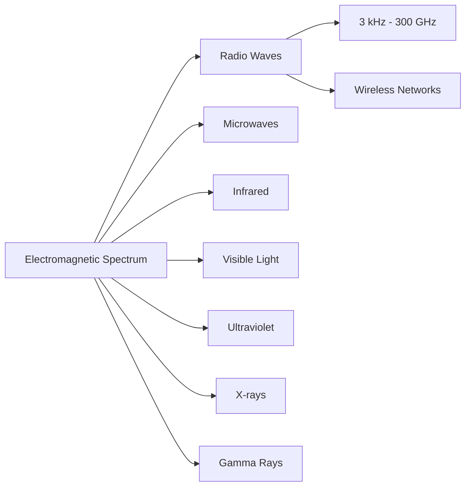
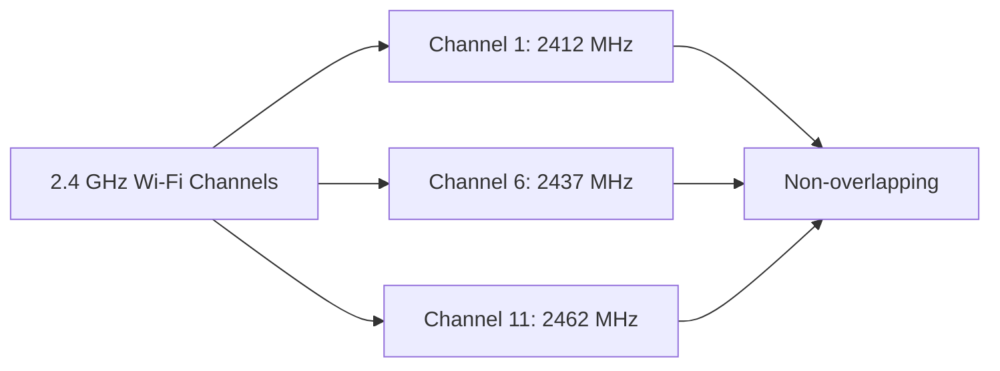
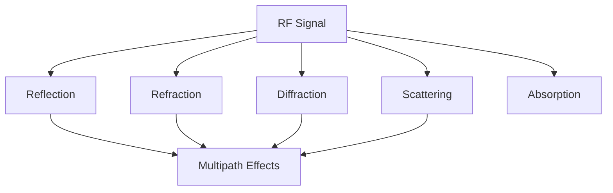

# Networks RF Basics

## Introduction

Radio Frequency (RF) is the foundation of all wireless communication systems, including Wi-Fi, Bluetooth, cellular networks, and more. Understanding RF basics is crucial for anyone working with wireless networks or developing applications that rely on wireless connectivity.

In this guide, we'll explore the fundamental concepts of RF, how signals propagate through space, and the key principles that make wireless networks function. Whether you're planning to set up a wireless network, troubleshoot connectivity issues, or simply understand how your devices communicate wirelessly, these concepts will provide you with the essential knowledge.

## What is Radio Frequency (RF)?

Radio Frequency refers to electromagnetic waves with frequencies ranging from about 3 kHz to 300 GHz. These waves can travel through space without requiring a physical medium, making them ideal for wireless communication.

### The Electromagnetic Spectrum

RF signals are part of the electromagnetic spectrum, which includes various types of radiation with different frequencies and wavelengths.



In wireless networking, we're primarily concerned with specific portions of the RF spectrum:

- **2.4 GHz band**: Used by Wi-Fi (802.11b/g/n/ax), Bluetooth, and many household devices
- **5 GHz band**: Used by Wi-Fi (802.11a/n/ac/ax) for higher bandwidth connections
- **6 GHz band**: Recently opened for Wi-Fi 6E (802.11ax)
- **60 GHz band**: Used for high-speed, short-range connections (802.11ad/ay)

## Key RF Concepts for Networking

### Frequency and Wavelength

Frequency and wavelength are inversely related - higher frequencies have shorter wavelengths. This relationship is defined by the equation:

```
λ = c/f
```

Where:
- λ (lambda) is the wavelength in meters
- c is the speed of light (approximately 3×10^8 meters per second)
- f is the frequency in Hz

For example, a 2.4 GHz signal (2,400,000,000 Hz) has a wavelength of:

```
λ = 3×10^8 / 2.4×10^9 = 0.125 meters or 12.5 centimeters
```

Wavelength is important for determining antenna size and understanding how signals interact with physical objects.

### Power and Signal Strength

RF signal strength is typically measured in:

- **dBm (decibel-milliwatts)**: Absolute power referenced to 1 milliwatt
- **dBi (decibel-isotropic)**: Antenna gain compared to a theoretical isotropic antenna
- **RSSI (Received Signal Strength Indicator)**: A relative measurement of received signal power

For wireless networks, signal strength ranges are often interpreted as:

| Signal Strength (dBm) | Quality         | Typical Use Case                        |
|-----------------------|-----------------|----------------------------------------|
| -30 to -50            | Excellent       | Close to access point, maximum speed    |
| -50 to -60            | Good            | Reliable connections, good speed        |
| -60 to -70            | Fair            | Reliable connections, moderate speed    |
| -70 to -80            | Poor            | Basic connectivity, lower speeds        |
| Below -80             | Very Poor       | Intermittent connectivity, very slow    |

### Channels and Bandwidth

RF spectrum is divided into channels to allow multiple devices to communicate without interference. For example, the 2.4 GHz Wi-Fi band is divided into channels that are 20 MHz wide.

Channel selection is crucial for optimal wireless performance:



In the 2.4 GHz band, channels 1, 6, and 11 are typically used because they don't overlap, reducing interference.

### RF Propagation Models

How RF signals travel through space and interact with the environment is described by various propagation models:

1. **Free Space Path Loss (FSPL)**: Signal loss in an unobstructed path
   - FSPL (dB) = 20log₁₀(d) + 20log₁₀(f) + 32.45
   - Where d is distance in kilometers and f is frequency in MHz

2. **Line of Sight (LOS)**: Direct path between transmitter and receiver

3. **Non-Line of Sight (NLOS)**: Communication when obstacles exist between devices

### RF Signal Behaviors

RF signals interact with the environment in several ways:

1. **Reflection**: Signals bounce off surfaces like walls, floors, and metal objects
2. **Refraction**: Signals bend when passing through different mediums
3. **Diffraction**: Signals bend around obstacles
4. **Scattering**: Signals disperse when hitting irregular surfaces
5. **Absorption**: Materials absorb signal energy, reducing strength



These behaviors can lead to multipath effects, where signals arrive at the receiver from multiple paths with different delays, potentially causing interference.

## Modulation and Encoding

For data to be transmitted over RF, it needs to be encoded onto the carrier signal. This is done through various modulation techniques:

1. **Amplitude Modulation (AM)**: Varies the amplitude of the carrier wave
2. **Frequency Modulation (FM)**: Varies the frequency of the carrier wave
3. **Phase Modulation (PM)**: Varies the phase of the carrier wave
4. **Quadrature Amplitude Modulation (QAM)**: Combines amplitude and phase modulation for higher data rates

Modern Wi-Fi standards use sophisticated modulation schemes:

- **802.11b**: Uses DSSS (Direct Sequence Spread Spectrum) with CCK (Complementary Code Keying)
- **802.11a/g**: Uses OFDM (Orthogonal Frequency Division Multiplexing)
- **802.11n/ac/ax**: Uses MIMO-OFDM (Multiple Input Multiple Output OFDM)

## Antennas and Their Properties

Antennas are critical components in RF systems, converting electrical signals to radio waves and vice versa.

### Types of Antennas

1. **Omnidirectional**: Radiates signal equally in all horizontal directions
   - Ideal for general coverage in homes or offices

2. **Directional**: Focuses signal in a specific direction
   - Yagi, panel, and parabolic antennas
   - Used for point-to-point links or covering specific areas

3. **Sector**: Covers a specific angular sector
   - Common in cellular networks and large-scale Wi-Fi deployments

### Antenna Properties

1. **Gain**: Measure of directional focus, expressed in dBi
   - Higher gain = more focused signal = longer range in a specific direction

2. **Polarization**: Orientation of the electric field in the RF wave
   - Horizontal, vertical, or circular polarization
   - Antennas must have matching polarization for optimal reception

3. **Beamwidth**: Angular width of the radiation pattern
   - Narrower beamwidth = more focused signal = higher gain

## Practical Applications: Wi-Fi Site Survey

One practical application of RF basics is conducting a Wi-Fi site survey to optimize wireless network performance.

### Steps for a Basic Site Survey:

1. **Gather requirements**: Determine coverage needs, number of clients, and throughput requirements

2. **Map the environment**: Create a floor plan and note potential sources of interference and obstacles

3. **Identify optimal AP locations**: Consider coverage, client density, and potential interference

4. **Measure RF characteristics**: Use tools to measure signal strength, noise floor, and interference

5. **Validate design**: Deploy test APs and verify coverage meets requirements

### Tools for RF Analysis:

- **Spectrum analyzers**: Identify RF activity across frequencies
- **Wi-Fi analyzers**: Measure signal strength, SNR, and identify neighboring networks
- **Heat mapping software**: Visualize coverage areas

## Common RF Issues in Wireless Networks

Understanding RF basics helps troubleshoot these common wireless networking issues:

1. **Co-channel interference**: Multiple access points using the same channel
   - Solution: Proper channel planning with non-overlapping channels

2. **Adjacent channel interference**: Nearby channels overlapping
   - Solution: Use widely separated channels (1, 6, 11 in 2.4 GHz)

3. **Hidden node problem**: Clients can see AP but not each other
   - Solution: Enable RTS/CTS mechanism in high-density environments

4. **RF dead zones**: Areas with insufficient signal coverage
   - Solution: Add access points or use directional antennas

5. **Multipath interference**: Signal reflections causing destructive interference
   - Solution: Use MIMO technology, adjust antenna placement

## Real-World Example: Setting Up a Wireless Bridge

Let's walk through setting up a wireless bridge between two buildings, applying RF concepts:

1. **Line of sight assessment**: Check if there's a clear path between locations
   - Use Fresnel zone calculations to ensure clearance:
   ```
   r = 17.3 × √(d/4f)
   ```
   Where r is the radius in meters, d is the distance in kilometers, and f is the frequency in GHz

2. **Link budget calculation**: 
   ```
   Received Power (dBm) = Transmit Power (dBm) + Tx Antenna Gain (dBi) - Path Loss (dB) + Rx Antenna Gain (dBi) - Cable Losses (dB)
   ```

3. **Equipment selection**: Choose directional antennas with appropriate gain
   - Higher gain antennas for longer distances
   - Consider weather-resistant equipment for outdoor installation

4. **Frequency selection**: Choose a less congested band (5 GHz often better than 2.4 GHz)

5. **Alignment**: Precisely align directional antennas for maximum signal strength

## Programming Example: Basic Signal Strength Monitor

Here's a simple Python script using the `scapy` library to monitor Wi-Fi signal strength:

```python
from scapy.all import *
from threading import Thread
import pandas as pd
import time

# Dictionary to store devices
devices = {}

def packet_handler(pkt):
    # Check if packet has a Dot11 layer and is a beacon or probe response
    if pkt.haslayer(Dot11) and pkt.type == 0 and pkt.subtype in [0, 5]:
        if pkt.haslayer(Dot11Beacon) or pkt.haslayer(Dot11ProbeResp):
            # Extract SSID
            if pkt.info:
                ssid = pkt.info.decode('utf-8', errors='replace')
                
                # Get MAC address
                bssid = pkt.addr2
                
                # Get signal strength
                try:
                    signal_strength = -(256-ord(pkt[RadioTap].notdecoded[-4:-3]))
                except:
                    signal_strength = -100
                    
                # Store or update device info
                devices[bssid] = {
                    'SSID': ssid,
                    'Signal': signal_strength,
                    'Last seen': time.time()
                }

# Function to print the device table
def print_devices():
    while True:
        # Clear screen
        os.system('clear' if os.name == 'posix' else 'cls')
        
        # Create a pandas DataFrame
        df = pd.DataFrame.from_dict(devices, orient='index')
        
        # Sort by signal strength
        df = df.sort_values('Signal', ascending=False)
        
        # Print the table
        print("
= Wi-Fi Networks and Signal Strength =")
        print(df)
        
        # Wait before refreshing
        time.sleep(2)

# Start sniffing in a separate thread
sniff_thread = Thread(target=lambda: sniff(iface="wlan0", prn=packet_handler, store=0))
sniff_thread.daemon = True
sniff_thread.start()

# Start the printer thread
print_thread = Thread(target=print_devices)
print_thread.daemon = True
print_thread.start()

# Keep the main thread running
try:
    while True:
        time.sleep(1)
except KeyboardInterrupt:
    print("
Exiting...")
```

Output example:

```
= Wi-Fi Networks and Signal Strength =
                                SSID  Signal     Last seen
00:11:22:33:44:55          HomeWiFi     -45  1646489320.5
AA:BB:CC:DD:EE:FF          GuestNet     -67  1646489319.8
11:22:33:44:55:66        CompanyNet     -72  1646489321.2
```

This script demonstrates:
- How to capture and analyze RF signal strength
- Real-time monitoring of surrounding Wi-Fi networks
- Practical application of RSSI concepts

## Summary

In this guide, we've covered the fundamental RF concepts that form the basis of wireless networking:

- Radio frequency basics and the electromagnetic spectrum
- Frequency, wavelength, and their relationship
- Signal strength measurement and interpretation
- Channel allocation and bandwidth considerations
- RF propagation models and signal behaviors
- Modulation techniques for data transmission
- Antenna types and properties
- Practical applications like site surveys and wireless bridges

Understanding these RF fundamentals is essential for designing, deploying, and troubleshooting wireless networks. As wireless technology continues to evolve with standards like Wi-Fi 6, Wi-Fi 6E, and upcoming Wi-Fi 7, the core RF principles remain the same.

## Further Learning

To deepen your understanding of RF and wireless networks, consider exploring:

1. **RF measurement tools**: Learn to use spectrum analyzers and Wi-Fi analyzers
2. **Antenna design**: Study how different antenna designs affect coverage patterns
3. **Advanced modulation techniques**: Explore how modern Wi-Fi standards achieve higher data rates
4. **Wireless security**: Understand how RF properties impact security considerations
5. **IoT wireless protocols**: Examine how protocols like Zigbee, Z-Wave, and LoRaWAN use RF principles

The concepts you've learned here provide a solid foundation for more advanced wireless networking topics and will help you make informed decisions when designing and troubleshooting wireless systems.