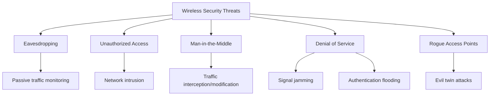
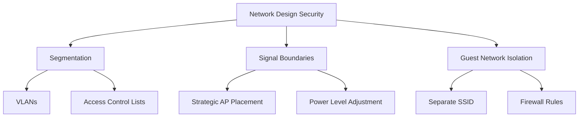

# Networks Wireless Security

## Introduction

Wireless networks have become an essential part of our digital infrastructure, allowing us to connect devices without physical cables. However, this convenience comes with significant security challenges. Unlike wired networks, wireless signals propagate through the air, potentially reaching unintended recipients beyond physical boundaries. This makes wireless networks inherently more vulnerable to various security threats.

In this guide, we'll explore the fundamentals of wireless network security, common vulnerabilities, and how to implement effective security measures to protect your wireless networks from unauthorized access and attacks.

## Wireless Network Security Fundamentals

### Why Wireless Networks Are Vulnerable

Wireless networks face unique security challenges compared to wired networks:

1. **Signal Propagation**: Radio waves can extend beyond intended boundaries (like walls)
2. **Passive Interception**: Attackers can capture data without detection
3. **Open Medium**: Anyone within range can attempt to connect
4. **Resource Constraints**: Many wireless devices have limited computing power for security
5. **Backward Compatibility**: Supporting older devices may require weaker security protocols

### Common Wireless Security Threats



Let's examine each of these threats:

#### 1. Eavesdropping (Passive Attacks)

An attacker can use specialized tools to capture and analyze wireless traffic without directly interacting with the network.

```javascript
// Example of how simple it can be (using a packet capturing library)
const capture = require('wireless-packet-capture');

// Start capturing packets on a specific channel
capture.start({
  interface: 'wlan0',
  channel: 6,
  promiscuous: true
});

// Process and filter for interesting data
capture.on('packet', (packet) => {
  if (packet.contains('password') || packet.contains('username')) {
    console.log('Potential credential found:', packet.data);
  }
});
```

#### 2. Unauthorized Access

Attackers attempt to bypass authentication mechanisms to gain access to the network.

#### 3. Man-in-the-Middle (MitM) Attacks

An attacker positions themselves between legitimate devices, intercepting and potentially modifying communications.

#### 4. Denial of Service (DoS)

Attackers overwhelm network resources by flooding it with traffic or exploiting protocol vulnerabilities.

#### 5. Rogue Access Points

Unauthorized access points that mimic legitimate networks to trick users into connecting.

## Wireless Security Protocols and Standards

Wireless security has evolved through several generations of protocols:

### WEP (Wired Equivalent Privacy)

The original 802.11 security standard, now considered completely broken.

**Key weaknesses**:
- Static encryption keys
- Weak RC4 cipher implementation
- Short 24-bit Initialization Vector (IV)
- No proper authentication mechanism

### WPA (Wi-Fi Protected Access)

An interim solution that improved upon WEP.

**Improvements**:
- TKIP (Temporal Key Integrity Protocol)
- Message Integrity Check (MIC)
- Dynamic key generation

### WPA2 (Wi-Fi Protected Access 2)

The long-standing security standard that replaced WPA.

**Key features**:
- AES (Advanced Encryption Standard)
- CCMP (Counter Mode with Cipher Block Chaining Message Authentication Code Protocol)
- Stronger authentication with 802.1X/EAP

```javascript
// Example configuration for WPA2-Enterprise in a network setup script
const networkConfig = {
  ssid: 'SecureNetwork',
  security: 'WPA2-Enterprise',
  encryption: 'AES',
  authentication: {
    type: 'EAP-TLS',
    identity: 'user@domain.com',
    certificatePath: '/path/to/client.crt',
    privateKeyPath: '/path/to/client.key',
    caCertPath: '/path/to/ca.crt'
  }
};

connectToNetwork(networkConfig);
```

### WPA3 (Wi-Fi Protected Access 3)

The latest security standard with significantly improved security.

**Key improvements**:
- SAE (Simultaneous Authentication of Equals) replaces PSK
- Forward secrecy
- Protected Management Frames
- 192-bit security option for enterprise
- Enhanced protection against brute-force attacks

## Implementing Wireless Security Best Practices

### 1. Secure Authentication

#### Password-Based Authentication

```javascript
// Example of a strong password policy function
function evaluatePasswordStrength(password) {
  const minLength = 12;
  const hasUppercase = /[A-Z]/.test(password);
  const hasLowercase = /[a-z]/.test(password);
  const hasNumbers = /[0-9]/.test(password);
  const hasSpecialChars = /[!@#$%^&*()_+\-=\[\]{};':"\\|,.<>\/?]/.test(password);
  
  let strength = 0;
  
  if (password.length >= minLength) strength += 25;
  if (hasUppercase) strength += 25;
  if (hasLowercase) strength += 15;
  if (hasNumbers) strength += 15;
  if (hasSpecialChars) strength += 20;
  
  return {
    score: strength,
    feedback: strength < 70 ? 'Password is too weak' : 'Password is strong'
  };
}

// Use for validating network passwords
const passphrase = 'SimplePassword123';
const result = evaluatePasswordStrength(passphrase);
console.log(result.feedback); // "Password is too weak"
```

#### Certificate-Based Authentication

For enterprise networks, certificate-based authentication provides stronger security than passwords alone.

### 2. Encryption

Always use the strongest available encryption for wireless data:

- Prefer WPA3 when available
- Use WPA2 with AES (not TKIP) if WPA3 is not an option
- Never use WEP or WPA with TKIP for new deployments

### 3. Network Design Best Practices



#### Network Segmentation

Separate sensitive network resources from general-purpose and guest networks.

```javascript
// Example configuration for network segmentation
const networkSegments = [
  {
    name: 'Management',
    vlan: 10,
    subnet: '10.10.10.0/24',
    access: 'restricted',
    devices: ['servers', 'admin-workstations']
  },
  {
    name: 'Employee',
    vlan: 20,
    subnet: '10.20.20.0/24',
    access: 'standard',
    devices: ['workstations', 'phones', 'printers']
  },
  {
    name: 'Guest',
    vlan: 30,
    subnet: '10.30.30.0/24',
    access: 'internet-only',
    devices: ['guest-devices']
  },
  {
    name: 'IoT',
    vlan: 40,
    subnet: '10.40.40.0/24',
    access: 'limited',
    devices: ['cameras', 'sensors', 'smart-devices']
  }
];

// Apply firewall rules between segments
applySegmentationRules(networkSegments);
```

#### Signal Boundary Control

Adjust access point placement and signal strength to minimize leakage outside your physical boundaries.

#### Guest Network Isolation

Configure guest networks with:
- No access to internal resources
- Rate limiting and bandwidth controls
- Captive portal for authentication
- Automatic session timeouts

### 4. Wireless Intrusion Detection and Prevention

Implementing a Wireless Intrusion Detection System (WIDS) or Wireless Intrusion Prevention System (WIPS) can help identify and respond to attacks.

```javascript
// Simplified WIDS alert logic
function detectWirelessAnomaly(networkEvents) {
  const thresholds = {
    authFailures: 5,
    deauthFrames: 10,
    unknownDevices: 3,
    signalStrengthDrop: 20
  };
  
  const alerts = [];
  
  // Check for authentication brute force
  if (networkEvents.authFailures > thresholds.authFailures) {
    alerts.push({
      severity: 'high',
      type: 'brute_force',
      details: `Detected ${networkEvents.authFailures} failed authentication attempts`
    });
  }
  
  // Check for deauthentication attacks
  if (networkEvents.deauthFrames > thresholds.deauthFrames) {
    alerts.push({
      severity: 'critical',
      type: 'deauth_attack',
      details: `Detected unusual deauthentication frames (${networkEvents.deauthFrames})`
    });
  }
  
  return alerts;
}

// Usage
const events = monitorNetwork('wlan0');
const securityAlerts = detectWirelessAnomaly(events);

if (securityAlerts.length > 0) {
  notifySecurityTeam(securityAlerts);
  
  // Automated response for critical alerts
  securityAlerts.forEach(alert => {
    if (alert.severity === 'critical') {
      initiateAutomatedResponse(alert);
    }
  });
}
```

## Practical Example: Securing a Small Business Wireless Network

Let's walk through setting up a secure wireless network for a small business:

### Step 1: Planning the Network

- **Inventory**: Identify all devices that will connect
- **Requirements**: Determine access needs
- **Physical review**: Map office layout for optimal coverage

### Step 2: Secure Access Point Configuration

1. Change default admin credentials
2. Update firmware
3. Configure WPA3 or WPA2-Enterprise security
4. Create separate networks for:
   - Employee devices
   - Guest access
   - IoT/operational devices

### Step 3: Implement Authentication

For a small business:
- RADIUS server for employee authentication
- Certificate-based authentication for critical systems
- Captive portal for guest access

### Step 4: Configure Network Monitoring

```javascript
// Example monitoring setup pseudocode
function setupNetworkMonitoring(network) {
  // Configure monitoring for multiple aspects
  const monitoring = {
    traffic: {
      interval: '5m',
      thresholds: {
        unusualVolume: '50%',
        unexpectedHosts: true
      }
    },
    authentication: {
      loginAttempts: {
        failureThreshold: 5,
        timeWindow: '15m'
      },
      unusualTimes: true
    },
    radioSpectrum: {
      scanInterval: '10m',
      detectRogueAPs: true,
      detectInterference: true
    }
  };
  
  // Start monitoring services
  const monitoringService = new NetworkMonitoring(network, monitoring);
  monitoringService.start();
  
  // Configure alerts
  monitoringService.on('alert', (alert) => {
    if (alert.priority === 'high') {
      sendSmsAlert(alert);
      sendEmailAlert(alert);
    } else {
      logAlert(alert);
      sendEmailDigest(alert);
    }
  });
  
  return monitoringService;
}

// Implementation
const businessNetwork = {
  name: 'AcmeCorp',
  accessPoints: ['ap-floor1', 'ap-floor2'],
  securityLevel: 'business'
};

const monitor = setupNetworkMonitoring(businessNetwork);
```

### Step 5: Create Security Policies

Document clear policies for:
- Password requirements
- Device onboarding procedures
- Guest access procedures
- Regular security assessment schedule
- Incident response plan

## Security Assessment Tools

Several tools are available to evaluate wireless network security:

### Wireless Network Scanners

Tools like Kismet, Wireshark, and Aircrack-ng can help identify vulnerabilities.

```bash
# Example of scanning for nearby wireless networks
sudo airodump-ng wlan0

# Example of capturing handshakes for security testing
sudo airodump-ng -c 1 --bssid 00:11:22:33:44:55 -w capture wlan0
```

### Vulnerability Assessment

Regular testing should include:
- Password strength audits
- Rogue access point detection
- Physical security assessment
- Security protocol verification

## Summary

Wireless network security is a critical aspect of modern networking that requires a comprehensive approach:

1. **Use strong protocols**: Implement WPA3 or WPA2-Enterprise with AES encryption
2. **Authentication matters**: Strong passwords, certificate-based authentication, and MFA
3. **Network design**: Segment networks, control signal boundaries, isolate guest access
4. **Monitoring and response**: Implement WIDS/WIPS and have response procedures ready
5. **Regular assessment**: Continuously evaluate and improve security measures

By implementing these practices, you can significantly reduce the risk of security breaches in your wireless networks while maintaining the convenience and flexibility that wireless connectivity provides.

## Additional Resources

- Wi-Fi Alliance Security Certification Programs
- IEEE 802.11 Standards
- NIST Special Publication 800-153: Guidelines for Securing Wireless Local Area Networks
- OWASP Wireless Security Testing Guide

## Exercises

1. **Security Audit Exercise**: Perform a basic security audit of your home or office wireless network. Identify potential vulnerabilities and create an improvement plan.

2. **Protocol Analysis**: Compare the security features of WPA2 and WPA3. What specific improvements does WPA3 offer over WPA2?

3. **Network Segmentation Planning**: Design a wireless network segmentation strategy for a small business with employee, guest, and IoT devices.

4. **Password Security**: Create a password policy for wireless networks that balances security with usability.

5. **Threat Response**: Develop a basic incident response plan for common wireless network attacks.