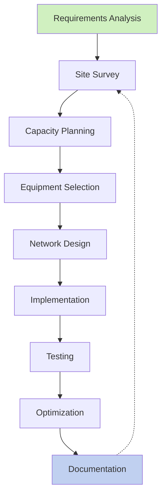
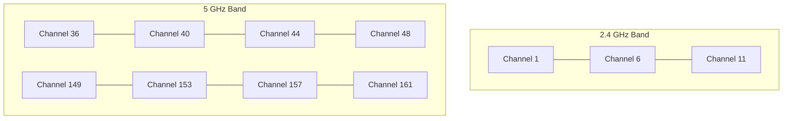
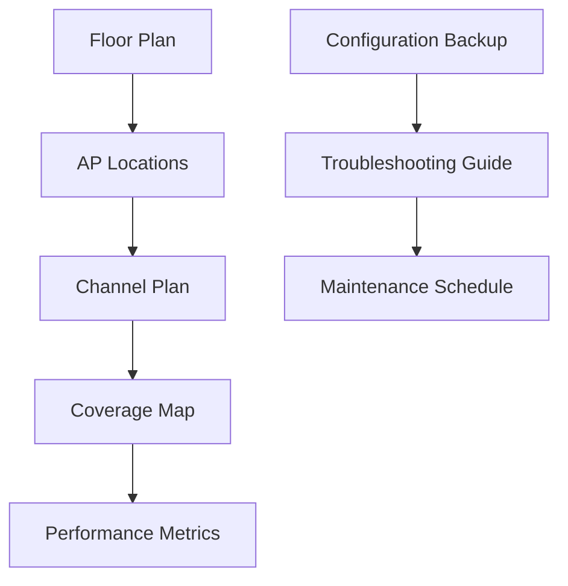

# Networks Wireless Planning

## Introduction

Wireless network planning is the process of designing, implementing, and optimizing wireless networks to ensure reliable connectivity, adequate coverage, and sufficient capacity. For programmers working with network applications or IoT devices, understanding how wireless networks are planned and deployed provides critical context for developing robust applications.

In this guide, we'll explore the fundamentals of wireless network planning, from initial site surveys to performance optimization. Whether you're setting up a home network, configuring a small office, or just wanting to understand how wireless networks function at scale, these principles will help you build more effective wireless solutions.

## The Wireless Network Planning Process

Wireless network planning follows a structured approach that includes several key phases:



Let's explore each of these phases in detail.

## Requirements Analysis

Before planning a wireless network, you need to understand the specific requirements it must fulfill:

- **Coverage area**: Where do users need wireless access?
- **User density**: How many users will connect simultaneously in different areas?
- **Application needs**: What will users be doing (browsing, streaming, VoIP, etc.)?
- **Security requirements**: What level of security is needed?
- **Budget constraints**: What resources are available for the network?

**Example Requirements Document:**

```
# Wireless Network Requirements
- Coverage: 3-floor office building (30,000 sq ft total)
- Users: 150 employees + 50 guests (maximum)
- Applications: Web browsing, email, video conferencing, CRM software
- Security: WPA3-Enterprise with RADIUS authentication
- Special areas: Conference rooms need higher capacity (25 users)
- Budget: $25,000 for equipment and installation
```

## Site Survey

A site survey is a critical step in wireless planning where you analyze the physical environment to identify:

1. **Physical obstacles**: Walls, windows, doors, furniture that affect signal
2. **Sources of interference**: Other wireless networks, microwave ovens, Bluetooth devices
3. **Coverage requirements**: Where users need connectivity
4. **Existing infrastructure**: Cable pathways, power sources, mounting locations

### Types of Site Surveys

#### 1. Preliminary Survey

This involves reviewing floor plans and walking through the site to identify obvious challenges.

#### 2. Passive Survey

Conducted by walking through the area with specialized tools to measure existing RF (Radio Frequency) signals:

```javascript
// Example of processing passive survey data with JavaScript
function analyzeSignalStrength(readings) {
  const averageSignal = readings.reduce((sum, reading) => sum + reading.rssi, 0) / readings.length;
  const interferingSources = readings.filter(reading => reading.ssid !== "OurNetwork" && reading.rssi > -70);
  
  return {
    averageSignal,
    interferenceLevel: interferingSources.length > 5 ? "High" : "Low",
    recommendedChannels: findClearChannels(readings)
  };
}

function findClearChannels(readings) {
  // Logic to identify least congested channels
  // Returns array of recommended channels
}
```

#### 3. Active Survey

Involves temporarily setting up access points and measuring actual performance:

```python
# Example Python script to process active survey results
def calculate_coverage_quality(signal_readings):
    coverage_map = {}
    for reading in signal_readings:
        location = reading["location"]
        signal = reading["signal_strength"]
        noise = reading["noise_floor"]
        snr = signal - noise  # Signal-to-Noise Ratio
        
        if snr > 25:
            quality = "Excellent"
        elif snr > 20:
            quality = "Good"
        elif snr > 15:
            quality = "Fair"
        else:
            quality = "Poor"
            
        coverage_map[location] = quality
    
    return coverage_map
```

#### 4. Predictive Survey

Uses specialized software to simulate wireless coverage based on floor plans and building materials:

```python
# Example of how predictive survey tools might calculate attenuation
def calculate_signal_attenuation(distance, obstacles):
    # Free space path loss calculation
    path_loss = 20 * math.log10(distance) + 20 * math.log10(frequency) - 27.55
    
    # Add attenuation from obstacles
    total_attenuation = path_loss
    for obstacle in obstacles:
        if obstacle == "concrete_wall":
            total_attenuation += 12  # dB
        elif obstacle == "glass_window":
            total_attenuation += 3   # dB
        elif obstacle == "wooden_door":
            total_attenuation += 4   # dB
    
    return total_attenuation
```

## Capacity Planning

Capacity planning ensures your network can handle the expected load:

### Bandwidth Requirements

Calculate the bandwidth required for different areas based on:

1. Number of users
2. Types of applications
3. Concurrent usage patterns

```javascript
// Example function to estimate bandwidth requirements
function estimateBandwidth(users, applications) {
  let totalBandwidth = 0;
  
  // Calculate per-user bandwidth needs based on applications
  users.forEach(user => {
    if (user.usesVideoConferencing) totalBandwidth += 2.5; // 2.5 Mbps
    if (user.usesCloudApps) totalBandwidth += 1.0; // 1 Mbps
    if (user.streamsMedia) totalBandwidth += 5.0; // 5 Mbps
    // Basic web browsing/email
    totalBandwidth += 0.5; // 0.5 Mbps baseline
  });
  
  // Apply concurrent usage factor (not everyone uses maximum bandwidth simultaneously)
  const concurrentFactor = 0.6; // 60% concurrent usage
  
  return totalBandwidth * concurrentFactor;
}
```

### Access Point Capacity

Each access point has limits on:

1. **Maximum client connections**: Typically 25-50 clients per AP for optimal performance
2. **Maximum throughput**: Varies by standard (802.11ac, 802.11ax, etc.)

**Sample Calculation:**

```
For a conference room with 25 users:
- Average bandwidth per user: 2 Mbps
- Total required bandwidth: 50 Mbps
- Selected AP capacity: 867 Mbps (802.11ac Wave 2)
- Effective capacity (accounting for overhead): ~400 Mbps
- Result: One AP should handle the load with headroom for peak usage
```

## Equipment Selection

Selecting the right equipment involves evaluating:

### Access Points

- **Standards**: 802.11n, 802.11ac, 802.11ax (Wi-Fi 6)
- **Radio bands**: 2.4 GHz, 5 GHz, 6 GHz
- **MIMO capabilities**: Multiple-Input, Multiple-Output antennas
- **Power options**: PoE (Power over Ethernet), DC power
- **Management features**: Standalone vs. controller-based

### Wireless Controllers

For larger deployments, wireless controllers provide centralized management:

```javascript
// Example of a controller configuration script
const controllerConfig = {
  managementVLAN: 10,
  apGroups: [
    {
      name: "Office-Standard",
      ssids: ["Corporate", "Guest"],
      radioSettings: {
        channel: "auto",
        txPower: "auto",
        channelWidth: "40MHz"
      }
    },
    {
      name: "Conference-Rooms",
      ssids: ["Corporate", "Guest", "Presentation"],
      radioSettings: {
        channel: "auto",
        txPower: "high",
        channelWidth: "80MHz"
      }
    }
  ]
};
```

### Antennas

Different antenna types serve different purposes:

1. **Omnidirectional**: Broadcasts in all directions
2. **Directional**: Focuses signal in specific directions
3. **Ceiling-mounted**: For open office spaces
4. **Wall-mounted**: For hallways and corridors

## Network Design

With survey data and equipment selected, create a detailed network design:

### Access Point Placement

Best practices for AP placement include:

- **Height**: Mount APs 10-15 feet high when possible
- **Spacing**: Maintain appropriate distance between APs (typically 30-50 feet)
- **Overlap**: Ensure 20-30% signal overlap for roaming
- **Obstacles**: Account for walls and other signal barriers

### Channel Planning

To minimize interference, plan channel allocation carefully:



**Channel Planning Example:**

```python
# Simplified channel planning algorithm
def assign_channels(access_points):
    # For 2.4 GHz
    available_24ghz_channels = [1, 6, 11]
    # For 5 GHz (simplified list)
    available_5ghz_channels = [36, 40, 44, 48, 149, 153, 157, 161]
    
    for idx, ap in enumerate(access_points):
        # Assign 2.4 GHz channel
        ap.channel_24ghz = available_24ghz_channels[idx % len(available_24ghz_channels)]
        
        # Assign 5 GHz channel
        ap.channel_5ghz = available_5ghz_channels[idx % len(available_5ghz_channels)]
    
    # Check for adjacent AP interference and adjust as needed
    optimize_channel_assignments(access_points)
    
    return access_points
```

### SSID and Security Planning

Decide on network names and security settings:

```javascript
// Example SSID configuration
const networkConfiguration = [
  {
    ssid: "CorporateNet",
    security: "WPA3-Enterprise",
    vlan: 10,
    qos: "high",
    authentication: "RADIUS",
    radiusServer: "192.168.1.100"
  },
  {
    ssid: "GuestNet",
    security: "WPA3-Personal",
    vlan: 20,
    qos: "low",
    captivePortal: true,
    bandwidthLimit: "5Mbps"
  }
];
```

## Implementation

During implementation, follow these steps:

1. **Install physical infrastructure**: Mount APs, run cables
2. **Configure network settings**: Set up SSIDs, security, VLANs
3. **Integrate with existing systems**: Connect to authentication servers
4. **Document the installation**: Record AP locations, configurations

**Implementation Checklist:**

```
□ Verify power availability at AP locations
□ Install mounting brackets
□ Run Ethernet cables to each AP
□ Label all cables
□ Mount access points
□ Connect APs to network switches
□ Configure wireless controller
□ Set up SSIDs and security profiles
□ Configure advanced features (band steering, airtime fairness)
□ Verify connectivity
```

## Testing and Validation

After implementation, thoroughly test the network:

### Coverage Testing

Verify signal strength throughout the coverage area:

```python
# Example of processing coverage test results
def evaluate_coverage(test_points):
    problem_areas = []
    
    for point in test_points:
        if point["signal_strength"] < -70:  # dBm
            problem_areas.append({
                "location": point["location"],
                "signal": point["signal_strength"],
                "recommended_action": "Consider additional AP"
            })
    
    coverage_score = (len(test_points) - len(problem_areas)) / len(test_points) * 100
    
    return {
        "coverage_score": coverage_score,
        "problem_areas": problem_areas
    }
```

### Performance Testing

Test actual throughput and response times:

```bash
# Example commands for network performance testing
$ iperf3 -c server_ip -t 30  # Test throughput for 30 seconds
$ ping -c 100 server_ip      # Test latency with 100 pings
$ wget http://test-file.com/100mb.test  # Test download speed
```

### Client Device Testing

Test with various devices (laptops, phones, tablets) to ensure compatibility.

## Optimization

Based on testing, optimize the network:

1. **Adjust AP placement** if coverage gaps are found
2. **Fine-tune power levels** to balance coverage
3. **Reconfigure channels** if interference is detected
4. **Update QoS settings** to prioritize critical applications

```javascript
// Example optimization script
function optimizeNetwork(testResults) {
  const recommendations = [];
  
  // Check for coverage issues
  testResults.coverageTests.forEach(test => {
    if (test.signalStrength < -70) {
      recommendations.push({
        type: "coverage",
        location: test.location,
        action: "Increase AP power or add additional AP"
      });
    }
  });
  
  // Check for interference issues
  testResults.interferenceTests.forEach(test => {
    if (test.interferenceLevel > 20) {
      recommendations.push({
        type: "interference",
        location: test.location,
        action: "Change channel or adjust neighboring AP power"
      });
    }
  });
  
  return recommendations;
}
```

## Documentation

Maintain comprehensive documentation of your wireless network:

1. **Network diagrams** showing AP locations
2. **Configuration details** for all equipment
3. **Test results** showing coverage and performance
4. **Maintenance procedures** for ongoing operations



## Real-World Example: Office Wireless Deployment

Let's walk through a complete example of planning a wireless network for a small office:

### Requirements:
- 2,500 sq. ft office space
- 25 employees with laptops, smartphones
- 5 IoT devices (printers, smart displays)
- Video conferencing in conference room
- Regular web browsing and cloud applications
- Guest network for visitors

### Site Survey Results:
- Concrete walls between major sections
- Glass conference room
- Open office area in center
- Existing network closet with switch

### Capacity Planning:
- Average bandwidth per user: 2 Mbps
- Peak bandwidth (video conferencing): 10 Mbps
- Total required bandwidth: ~75 Mbps

### Equipment Selection:
- 3 × 802.11ax Access Points
- PoE+ Switch (existing)
- Cloud-based management

### Network Design:
- AP1: Open office area (center ceiling)
- AP2: Conference room (ceiling)
- AP3: Secondary work area (wall-mounted)
- SSID1: "OfficeNet" (WPA3-Enterprise)
- SSID2: "OfficeGuest" (WPA3-Personal with captive portal)

### Implementation:
- Run Cat6 cables to AP locations
- Mount and connect APs
- Configure SSIDs and security settings
- Set up cloud management

### Testing:
- Verify minimum -65dBm signal throughout office
- Confirm roaming works between APs
- Test video conferencing quality
- Verify guest isolation

### Optimization:
- Increase AP2 power for better conference room coverage
- Adjust band steering to prefer 5GHz where possible
- Set QoS to prioritize video conferencing traffic

## Best Practices for Wireless Planning

1. **Plan for growth**: Design with 30% extra capacity for future expansion
2. **Conduct regular surveys**: Environments change over time
3. **Segment traffic**: Use VLANs and multiple SSIDs
4. **Document everything**: Maintain detailed records
5. **Consider environmental factors**: Weather, seasonal changes, and building occupancy
6. **Follow security best practices**: Use the latest encryption, change default credentials
7. **Test with real devices**: The devices your users will actually use
8. **Monitor and maintain**: Set up monitoring and regular maintenance

## Troubleshooting Common Wireless Issues

| Issue | Possible Causes | Solutions |
|-------|----------------|-----------|
| Dead spots | Physical obstacles, insufficient APs | Add APs, relocate existing APs |
| Slow performance | Interference, outdated equipment | Change channels, upgrade equipment |
| Intermittent connection | Interference, power issues | Check power source, adjust channels |
| Authentication failures | Security misconfiguration | Verify RADIUS server, check credentials |
| Roaming issues | Insufficient signal overlap | Adjust AP placement, check roaming settings |

## Summary

Wireless network planning is both an art and a science that requires understanding RF principles, user requirements, and network technologies. A properly planned wireless network will provide reliable connectivity, sufficient capacity, and secure communications for all users.

By following the structured approach outlined in this guide—from requirements analysis through optimization—you can build wireless networks that meet current needs and adapt to future requirements.

## Additional Resources

- **Learn More About RF Principles**
  - Explore how radio waves propagate and interact with different materials
  
- **Tools for Network Planning**
  - NetSpot
  - Ekahau Site Survey
  - WiFi Analyzer (mobile apps)

## Exercises

1. **Beginner Exercise**: Create a simple wireless plan for your home, identifying potential interference sources and optimal AP placement.

2. **Intermediate Exercise**: Design a wireless network for a small office (10-15 users) with separate networks for staff and guests.

3. **Advanced Exercise**: Plan a multi-floor wireless deployment with roaming capabilities and integrated authentication.

4. **Programming Exercise**: Write a script that takes signal strength readings from different locations and generates a basic heatmap.

5. **Critical Thinking Exercise**: Analyze a wireless network plan and identify potential weaknesses or improvements.