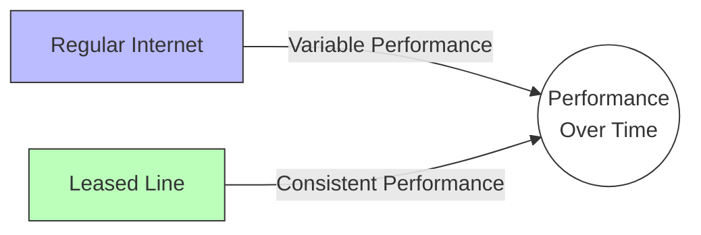
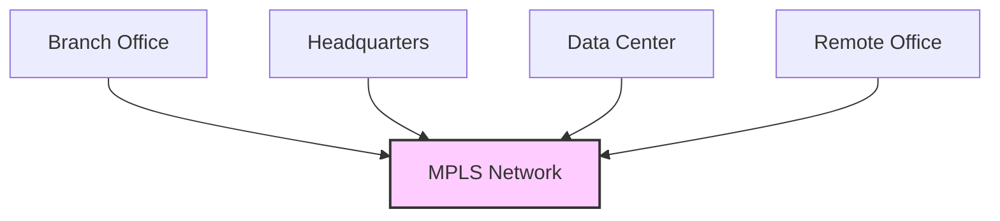

# Networks Leased Lines

## Introduction

Leased lines represent one of the core technologies used in Wide Area Networks (WANs) to connect geographically dispersed locations. Unlike regular internet connections that share bandwidth with other users, leased lines provide dedicated, private connectivity between two points. This dedicated nature makes them particularly valuable for businesses and organizations that require consistent, reliable, and secure network communications.

In this guide, we'll explore what leased lines are, how they work, their advantages and disadvantages, and how they fit into the broader landscape of WAN technologies.

## What Are Leased Lines?

A leased line is a private telecommunications circuit between two or more locations provided by a telecommunications carrier. Unlike typical connections where bandwidth is shared among multiple users, leased lines offer:

- **Dedicated bandwidth** that isn't shared with other customers
- **Symmetric speeds** with identical upload and download rates
- **Fixed monthly cost** regardless of usage (hence "leased")
- **Point-to-point connectivity** between specific locations

## How Leased Lines Work

Leased lines establish a permanent, dedicated connection between locations using various technologies depending on the required bandwidth, distance, and service provider capabilities.

### Technical Implementation

```mermaid
graph LR
    A[Location A] -- Dedicated Circuit --> B[Location B]
    A -- No Public Internet -- B
    style A fill:#f9f,stroke:#333,stroke-width:2px
    style B fill:#f9f,stroke:#333,stroke-width:2px
```

The fundamental characteristics of a leased line implementation include:

1. **Customer Premises Equipment (CPE)** - Specialized routers or switches at each end point
2. **Local Loop** - The physical connection from the customer site to the provider's network
3. **Provider Network** - Carrier infrastructure that maintains the dedicated circuit
4. **Service Level Agreement (SLA)** - Contractual guarantees for uptime, latency, and performance

### Types of Leased Line Technologies

Leased lines can be implemented using various technologies:

| Technology | Typical Speeds | Common Use Cases |
|------------|----------------|------------------|
| T1/E1 | 1.544/2.048 Mbps | Traditional voice and data |
| T3/E3 | 44.736/34.368 Mbps | Medium enterprise connectivity |
| OC-3 | 155 Mbps | Large enterprise backbone |
| OC-12 | 622 Mbps | Data center connectivity |
| Metro Ethernet | 10 Mbps - 100 Gbps | Modern enterprise WANs |
| SONET/SDH | Various rates | Carrier backbone |

## Configuration Basics

Setting up a leased line typically requires configuration on the CPE devices. Here's a simplified example of configuring a router interface for a T1 leased line:

```
! Basic T1 leased line interface configuration
interface Serial0/0
 description T1 Leased Line to Branch Office
 ip address 192.168.1.1 255.255.255.252
 bandwidth 1544
 clock rate 1544000
 encapsulation hdlc
 service-module t1 timeslots 1-24
 no shutdown
```

The counterpart router at the remote location would have a similar configuration with a matching subnet:

```
interface Serial0/0
 description T1 Leased Line to Headquarters
 ip address 192.168.1.2 255.255.255.252
 bandwidth 1544
 encapsulation hdlc
 no shutdown
```

## Advantages of Leased Lines

### 1. Guaranteed Bandwidth

Unlike shared connections, leased lines provide a fixed amount of bandwidth that is always available to the customer. This makes them ideal for applications sensitive to bandwidth constraints.

### 2. Consistent Performance



Leased lines offer predictable latency and jitter metrics, which is crucial for real-time applications like:
- VoIP telephony
- Video conferencing
- Financial transactions
- Critical business applications

### 3. Enhanced Security

Since leased lines don't traverse the public internet, they provide an inherently more secure connection:
- Data doesn't mix with public internet traffic
- Reduced exposure to common internet-based attacks
- Physical security through dedicated infrastructure

### 4. Symmetric Bandwidth

Upload and download speeds are identical, making leased lines perfect for:
- Hosting servers accessible from remote locations
- Cloud service providers
- Data center interconnects
- Backup and replication services

## Disadvantages of Leased Lines

### 1. Cost

Leased lines are typically much more expensive than regular internet connections due to their dedicated nature. Costs scale with:
- Bandwidth requirements
- Distance between locations
- Geographic availability
- Service level agreements

### 2. Geographic Limitations

Not all locations can be serviced by leased lines due to infrastructure requirements. Rural or remote locations may have limited options or significantly higher costs.

### 3. Deployment Time

Setting up a leased line often takes weeks or months due to:
- Physical infrastructure requirements
- Permitting and right-of-way considerations
- Provider scheduling and implementation

## Real-World Applications

### Case Study 1: Financial Institution

A bank with multiple branches uses leased lines to connect its locations to ensure:
- Secure transfer of sensitive financial data
- Reliable connectivity for transaction processing
- Consistent performance for customer-facing applications
- Compliance with financial regulations

### Case Study 2: Healthcare Provider

A hospital network implements leased lines to:
- Enable real-time access to electronic health records across facilities
- Support telemedicine services with guaranteed quality
- Ensure HIPAA compliance through private data transmission
- Provide reliable connectivity for critical care systems

### Case Study 3: Retail Chain

A retail business uses leased lines to connect stores to headquarters for:
- Real-time inventory management
- Point-of-sale system integration
- Consistent customer experience across locations
- Reliable credit card processing

## Modern Alternatives and Evolutions

While traditional leased lines remain important, several modern alternatives have emerged:

### MPLS (Multiprotocol Label Switching)

MPLS offers similar dedicated performance with greater flexibility:



MPLS allows for:
- Multiple sites to connect in a mesh topology
- Quality of Service (QoS) guarantees for different traffic types
- Simplified routing between multiple locations

### SD-WAN (Software-Defined WAN)

SD-WAN represents the next evolution, allowing organizations to:
- Combine multiple connection types (including leased lines)
- Dynamically route traffic based on application requirements
- Centrally manage WAN connections through software
- Reduce dependency on expensive dedicated circuits

## Implementation Considerations

When considering a leased line implementation, evaluate:

1. **Bandwidth Requirements**
   - Current and future needs
   - Peak usage patterns
   - Critical application requirements

2. **Reliability Needs**
   - Required uptime percentages
   - Backup connection options
   - Business impact of outages

3. **Budget Constraints**
   - Initial installation costs
   - Ongoing monthly fees
   - Equipment requirements

4. **Service Level Agreements**
   - Guaranteed uptime
   - Mean time to repair
   - Performance metrics

## Summary

Leased lines provide dedicated, private connectivity between locations with guaranteed bandwidth, consistent performance, and enhanced security. While more expensive than shared connections, they offer critical advantages for businesses with specific requirements for reliability, security, and performance.

As networking technologies evolve, traditional leased lines continue to play an important role, especially in hybrid architectures that combine dedicated circuits with newer software-defined approaches.

## Additional Resources

To further your understanding of leased lines and WAN technologies:

- Study the various physical media used for leased lines (fiber, copper, microwave)
- Learn about the OSI model layers relevant to leased line implementation
- Explore the evolution from leased lines to MPLS and SD-WAN
- Practice configuring router interfaces for different types of leased connections

## Practice Exercises

1. Compare the monthly cost of a 100Mbps leased line with a regular business internet connection of similar speed. What factors account for the difference?

2. Design a network topology for a company with a headquarters and three branch offices using leased lines. Consider redundancy and cost optimization.

3. Research how leased line requirements might differ across industries such as healthcare, finance, and education.

4. Configure a simulated leased line connection between two routers in a lab environment, establishing appropriate IP addressing and routing.

5. Evaluate when a traditional leased line might be preferred over newer technologies like SD-WAN, and vice versa.