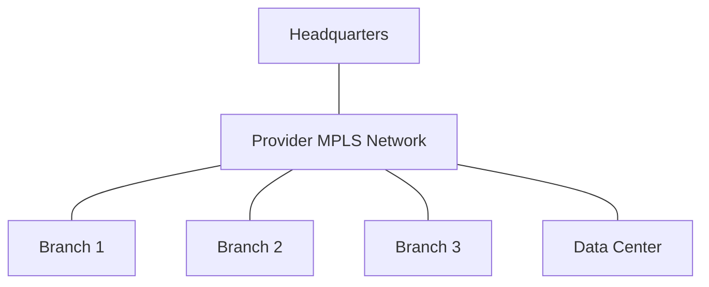
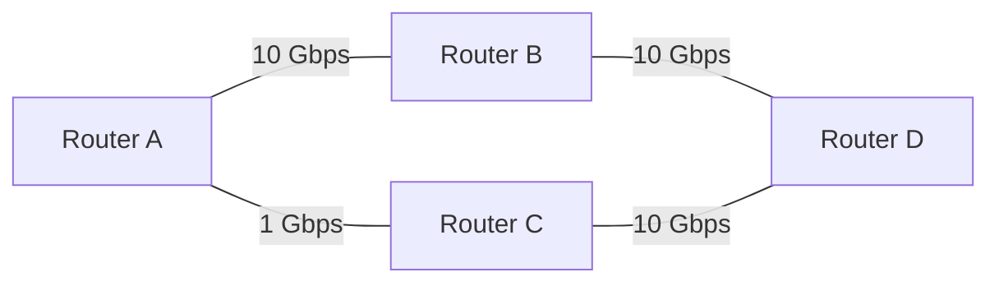

# Multiprotocol Label Switching (MPLS)

## Introduction

Multiprotocol Label Switching (MPLS) is a routing technique in telecommunications networks that directs data from one network node to the next based on short path labels rather than long network addresses. This avoids complex lookups in routing tables and significantly speeds up packet forwarding. First standardized in 1997, MPLS has become a fundamental building block of modern Wide Area Networks (WANs) due to its flexibility, scalability, and efficiency.

If you've ever wondered how large organizations maintain reliable connections between distant offices or how service providers manage different types of traffic on the same network infrastructure, MPLS is likely part of the answer.

## How MPLS Works: The Fundamentals

### Core Concepts

MPLS operates between the traditional Layer 2 (Data Link) and Layer 3 (Network) of the OSI model, sometimes referred to as a "Layer 2.5" protocol. The key components of MPLS include:

- **Label**: A short, fixed-length identifier assigned to packets
- **Label Edge Router (LER)**: Router at the edge of an MPLS network that applies or removes labels
- **Label Switch Router (LSR)**: Router within the MPLS network that forwards packets based on labels
- **Label Switched Path (LSP)**: The route a packet takes through an MPLS network
- **Forward Equivalence Class (FEC)**: A group of packets treated the same way for forwarding purposes

### MPLS Packet Structure

An MPLS header (or "shim") is inserted between the Layer 2 and Layer 3 headers:

```
+----------------+----------------+----------------+
| Layer 2 Header | MPLS Header(s) | Layer 3 Packet |
+----------------+----------------+----------------+
```

The MPLS header is 32 bits with the following structure:

```
 0                   1                   2                   3
 0 1 2 3 4 5 6 7 8 9 0 1 2 3 4 5 6 7 8 9 0 1 2 3 4 5 6 7 8 9 0 1
+-+-+-+-+-+-+-+-+-+-+-+-+-+-+-+-+-+-+-+-+-+-+-+-+-+-+-+-+-+-+-+-+
|                Label                  | Exp |S|       TTL     |
+-+-+-+-+-+-+-+-+-+-+-+-+-+-+-+-+-+-+-+-+-+-+-+-+-+-+-+-+-+-+-+-+
```

Where:
- **Label (20 bits)**: The actual label value
- **Exp (3 bits)**: Experimental bits, often used for QoS
- **S (1 bit)**: Bottom of stack indicator (1 for bottom label)
- **TTL (8 bits)**: Time to Live counter

### Basic Operation

Let's walk through how MPLS processes a packet:

1. **Classification**: When a packet enters an MPLS network, the ingress LER classifies it into an FEC based on factors like destination IP, QoS requirements, or VPN membership.

2. **Label Assignment**: The LER assigns an appropriate label to the packet based on its FEC.

3. **Label Switching**: Within the MPLS network, LSRs forward packets based solely on their labels, not their IP headers. Each LSR:
   - Receives a labeled packet
   - Looks up the label in its Label Forwarding Information Base (LFIB)
   - Swaps the incoming label with an outgoing label
   - Forwards the packet to the next hop

4. **Label Removal**: When the packet reaches the egress LER at the network edge, the label is removed, and the packet is forwarded using traditional IP routing.


## Label Distribution Protocols

For MPLS to function, routers need to agree on which labels to use. Several protocols handle this task:

### Label Distribution Protocol (LDP)

LDP is the most common protocol for distributing labels in MPLS networks. It works alongside traditional IP routing protocols like OSPF or IS-IS.

```javascript
// Simplified LDP Hello Message (pseudocode)
const ldpHello = {
  messageType: "Hello",
  messageLength: 20,
  messageID: 12345,
  parameters: [
    { type: "Transport Address", value: "192.168.1.1" },
    { type: "Configuration Sequence Number", value: 42 }
  ]
};
```

### Resource Reservation Protocol with Traffic Engineering (RSVP-TE)

RSVP-TE is used for traffic engineering purposes, allowing network administrators to establish LSPs that don't necessarily follow the shortest path determined by IP routing.

### Border Gateway Protocol with MPLS Labels (BGP-LU)

BGP-LU extends BGP to carry label information, particularly useful in inter-domain MPLS deployments.

## Key Benefits of MPLS

### 1. Traffic Engineering

MPLS allows precise control over traffic paths, enabling network administrators to:

- Balance load across multiple paths
- Direct traffic away from congested links
- Implement path protection and fast reroute mechanisms

Example of traffic engineering with RSVP-TE:

```javascript
// RSVP-TE Path Message (pseudocode)
const rsvpPathMessage = {
  session: {
    destinationAddress: "10.0.0.1",
    tunnelID: 100
  },
  sender: {
    sourceAddress: "10.0.0.254",
    lspID: 1
  },
  explicitRoute: [
    "192.168.1.1",
    "192.168.2.1",
    "192.168.3.1"
  ],
  bandwidth: "10Mbps",
  setupPriority: 3,
  holdingPriority: 3
};
```

### 2. Quality of Service (QoS)

MPLS can prioritize certain types of traffic (voice, video, critical applications) over others:

- The EXP bits in the MPLS header can indicate traffic class
- Different FECs can have different resource allocations
- Traffic can be routed differently based on QoS requirements

### 3. Virtual Private Networks (VPNs)

MPLS VPNs are a popular service offering from providers:

- **Layer 3 VPNs (L3VPNs)**: Connect customer sites at the IP layer
- **Layer 2 VPNs (L2VPNs)**: Extend Layer 2 connectivity across the provider network
- **Virtual Private LAN Service (VPLS)**: Creates a virtual Ethernet switch across the provider network

### 4. Protocol Independence

As the name suggests, MPLS can carry virtually any protocol:

- IPv4 and IPv6
- Ethernet frames
- ATM cells
- Frame Relay frames

### 5. Scalability

MPLS networks can scale to support thousands of customers and millions of routes.

## Real-World MPLS Applications

### Enterprise WAN Connectivity

Many enterprises use MPLS services from carriers to connect their branch offices:



**Example Configuration (Cisco IOS)**:

```
! LER Configuration
router bgp 65000
 neighbor 192.168.1.2 remote-as 65000
 !
 address-family vpnv4
  neighbor 192.168.1.2 activate
  neighbor 192.168.1.2 send-community extended
 exit-address-family
 !
 address-family ipv4 vrf CUSTOMER_A
  redistribute connected
  redistribute static
 exit-address-family

! MPLS Interface Configuration
interface GigabitEthernet0/0
 description MPLS Core Facing
 ip address 10.1.1.1 255.255.255.0
 mpls ip
 mpls label protocol ldp
```

### Service Provider Infrastructure

Service providers use MPLS to:

- Segregate customer traffic
- Provide differentiated services
- Optimize network utilization
- Support multiple services on a single infrastructure

### Traffic Engineering for Congestion Management

Consider a service provider with links of varying capacities:



Without MPLS TE, all traffic might flow through the A→B→D path. With MPLS TE, traffic can be balanced based on priority and bandwidth requirements.

## MPLS vs. Other WAN Technologies

### MPLS vs. SD-WAN

Software-Defined WAN (SD-WAN) has emerged as an alternative to traditional MPLS:

| Feature | MPLS | SD-WAN |
|---------|------|--------|
| Reliability | High | Depends on underlying transport |
| Cost | Typically higher | Often lower |
| Deployment time | Weeks/months | Days |
| Bandwidth flexibility | Limited | High |
| Traffic optimization | Provider-controlled | Customer-controlled |
| Security | Inherently secure | Requires encryption |

Many organizations now implement hybrid approaches, using both MPLS for critical traffic and SD-WAN for general internet access.

### MPLS vs. Metro Ethernet

Metro Ethernet provides Layer 2 connectivity within metropolitan areas:

- MPLS can extend over wider geographic areas
- MPLS offers more sophisticated traffic engineering
- Metro Ethernet is typically simpler to understand and troubleshoot

## Common Challenges and Solutions

### Challenge: MPLS Troubleshooting

MPLS adds complexity to network troubleshooting:

```javascript
// Example MPLS traceroute output (pseudocode)
const mplsTraceroute = [
  { hop: 1, label: "Push 16", router: "10.1.1.1", rtt: "1.2ms" },
  { hop: 2, label: "Swap 16->42", router: "10.1.2.1", rtt: "5.4ms" },
  { hop: 3, label: "Swap 42->23", router: "10.1.3.1", rtt: "8.9ms" },
  { hop: 4, label: "Pop 23", router: "10.1.4.1", rtt: "12.3ms" },
  { hop: 5, label: "None", router: "10.2.1.1", rtt: "15.7ms" }
];
```

**Solution**: Use specialized tools like:
- `mpls traceroute`
- MPLS OAM (Operations, Administration, and Maintenance)
- MPLS ping

### Challenge: Migration to MPLS

**Solution**: Phase the migration:
1. Implement MPLS in the core network first
2. Gradually migrate edge devices
3. Use tunneling techniques during transition

## Practical Example: Setting Up a Basic MPLS Network in GNS3

While a full MPLS network setup is beyond the scope of a text-based tutorial, we can outline the key steps for setting up a simple MPLS network in GNS3 (a network emulator):

1. **Create the topology**: Set up at least two LERs and one or more LSRs.
2. **Configure IP addressing**: Ensure all interfaces have proper IP addresses.
3. **Enable MPLS on interfaces**:

```
Router(config)# interface GigabitEthernet0/0
Router(config-if)# mpls ip
Router(config-if)# mpls label protocol ldp
```

4. **Configure LDP**:

```
Router(config)# mpls ldp router-id Loopback0 force
Router(config)# mpls ldp neighbor 10.0.0.2 targeted ldp
```

5. **Verify MPLS operation**:

```
Router# show mpls interfaces
Router# show mpls ldp neighbor
Router# show mpls forwarding-table
```

## Future of MPLS

Despite the rise of SD-WAN and cloud networking, MPLS continues to evolve:

- **Segment Routing**: Simplifies MPLS operations by encoding path information in the packet header
- **MPLS-TP (Transport Profile)**: Adapts MPLS for transport networks
- **MPLS in SDN**: Integration with Software-Defined Networking architectures

## Summary

MPLS remains a fundamental technology in modern WANs due to its unique combination of features:

- Label-based forwarding for improved performance
- Traffic engineering capabilities
- QoS implementation
- Support for VPNs
- Protocol independence

Whether you're designing enterprise networks, developing for service providers, or preparing for networking certifications, understanding MPLS is essential for working with advanced WAN technologies.

## Additional Resources

### Books
- "MPLS-Enabled Applications" by Ina Minei and Julian Lucek
- "MPLS Fundamentals" by Luc De Ghein

### RFCs
- RFC 3031: Multiprotocol Label Switching Architecture
- RFC 5036: LDP Specification

### Practice Exercises

1. **Conceptual Exercise**: Draw the packet flow through an MPLS network with at least three routers, showing label operations at each step.

2. **Configuration Exercise**: Write the configuration commands to enable MPLS on a router interface and establish an LDP session with a neighboring router.

3. **Troubleshooting Exercise**: Given a non-functioning MPLS network, identify what commands you would use to diagnose problems with label distribution.

4. **Design Exercise**: Design an MPLS network for a company with a headquarters and three branch offices, including appropriate redundancy and traffic engineering considerations.