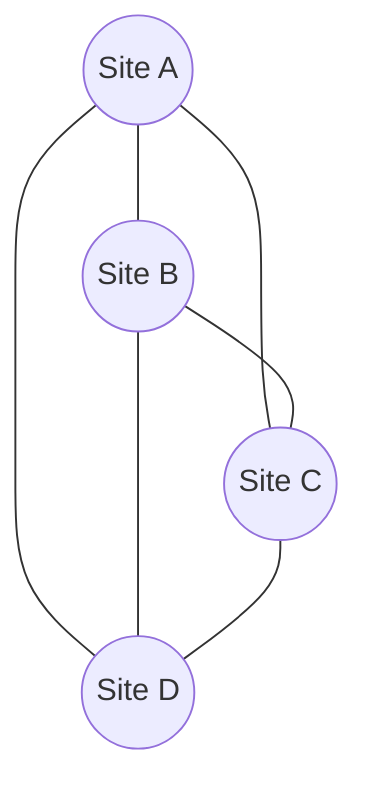
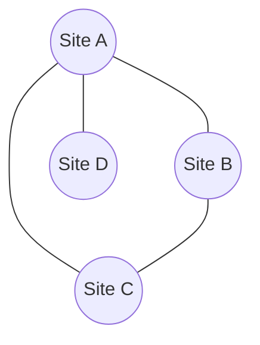
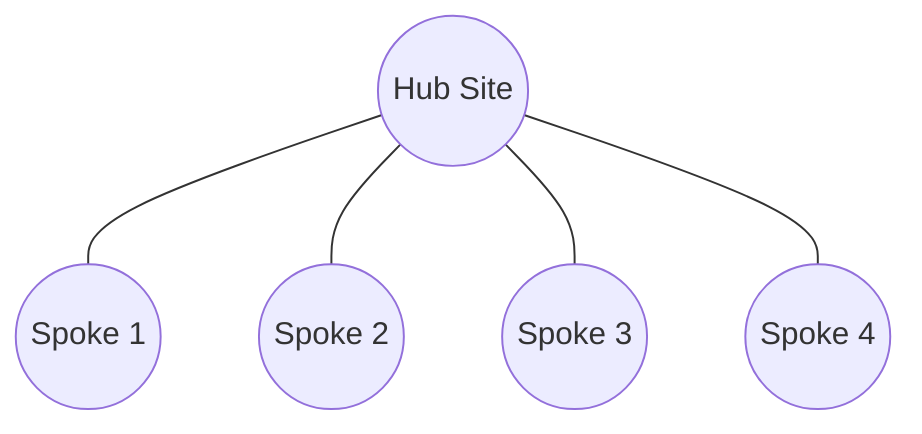
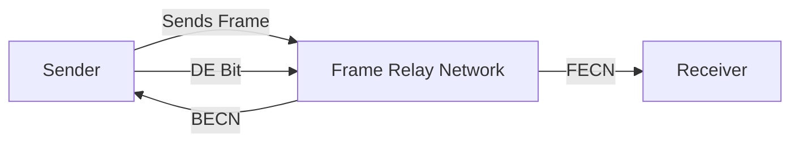
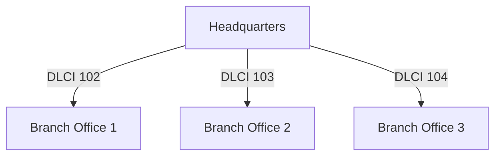
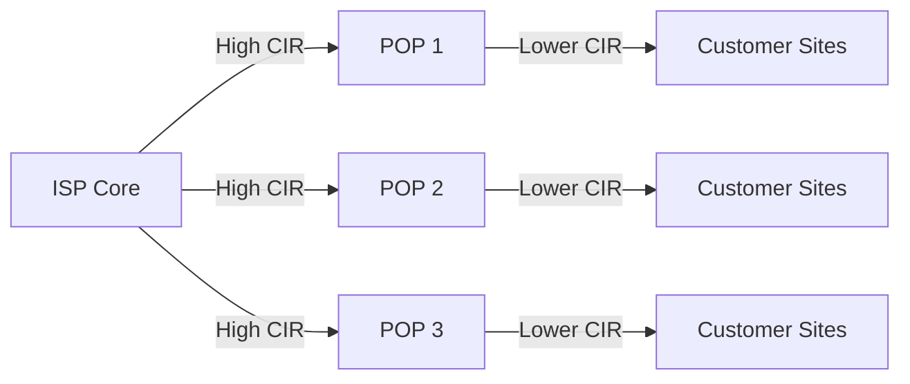

# Frame Relay Networks

## Introduction

Frame Relay is a high-performance Wide Area Network (WAN) protocol that operates at the data link layer (Layer 2) of the OSI model. Developed in the 1980s as an evolution of X.25, Frame Relay became popular in the 1990s and early 2000s as a cost-effective alternative to dedicated leased lines for connecting LANs across geographic distances.

Frame Relay provides a packet-switched, connection-oriented service that allows multiple virtual connections to share the same physical interface. This makes it significantly more efficient and economical than point-to-point leased lines, especially when connecting multiple sites.

## Key Concepts in Frame Relay

### Virtual Circuits

Frame Relay operates using **virtual circuits** rather than physical dedicated connections:

- **Permanent Virtual Circuits (PVCs)**: Pre-established, permanent connections between endpoints that remain active until administratively changed.
- **Switched Virtual Circuits (SVCs)**: Temporary connections established on demand and terminated when data transfer is complete.

Most Frame Relay implementations use PVCs, which are identified by a **Data Link Connection Identifier (DLCI)**.

### Data Link Connection Identifiers (DLCIs)

DLCIs are locally significant numbers (typically 10-bit values) that identify the virtual circuit endpoint on a Frame Relay interface. They function similarly to how a telephone extension identifies a specific desk in an office building.

```
DLCI Range: 0-1023
Reserved DLCIs:
- 0: Used for management purposes
- 1-15: Reserved for future use
- 1008-1022: Reserved for network implementation
- 1023: Reserved for LMI messages
```

### Committed Information Rate (CIR)

The CIR represents the minimum data transfer rate guaranteed by the service provider under normal network conditions:

- **CIR**: The rate at which the carrier agrees to transfer data
- **Bc (Committed Burst)**: The maximum amount of data the network commits to deliver within a given time interval
- **Be (Excess Burst)**: Additional data above the CIR that the network may deliver if resources are available

### Frame Relay Frame Structure

A typical Frame Relay frame includes:

```
+-------+-------+---------------+----------------+-------+
| Flag  | Header|     Data      | Frame Check    | Flag  |
| (8b)  | (16b) |  (Variable)   | Sequence (16b) | (8b)  |
+-------+-------+---------------+----------------+-------+
```

- **Flag**: Marks the beginning and end of a frame (01111110)
- **Header**: Contains addressing information (DLCI) and control bits
- **Data**: The actual payload being transmitted (up to 4096 bytes)
- **FCS**: Frame Check Sequence for error detection

### Local Management Interface (LMI)

LMI is a signaling standard between the user device (router) and the Frame Relay switch that provides:

- Status of virtual circuits
- Keepalive mechanism
- Multicasting capabilities
- Global addressing
- Status messages

LMI types include:
- Cisco (default)
- ANSI T1.617 Annex D
- ITU-T Q.933 Annex A

## Frame Relay Topology Designs

Frame Relay networks can be designed in several topologies:

### Full Mesh

All sites connect directly to all other sites through PVCs.



### Partial Mesh

Some sites connect directly, while others route through intermediate sites.



### Hub and Spoke

A central site (hub) connects to all remote sites (spokes), with no direct connections between remote sites.



## Frame Relay Configuration (Cisco Example)

Here's a basic example of configuring Frame Relay on a Cisco router:

```
! Step 1: Configure the physical interface
Router(config)# interface Serial0/0
Router(config-if)# encapsulation frame-relay
Router(config-if)# no frame-relay inverse-arp

! Step 2: Configure a point-to-point subinterface
Router(config)# interface Serial0/0.102 point-to-point
Router(config-subif)# ip address 192.168.1.1 255.255.255.0
Router(config-subif)# frame-relay interface-dlci 102
```

### Verifying Frame Relay Configuration

To verify your Frame Relay configuration:

```
! Show PVC status
Router# show frame-relay pvc

! Show frame-relay map
Router# show frame-relay map

! Show LMI statistics
Router# show frame-relay lmi
```

Example output:

```
Router# show frame-relay pvc

PVC Statistics for interface Serial0/0 (Frame Relay DTE)
              Active     Inactive      Deleted       Static
  Local          1            0            0            0
  Switched       0            0            0            0
  Unused         0            0            0            0

DLCI = 102, DLCI USAGE = LOCAL, PVC STATUS = ACTIVE, INTERFACE = Serial0/0.102

  input pkts 50            output pkts 40           in bytes 5000    
  out bytes 4000           dropped pkts 0           in pkts dropped 0         
  out pkts dropped 0       
  in FECN pkts 0           in BECN pkts 0           out FECN pkts 0          
  out BECN pkts 0          in DE pkts 0             out DE pkts 0
  out bcast pkts 30        out bcast bytes 2800     
  pvc create time 00:10:10, last time pvc status changed 00:05:20
```

## Frame Relay Congestion Control Mechanisms

### Forward Explicit Congestion Notification (FECN)

FECN is a bit set by the Frame Relay network in frames traveling in the same direction as the congestion to inform the destination device of congestion.

### Backward Explicit Congestion Notification (BECN)

BECN is a bit set by the Frame Relay network in frames traveling in the opposite direction of the congestion to inform the source device of congestion.

### Discard Eligibility (DE)

The DE bit marks frames that can be discarded first if the network becomes congested. These are typically frames sent in excess of the CIR.



## Common Frame Relay Issues

### Split Horizon Problem

In hub-and-spoke topologies, the split horizon rule in certain routing protocols (like RIP) prevents routes learned on one interface from being advertised back out the same interface. Since all PVCs in a Frame Relay network may use the same physical interface, this can cause routing issues.

**Solution**: Use subinterfaces to logically separate the PVCs, or use routing protocols that don't implement split horizon.

### Broadcast Handling

Frame Relay doesn't natively support broadcasts, which many routing protocols rely on.

**Solution**: Use the `frame-relay map` command to enable pseudo-broadcasting:

```
Router(config-if)# frame-relay map ip 192.168.1.2 102 broadcast
```

### Bandwidth Allocation

Frame Relay interfaces default to a bandwidth setting that might not match your actual CIR, affecting QoS and routing decisions.

**Solution**: Explicitly set the bandwidth to match your CIR:

```
Router(config-if)# bandwidth 512
```

## Real-World Applications

### Enterprise WAN Connectivity

Frame Relay was commonly used to connect branch offices to a corporate headquarters:



Each branch has a PVC to headquarters with a guaranteed CIR based on its needs.

### Internet Service Provider Backbones

ISPs used Frame Relay to provide connectivity between their Points of Presence (POPs) and to connect to other providers:



### Voice and Video Integration

Frame Relay could support voice and video traffic with appropriate QoS mechanisms:

```
! Configure Frame Relay for voice traffic
Router(config)# map-class frame-relay VOICE
Router(config-map-class)# frame-relay cir 128000
Router(config-map-class)# frame-relay bc 128000
Router(config-map-class)# frame-relay be 0
Router(config-map-class)# frame-relay mincir 128000

Router(config)# interface Serial0/0.102 point-to-point
Router(config-subif)# frame-relay class VOICE
```

## Summary

Frame Relay was a pivotal WAN technology that helped organizations move from expensive point-to-point leased lines to more cost-effective shared infrastructure. Its key benefits included:

- Lower cost compared to leased lines
- Support for variable bandwidth requirements
- Built-in redundancy through the mesh design options
- Congestion management mechanisms (FECN, BECN, DE)
- Compatibility with most network protocols

While Frame Relay has largely been replaced by MPLS, Metro Ethernet, and broadband internet-based VPNs, understanding its concepts provides valuable insight into the evolution of WAN technologies and the foundation for many modern networking solutions.

## Additional Resources and Exercises

### Exercises

1. **Configuration Exercise**: Draw a network diagram for a company with a headquarters and three branch offices. Assign appropriate DLCIs and IP addresses for a Frame Relay network connecting these locations.

2. **Troubleshooting Challenge**: Identify potential issues in the following scenario:
   - A Frame Relay network with a hub-and-spoke topology
   - OSPF as the routing protocol
   - All configured on the physical interface (no subinterfaces)
   - Branches cannot see routes from other branches

3. **Design Exercise**: Design a Frame Relay network for an organization with 5 locations, considering bandwidth requirements, redundancy needs, and cost optimization.

### Further Reading

- RFC 1490: Multiprotocol Interconnect over Frame Relay
- RFC 2427: Multiprotocol Interconnect over Frame Relay
- Cisco's Frame Relay documentation

### Interactive Labs

Practice your Frame Relay skills using network simulation software like:
- Cisco Packet Tracer
- GNS3
- EVE-NG

Try configuring different Frame Relay topologies and testing connectivity between sites.