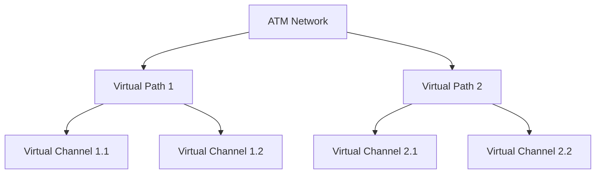

# ATM Networks

## Introduction

Asynchronous Transfer Mode (ATM) is a core networking technology that played a significant role in the evolution of Wide Area Network (WAN) technologies. ATM provides a connection-oriented, cell-based data transmission system designed to support multiple types of traffic (voice, video, and data) simultaneously with Quality of Service (QoS) guarantees. This guide will introduce you to ATM networks, explaining the fundamental concepts, architecture, and real-world applications.

## What is ATM?

ATM (Asynchronous Transfer Mode) is a high-speed, cell-switched network technology that uses fixed-size cells (53 bytes) to transport data across a network. Unlike variable-sized packets used in IP networks, ATM's fixed-size cells offer predictable transmission times, making it suitable for time-sensitive applications.

Key features of ATM include:

- Fixed 53-byte cells (5-byte header, 48-byte payload)
- Connection-oriented transmission
- Support for multiple traffic types
- Built-in Quality of Service (QoS) mechanisms
- Scalable from 1.5 Mbps to multiple Gbps

## ATM Architecture

ATM operates on a layered model similar to but distinct from the OSI model:

1. **Physical Layer**: Handles the physical medium, bit timing, and electrical/optical transmission
2. **ATM Layer**: Manages cell transport, cell header processing, and virtual path/channel management
3. **ATM Adaptation Layer (AAL)**: Adapts different traffic types to the ATM format

### Cell Structure

```
+---------------------------+----------------+
| Header (5 bytes)          | Payload (48 B) |
+---------------------------+----------------+
| GFC | VPI | VCI | PT |CLP | User Data     |
+---------------------------+----------------+
```

- **GFC (Generic Flow Control)**: 4 bits - Controls cell flow at the user-network interface
- **VPI (Virtual Path Identifier)**: 8 bits - Identifies the virtual path
- **VCI (Virtual Channel Identifier)**: 16 bits - Identifies the virtual channel within a path
- **PT (Payload Type)**: 3 bits - Indicates payload type (user data or management)
- **CLP (Cell Loss Priority)**: 1 bit - Indicates priority for discarding during congestion
- **HEC (Header Error Control)**: 8 bits - Error detection and correction for the header

## Virtual Paths and Channels

ATM establishes connections through a hierarchy of:

- **Virtual Channels (VC)**: Individual connections between end systems
- **Virtual Paths (VP)**: Groups of virtual channels that share a common path

This creates a two-level hierarchy shown here:



## ATM Adaptation Layers (AALs)

ATM uses different adaptation layers to handle various traffic types:

- **AAL1**: For constant bit rate (CBR) traffic like uncompressed voice or video
- **AAL2**: For variable bit rate (VBR) traffic with timing requirements
- **AAL3/4**: For variable bit rate data without timing requirements
- **AAL5**: Simplified adaptation layer for data, most commonly used

## ATM Switching

ATM networks use switches to route cells based on VPI/VCI values:

```
Input Port                                 Output Port
   |                                           |
   V                                           V
+-------+    +-------------------+    +----------------+
| Cell  | -> | VPI/VCI Lookup in | -> | Updated Header |
| Input |    | Switching Table   |    | Cell Output    |
+-------+    +-------------------+    +----------------+
```

The switch performs these basic functions:
1. Receive cells from input ports
2. Analyze header information (VPI/VCI)
3. Determine output port using switching table
4. Update header information if needed
5. Forward cell to the appropriate output port

## Quality of Service (QoS)

ATM provides different service categories to meet various application requirements:

1. **CBR (Constant Bit Rate)**: For applications needing fixed bandwidth
2. **VBR-rt (Variable Bit Rate - real time)**: For real-time applications with variable rates
3. **VBR-nrt (Variable Bit Rate - non-real time)**: For non-real-time applications with variable rates
4. **ABR (Available Bit Rate)**: For adaptive applications that can adjust to available bandwidth
5. **UBR (Unspecified Bit Rate)**: For best-effort traffic with no guarantees

## ATM in WAN Technologies

ATM has been widely deployed in carrier networks and backbones:

1. **SONET/SDH Backbones**: ATM cells carried over SONET/SDH infrastructure
2. **DSL Technologies**: ADSL originally used ATM as its data link layer
3. **Mobile Backhaul**: Used in 2G/3G cellular network backhaul
4. **Enterprise WANs**: For connecting multiple sites with QoS guarantees

### Example: DSL Implementation

```
+----------+    +------+    +----------+    +--------+
| Customer | -- | DSLAM | -- | ATM Core | -- | Internet|
| Premises |    |      |    | Network  |    |        |
+----------+    +------+    +----------+    +--------+
```

## ATM Signaling

ATM uses signaling protocols to establish, maintain, and terminate connections:

- **UNI (User-Network Interface)**: Between end users and ATM network
- **NNI (Network-Network Interface)**: Between ATM switches within a network
- **PNNI (Private Network-Network Interface)**: For routing within private ATM networks

## Advantages and Limitations

### Advantages
- Guaranteed QoS for different traffic types
- Low and predictable latency
- Efficient multiplexing of different traffic types
- Connection-oriented service with traffic contracts

### Limitations
- Fixed cell size overhead (approximately 10%)
- Complex implementation compared to IP-based networks
- Declining relevance as IP-based technologies evolved
- Higher cost compared to pure IP solutions

## Modern Context and Legacy

While pure ATM networks are less common today, the concepts pioneered by ATM have influenced modern networking:

- Traffic classification and QoS mechanisms in IP networks
- MPLS networks inherit concepts from ATM's virtual path approach
- Modern SDN (Software-Defined Networking) implementations often incorporate ATM QoS concepts

## Summary

ATM networks represented an important step in the evolution of networking technologies, providing sophisticated traffic management and QoS capabilities. Although largely replaced by IP-based technologies in modern networks, ATM's concepts of traffic classification, connection-oriented service, and QoS guarantees continue to influence network design today. Understanding ATM provides valuable insights into the development of modern WAN technologies and the ongoing challenges of delivering diverse traffic types with appropriate performance guarantees.

## Additional Resources

For further learning about ATM networks:
- "Computer Networks" by Andrew S. Tanenbaum
- "Data and Computer Communications" by William Stallings
- "ATM: Theory and Application" by David E. McDysan and Darren L. Spohn