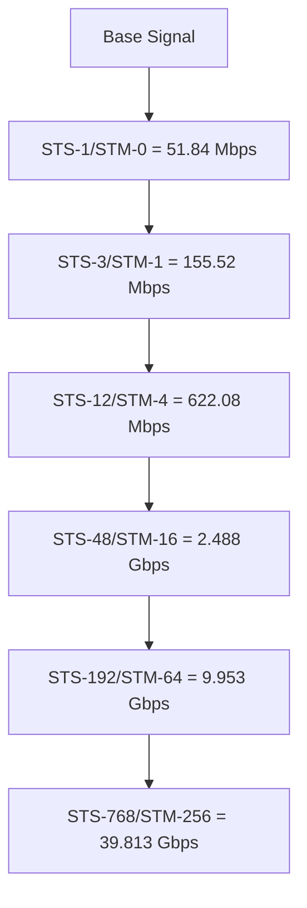
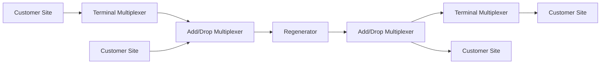
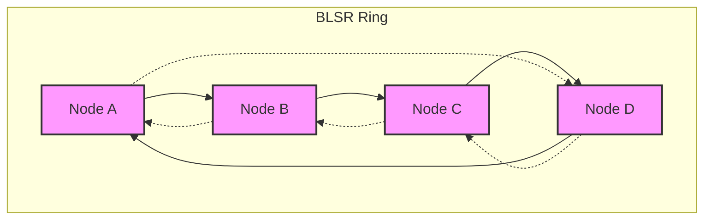
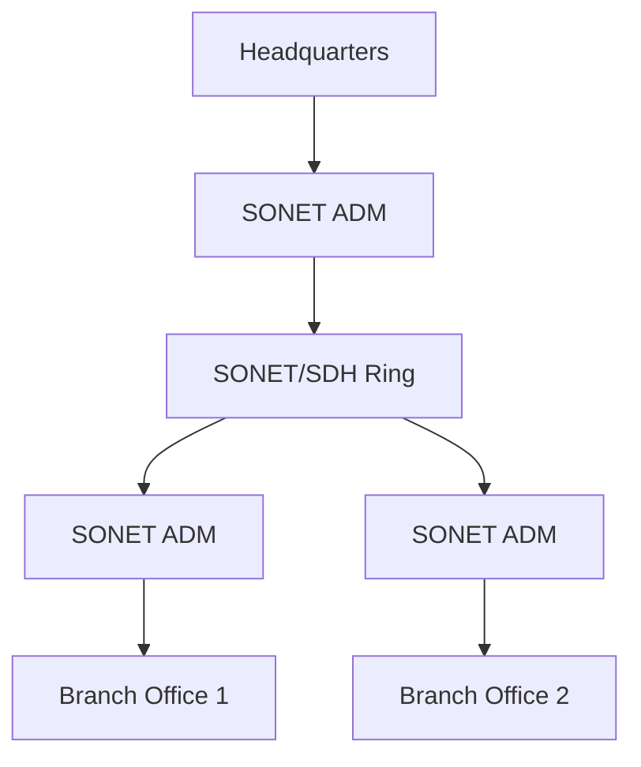

# SONET and SDH Networks

## Introduction

Synchronous Optical Network (SONET) and Synchronous Digital Hierarchy (SDH) are international standards for high-speed, high-capacity data transmission over fiber optic networks. Developed in the 1980s, these technologies revolutionized telecommunications by providing a standardized framework for transporting multiple digital signals across optical fiber backbones.

SONET is the standard used predominantly in North America, while SDH is the international equivalent used throughout the rest of the world. Despite some differences in terminology and specific implementations, both standards share the same fundamental principles and operate in similar ways.

## Fundamentals of SONET/SDH

### Basic Concepts

SONET/SDH networks are based on a few key principles:

1. **Synchronous Operation**: All network elements operate from a single master clock, ensuring precise timing.
2. **Multiplexing Structure**: Multiple lower-speed signals can be combined into higher-speed transmissions.
3. **Built-in Operations, Administration, and Maintenance (OAM)**: Self-monitoring capabilities are embedded into the protocol.
4. **Standardized Interfaces**: Ensures equipment interoperability across vendors.

### Signal Hierarchy

Both SONET and SDH organize data into frames with specific rates:



| SONET Signal | SDH Signal | Data Rate |
|--------------|------------|-----------|
| STS-1        | -          | 51.84 Mbps |
| STS-3        | STM-1      | 155.52 Mbps |
| STS-12       | STM-4      | 622.08 Mbps |
| STS-48       | STM-16     | 2.488 Gbps |
| STS-192      | STM-64     | 9.953 Gbps |
| STS-768      | STM-256    | 39.813 Gbps |

## SONET/SDH Frame Structure

The basic building block of SONET is the Synchronous Transport Signal Level 1 (STS-1) frame, while in SDH it's the Synchronous Transport Module Level 1 (STM-1).

### SONET Frame Structure

An STS-1 frame consists of 810 bytes arranged in 9 rows by 90 columns:

```
+------------------+------------------+
| Transport        | Synchronous      |
| Overhead         | Payload          |
| (3 columns)      | Envelope         |
|                  | (87 columns)     |
+------------------+------------------+
```

- **Section Overhead (SOH)**: First 3 rows of the Transport Overhead
- **Line Overhead (LOH)**: Remaining 6 rows of the Transport Overhead
- **Path Overhead (POH)**: 1 column at the beginning of the payload
- **Payload**: The actual data being transported

### SONET Frame Transmission

Each frame is transmitted in 125 microseconds (μs), resulting in 8,000 frames per second. This specific timing was chosen because it aligns with the sampling rate used in traditional voice telecommunications (8 kHz).

## Network Elements in SONET/SDH

SONET/SDH networks consist of several key components:

1. **Terminal Multiplexers (TM)**: Connect non-SONET/SDH signals to the SONET/SDH network.
2. **Add/Drop Multiplexers (ADM)**: Allow signals to be added or dropped from the SONET/SDH stream without disrupting other traffic.
3. **Regenerators**: Boost and clean up signals for long-distance transmission.
4. **Digital Cross-Connect Systems (DCS)**: Route signals between different paths in the network.



## SONET/SDH Protection Mechanisms

One of the strongest aspects of SONET/SDH is its built-in protection switching capabilities:

### 1. Linear Automatic Protection Switching (APS)

- **1+1 Protection**: Traffic is sent simultaneously on working and protection fibers.
- **1:1 Protection**: Each working fiber has a dedicated protection fiber.
- **1:N Protection**: Multiple working fibers share one protection fiber.

### 2. Ring-Based Protection

- **Unidirectional Path Switched Ring (UPSR)**: Traffic is sent in both directions; receiver selects the better signal.
- **Bidirectional Line Switched Ring (BLSR)**: Uses loopback mechanisms to reroute traffic when a failure occurs.



## Real-World Applications

### Telecommunications Backbone

SONET/SDH has been the foundation of telecommunications networks worldwide for decades. Major telephone companies use SONET/SDH to transport voice, data, and video across their core networks.

### Example: Metro Ethernet Service

A business needs to connect multiple office locations with high-speed Ethernet across a metropolitan area:



The service provider maps the customer's Ethernet traffic into SONET/SDH containers (using Generic Framing Procedure or GFP), transports it across the ring, and demaps it back to Ethernet at the destination.

### Internet Service Provider Connectivity

ISPs often use SONET/SDH for their high-speed backbone connections between major cities or countries.

## Programming Example: SONET Overhead Processing

Here's a simplified example of how a network device might process SONET frame overhead in C:

```c
typedef struct {
    uint8_t section_overhead[3][3];    /* 3 rows × 3 columns */
    uint8_t line_overhead[6][3];       /* 6 rows × 3 columns */
    uint8_t payload[9][87];           /* 9 rows × 87 columns */
} SONET_STS1_Frame;

/* Function to detect if there's a Loss of Signal alarm */
bool detect_LOS(SONET_STS1_Frame* frame) {
    /* A2 bytes (framing bytes) are in the second row of section overhead */
    for (int i = 0; i < 3; i++) {
        if (frame->section_overhead[1][i] != 0x2F) { /* 0x2F is the expected A2 byte */
            return true; /* Loss of Signal detected */
        }
    }
    return false; /* No Loss of Signal */
}

/* Function to extract the J0 Trace message (used for path identification) */
void extract_J0_trace(SONET_STS1_Frame frames[], int num_frames, char* trace_msg) {
    int trace_index = 0;
    
    /* J0 byte is in the first byte of the first row of each frame's section overhead */
    for (int i = 0; i < num_frames && trace_index < 16; i++) {
        trace_msg[trace_index++] = frames[i].section_overhead[0][0];
        if (frames[i].section_overhead[0][0] == 0) {
            break; /* Null-terminated string */
        }
    }
    trace_msg[trace_index] = '\0'; /* Ensure null termination */
}

/* Sample usage */
void process_sonet_frames(SONET_STS1_Frame frames[], int num_frames) {
    char trace_message[17]; /* 16 chars + null terminator */
    
    /* Check for alarms */
    if (detect_LOS(&frames[0])) {
        printf("ALARM: Loss of Signal detected!
");
        /* Initiate protection switching */
    }
    
    /* Extract path identification */
    extract_J0_trace(frames, num_frames, trace_message);
    printf("Circuit identification: %s
", trace_message);
    
    /* Process payload data... */
}
```

Output example:
```
Circuit identification: CHICAGO-TO-NY01
```

## SONET/SDH vs. Modern Technologies

While SONET/SDH has been a critical technology for telecommunications networks, newer technologies are increasingly replacing it:

- **OTN (Optical Transport Network)**: Provides more efficient transport for higher bandwidth signals
- **Carrier Ethernet**: Extends Ethernet beyond the LAN for metro and wide-area networks
- **DWDM (Dense Wavelength Division Multiplexing)**: Allows multiple wavelengths on a single fiber
- **IP/MPLS**: Direct packet transport without the SONET/SDH layer

However, SONET/SDH principles of synchronization, protection, and management continue to influence these newer technologies.

## Summary

SONET/SDH networks represent a critical technology in the evolution of telecommunications. They provided:

- Standardized optical interfaces for network equipment
- Robust protection mechanisms for high reliability
- Efficient multiplexing structures for various traffic types
- Comprehensive OAM capabilities

While SONET/SDH deployments are gradually decreasing in favor of newer technologies, understanding these standards provides valuable insight into the fundamental principles of telecommunications networks and how modern networks evolved from them.

## Additional Resources and Exercises

### Exercises

1. Calculate the payload capacity of an STM-4 signal after accounting for overhead.
2. Design a SONET network connecting four sites in a ring configuration with appropriate protection mechanisms.
3. Compare the efficiency of mapping Ethernet frames into SONET vs. direct packet over DWDM transport.

### For Further Learning

- **Standards**: ITU-T G.707 (SDH) and Telcordia GR-253-CORE (SONET)
- **Telecommunications engineering textbooks** that cover optical networking fundamentals
- **Network certification courses** that include WAN technologies sections