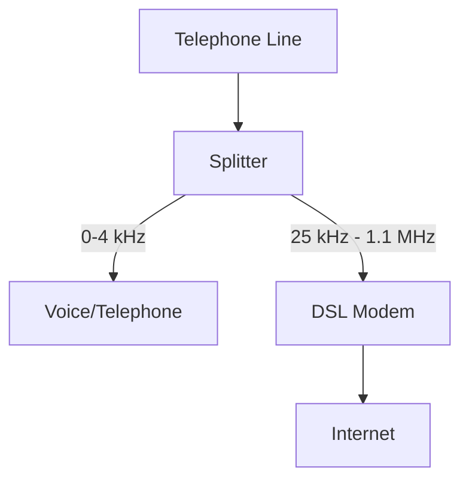
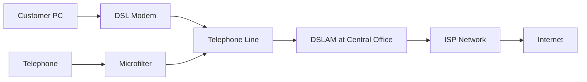

# Digital Subscriber Line (DSL) Networks

## Introduction

Digital Subscriber Line (DSL) technology represents one of the most widely deployed broadband connection methods worldwide. Unlike traditional dial-up connections, DSL provides high-speed internet access through standard copper telephone lines without interrupting telephone service. This technology revolutionized internet connectivity by offering a cost-effective way to utilize existing infrastructure for broadband service.

In this guide, we'll explore how DSL works, its various types, advantages and limitations, and its place in the modern networking landscape.

## What is DSL?

DSL is a family of technologies that provides digital data transmission over the wires of a local telephone network. The key innovation of DSL is its ability to use higher frequency bands on traditional copper telephone lines, enabling data transmission without interfering with regular voice service on the same lines.

### How DSL Works

DSL operates on a simple but clever principle: telephone lines are capable of carrying much more data than what is needed for voice calls. By using different frequency ranges, DSL can transmit data alongside voice signals on the same line:

- **Voice calls**: Use the lower frequency range (0-4 kHz)
- **Data transmission**: Uses higher frequencies (25 kHz to 1.1 MHz, depending on the DSL type)



At the customer's premises, a device called a DSL filter (or splitter) separates these frequencies, directing voice signals to the telephone and data signals to the DSL modem.

## Types of DSL Technologies

DSL encompasses several variations, each with different characteristics suited for specific applications:

### ADSL (Asymmetric Digital Subscriber Line)

ADSL is the most common form of DSL, characterized by different upload and download speeds (asymmetric).

**Characteristics:**
- Download speeds: 1.5 to 24 Mbps
- Upload speeds: 128 Kbps to 3.5 Mbps
- Distance limitation: Typically up to 5.5 km (18,000 feet) from the central office

**Use case:** Ideal for residential customers who primarily consume content (download more than upload)

### SDSL (Symmetric Digital Subscriber Line)

SDSL provides equal bandwidth for uploads and downloads, making it suitable for business applications.

**Characteristics:**
- Equal upload and download speeds: 192 Kbps to 4.6 Mbps
- Distance limitation: Up to 3 km (10,000 feet) from the central office

**Use case:** Businesses requiring file hosting, video conferencing, or VPN services

### VDSL (Very-high-bit-rate Digital Subscriber Line)

VDSL offers significantly higher speeds over shorter distances.

**Characteristics:**
- Download speeds: Up to 100 Mbps
- Upload speeds: Up to 40 Mbps
- Distance limitation: Typically less than 1.2 km (4,000 feet)

**Use case:** Applications requiring high bandwidth like streaming 4K video or online gaming

### HDSL (High-bit-rate Digital Subscriber Line)

HDSL was one of the first DSL technologies developed, offering T1/E1 speeds over longer distances.

**Characteristics:**
- Symmetric speeds: 1.544 Mbps (T1) or 2.048 Mbps (E1)
- Uses multiple wire pairs
- Distance limitation: Up to 3.6 km (12,000 feet)

**Use case:** Business applications requiring T1/E1 connectivity without repeaters

## DSL Architecture and Components

A typical DSL setup involves several key components:

### Customer Premises Equipment

- **DSL Modem/Router:** Converts digital signals from your computer to the format needed for transmission over DSL lines
- **Microfilter/Splitter:** Separates voice and data signals to prevent interference

### Network Components

- **DSLAM (DSL Access Multiplexer):** Located at the service provider's local exchange (central office), aggregates connections from multiple DSL subscribers
- **ATU-C (ADSL Terminal Unit - Central Office):** The DSLAM-side DSL modem
- **ATU-R (ADSL Terminal Unit - Remote):** The customer-side DSL modem



## DSL Implementation Example

Here's a practical example of how to configure a basic DSL connection on a customer router. This example uses a simplified configuration syntax that would be similar to what you might use on a home DSL router:

```
# Basic DSL Router Configuration

# Set connection type
connection_type = DSL
dsl_protocol = PPPoE  # Point-to-Point Protocol over Ethernet

# Authentication details (provided by ISP)
username = "customer@isp.net"
password = "secure_password"

# Connection parameters
vpi = 8   # Virtual Path Identifier 
vci = 35  # Virtual Channel Identifier

# IP configuration
ip_assignment = dynamic  # Get IP address automatically from ISP
dns_assignment = automatic

# Enable connection
enable_connection = true
```

After applying this configuration, the DSL modem would attempt to establish a connection with the ISP's DSLAM using the PPPoE protocol.

## Advantages of DSL

DSL technology offers several benefits that have contributed to its widespread adoption:

1. **Uses existing infrastructure:** Leverages the telephone network that already reaches most homes and businesses
2. **Always-on connection:** Unlike dial-up, DSL provides constant connectivity without the need to establish a new connection each time
3. **Simultaneous voice and data:** Allows for phone calls and internet usage at the same time
4. **Cost-effective:** Generally less expensive than newer technologies like fiber optics, especially for installation
5. **Dedicated connection:** Unlike cable internet, DSL provides a dedicated line to each customer, reducing the impact of neighbor usage

## Limitations and Challenges

Despite its advantages, DSL has several important limitations:

1. **Distance sensitivity:** Signal quality and speed decrease significantly with distance from the central office (CO)
2. **Line quality dependence:** Performance can be affected by the condition and age of copper lines
3. **Asymmetric speeds:** Most DSL connections offer faster download than upload speeds
4. **Interference susceptibility:** Can be affected by electromagnetic interference and line noise
5. **Speed limitations:** Cannot match the performance of newer technologies like fiber optics

## Real-World Applications

### Case Study: Rural Connectivity

In many rural areas, DSL remains the most practical broadband solution due to the prohibitive cost of installing fiber optic cables across large distances. For example, a small town might use a central DSLAM at the local telephone exchange to provide broadband service to residents within a 5 km radius.

### Home Office Setup

For a home office user requiring reliable internet without the expense of a business-grade fiber connection, an ADSL2+ connection might offer:

- Download speeds of up to 24 Mbps
- Upload speeds of up to 3.3 Mbps
- Support for VoIP phone services
- Enough bandwidth for video conferencing and file sharing

### Small Business Implementation

A small business might use SDSL or bonded DSL to achieve:

- Symmetric speeds of 5-10 Mbps
- Hosting of a company website and email server
- Support for a VPN for remote workers
- Consistent performance during business hours

## Troubleshooting DSL Connections

Common DSL issues and their potential solutions:

| Problem | Possible Causes | Solutions |
|---------|----------------|-----------|
| No DSL signal | Line disconnection, DSLAM issues | Check physical connections, contact ISP |
| Intermittent connection | Interference, line quality | Install proper filters, check for interference sources |
| Slow speeds | Distance from CO, line quality | Request line quality check, consider line bonding |
| Authentication failures | Incorrect credentials | Verify username and password with ISP |

## The Future of DSL

While fiber optic technology is gradually replacing DSL in urban areas, advancements continue in DSL technology:

- **G.fast:** Offers speeds up to 1 Gbps over very short distances (under 500m)
- **Bonded DSL:** Combines multiple DSL lines to increase bandwidth
- **Vectored DSL:** Reduces cross-talk interference between multiple DSL lines
- **VDSL Profile 35b:** Extends VDSL2 performance with speeds up to 300 Mbps over short distances

DSL will likely remain important in areas where fiber deployment is economically unfeasible, serving as a bridge technology during the transition to fiber networks.

## Summary

Digital Subscriber Line technology transformed internet access by repurposing existing telephone infrastructure for high-speed data transmission. While newer technologies offer higher performance, DSL remains relevant due to its widespread availability, lower cost, and continuous technical improvements.

Key points to remember:
- DSL uses higher frequencies on copper telephone lines to transmit data
- Various DSL types (ADSL, SDSL, VDSL) serve different needs
- Performance depends heavily on distance from the central office
- Despite limitations, DSL continues to evolve with technologies like G.fast

## Exercises

1. **Research Exercise:** Compare DSL availability and pricing in your local area against other broadband options.
2. **Technical Exercise:** Design a network diagram for a small business using DSL for both internet connectivity and VoIP services.
3. **Problem-solving Exercise:** Troubleshoot a scenario where a DSL connection drops whenever it rains.
4. **Calculation Exercise:** If a user is located 3 km from the central office, estimate the maximum ADSL2+ speed they might achieve (research attenuation rates).

## Further Reading

- RFC 2616: "DSL Forum System Reference Model"
- "Understanding DSL Technology" by Starr, Cioffi, and Silverman
- ITU-T G.992 series recommendations (ADSL standards)
- ITU-T G.993 series recommendations (VDSL standards)