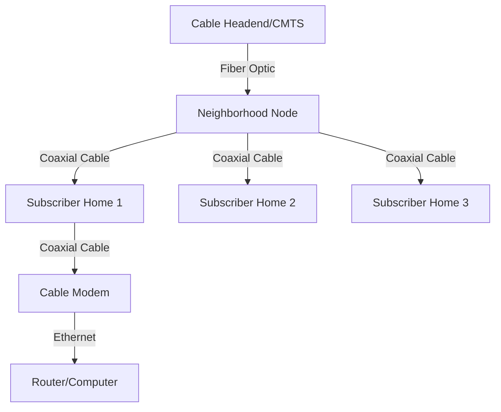
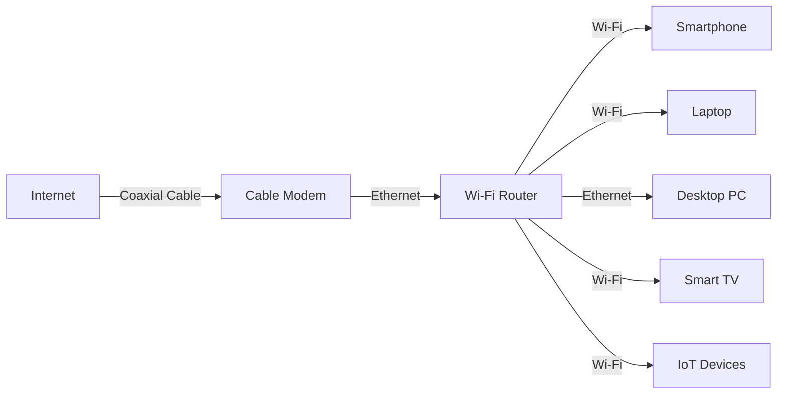
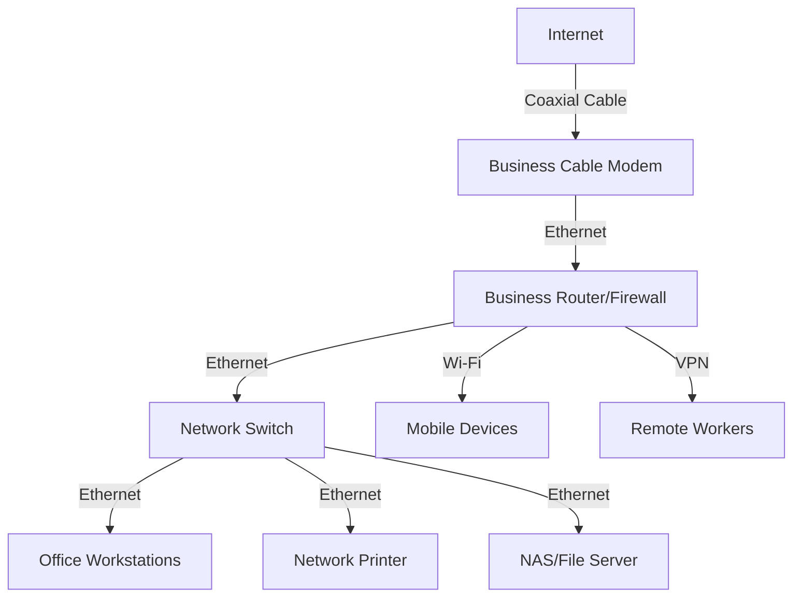

# Cable Internet

## Introduction

Cable internet is one of the most widely used broadband technologies for connecting homes and businesses to the internet. Unlike traditional dial-up connections, cable internet utilizes the same coaxial cable infrastructure originally deployed for cable television services, offering significantly higher speeds and always-on connectivity.

In this guide, we'll explore how cable internet works, its technical specifications, advantages and limitations, and how it fits into the broader landscape of Wide Area Network (WAN) technologies.

## How Cable Internet Works

### The Cable Infrastructure

Cable internet leverages existing cable television infrastructure to deliver internet service to end users. This infrastructure consists of several key components:



1. **Cable Headend**: The central facility where cable operators receive television signals for distribution to subscribers. For internet service, this facility houses the Cable Modem Termination System (CMTS).

2. **CMTS (Cable Modem Termination System)**: The equipment that connects the cable network to the Internet backbone, managing connections and traffic between the internet and subscribers' cable modems.

3. **Hybrid Fiber-Coaxial (HFC) Network**: Most modern cable networks use a combination of fiber optic and coaxial cables:
   - Fiber optic cables connect the headend to neighborhood nodes
   - Coaxial cables connect from nodes to individual subscribers

4. **Cable Modem**: The device at the subscriber's location that connects to the cable network and converts the signal to a format usable by computers and home networks.

### Data Transmission Process

Cable internet uses separate frequency channels on the coaxial cable to transmit data:

1. **Downstream Channels**: Carry data from the internet to users (typically 50-860 MHz)
2. **Upstream Channels**: Carry data from users to the internet (typically 5-42 MHz)

This asymmetric allocation of frequencies is why download speeds are typically faster than upload speeds on cable internet connections.

## DOCSIS: The Technical Standard

Cable internet is standardized through the Data Over Cable Service Interface Specification (DOCSIS), which defines the communications and operation support interface requirements for data transfer over cable systems.

### DOCSIS Versions and Capabilities

| DOCSIS Version | Max Download Speed | Max Upload Speed | Released |
|----------------|-------------------|-----------------|----------|
| 1.0            | 40 Mbps           | 10 Mbps         | 1997     |
| 2.0            | 40 Mbps           | 30 Mbps         | 2001     |
| 3.0            | 1.2 Gbps          | 200 Mbps        | 2006     |
| 3.1            | 10 Gbps           | 1-2 Gbps        | 2013     |
| 4.0            | 10 Gbps           | 6 Gbps          | 2017     |

Each new version of DOCSIS has introduced improvements in speed, latency, and efficiency.

## Cable Modem Configuration

When a cable modem is connected to the network, it goes through several initialization steps:

1. **Scanning**: The modem scans for downstream channels
2. **Ranging**: Determines the distance from the CMTS to adjust timing
3. **Authentication**: The modem is authenticated via its MAC address
4. **IP Assignment**: The modem receives an IP address via DHCP
5. **Configuration**: The modem downloads configuration files

### Example Configuration Process

Here's a simplified example of what happens when a cable modem connects to the network:

```
# Cable Modem Initialization Sequence (simplified)

1. Power on the cable modem
   > Scanning for downstream channel...
   > Found downstream channel at 699 MHz
   > Establishing connection with CMTS...

2. DHCP Discovery
   > DHCP Discover sent
   > DHCP Offer received (IP: 192.168.100.10)
   > DHCP Request sent
   > DHCP ACK received

3. Configuration File Download
   > Downloading config file from TFTP server
   > Loading configuration...
   > Registration with CMTS successful

4. Online Status
   > Cable modem online
   > Downstream: 686 Mbps
   > Upstream: 35 Mbps
```

## Advantages of Cable Internet

1. **Wide Availability**: Available in most urban and suburban areas where cable TV service exists
2. **High Speeds**: Offers significantly higher speeds than DSL or satellite internet
3. **Always-On Connection**: No need to dial in; the connection remains active
4. **Reliability**: Generally stable connections with good uptime
5. **Cost-Effective**: Typically offers good value for the speed provided

## Limitations and Challenges

1. **Shared Bandwidth**: Users in the same neighborhood share bandwidth, which can lead to slowdowns during peak usage times
2. **Asymmetric Speeds**: Upload speeds are typically much slower than download speeds
3. **Distance Limitations**: Signal quality can degrade over long cable runs
4. **Latency Issues**: While better than satellite, cable can have higher latency than fiber
5. **Limited Rural Availability**: Often unavailable in rural areas

## Cable Internet vs. Other WAN Technologies

Let's compare cable internet with other common WAN technologies:

| Technology      | Typical Speeds              | Pros                           | Cons                          |
|-----------------|----------------------------|--------------------------------|-------------------------------|
| Cable           | 100-1000 Mbps down<br />5-50 Mbps up | Widely available, high speeds | Shared bandwidth, asymmetric   |
| DSL             | 5-100 Mbps down<br />1-20 Mbps up   | Dedicated line, consistent    | Speed decreases with distance  |
| Fiber           | 300-10000 Mbps (symmetric) | Fastest speeds, low latency    | Limited availability, cost     |
| Satellite       | 12-100 Mbps down<br />3-20 Mbps up  | Available almost anywhere     | High latency, weather affected |
| 5G Fixed Wireless | 100-1000 Mbps           | No cables, easy installation   | Line of sight, coverage issues |

## Troubleshooting Cable Internet Connections

Common issues and their solutions:

### Signal Levels and SNR

Signal strength is measured in dBmV (decibels above/below 1 millivolt):

```
# Optimal Signal Ranges for Cable Modems
Downstream Power: -7 to +7 dBmV (ideal is around 0 dBmV)
Upstream Power: 38 to 48 dBmV
SNR (Signal-to-Noise Ratio): >30 dB (higher is better)
```

### Checking Modem Status via Browser Interface

Most cable modems have a web interface accessible at `192.168.100.1` that shows signal levels and connection status.

```javascript
// Example JavaScript to fetch and display cable modem statistics
function checkModemStatus() {
  fetch('http://192.168.100.1/status.json')
    .then(response => response.json())
    .then(data => {
      console.log('Downstream Power:', data.downstream.power, 'dBmV');
      console.log('Upstream Power:', data.upstream.power, 'dBmV');
      console.log('SNR:', data.downstream.snr, 'dB');
      console.log('Uncorrectable Errors:', data.downstream.uncorrectables);
    })
    .catch(error => console.error('Error fetching modem status:', error));
}
```

### Common Troubleshooting Steps

1. **Reboot the Cable Modem**:
   ```bash
   # Unix-like command for pinging to check connectivity
   ping -c 4 google.com
   
   # If ping fails
   # 1. Unplug modem power for 30 seconds
   # 2. Reconnect and wait for lights to stabilize
   # 3. Test connection again
   ping -c 4 google.com
   ```

2. **Check for Signal Issues**:
   - Multiple T3/T4 timeouts in modem logs indicate upstream issues
   - High number of uncorrectable errors indicates signal quality problems

3. **Inspect Physical Connections**:
   - Check for loose coaxial connections
   - Look for damaged cables or excessive splitters

## Real-World Applications

### Home Networks

In a typical home network setup with cable internet:



### Small Business Setup

For a small business using cable internet for office connectivity:



### Case Study: School District Network

A school district might use cable internet as one component of their WAN strategy:

- **Main Administration Building**: High-speed cable business internet as primary connection
- **Backup Connection**: Secondary cable connection from different provider for redundancy
- **Connection Distribution**: Internal fiber network connects administration to schools
- **Load Balancing**: Traffic distributed between multiple cable connections for higher throughput

## Best Practices for Cable Internet Deployments

1. **Minimizing Splitters**: Each splitter reduces signal strength by 3.5-7 dB
2. **Quality Coaxial Cable**: Use RG-6 cable rather than older RG-59 for better performance
3. **Proper Grounding**: Ensure coaxial cables are properly grounded to prevent electrical issues
4. **Strategic Modem Placement**: Position the modem centrally to allow shorter cable runs
5. **Regular Firmware Updates**: Keep modem and router firmware updated for best performance and security

## Programming Examples

### Monitoring Cable Internet Performance

The following Python script uses the `speedtest-cli` library to monitor and log internet speed over time:

```python
import speedtest
import time
import csv
from datetime import datetime

def test_speed():
    s = speedtest.Speedtest()
    s.get_best_server()
    download_speed = s.download() / 1_000_000  # Convert to Mbps
    upload_speed = s.upload() / 1_000_000  # Convert to Mbps
    ping = s.results.ping
    return download_speed, upload_speed, ping

def log_results(download, upload, ping):
    timestamp = datetime.now().strftime("%Y-%m-%d %H:%M:%S")
    with open('internet_speed_log.csv', 'a', newline='') as file:
        writer = csv.writer(file)
        if file.tell() == 0:  # Check if file is empty
            writer.writerow(['Timestamp', 'Download (Mbps)', 'Upload (Mbps)', 'Ping (ms)'])
        writer.writerow([timestamp, round(download, 2), round(upload, 2), round(ping, 2)])
    
    print(f"[{timestamp}] Download: {download:.2f} Mbps, Upload: {upload:.2f} Mbps, Ping: {ping:.2f} ms")

# Run speed test every hour
try:
    while True:
        print("Running speed test...")
        download, upload, ping = test_speed()
        log_results(download, upload, ping)
        print("Waiting for next test in 1 hour...")
        time.sleep(3600)  # Wait for 1 hour
except KeyboardInterrupt:
    print("Speed test monitoring stopped.")
```

**Example output:**
```
Running speed test...
[2023-09-15 14:30:22] Download: 245.67 Mbps, Upload: 23.45 Mbps, Ping: 18.23 ms
Waiting for next test in 1 hour...
Running speed test...
[2023-09-15 15:30:27] Download: 237.89 Mbps, Upload: 22.98 Mbps, Ping: 19.45 ms
Waiting for next test in 1 hour...
```

### Simple Network Device Scanner for Home Cable Networks

This Python script uses the `scapy` library to discover devices on your home network:

```python
from scapy.all import ARP, Ether, srp
import socket
import fcntl
import struct

def get_interface_ip(ifname):
    s = socket.socket(socket.AF_INET, socket.SOCK_DGRAM)
    return socket.inet_ntoa(fcntl.ioctl(
        s.fileno(),
        0x8915,  # SIOCGIFADDR
        struct.pack('256s', ifname[:15].encode('utf-8'))
    )[20:24])

def scan_network(interface):
    # Get IP address and construct network address
    ip_address = get_interface_ip(interface)
    network = '.'.join(ip_address.split('.')[:3]) + '.0/24'
    
    print(f"Scanning network: {network}")
    
    # Create ARP packet
    arp = ARP(pdst=network)
    ether = Ether(dst="ff:ff:ff:ff:ff:ff")
    packet = ether/arp
    
    # Send packet and capture responses
    result = srp(packet, timeout=3, verbose=0)[0]
    
    # Process responses
    devices = []
    for sent, received in result:
        devices.append({'ip': received.psrc, 'mac': received.hwsrc})
    
    return devices

# Example usage
if __name__ == "__main__":
    try:
        # Replace 'eth0' with your network interface
        interface = 'eth0'
        devices = scan_network(interface)
        
        print(f"Discovered {len(devices)} devices:")
        print("IP Address\t\tMAC Address")
        print("-" * 40)
        for device in devices:
            print(f"{device['ip']}\t\t{device['mac']}")
    except Exception as e:
        print(f"Error: {e}")
```

**Example output:**
```
Scanning network: 192.168.1.0/24
Discovered 8 devices:
IP Address              MAC Address
----------------------------------------
192.168.1.1             aa:bb:cc:dd:ee:ff
192.168.1.10            11:22:33:44:55:66
192.168.1.15            aa:bb:cc:11:22:33
192.168.1.20            dd:ee:ff:11:22:33
192.168.1.25            66:77:88:99:aa:bb
192.168.1.30            cc:dd:ee:ff:00:11
192.168.1.35            22:33:44:55:66:77
192.168.1.40            88:99:aa:bb:cc:dd
```

## Future of Cable Internet

Cable internet continues to evolve with several promising developments:

1. **DOCSIS 4.0**: Will enable symmetrical multi-gigabit speeds
2. **Full Duplex Technology**: Allows simultaneous upstream and downstream communication on the same frequency
3. **Distributed Access Architecture (DAA)**: Moving intelligence from headend to the network edge
4. **Integration with 5G**: Cable providers increasingly offering hybrid fixed/mobile solutions
5. **Network Virtualization**: Software-defined networking approaches for more flexible configurations

## Summary

Cable internet has evolved from its origins as a way to repurpose existing cable TV infrastructure into one of the most common broadband technologies worldwide. Its key advantages include:

- Widespread availability in urban and suburban areas
- Relatively high speeds compared to older technologies
- Continuous improvement through DOCSIS standard evolution
- Cost-effectiveness for most residential and small business applications

Despite challenges like shared bandwidth and asymmetric speeds, cable internet remains a crucial part of the WAN technology landscape and continues to evolve to meet increasing bandwidth demands.

## Exercises

1. **Research Exercise**: Compare the DOCSIS versions available from cable providers in your area. What speeds do they advertise, and which DOCSIS version do they use?

2. **Hands-On Exercise**: Access your cable modem's admin interface (typically at 192.168.100.1) and document the signal levels, SNR, and error counts. Are they within the optimal ranges discussed in this guide?

3. **Programming Exercise**: Extend the Python speed monitoring script to create visualizations of your internet performance over time.

4. **Technical Exercise**: Draw a diagram of your home network, showing how your devices connect to your cable modem and router.

5. **Troubleshooting Exercise**: Intentionally introduce a splitter into your cable line and observe how it affects your signal levels and internet performance.

## Additional Resources

- [CableLabs](https://www.cablelabs.com/) - The organization behind DOCSIS standards
- [DOCSIS Specifications](https://www.cablelabs.com/technologies/docsis) - Technical specifications for different DOCSIS versions
- [FCC Broadband Speed Guide](https://www.fcc.gov/consumers/guides/broadband-speed-guide) - Information on required speeds for various activities
- Online courses on networking fundamentals
- Network analyzer tools like Wireshark for deeper packet inspection