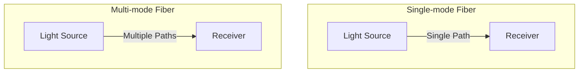

# Networks Fiber Optics

## Introduction

Fiber optic technology represents one of the most significant advancements in modern telecommunications and networking. Unlike traditional copper cables that transmit electrical signals, fiber optic cables use light to transmit data across vast distances with minimal loss and maximum speed. This technology forms the backbone of today's high-speed internet infrastructure and wide area networks (WANs).

In this guide, we'll explore how fiber optics work, their advantages over traditional copper wiring, implementation considerations, and real-world applications. Whether you're building a network or simply curious about how data travels across the globe, understanding fiber optics is essential for anyone interested in modern networking.

## What is Fiber Optics?

Fiber optics is a technology that uses thin strands of glass or plastic (optical fibers) to transmit data as pulses of light. Each optical fiber consists of:

1. **Core** - The central part where light travels
2. **Cladding** - The outer optical material that reflects light back into the core
3. **Buffer coating** - The protective layer that shields the fiber from damage


## How Fiber Optics Work

The fundamental principle behind fiber optics is **total internal reflection**. When light enters the core of a fiber at a certain angle, it bounces off the cladding (which has a lower refractive index than the core) and stays within the core as it travels through the cable.

### Basic Process:

1. A transmitter converts electrical signals into light pulses
2. Light travels through the optical fiber
3. A receiver converts the light pulses back into electrical signals

### Types of Fiber Optic Cables

There are two main types of fiber optic cables:

#### 1. Single-mode Fiber (SMF)
- Has a small core diameter (8-10 microns)
- Allows only one mode (path) of light to propagate
- Used for long-distance transmission (up to 100 km)
- Uses laser light sources
- Higher bandwidth capacity
- More expensive

#### 2. Multi-mode Fiber (MMF)
- Has a larger core diameter (50-62.5 microns)
- Allows multiple modes (paths) of light to propagate
- Used for shorter distances (up to 2 km)
- Uses LED light sources
- Lower cost than single-mode fiber



## Advantages of Fiber Optics in WANs

Fiber optics offers several advantages over traditional copper cabling for wide area networks:

1. **Higher Bandwidth** - Fiber can carry much more data than copper cables
2. **Longer Distances** - Signal degradation is minimal, allowing for connections spanning many kilometers without repeaters
3. **Immunity to Electromagnetic Interference** - Light signals aren't affected by electrical interference
4. **Security** - Extremely difficult to tap without detection
5. **Durability** - Resistant to environmental factors like temperature and moisture
6. **Future-proof** - Bandwidth can be increased by changing the equipment at the ends without replacing the fiber
7. **Size and Weight** - Fiber cables are lighter and thinner than copper equivalents

## Fiber Optic Network Components

A fiber optic network consists of several key components:

### 1. Optical Transmitters
Converts electrical signals into light pulses, usually using:
- **LEDs (Light Emitting Diodes)** - Used in multi-mode systems
- **Lasers** - Used in single-mode systems

### 2. Optical Fibers
The transmission medium that carries the light signals.

### 3. Optical Receivers
Converts light pulses back into electrical signals using photodetectors.

### 4. Connectors
Join fiber optic cables together or connect them to equipment:
- **SC (Subscriber Connector)** - Push-pull mechanism
- **LC (Lucent Connector)** - Smaller version of SC
- **ST (Straight Tip)** - Bayonet-style connector
- **FC (Ferrule Connector)** - Screw-type connector

### 5. Splices
Permanent joints between fiber optic cables:
- **Fusion splices** - Fibers are melted together
- **Mechanical splices** - Fibers are aligned and held in place mechanically

### 6. Optical Amplifiers
Boost signal strength for long-distance transmission without converting to electrical signals.

## Implementing Fiber Optics in a WAN

Setting up a fiber optic WAN involves several considerations:

### Planning Phase
```javascript
const planFiberNetwork = (locations, bandwidth, budget) => {
  const requiredComponents = [];
  const totalDistance = calculateDistanceBetweenLocations(locations);
  
  // Determine fiber type based on distance and bandwidth
  const fiberType = totalDistance > 10 ? 'single-mode' : 'multi-mode';
  
  // Calculate number of repeaters/amplifiers needed
  const repeatersNeeded = Math.floor(totalDistance / 80); // One repeater every 80km
  
  requiredComponents.push({
    type: 'fiber_cable',
    specs: fiberType,
    length: totalDistance * 1.2 // Adding 20% for routing and slack
  });
  
  requiredComponents.push({
    type: 'transmitters',
    count: locations.length,
    specs: fiberType === 'single-mode' ? 'laser' : 'LED'
  });
  
  if (repeatersNeeded > 0) {
    requiredComponents.push({
      type: 'repeaters',
      count: repeatersNeeded
    });
  }
  
  return {
    components: requiredComponents,
    estimatedCost: calculateCost(requiredComponents, budget),
    estimatedBandwidth: calculateAvailableBandwidth(fiberType, bandwidth)
  };
};

// Example output:
// {
//   components: [
//     { type: 'fiber_cable', specs: 'single-mode', length: 60 },
//     { type: 'transmitters', count: 2, specs: 'laser' },
//     { type: 'repeaters', count: 0 }
//   ],
//   estimatedCost: 15000,
//   estimatedBandwidth: '10 Gbps'
// }
```

### Installation Considerations

1. **Route Planning** - Survey the path for obstacles and existing infrastructure
2. **Right of Way** - Obtain necessary permissions for cable installation
3. **Installation Method**:
   - **Aerial** - Along existing utility poles
   - **Underground** - Direct buried or in conduits
   - **Submarine** - For crossing bodies of water

4. **Testing** - Verify integrity and performance:
   - **OTDR (Optical Time Domain Reflectometer)** testing for locating faults
   - **Power meter** testing for signal strength

## Fiber Optic Standards and Protocols

Several standards govern fiber optic networks:

1. **IEEE 802.3** (Ethernet over Fiber)
   - 1000BASE-SX (Gigabit Ethernet over multi-mode fiber)
   - 1000BASE-LX (Gigabit Ethernet over single-mode fiber)
   - 10GBASE-SR/LR/ER (10 Gigabit Ethernet variants)
   - 100GBASE-SR10/LR4/ER4 (100 Gigabit Ethernet variants)

2. **SONET/SDH** (Synchronous Optical Networking/Synchronous Digital Hierarchy)
   - Traditional telecom carrier standards
   - OC-3 (155 Mbps) to OC-768 (40 Gbps)

3. **Fiber Channel** - Used for storage area networks (SANs)

## Troubleshooting Fiber Optic Networks

Common issues in fiber networks and debugging approaches:

```javascript
function diagnoseOpticalLink(powerReadings, expectedLoss) {
  const inputPower = powerReadings.transmitter; // in dBm
  const outputPower = powerReadings.receiver; // in dBm
  const actualLoss = inputPower - outputPower;
  const tolerance = 3; // dB
  
  if (Math.abs(actualLoss - expectedLoss) > tolerance) {
    // Excessive loss detected
    return {
      status: 'DEGRADED',
      possibleCauses: [
        'Dirty connectors',
        'Bent fiber',
        'Poor splice',
        'Damaged cable'
      ],
      recommendedActions: [
        'Clean connectors using proper fiber cleaning tools',
        'Check for minimum bend radius violations',
        'Perform OTDR test to locate fault',
        'Inspect cable route for physical damage'
      ]
    };
  }
  
  return { status: 'HEALTHY', message: 'Link operating within specifications' };
}

// Example usage:
// const diagnosis = diagnoseOpticalLink({ transmitter: 0, receiver: -22 }, 20);
// console.log(diagnosis);
// Output: { status: 'DEGRADED', possibleCauses: [...], recommendedActions: [...] }
```

### Common Issues:

1. **High Attenuation** - Signal loss exceeding specifications
2. **Dirty Connectors** - Most common cause of problems
3. **Macro/Microbends** - Physical bending causing signal loss
4. **Broken Fibers** - Complete signal loss
5. **Dispersion** - Signal spreading that causes distortion

## Real-World Applications

### Global Internet Backbone
Submarine fiber optic cables connect continents and carry over 95% of international data traffic. Major cable systems like:
- Asia-America Gateway (AAG)
- Trans-Pacific Express (TPE)
- Africa Coast to Europe (ACE)

### Metropolitan Area Networks (MANs)
Fiber rings connect multiple locations within a city or region, providing high-speed connectivity between business districts.

### Fiber to the x (FTTx)
- **FTTH (Fiber to the Home)** - Direct fiber connection to residential buildings
- **FTTB (Fiber to the Building)** - Fiber to a building with copper for internal distribution
- **FTTC (Fiber to the Curb)** - Fiber to a street cabinet with copper for the final leg

### Case Study: Google Fiber

Google Fiber launched in 2010, offering gigabit internet connections to residential customers. This initiative helped drive adoption of high-speed fiber internet in the US and encouraged competition from other providers.

```javascript
// Example calculation of time to download a 4K movie (100GB) with different technologies
const calculateDownloadTime = (fileSize, connectionSpeed) => {
  // fileSize in GB, connectionSpeed in Mbps
  const fileSizeBits = fileSize * 8 * 1024; // Convert GB to Mb
  const timeSeconds = fileSizeBits / connectionSpeed;
  const timeMinutes = timeSeconds / 60;
  
  return timeMinutes.toFixed(2);
};

const technologies = [
  { name: 'DSL', speed: 10 },
  { name: 'Cable', speed: 100 },
  { name: 'Fiber', speed: 1000 }
];

technologies.forEach(tech => {
  console.log(`${tech.name}: ${calculateDownloadTime(100, tech.speed)} minutes`);
});

// Output:
// DSL: 13653.33 minutes (9.5 days)
// Cable: 1365.33 minutes (22.8 hours)
// Fiber: 136.53 minutes (2.3 hours)
```

## The Future of Fiber Optics

Fiber optic technology continues to evolve:

1. **Higher Capacity**
   - **Space-division multiplexing (SDM)** with multi-core fibers
   - **Mode-division multiplexing (MDM)** in few-mode fibers

2. **Increased Speeds**
   - 400G and 800G standards in development
   - Terabit speeds on the horizon

3. **Photonic Integration**
   - Silicon photonics integrating optical components on chips
   - Reduced size and power consumption

4. **Last-Mile Fiber**
   - Increasing FTTH deployments worldwide
   - Reduced installation costs through innovative deployment methods

## Summary

Fiber optic technology has revolutionized wide area networks by providing unprecedented bandwidth, reliability, and distance capabilities. Understanding the principles, components, and implementation considerations of fiber optics is essential for networking professionals.

The key points to remember:
- Fiber optic cables transmit data using light instead of electricity
- They offer higher bandwidth, longer distances, and immunity to electromagnetic interference
- Single-mode fiber is used for long distances, while multi-mode is more cost-effective for shorter runs
- Proper planning and installation are critical for optimal performance
- Fiber optics forms the backbone of the global internet and enables high-speed connections worldwide

## Practice Exercises

1. Calculate the bandwidth-distance product for a multi-mode fiber with bandwidth of 500 MHz-km and a length of 2 km.
2. Compare the total cost of ownership for a 50 km copper vs. fiber link over a 10-year period.
3. Design a redundant fiber optic WAN connecting three office locations.

## Additional Resources

- **Books**:
  - "Fiber Optic Communications" by Joseph C. Palais
  - "Understanding Fiber Optics" by Jeff Hecht

- **Certifications**:
  - Fiber Optic Association (FOA) certifications
  - Certified Fiber Optic Technician (CFOT)

- **Online Courses**:
  - Fiber Optic Network Design courses on popular e-learning platforms
  - IEEE courses on optical networking