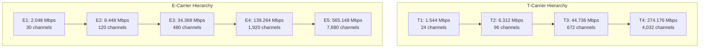
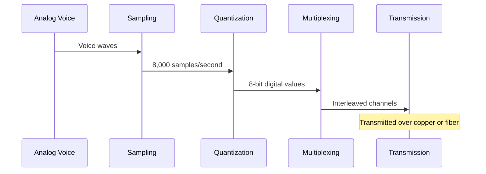

# Networks T-Carrier E-Carrier

## Introduction

T-Carrier and E-Carrier are digital transmission systems used in telecommunications for carrying multiple voice and data channels over the same connection. These technologies represent some of the earliest digital transmission standards that revolutionized telecommunications infrastructure worldwide. T-Carrier is primarily used in North America, Japan, and South Korea, while E-Carrier is the European equivalent used throughout the rest of the world.

These carrier systems were initially developed to increase the capacity of existing physical infrastructure while improving signal quality. Before we dive deeper, let's understand their basic purpose:

- **T-Carrier (T for Transmission)**: Developed by Bell Labs in the 1960s to maximize the number of voice calls that could be transmitted over a single physical medium.
- **E-Carrier (E for European)**: Developed as a European standard with similar goals but different specifications.

## T-Carrier Standards and Specifications

The T-Carrier system consists of several levels, each with increasing capacity:

### T1

T1 is the most common T-Carrier standard and forms the foundation of the hierarchy.

- **Data Rate**: 1.544 Mbps
- **Channels**: 24 voice channels (DS0s)
- **Framing**: 193 bits per frame (24 channels × 8 bits + 1 framing bit)
- **Signaling**: In-band or out-of-band
- **Physical Medium**: Typically two twisted-pair copper wires

T1 frames are organized into a structure called a "superframe" or an "extended superframe," which helps with synchronization and signaling.

```
T1 Frame Structure:
+-----+-----+-----+-----+-----+-----+
| F   | Ch1 | Ch2 | ... | Ch23| Ch24|
+-----+-----+-----+-----+-----+-----+
  1b    8b    8b          8b    8b
```

### T2

T2 is less commonly deployed but represents the next tier in the hierarchy.

- **Data Rate**: 6.312 Mbps
- **Equivalent**: Combines 4 T1 lines
- **Channels**: 96 voice channels

### T3

T3 is often used for high-capacity trunks between telecommunications facilities.

- **Data Rate**: 44.736 Mbps
- **Equivalent**: Combines 28 T1 lines
- **Channels**: 672 voice channels
- **Common Application**: Internet backbone connections before the widespread adoption of fiber optics

### T4

T4 is the highest level in the T-Carrier hierarchy.

- **Data Rate**: 274.176 Mbps
- **Equivalent**: Combines 168 T1 lines
- **Channels**: 4,032 voice channels

## E-Carrier Standards and Specifications

The E-Carrier system follows a similar hierarchical approach but with different specifications:

### E1

E1 is the European equivalent of T1 but offers more capacity.

- **Data Rate**: 2.048 Mbps
- **Channels**: 32 channels (30 voice channels, 1 signaling channel, 1 synchronization channel)
- **Time Slots**: Numbered from 0 to 31
- **Signaling**: Channel 16 is typically used for signaling
- **Synchronization**: Channel 0 is used for synchronization

```
E1 Frame Structure:
+-----+-----+-----+-----+-----+-----+-----+
| TS0 | TS1 | TS2 | ... | TS16| ... | TS31|
+-----+-----+-----+-----+-----+-----+-----+
  Sync  Data  Data      Signal     Data
```

### E2

- **Data Rate**: 8.448 Mbps
- **Equivalent**: Combines 4 E1 lines
- **Channels**: 120 voice channels

### E3

- **Data Rate**: 34.368 Mbps
- **Equivalent**: Combines 16 E1 lines
- **Channels**: 480 voice channels

### E4

- **Data Rate**: 139.264 Mbps
- **Equivalent**: Combines 64 E1 lines
- **Channels**: 1,920 voice channels

### E5

- **Data Rate**: 565.148 Mbps
- **Equivalent**: Combines 256 E1 lines
- **Channels**: 7,680 voice channels

## Comparing T-Carrier and E-Carrier

Let's compare the two systems to understand their key differences:



| Feature | T-Carrier | E-Carrier |
|---------|-----------|-----------|
| Origin | North America | Europe |
| Base Rate | 1.544 Mbps (T1) | 2.048 Mbps (E1) |
| Base Channels | 24 (T1) | 30 (E1) |
| Signaling | In-band or out-of-band | Dedicated channel (TS16) |
| Frame Bit | 1 framing bit per frame | Entire timeslot (TS0) |
| Typical Markets | USA, Canada, Japan, South Korea | Europe, Africa, Australia, most of Asia |

## How T-Carrier and E-Carrier Work

Both T-Carrier and E-Carrier systems employ time-division multiplexing (TDM) to transmit multiple channels over a single communication medium. Here's how they work:

1. **Sampling**: Analog voice signals are sampled at 8,000 times per second
2. **Quantization**: Each sample is converted to an 8-bit digital value
3. **Multiplexing**: Multiple channels are interleaved into time slots
4. **Framing**: Additional bits are added for synchronization and signaling
5. **Transmission**: The digital signals are transmitted over the physical medium



## Digital Signal (DS) Levels

In T-Carrier systems, the digital signal (DS) level describes the data rate:

- **DS0**: 64 Kbps (single voice channel)
- **DS1**: 1.544 Mbps (T1)
- **DS2**: 6.312 Mbps (T2)
- **DS3**: 44.736 Mbps (T3)
- **DS4**: 274.176 Mbps (T4)

Each DS level corresponds to a specific T-Carrier but describes the signal format rather than the physical implementation.

## Practical Applications

T-Carrier and E-Carrier systems have been foundational in telecommunications infrastructure. Here are some real-world applications:

### Business Connectivity

Many businesses still use T1/E1 lines for reliable internet and voice connectivity:

```javascript
// Example code for configuring a router for T1 connectivity
router.configure('Serial0/0', {
  encapsulation: 'hdlc',
  clockRate: 1544000, // 1.544 Mbps for T1
  framing: 'esf',  // Extended Superframe
  linecode: 'b8zs' // Bipolar with 8-Zero Substitution
});

// Output:
// Interface Serial0/0 configured for T1 connection
// Connectivity test: PASSED
// Available bandwidth: 1.544 Mbps
```

### Call Centers

Call centers often use E1/T1 connections for handling multiple simultaneous calls:

- A T1 can handle 24 simultaneous calls
- An E1 can handle 30 simultaneous calls
- Multiple T1/E1 lines can be combined for larger call centers

### Internet Service Providers

ISPs use T3/E3 and higher connections for their backbone networks:

- A T3 connection can serve hundreds of residential customers
- E3/T3 connections are often used to connect to internet exchange points (IXPs)

### Mobile Network Backhaul

Mobile network operators use T1/E1 connections for backhaul from cell towers to their core network:

- Each cell site might have one or more T1/E1 connections
- Modern networks are transitioning to fiber optics and Ethernet, but T-Carrier/E-Carrier remains in use in many areas

## Modern Replacements

While T-Carrier and E-Carrier systems revolutionized telecommunications, newer technologies are gradually replacing them:

1. **Metro Ethernet**: Offers scalable bandwidth from 10 Mbps to 100 Gbps
2. **SONET/SDH**: Optical networking standards that provide much higher capacities
3. **Packet-based Networks**: MPLS, VPLS, and other packet-switching technologies
4. **Fiber Optics**: Direct fiber connections with virtually unlimited bandwidth potential

Still, understanding T-Carrier and E-Carrier is important because:
- Legacy systems remain in operation
- Many concepts (like TDM) carry over to modern technologies
- They form the historical foundation of digital telecommunications

## Troubleshooting Common Issues

When working with T1/E1 lines, several common issues may arise:

### 1. Loss of Frame (LOF)

This occurs when the receiving equipment cannot synchronize with the framing pattern.

```javascript
// Checking for LOF errors
function checkFraming(t1Line) {
  const errors = t1Line.getErrors();
  if (errors.includes('LOF')) {
    console.log('Loss of Frame detected. Check physical connection and framing type.');
    return false;
  }
  return true;
}

// Output for faulty line:
// Loss of Frame detected. Check physical connection and framing type.
```

### 2. Bipolar Violations (BPV)

These occur when the alternating polarity pattern of the signal is violated.

### 3. Excessive Jitter

Timing variations that can degrade signal quality.

## Summary

T-Carrier and E-Carrier systems have been the backbone of digital telecommunications for decades. While they're gradually being replaced by newer technologies, their legacy and influence remain significant. They introduced concepts like time-division multiplexing that are still fundamental to modern networking.

The key points to remember:

- T-Carrier is used primarily in North America with T1 (1.544 Mbps) as its basic unit
- E-Carrier is used in Europe and most of the world with E1 (2.048 Mbps) as its basic unit
- Both use time-division multiplexing to combine multiple channels
- They form hierarchical systems with increasing capacities
- Despite being older technologies, they remain in use for critical telecommunications infrastructure

## Exercises

1. Compare the channel capacity and data rates of T1 and E1 systems. Why might one be preferred over the other in different contexts?

2. Draw a diagram showing how four voice conversations would be multiplexed onto a T1 line.

3. Research how a modern VoIP system might interface with legacy T1/E1 systems. What equipment would be needed?

4. Calculate how many simultaneous HD video streams (requiring 5 Mbps each) could be supported on a T3 connection.

5. Investigate whether your local telecommunications providers still offer T1/E1 services and what they charge compared to modern alternatives.

## Additional Resources

For more information on T-Carrier and E-Carrier systems:

- Telecommunications Industry Association (TIA) standards
- International Telecommunication Union (ITU) G.703 and G.704 recommendations
- Cisco documentation on configuring T1/E1 interfaces
- Books on digital telecommunications fundamentals