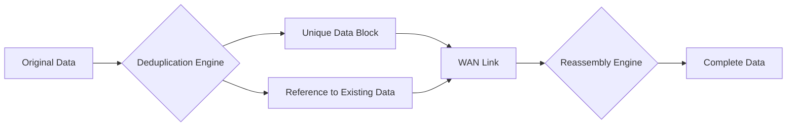
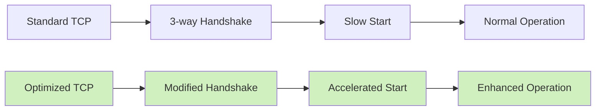
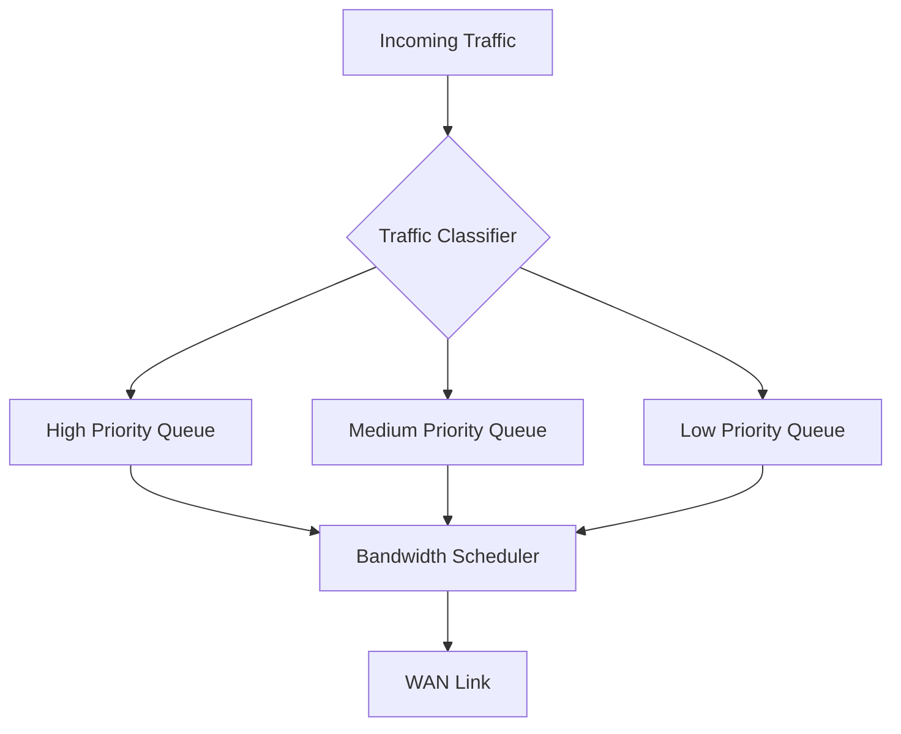

# Networks WAN Optimization

## Introduction

Wide Area Network (WAN) optimization refers to a set of techniques and technologies designed to maximize the efficiency of data transfer across a WAN. Unlike Local Area Networks (LANs) which operate within confined geographical areas, WANs connect networks across cities, countries, or even continents. This geographical dispersion introduces challenges like higher latency, limited bandwidth, and increased packet loss.

WAN optimization addresses these challenges by employing various methods to accelerate applications, reduce data transfer times, and minimize network congestion. For organizations with multiple branch offices or cloud-based applications, WAN optimization is crucial for maintaining productivity and user experience.

## Key Challenges in WAN Communication

Before diving into optimization techniques, let's understand the primary challenges in WAN environments:

1. **Latency**: The time delay for data packets to travel from source to destination
2. **Limited bandwidth**: Restricted data transfer capacity compared to LANs
3. **Packet loss**: Data packets that fail to reach their destination
4. **Protocol inefficiencies**: Some protocols weren't designed for high-latency networks
5. **Application chatty behavior**: Applications that require numerous back-and-forth communications

## Core WAN Optimization Techniques

### 1. Data Deduplication

Data deduplication identifies and removes redundant data before transmission. Instead of sending duplicate data, the system sends references to data that has already been transferred.



#### Example: File Transfer Optimization

When a user sends an email with an attachment to multiple recipients in different branch offices, deduplication ensures the attachment is sent only once across the WAN. Recipients retrieve the attachment from a local cache rather than downloading it repeatedly.

### 2. Compression

Compression reduces the size of data before transmission, allowing more efficient use of available bandwidth.

#### Types of Compression in WAN Optimization:

- **Lossless compression**: Preserves all original data (used for text, databases, executables)
- **Lossy compression**: Removes some data deemed less important (used for images, audio, video)

#### Example Implementation:

```javascript
// Simple pseudocode showing the concept of compression in WAN optimization
function optimizeDataTransfer(data) {
  // Check if data is compressible
  if (isCompressible(data)) {
    // Compress data before sending
    const compressedData = compressionAlgorithm(data);
    sendOverWAN(compressedData);
  } else {
    // Some data types may already be compressed (e.g., JPEG images)
    sendOverWAN(data);
  }
}

function receiveAndProcess(compressedData) {
  // Decompress at the receiving end
  const originalData = decompressionAlgorithm(compressedData);
  return originalData;
}
```

### 3. Protocol Optimization

Many protocols weren't designed with high-latency WAN environments in mind. Protocol optimization modifies how these protocols function to reduce unnecessary round trips.

#### TCP Optimization:

TCP (Transmission Control Protocol) is particularly affected by high latency. WAN optimization techniques include:

- **TCP window size adjustment**: Increases the amount of data that can be in transit at once
- **Selective acknowledgments (SACK)**: Allows the receiver to acknowledge non-contiguous blocks of data
- **TCP slow start modification**: Accelerates the initial connection phase



### 4. Caching and Content Delivery

Caching stores frequently accessed data closer to end users, reducing the need to retrieve the same information repeatedly across the WAN.

#### Implementation Example:

```python
# Pseudocode for a simple caching system
class WANCache:
    def __init__(self):
        self.cache = {}
        self.cache_hits = 0
        self.cache_misses = 0
    
    def get_data(self, data_id):
        # Check if data exists in local cache
        if data_id in self.cache:
            self.cache_hits += 1
            return self.cache[data_id]
        else:
            # Data not in cache, retrieve from remote server
            self.cache_misses += 1
            data = retrieve_from_remote_server(data_id)
            # Store in cache for future requests
            self.cache[data_id] = data
            return data
    
    def cache_efficiency(self):
        total_requests = self.cache_hits + self.cache_misses
        if total_requests > 0:
            return (self.cache_hits / total_requests) * 100
        return 0
```

### 5. Traffic Shaping and QoS

Traffic shaping prioritizes critical applications and controls bandwidth allocation to ensure important traffic isn't delayed during congestion.

#### QoS (Quality of Service) Implementation:



## Real-World Applications of WAN Optimization

### Case Study 1: Global Enterprise with Remote Offices

A multinational corporation with headquarters in New York and offices in London, Tokyo, and Sydney implemented WAN optimization to address slow file transfers and collaboration issues.

**Challenges:**
- 200+ ms latency between locations
- Limited bandwidth on international links
- Large CAD files needing frequent transfer between design teams

**Solution:**
- Deployed WAN optimization appliances at each location
- Implemented data deduplication and compression
- Added application-specific optimizations for CAD software
- Configured caching for frequently accessed resources

**Results:**
- 85% reduction in file transfer times
- 60% decrease in WAN bandwidth utilization
- Improved real-time collaboration between international teams

### Case Study 2: Cloud Application Access Optimization

A financial services company moved their critical applications to the cloud but experienced performance issues from branch offices.

**Implementation:**

```javascript
// Example of how a request might be optimized
function optimizedCloudRequest(request) {
  // Check local cache first
  const cachedResponse = checkCache(request);
  
  if (cachedResponse && !isExpired(cachedResponse)) {
    return cachedResponse;
  }
  
  // Optimize the request
  const compressedRequest = compressRequest(request);
  
  // Bundle multiple small requests if possible
  const batchedRequest = batchWithOtherPendingRequests(compressedRequest);
  
  // Send over optimized connection
  const response = sendViaOptimizedConnection(batchedRequest);
  
  // Extract relevant response and cache it
  const extractedResponse = extractAndCacheResponse(response, request);
  
  return extractedResponse;
}
```

**Results:**
- 70% improvement in application response time
- Better user experience from branch offices
- Reduced load on cloud infrastructure

## WAN Optimization Technologies and Tools

### Physical Appliances

Hardware devices deployed at each end of a WAN connection to optimize traffic.

**Examples:**
- Riverbed Steelhead
- Cisco WAN Optimization
- Silver Peak Unity EdgeConnect

### Virtual Appliances

Software versions of hardware optimizers that can be deployed in virtual environments or cloud platforms.

**Benefits:**
- Lower cost than physical appliances
- Flexible deployment options
- Easy scaling

### Cloud-Based Optimization

Services that optimize traffic to and from cloud applications.

**Implementation approaches:**
- Cloud provider native solutions
- Third-party cloud optimization services
- SD-WAN (Software-Defined WAN) with built-in optimization

## Implementation Considerations

When planning WAN optimization deployment, consider these factors:

1. **Traffic analysis**: Understand your current traffic patterns before optimization
2. **Application prioritization**: Identify critical applications that need optimization
3. **Deployment model**: Choose between physical, virtual, or cloud-based solutions
4. **Symmetrical deployment**: Most solutions require optimization devices at both ends
5. **Integration with existing infrastructure**: Ensure compatibility with firewalls, routers, etc.

## Monitoring and Measuring Optimization Benefits

To ensure your WAN optimization is effective, measure these key metrics:

```javascript
// Pseudocode for monitoring WAN optimization effectiveness
function calculateOptimizationMetrics() {
  const metrics = {
    // Reduction in data transferred
    dataReductionRatio: originalDataSize / optimizedDataSize,
    
    // Application response time improvement
    responseTimeImprovement: (oldResponseTime - newResponseTime) / oldResponseTime * 100,
    
    // Cache efficiency
    cacheHitRatio: cacheHits / (cacheHits + cacheMisses) * 100,
    
    // Connection utilization
    bandwidthUtilization: currentBandwidthUsed / totalAvailableBandwidth * 100
  };
  
  return metrics;
}
```

## Future Trends in WAN Optimization

### Integration with SD-WAN

Software-Defined WAN (SD-WAN) is increasingly incorporating optimization techniques directly into its functionality.

### AI-Driven Optimization

Machine learning algorithms are being used to predict network conditions and automatically adjust optimization parameters.

### Zero-Trust Network Access

Security integration with WAN optimization to ensure secure, optimized access to applications.

## Summary

WAN optimization is essential for organizations that rely on efficient data transfer across geographically dispersed locations. By employing techniques like deduplication, compression, protocol optimization, caching, and traffic shaping, organizations can:

- Reduce data transfer times
- Improve application performance
- Maximize existing bandwidth utilization
- Enhance user experience
- Enable better collaboration across distances

When implementing WAN optimization, it's important to analyze your specific needs, choose the right deployment model, and continuously monitor performance to ensure the desired benefits are being achieved.

## Additional Resources and Exercises

### Exercises

1. **Traffic Analysis Exercise**: 
   Use Wireshark to capture and analyze traffic between two locations. Identify patterns that could benefit from WAN optimization.

2. **Calculation Practice**: 
   Calculate the theoretical bandwidth savings for a 10MB file being transferred daily with an estimated 60% redundancy rate over a month.

3. **Optimization Selection**: 
   For each scenario below, determine which WAN optimization technique would provide the most benefit:
   - VoIP communication between offices
   - Daily database replication
   - Software updates to branch offices
   - Video conferencing

### Further Learning

- Explore the TCP/IP protocol suite to understand how optimization techniques affect specific protocols
- Learn about modern SD-WAN technologies and how they incorporate optimization
- Study case studies of WAN optimization in different industries