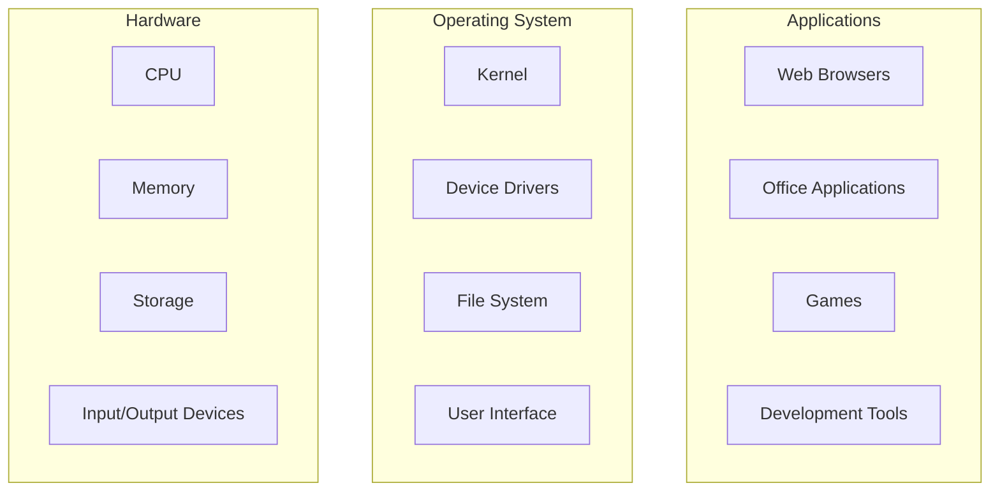

# Operating System Fundamentals

## Introduction

An operating system (OS) is the most essential software that runs on a computer. It manages computer hardware and software resources and provides common services for computer programs. Without an operating system, using a modern computer would be significantly more complex and much less intuitive.

Think of an operating system as a translator between you and your computer's hardware. When you click an icon, type on your keyboard, or save a file, the operating system translates these actions into instructions that your computer's hardware can understand.

## What is an Operating System?

An operating system is a software layer that sits between the hardware and the applications that you use daily. It serves several critical functions:

1. **Resource Management**: Controls and allocates computer resources (CPU, memory, disk space)
2. **Process Management**: Creates, schedules, and terminates processes
3. **Memory Management**: Allocates and deallocates memory space as needed
4. **File System Management**: Organizes and maintains files and directories
5. **Device Management**: Communicates with and controls hardware devices
6. **User Interface**: Provides a way for users to interact with the computer (GUI or CLI)
7. **Security**: Protects the system and user data

Let's visualize the relationship between hardware, operating system, and applications:



## Types of Operating Systems

There are several types of operating systems, each designed for specific use cases:

### Desktop Operating Systems

Examples: Windows, macOS, Linux distributions (Ubuntu, Fedora)

These provide a graphical user interface (GUI) and are designed for personal computers. They focus on user experience and multitasking.

### Mobile Operating Systems

Examples: Android, iOS

Designed for smartphones and tablets with touch interfaces and power efficiency in mind.

### Server Operating Systems

Examples: Windows Server, Linux server distributions (RHEL, Ubuntu Server)

Optimized for network operations, stability, and security rather than user interface.

### Embedded Operating Systems

Examples: Embedded Linux, RTOS (Real-Time Operating System)

Designed for devices like smart TVs, car systems, and IoT devices, often with resource constraints.

## Core Components of an Operating System

### The Kernel

The kernel is the central component of an operating system and the first program loaded during startup. It has complete control over everything in the system and provides the most basic level of control over all computer hardware devices.

The kernel is responsible for:
- Memory management
- Process management
- Device management
- System calls and security

There are different types of kernels:
- **Monolithic kernels**: All OS services run in kernel space (e.g., Linux)
- **Microkernels**: Minimal services in kernel space; most run in user space (e.g., MINIX)
- **Hybrid kernels**: Combine aspects of monolithic and microkernels (e.g., Windows NT)

### Process Management

A process is a program in execution. The operating system is responsible for:

- Creating and terminating processes
- Suspending and resuming processes
- Process synchronization
- Inter-process communication
- Handling deadlocks

Let's look at a simple code example that creates a new process in C:

```c
#include <stdio.h>
#include <unistd.h>

int main() {
    pid_t pid = fork();
    
    if (pid < 0) {
        fprintf(stderr, "Fork failed
");
        return 1;
    } else if (pid == 0) {
        // Child process
        printf("Child process (PID: %d)
", getpid());
    } else {
        // Parent process
        printf("Parent process (PID: %d), created child (PID: %d)
", getpid(), pid);
    }
    
    return 0;
}
```

Output:
```
Parent process (PID: 3456), created child (PID: 3457)
Child process (PID: 3457)
```

### Memory Management

Memory management involves keeping track of each byte of memory: which parts are in use, which parts are not, and how to allocate or deallocate memory when requested.

Key memory management concepts include:

- **Physical vs. Virtual Memory**: Mapping between memory addresses used by programs and actual physical addresses
- **Paging**: Dividing memory into fixed-size blocks
- **Segmentation**: Dividing memory based on logical divisions of programs
- **Swapping**: Moving processes between main memory and secondary storage

### File System Management

The file system is how the operating system organizes and retrieves files on storage devices. It provides:

- A hierarchical directory structure
- File creation, deletion, and manipulation
- Access control and file permissions
- File searching and metadata

Here's a simple Python code example that shows how to interact with the file system:

```python
import os

# List files and directories
print("Files and directories in current directory:")
for item in os.listdir('.'):
    if os.path.isdir(item):
        print(f"{item}/")
    else:
        print(item)

# Create a new directory
os.makedirs('new_directory', exist_ok=True)
print("
Created a new directory")

# Create and write to a file
with open('new_directory/example.txt', 'w') as f:
    f.write('This is an example file created by the operating system.')

# Read file information
file_stats = os.stat('new_directory/example.txt')
print(f"
File size: {file_stats.st_size} bytes")
print(f"File permissions: {oct(file_stats.st_mode)}")
```

### Device Management

Device management involves:

- Device drivers for communication with hardware
- Providing an interface for device I/O
- Managing device allocation
- Handling interrupts

### User Interface

Operating systems provide two main types of interfaces:

1. **Command Line Interface (CLI)**: Text-based interface where users type commands
2. **Graphical User Interface (GUI)**: Visual interface with windows, icons, and menus

## Real-World Application: Multi-tasking

One of the most important features of modern operating systems is multi-tasking - the ability to run multiple programs simultaneously. This isn't as straightforward as it might seem, as most computers have fewer CPU cores than the number of programs they run.

Let's explore how this works:

1. **Time-sharing**: The OS allocates small time slices to each process, switching between them quickly.
2. **Context switching**: The OS saves the state of one process before switching to another.
3. **Process scheduling**: The OS decides which process to run next based on priorities and other factors.

Here's a simple demonstration of concurrent tasks in JavaScript:

```javascript
// Simulating multiple processes running concurrently
console.log("Process 1: Starting");

// Process 2 (simulated with setTimeout)
setTimeout(() => {
    console.log("Process 2: Running a background task");
    console.log("Process 2: Completed");
}, 1000);

// Process 3 (immediate execution)
console.log("Process 3: Performing a calculation");
const result = 42;
console.log(`Process 3: Result = ${result}`);

// Back to Process 1
console.log("Process 1: Still running");
console.log("Process 1: Completed");
```

Output:
```
Process 1: Starting
Process 3: Performing a calculation
Process 3: Result = 42
Process 1: Still running
Process 1: Completed
Process 2: Running a background task
Process 2: Completed
```

Notice how the operating system manages these different "processes" (in this case, JavaScript tasks) to create the illusion of simultaneous execution.

## Modern Operating System Concepts

### Distributed Operating Systems

Distributed operating systems manage resources across multiple physical computers, making the network appear as a single computer to users.

Key features include:
- Distributed file systems
- Load balancing
- Fault tolerance
- Remote procedure calls

### Virtualization

Virtualization allows running multiple operating systems on a single physical machine:

- **Virtual machines**: Complete OS instances running on virtualized hardware
- **Containers**: Lightweight, isolated environments sharing the host OS kernel

```mermaid
flowchart TD
    subgraph "Physical Hardware"
        CPU[CPU]
        RAM[Memory]
        Storage[Storage]
    end
    
    subgraph "Hypervisor"
        VM1[Virtual Machine 1]
        VM2[Virtual Machine 2]
        VM3[Virtual Machine 3]
    end
    
    VM1 --> Guest_OS1[Windows OS]
    VM2 --> Guest_OS2[Linux OS]
    VM3 --> Guest_OS3[macOS]
    
    Hypervisor --> "Physical Hardware"
```

### Cloud Computing

Cloud computing relies heavily on modern operating system concepts:
- On-demand self-service
- Resource pooling
- Rapid elasticity
- Measured service

## Common Operating Systems

### Windows

Developed by Microsoft, Windows is the most widely used desktop operating system. Known for its user-friendly interface and extensive software compatibility.

### macOS

Developed by Apple for their Mac computers, macOS is known for its sleek design, stability, and integration with other Apple devices.

### Linux

An open-source operating system kernel that forms the basis of many distributions (distros). Linux is highly customizable, secure, and powers most servers and supercomputers.

### Android

A mobile operating system based on a modified Linux kernel, developed by Google for touchscreen devices.

### iOS

Apple's mobile operating system for iPhones and iPads, known for its security and controlled ecosystem.

## Summary

Operating systems serve as the critical bridge between hardware and software, managing resources, providing services, and enabling user interaction with computers. The fundamental components include:

- The kernel (the core of the OS)
- Process management
- Memory management
- File system management
- Device management
- User interfaces

Understanding these fundamentals is essential for anyone working in computer science or information technology, as they form the foundation upon which all other computer operations are built.

## Exercises

1. Compare and contrast two different operating systems of your choice. What are their strengths and weaknesses?
2. Explain the difference between a process and a thread. How does the operating system handle each?
3. Write a simple program that creates a file, writes some data to it, reads it back, and then deletes the file. Observe how the operating system manages these operations.
4. Research and explain how virtual memory works in modern operating systems.
5. Draw a diagram showing the lifecycle of a process from creation to termination.

## Additional Resources

- **Books**:
  - "Modern Operating Systems" by Andrew S. Tanenbaum
  - "Operating System Concepts" by Silberschatz, Galvin, and Gagne

- **Online Courses**:
  - MIT OpenCourseWare: Operating System Engineering
  - Stanford's Operating Systems course

- **Practice**:
  - Set up a virtual machine with a different operating system than your main one
  - Try using terminal/command line for daily tasks to understand OS interfaces