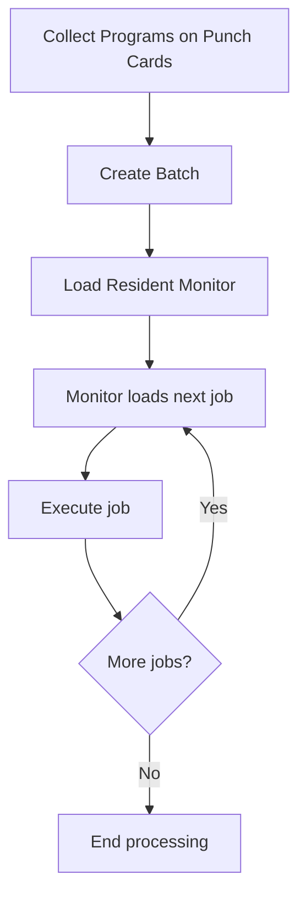
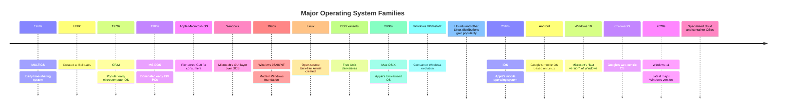

# Evolution of Operating Systems

## Introduction

An operating system (OS) is the fundamental software that manages computer hardware and provides common services for computer programs. The journey of operating systems reflects the remarkable evolution of computing itself - from room-sized machines operated by specialists to powerful devices in our pockets used by billions.

This article traces the fascinating development of operating systems through the decades, highlighting major milestones, paradigm shifts, and the constant drive to make computers more powerful, accessible, and useful.

## The Early Days: No Operating Systems (1940s-1950s)

In the very beginning, computers didn't have operating systems at all!

### Manual Operation Era

- **Early computers** like ENIAC (1945) were programmed manually through physical switches and rewiring
- Each program ran one at a time with direct hardware manipulation
- Programmers had to:
  - Book machine time (often days or weeks in advance)
  - Set up their programs using punched cards or paper tape
  - Debug by analyzing lights and printed output
  - Handle all hardware interactions manually

```
// No code examples exist from this era as programs were physical configurations rather than written code
```

### First Generation: Simple Batch Systems

As computers evolved from vacuum tubes to transistors, the first primitive operating systems emerged in the form of simple batch processing systems.

## Batch Processing Systems (Late 1950s-1960s)

The earliest recognizable operating systems were batch systems designed to minimize idle time on expensive mainframe computers.

### How Batch Systems Worked

1. Programs ("jobs") were collected into batches
2. A simple operating system called a **resident monitor** would:
   - Load the next job into memory
   - Transfer control to that job
   - When job completed, regain control and load the next job



### Limitations

- No interaction during program execution
- Long turnaround time (hours or days)
- Inefficient use of resources - CPU would be idle during I/O operations

## Multiprogramming and Timesharing (1960s-1970s)

The next major advance came with systems that could keep multiple programs in memory simultaneously.

### Multiprogramming

Multiprogramming allowed the CPU to switch between programs when one was waiting for I/O, dramatically improving efficiency.

```
// Conceptual pseudocode for a simple multiprogramming OS scheduler
while (true) {
    for (each program in memory) {
        if (program is ready to run) {
            execute program until I/O request or completion;
        }
    }
}
```

### Time-Sharing Systems

Time-sharing was a revolutionary concept that allowed multiple users to interact with a computer simultaneously, with the OS rapidly switching between tasks.

- **CTSS (Compatible Time-Sharing System)** - Developed at MIT in 1961
- **Multics** - Influential time-sharing OS (1964-1969)
- **UNIX** - Created at Bell Labs in 1969, a simplified response to Multics

Time-sharing systems introduced many concepts we still use today:

- Command line interfaces
- File systems with hierarchical directories
- User accounts and permissions
- Memory protection between processes

```bash
# Example of early UNIX commands (circa 1970s)
$ ls
$ cd /usr/bin
$ cat myfile.txt
$ who
```

## Personal Computer Era (1970s-1980s)

The microcomputer revolution brought computing to individuals, requiring new types of operating systems.

### Early PC Operating Systems

- **CP/M (Control Program/Monitor)** - Dominant OS for early microcomputers
- **Apple DOS** - For Apple II computers
- **MS-DOS (Microsoft Disk Operating System)** - Released in 1981 for the IBM PC

These early PC operating systems were simple by today's standards:

- Single-user systems
- Command-line interfaces
- Limited memory management
- No multitasking (one program at a time)

```bash
# Example MS-DOS commands
C:\> DIR
C:\> CD PROGRAMS
C:\PROGRAMS> EDIT MYFILE.TXT
```

### Graphical User Interfaces Emerge

The 1980s saw the development of graphical user interfaces (GUIs):

- **Apple Lisa and Macintosh** - Introduced the first commercially successful GUI OS
- **Windows** - Microsoft's GUI that ran on top of MS-DOS initially
- **AmigaOS** - Advanced multimedia capabilities for its time

## Modern Operating System Evolution (1990s-Present)

### The Rise of 32-bit and 64-bit Computing

- **Windows 95/98/NT/2000/XP** - Progressive evolution of Microsoft's platform
- **Linux** - Free, open-source Unix-like OS created by Linus Torvalds in 1991
- **macOS** - Built on Unix foundations with the NeXTSTEP acquisition

Modern operating systems introduced:

- Preemptive multitasking
- Protected memory
- Advanced graphics and networking
- Complex file systems

```c
// Example of a modern OS system call in C
#include <stdio.h>
#include <unistd.h>

int main() {
    pid_t pid = fork();  // Create a new process
    
    if (pid == 0) {
        printf("Child process running
");
    } else {
        printf("Parent process running, child has PID: %d
", pid);
    }
    
    return 0;
}
```

### Mobile Operating Systems

The smartphone revolution brought new OS designs:

- **iOS** - Apple's mobile OS for iPhone and iPad
- **Android** - Google's mobile OS based on Linux
- **Windows Phone/Mobile** - Microsoft's mobile efforts (discontinued)

Mobile operating systems introduced:

- Touch interfaces
- App stores and sandboxing
- Power management and resource constraints
- Location and sensor capabilities

```swift
// Example iOS Swift code for accessing mobile features
import UIKit
import CoreLocation

class LocationManager: NSObject, CLLocationManagerDelegate {
    let manager = CLLocationManager()
    
    override init() {
        super.init()
        manager.delegate = self
        manager.requestWhenInUseAuthorization()
        manager.startUpdatingLocation()
    }
    
    func locationManager(_ manager: CLLocationManager, didUpdateLocations locations: [CLLocation]) {
        if let location = locations.first {
            print("Latitude: \(location.coordinate.latitude)")
            print("Longitude: \(location.coordinate.longitude)")
        }
    }
}
```

### Embedded and Real-Time Operating Systems

As computing expanded beyond desktops and phones:

- **RTOS (Real-Time Operating Systems)** - For time-critical applications
- **Embedded OS** - For specialized devices, IoT, and appliances
- **QNX, VxWorks, FreeRTOS** - Examples of specialized operating systems

```c
// Example FreeRTOS task creation
void vATaskFunction(void *pvParameters) {
    for(;;) {
        // Task code here
        vTaskDelay(100);  // Delay for 100 milliseconds
    }
}

int main(void) {
    // Create the task
    xTaskCreate(
        vATaskFunction,        // Function that implements the task
        "ExampleTask",         // Text name for the task
        1000,                  // Stack size in words
        NULL,                  // Task input parameter
        1,                     // Priority of the task
        NULL                   // Task handle
    );
    
    // Start the scheduler
    vTaskStartScheduler();
    
    // Should never reach here
    return 0;
}
```

### Virtualization and Cloud Operating Systems

Most recently, operating systems have evolved to accommodate virtualization and cloud computing:

- **Hypervisors** (like VMware ESXi, Xen, KVM) - Allow running multiple OS instances
- **Container technologies** (Docker, Kubernetes) - Lightweight virtualization
- **Cloud-optimized OS** designs (CoreOS, etc.)

```yaml
# Example Docker container definition
version: '3'
services:
  webapp:
    image: node:14
    container_name: my-node-app
    ports:
      - "3000:3000"
    volumes:
      - ./app:/usr/src/app
    working_dir: /usr/src/app
    command: npm start
    environment:
      - NODE_ENV=production
```

## Key OS Concepts Throughout Evolution

Throughout this evolution, several key concepts have developed and matured:

### Process Management

From single-program batch systems to complex multitasking:

- **Process:** A program in execution
- **Thread:** Lightweight process (shares resources)
- **Scheduler:** Determines which process runs when
- **Context switching:** Changing from one process to another

### Memory Management

The evolution of memory systems:

- **Physical vs. Virtual memory**
- **Paging and Segmentation**
- **Memory protection**
- **Swapping and Virtual memory**

### File Systems

From basic storage to complex hierarchies:

- **File abstraction**
- **Directories and paths**
- **Access controls**
- **Journaling and recovery**

### User Interfaces

From toggle switches to natural language:

- **Command-line interfaces**
- **Graphical user interfaces**
- **Touch interfaces**
- **Voice and AI assistants**

## Operating System Families Timeline



## Summary

The evolution of operating systems reflects the incredible journey of computing itself - from room-sized mainframes to powerful smartphones and invisible embedded systems. Key trends throughout this evolution include:

1. **Increasing abstraction** - Operating systems have progressively hidden hardware complexity
2. **Improved resource utilization** - From single-job batch processing to sophisticated multitasking
3. **Enhanced user interfaces** - From toggle switches to natural language assistants
4. **Specialization for different domains** - Desktop, server, mobile, embedded, real-time
5. **Networking and distributed computing** - From isolated machines to interconnected systems

As computing continues to evolve, operating systems will adapt to new hardware paradigms, security challenges, and usage patterns. The next generation of operating systems may be designed around AI capabilities, quantum computing, or entirely new computing models not yet conceived.

## Further Learning

### Exercises

1. **Research Project**: Choose one historical operating system (like MULTICS, early UNIX, or MS-DOS) and write a one-page summary of its key innovations and limitations.

2. **Comparison Exercise**: Compare two current operating systems (Windows, macOS, Linux, Android, iOS) based on:
   - Process management approach
   - File system structure
   - User interface design
   - Security model

3. **Practical Exercise**: If you have access to a Linux system, explore the `/proc` directory to see how the OS exposes process information. Try commands like `ps`, `top`, and `htop` to observe process management in action.

### Key Concepts to Explore

- Kernel architecture (monolithic vs. microkernel)
- System calls and APIs
- Inter-process communication methods
- Virtual memory implementation
- Distributed operating systems