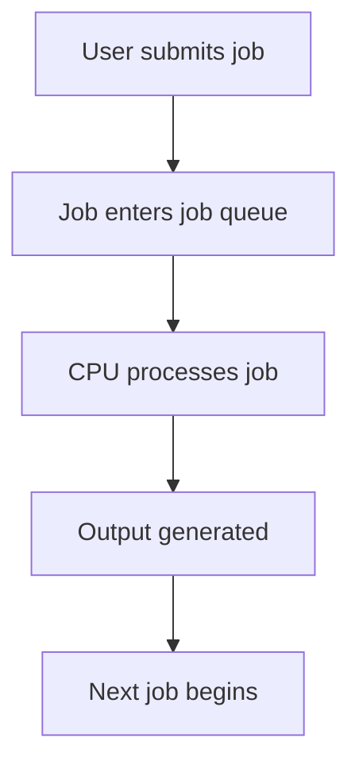
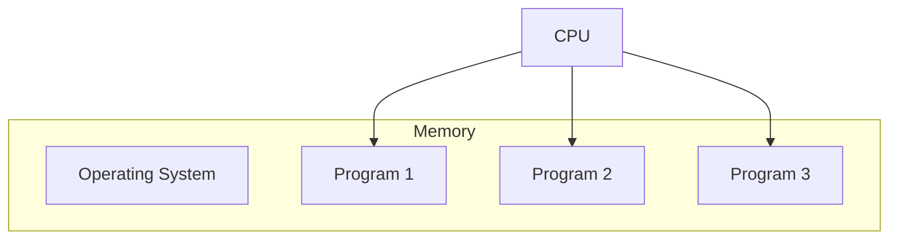
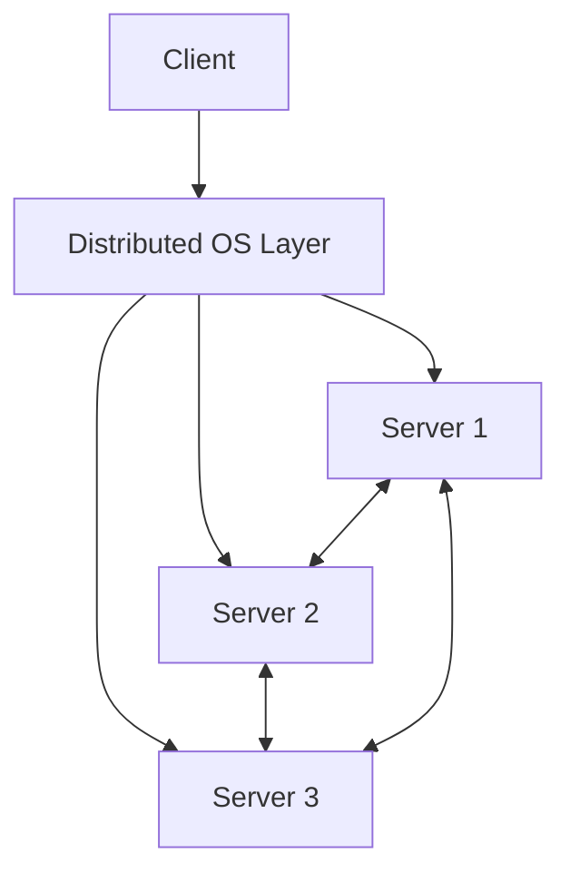
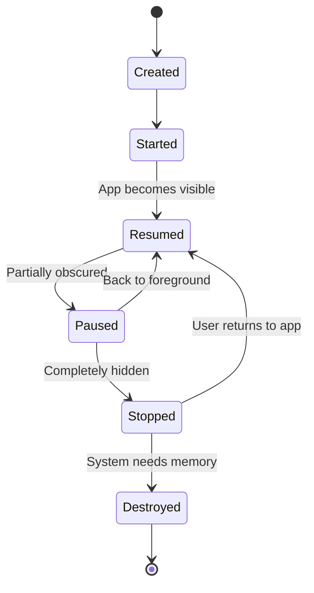

# Types of Operating Systems

## Introduction

An operating system (OS) serves as the critical interface between computer hardware and the user, managing system resources and providing services to programs. Different computing environments require different types of operating systems to function efficiently. In this article, we'll explore the major types of operating systems, their characteristics, advantages, limitations, and real-world applications.

## Batch Operating Systems

Batch operating systems were among the earliest types of operating systems developed in the 1950s and 1960s. They were designed to execute jobs (or batches of jobs) without user interaction.

### Characteristics

- Jobs are grouped into batches with similar requirements
- Minimal or no user interaction during processing
- Jobs are processed in sequence, one after another
- High throughput for similar types of jobs

### Example Workflow



### Real-World Applications

Batch systems are still used today for:

- Payroll processing
- Bank statement generation
- End-of-day transaction processing
- Scientific computations with large datasets

### Example Batch Processing Script

```bash
#!/bin/bash
# Simple batch processing script

echo "Beginning batch job processing..."

# Process all data files
for file in /data/inputs/*.csv; do
  echo "Processing $file..."
  python process_data.py "$file" > "$(basename "$file" .csv)_output.txt"
done

echo "Batch processing complete."
```

## Multi-Programming Operating Systems

Multiprogramming systems improve CPU utilization by organizing jobs so that the CPU always has one to execute.

### Characteristics

- Multiple programs loaded in memory at once
- CPU switches between programs when one is waiting for I/O
- Improved CPU utilization
- Memory must be sufficient to hold multiple programs

### Memory Allocation in Multiprogramming



## Time-Sharing Operating Systems

Time-sharing systems extend the concept of multiprogramming by rapidly switching the CPU between multiple interactive users or tasks.

### Characteristics

- Multiple users share computing resources simultaneously
- CPU time is shared using round-robin scheduling
- Quick response time for users
- Each user gets a small time slice of CPU time

### Example: Process Scheduling

```javascript
// Simplified pseudocode for a round-robin scheduler
function roundRobinScheduler(processes, timeSlice) {
  let queue = [...processes];
  let currentTime = 0;
  
  while (queue.length > 0) {
    let currentProcess = queue.shift();
    
    if (currentProcess.remainingTime <= timeSlice) {
      // Process completes within this time slice
      currentTime += currentProcess.remainingTime;
      console.log(`Process ${currentProcess.id} completed at time ${currentTime}`);
    } else {
      // Process needs more time, give it another time slice later
      currentTime += timeSlice;
      currentProcess.remainingTime -= timeSlice;
      queue.push(currentProcess);
      console.log(`Process ${currentProcess.id} used time slice, ${currentProcess.remainingTime} remaining`);
    }
  }
}

// Example usage
const processes = [
  { id: 'A', remainingTime: 10 },
  { id: 'B', remainingTime: 5 },
  { id: 'C', remainingTime: 8 }
];

roundRobinScheduler(processes, 2);

// Output:
// Process A used time slice, 8 remaining
// Process B used time slice, 3 remaining
// Process C used time slice, 6 remaining
// Process A used time slice, 6 remaining
// Process B used time slice, 1 remaining
// Process C used time slice, 4 remaining
// Process A used time slice, 4 remaining
// Process B completed at time 14
// Process C used time slice, 2 remaining
// Process A used time slice, 2 remaining
// Process C completed at time 18
// Process A completed at time 20
```

### Real-World Applications

- Traditional UNIX/Linux multiuser systems
- Academic computing environments
- Early cloud computing platforms

## Real-Time Operating Systems (RTOS)

Real-time operating systems are designed to process data as it comes in, typically without buffer delays.

### Types of Real-Time Systems

1. **Hard Real-Time Systems**: Must complete operations within guaranteed constraints or the system fails
2. **Soft Real-Time Systems**: Can tolerate some delays, but performance degrades

### Characteristics

- Minimal latency
- Predictable timing behavior
- Priority-based scheduling
- Specialized interrupt handling
- Small memory footprint (often)

### Example RTOS Code

```c
// Simple task definition in a Real-Time OS like FreeRTOS
void temperatureMonitorTask(void *pvParameters) {
  const TickType_t xDelay = pdMS_TO_TICKS(100); // 100ms sampling rate
  
  while(1) {
    float temperature = readTemperatureSensor();
    
    if (temperature > CRITICAL_TEMP) {
      // Priority interrupt to shut down system
      triggerEmergencyShutdown();
    }
    
    // Wait for the next sampling period
    vTaskDelay(xDelay);
  }
}

// Task creation
void initTasks() {
  // Create the temperature monitoring task with high priority
  xTaskCreate(
    temperatureMonitorTask,
    "TempMonitor",
    configMINIMAL_STACK_SIZE,
    NULL,
    HIGH_PRIORITY,
    NULL
  );
}
```

### Real-World Applications

- Industrial automation systems
- Medical devices
- Automotive systems (engine control, anti-lock brakes)
- Aerospace control systems
- IoT devices with timing constraints

## Distributed Operating Systems

Distributed operating systems manage collections of independent computers, making them appear as a single coherent system.

### Characteristics

- Resource sharing across multiple computers
- Computational speedup
- Reliability through redundancy
- Communication via message passing
- Global scheduling across machines

### Architecture



### Example Distributed Call

```python
# Example of a distributed procedure call in Python
import Pyro4

# Connect to a remote service
remote_math_service = Pyro4.Proxy("PYRONAME:example.math_service")

# Call the remote function as if it were local
result = remote_math_service.add(5, 7)
print(f"Remote calculation result: {result}")

# The actual function runs on a different computer
# but appears as if it's running locally
```

### Real-World Applications

- Cloud computing infrastructures
- Web service architectures
- Scientific computing clusters
- Blockchain systems
- Content delivery networks

## Mobile Operating Systems

Mobile operating systems are designed specifically for mobile devices like smartphones and tablets.

### Characteristics

- Touch-oriented user interfaces
- Power management for battery efficiency
- Limited multitasking capabilities
- App-centric design
- Integrated services (location, camera, sensors)

### Real-World Examples

- Android (Google)
- iOS (Apple)
- HarmonyOS (Huawei)

### Application Lifecycle



## Network Operating Systems

Network operating systems are designed primarily to support workstations, servers, and network resources on a local area network.

### Characteristics

- Centralized servers for resource management
- File and printer sharing capabilities
- User authentication and directory services
- Network traffic management
- Security and access control

### Real-World Examples

- Windows Server
- Linux server distributions
- Novell NetWare (historically)

## Virtualized Operating Systems

Virtualization allows multiple operating systems to run simultaneously on a single physical machine.

### Types of Virtualization

1. **Full Virtualization**: Complete simulation of hardware
2. **Paravirtualization**: Partial hardware simulation with modified guest OS
3. **Container Virtualization**: OS-level virtualization sharing the host kernel

### Example Docker Container Setup

```yaml
# Docker Compose file for a simple web application
version: '3'
services:
  webapp:
    image: nginx:latest
    ports:
      - "8080:80"
    volumes:
      - ./website:/usr/share/nginx/html
    environment:
      - NGINX_HOST=example.com
    restart: always
```

### Real-World Applications

- Cloud computing services
- Development and testing environments
- Server consolidation
- Legacy system support
- Isolated security environments

## Embedded Operating Systems

Embedded operating systems run on specialized devices with specific functions and constraints.

### Characteristics

- Minimal resource requirements
- Dedicated purpose
- Real-time capabilities (often)
- Limited or no user interface
- Long-term stability and reliability

### Real-World Examples

- Embedded Linux
- VxWorks
- FreeRTOS
- ThreadX
- Zephyr

### Example Embedded System Code

```c
// Simple embedded system code for a thermostat
#include "device_drivers.h"

#define TEMP_THRESHOLD 75 // degrees F

void main() {
  // Initialize hardware
  system_init();
  temperature_sensor_init();
  cooling_system_init();
  
  // Main control loop
  while(1) {
    int current_temp = read_temperature();
    
    if (current_temp > TEMP_THRESHOLD) {
      activate_cooling();
      set_status_led(LED_BLUE);
    } else {
      deactivate_cooling();
      set_status_led(LED_GREEN);
    }
    
    // Check again in 30 seconds
    delay_ms(30000);
  }
}
```

## Comparison of Operating System Types

| OS Type | Key Features | Example Use Cases | Examples |
|---------|--------------|------------------|----------|
| Batch | Sequential job processing | Data processing, reports | IBM OS/360, early mainframe systems |
| Multi-user | Shared resources, user accounts | Academic computing, servers | Unix, Linux |
| Real-time | Timing guarantees, fast response | Industrial control, medical devices | VxWorks, QNX |
| Distributed | Resource sharing across networks | Cloud services, high-performance computing | Amoeba, Hadoop |
| Mobile | Touch UI, power management | Smartphones, tablets | Android, iOS |
| Network | Centralized resources, sharing | Business servers, file sharing | Windows Server, Novell |
| Virtualized | Multiple OS on one machine | Cloud computing, testing | VMware, Hyper-V |
| Embedded | Specialized, minimal | IoT devices, appliances | Embedded Linux, RTOS variants |

## Summary

The variety of operating system types demonstrates how computing needs have evolved and diversified over time. From the early batch systems processing jobs sequentially to today's complex distributed and virtualized environments, operating systems continue to adapt to new hardware capabilities and user requirements.

Each type of operating system offers specific advantages for its target environment, whether prioritizing resource efficiency, response time, user experience, or specialized functionality. Understanding these different types helps developers and system administrators choose the appropriate platform for their specific needs.

## Exercises

1. Compare and contrast real-time operating systems with time-sharing systems. When would you choose one over the other?

2. Design a simple batch processing system that could handle student grade calculations at the end of a semester.

3. Research how virtualization has changed the landscape of server management. What benefits does it provide compared to traditional physical server deployments?

4. Implement a simple round-robin scheduler (similar to the one shown in the time-sharing section) and test it with different process workloads and time slice values.

5. For embedded systems, what are the key constraints that influence operating system design? How do these constraints affect the features available in embedded operating systems?

## Further Reading

- "Operating System Concepts" by Silberschatz, Galvin, and Gagne
- "Modern Operating Systems" by Andrew S. Tanenbaum
- "Real-Time Systems" by Jane W. S. Liu
- "Distributed Systems: Principles and Paradigms" by Andrew S. Tanenbaum and Maarten Van Steen