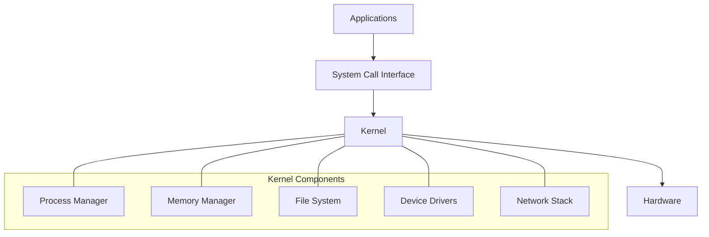
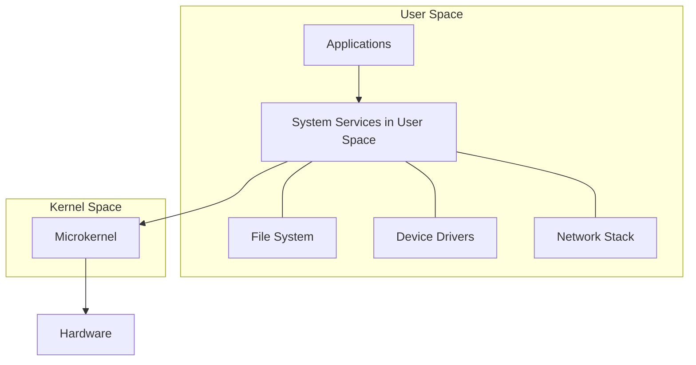

# Operating System Architecture

## Introduction

An operating system (OS) serves as the crucial intermediary between computer hardware and the software applications we use daily. Understanding OS architecture is essential for any programmer because it reveals how your code ultimately interacts with the underlying computer system.

In this guide, we'll explore the fundamental structures, components, and design principles that form modern operating systems. Whether you're developing applications, debugging system issues, or simply curious about what happens "under the hood" when you run a program, this knowledge will provide valuable context for your programming journey.

## Core Components of Operating System Architecture

At its foundation, operating system architecture can be divided into several key components that work together to provide a functional computing environment:

### 1. Kernel: The Heart of the OS

The kernel is the central component of any operating system. It has complete control over everything in the system and is responsible for:

- Memory management
- Process scheduling
- Device drivers
- System calls
- File system management



### 2. User Space vs. Kernel Space

Modern operating systems typically divide memory and execution contexts into two distinct regions:

- **Kernel Space**: Where the kernel and core OS services run with privileged access to hardware and memory
- **User Space**: Where applications run with limited privileges to protect the system

This separation is crucial for system stability and security. When an application needs to access hardware or perform a privileged operation, it makes a **system call** that transitions execution from user space to kernel space.

### 3. Process Management

A process is a program in execution. The OS manages processes by:

- Creating and terminating processes
- Suspending and resuming processes
- Process synchronization and communication
- CPU scheduling to share processor time

```javascript
// Simplified example of process creation in Node.js
const { spawn } = require('child_process');

// Create a new process
const childProcess = spawn('ls', ['-la']);

// Listen for output
childProcess.stdout.on('data', (data) => {
  console.log(`Output: ${data}`);
});

// Listen for process completion
childProcess.on('close', (code) => {
  console.log(`Process exited with code ${code}`);
});
```

### 4. Memory Management

Operating systems control how memory is allocated and used:

- **Virtual Memory**: Creates an abstraction that allows processes to use memory addresses independent of actual physical memory locations
- **Memory Protection**: Prevents processes from accessing memory assigned to other processes
- **Memory Allocation**: Assigning and reclaiming memory as processes start and terminate

### 5. File System Management

The file system provides organization, storage, retrieval, and access control for data:

- File creation, reading, and writing
- Directory management
- Access permissions
- Storage allocation

```javascript
// JavaScript example: File system operations using Node.js
const fs = require('fs');

// Writing to a file
fs.writeFileSync('example.txt', 'Hello, Operating System!');

// Reading from a file
const content = fs.readFileSync('example.txt', 'utf8');
console.log(content); // Output: Hello, Operating System!

// File information
const stats = fs.statSync('example.txt');
console.log(`File size: ${stats.size} bytes`);
console.log(`Created at: ${stats.birthtime}`);
```

### 6. I/O System Management

The operating system manages input/output operations to hardware devices:

- Device drivers for hardware communication
- Buffering to handle speed differences
- Caching to improve performance
- Error handling

## Operating System Architecture Patterns

Operating systems implement different architectural patterns that impact their performance, security, and flexibility:

### 1. Monolithic Kernel Architecture

In a monolithic design, the entire operating system runs in kernel space:

- **Advantages**: Direct function calls make it highly efficient; widely used in Linux, traditional Unix
- **Disadvantages**: Less modular; a bug in any part can crash the entire system

### 2. Microkernel Architecture

A microkernel design moves most services to user space, keeping only essential functions in the kernel:

- **Advantages**: Better stability and security; easier to extend and maintain
- **Disadvantages**: More context switching leads to potential performance overhead; examples include MINIX and QNX



### 3. Hybrid Kernel Architecture

A compromise between monolithic and microkernel designs:

- Most modern operating systems (Windows, macOS) use this approach
- Essential services run in kernel space for performance, while other services run in user space for modularity

## System Calls: The OS API

System calls are the interface between user applications and the operating system. They allow programs to request services from the kernel, such as:

- Process control (fork, exec, exit)
- File operations (open, read, write, close)
- Device manipulation
- Information maintenance
- Communication

```c
// C example: Using system calls to create a new process
#include <stdio.h>
#include <unistd.h>

int main() {
    pid_t pid = fork();  // Create a new process
    
    if (pid < 0) {
        // Error occurred
        fprintf(stderr, "Fork failed
");
        return 1;
    } else if (pid == 0) {
        // Child process
        printf("This is the child process with PID: %d
", getpid());
    } else {
        // Parent process
        printf("This is the parent process with PID: %d
", getpid());
        printf("Created a child with PID: %d
", pid);
    }
    
    return 0;
}
```

### How System Calls Work

1. An application makes a system call using a library function
2. The system transitions from user mode to kernel mode
3. The kernel executes the requested operation
4. The result is returned and the system transitions back to user mode

## Real-World OS Architecture Examples

Let's examine how these concepts apply to operating systems you likely use daily:

### Linux Architecture

Linux follows primarily a monolithic kernel design:

- Kernel manages core services (scheduling, memory management, file systems)
- Modular approach allows loading/unloading components at runtime
- User-space includes standard libraries, shell, and applications

### Windows Architecture

Windows uses a hybrid kernel architecture:

- NT kernel provides basic services
- Executive services handle higher-level functions
- Win32 subsystem supports applications
- User mode and kernel mode separation with well-defined interfaces

### macOS Architecture

macOS (Darwin) uses a hybrid architecture with:

- XNU kernel (combination of Mach microkernel and BSD components)
- Multiple abstraction layers including Cocoa and Core Services
- Strong separation between user space and kernel space

## Multi-user vs. Single-user OS Architecture

Operating systems are designed with different usage patterns in mind:

- **Single-user systems** (like most personal computers) optimize for individual performance and ease of use
- **Multi-user systems** (like servers) provide resource sharing, security, and isolation between users

## Practical Exercise: Observing OS Components

Here's a practical exercise to observe operating system components in action:

```javascript
// Node.js example to examine current running processes
const { execSync } = require('child_process');

// Get information about running processes
function getProcessInfo() {
  try {
    // Different command based on OS
    const command = process.platform === 'win32' 
      ? 'tasklist' 
      : 'ps -ef';
    
    const output = execSync(command).toString();
    console.log('Current running processes:');
    console.log(output.split('
').slice(0, 10).join('
'));
    
    // Get memory information
    const memCommand = process.platform === 'win32'
      ? 'wmic OS get FreePhysicalMemory,TotalVisibleMemorySize'
      : 'free -m';
    
    const memOutput = execSync(memCommand).toString();
    console.log('
Memory information:');
    console.log(memOutput);
  } catch (error) {
    console.error('Error retrieving system information:', error.message);
  }
}

getProcessInfo();
```

## Summary

Operating system architecture provides the foundation for all computing activities. We've explored:

- The core components of operating systems including the kernel, process management, memory management, and file systems
- Different architectural approaches like monolithic, microkernel, and hybrid designs
- The crucial role of system calls as the interface between applications and the OS
- Real-world examples of operating system architectures

Understanding these concepts helps you write more efficient code, debug system-level issues, and appreciate how your programs interact with the computer at a fundamental level.

## Additional Resources

To deepen your understanding of operating system architecture:

1. Try implementing simple system call wrappers in your preferred language
2. Experiment with different operating systems to compare their behavior
3. Explore advanced topics like virtualization and containerization

## Practice Exercises

1. Write a program that measures the time it takes to perform various file operations and observe how the operating system's file system and caching mechanisms affect performance.

2. Create a simple process management tool that lists running processes and allows basic operations like viewing resource usage.

3. Research and compare how memory management differs between Windows, Linux, and macOS in handling memory allocation and paging.