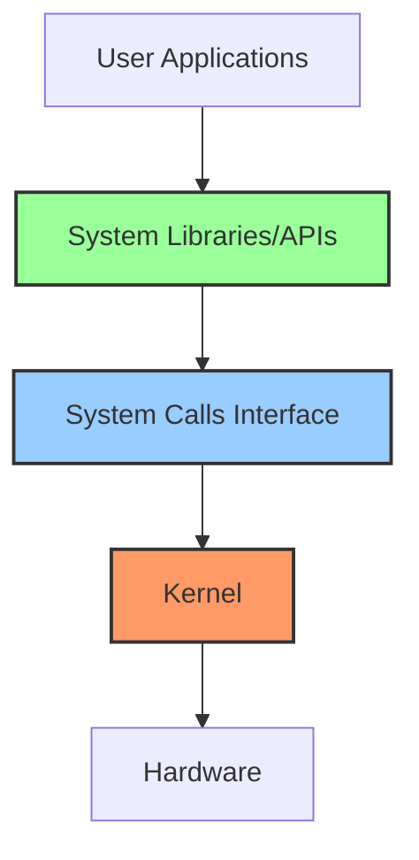
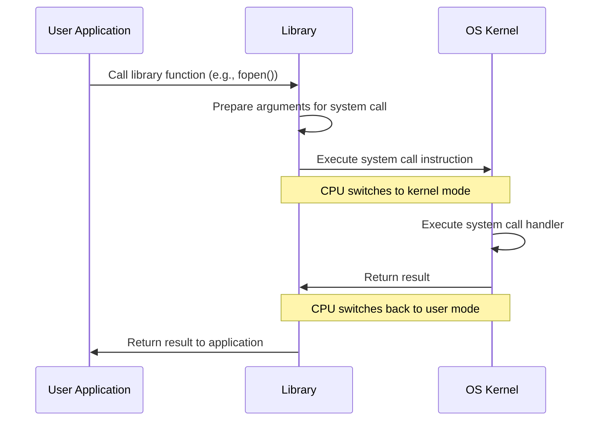
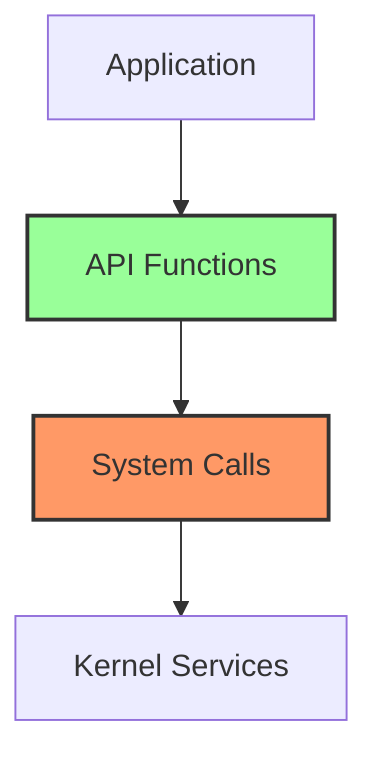

# System Calls and APIs

## Introduction

When you run a program on your computer, have you ever wondered how it can access hardware resources like files, network connections, or memory? How does your web browser save a downloaded file to your disk? How does your music player access your sound card?

The answer lies in **system calls** and **Application Programming Interfaces (APIs)**.

System calls are the fundamental interface between an application and the operating system kernel. They form the bridge that allows user programs to request services from the operating system. APIs, on the other hand, provide a higher-level, more programmer-friendly way to access these system calls.

In this tutorial, we'll explore what system calls and APIs are, how they work, and why they're essential for modern computing.

## Operating System Architecture: A Quick Refresher

Before diving into system calls, let's quickly revisit how an operating system is structured.



An operating system has two main execution modes:

1. **User Mode**: Where regular applications run with limited privileges
2. **Kernel Mode**: Where the core operating system runs with full access to hardware

System calls are the controlled entry points that allow transitions between these two worlds.

## What Are System Calls?

System calls are functions provided by the kernel that allow user-level programs to request services from the operating system. These services include:

- File operations (open, read, write, close)
- Process control (fork, exec, exit)
- Device manipulation
- Information maintenance
- Communication
- Protection

Let's look at a simple example to understand this better:

```c
#include <stdio.h>
#include <fcntl.h>
#include <unistd.h>

int main() {
    int fd = open("example.txt", O_RDONLY);
    if (fd == -1) {
        printf("Error opening file
");
        return 1;
    }
    
    char buffer[100];
    int bytes_read = read(fd, buffer, 100);
    buffer[bytes_read] = '\0';
    
    printf("Read %d bytes: %s
", bytes_read, buffer);
    close(fd);
    return 0;
}
```

In this C program, `open()`, `read()`, and `close()` are all system calls. When your program executes `open("example.txt", O_RDONLY)`, here's what happens behind the scenes:

1. The program prepares the arguments (file name and flags)
2. It executes a special instruction (like `syscall`, `int 0x80`, or `svc` depending on the platform)
3. The processor switches from user mode to kernel mode
4. The kernel validates the arguments, performs the requested operation, and returns the result
5. The processor switches back to user mode
6. Your program continues execution with the result of the system call

## Types of System Calls

System calls can be categorized into five major groups:

### 1. Process Control
- Creating and terminating processes
- Loading and executing programs
- Getting/setting process attributes

Example in C:
```c
#include <stdio.h>
#include <unistd.h>

int main() {
    pid_t pid = fork();
    
    if (pid < 0) {
        // Error occurred
        fprintf(stderr, "Fork failed
");
        return 1;
    } else if (pid == 0) {
        // Child process
        printf("Hello from child process (PID: %d)
", getpid());
    } else {
        // Parent process
        printf("Hello from parent process (PID: %d), child is %d
", getpid(), pid);
    }
    
    return 0;
}
```

Output:
```
Hello from parent process (PID: 1234), child is 1235
Hello from child process (PID: 1235)
```

### 2. File Management
- Creating/deleting files
- Opening/closing files
- Reading/writing files
- Changing attributes

### 3. Device Management
- Requesting/releasing devices
- Reading/writing to devices
- Getting/setting device attributes

### 4. Information Maintenance
- Getting/setting time and date
- Getting/setting system data
- Getting process, file, or device attributes

### 5. Communication
- Creating/deleting communication connections
- Sending/receiving messages
- Transferring status information

## System Call Implementation

How does the system actually execute these system calls? Let's look at a simplified view:



Each operating system has its own set of system calls:

- **Linux**: Around 300+ system calls (varying by kernel version)
- **Windows**: Several hundred system calls (often called "native API functions")
- **macOS/iOS**: Based on BSD and Mach kernels, with their own system call interfaces

## What Are APIs?

While system calls provide the fundamental interface to the kernel, they can be complex to use directly. This is where APIs come in.

**Application Programming Interfaces (APIs)** are higher-level interfaces that make it easier for programmers to access system functionality. They abstract away much of the complexity of direct system calls.

For example, instead of using the low-level `open`, `read`, and `write` system calls directly, most C programmers use the standard C library functions like `fopen()`, `fread()`, and `fwrite()`.

### Relationship Between System Calls and APIs



Consider the following Python example that reads a file:

```python
# High-level API (Python file object)
with open('example.txt', 'r') as file:
    content = file.read()
    print(content)
```

Behind the scenes, this Python code eventually leads to system calls like `open()`, `read()`, and `close()`, but the programmer doesn't need to directly manage these details.

## Common APIs and Their System Calls

Let's look at some common APIs and the system calls they might use:

### Standard C Library
- `fopen()` → `open()` system call
- `printf()` → eventually uses `write()` system call
- `malloc()` → may use `brk()` or `mmap()` system calls

### POSIX API
POSIX (Portable Operating System Interface) is a family of standards that helps maintain compatibility between different operating systems.

```c
#include <pthread.h>
#include <stdio.h>

void* thread_function(void* arg) {
    printf("Thread executing
");
    return NULL;
}

int main() {
    pthread_t thread_id;
    printf("Creating thread
");
    
    int result = pthread_create(&thread_id, NULL, thread_function, NULL);
    
    if (result != 0) {
        printf("Thread creation failed
");
        return 1;
    }
    
    pthread_join(thread_id, NULL);
    printf("Thread completed
");
    
    return 0;
}
```

Under the hood, `pthread_create()` might use system calls like `clone()` on Linux.

### Windows Win32 API
On Windows, applications typically use the Win32 API, which then interfaces with the Windows system calls (often called the "native API").

```c
#include <windows.h>
#include <stdio.h>

int main() {
    HANDLE hFile = CreateFile(
        "example.txt",             // File name
        GENERIC_READ,              // Access mode
        FILE_SHARE_READ,           // Share mode
        NULL,                      // Security attributes
        OPEN_EXISTING,             // Creation disposition
        FILE_ATTRIBUTE_NORMAL,     // Flags and attributes
        NULL                       // Template file
    );
    
    if (hFile == INVALID_HANDLE_VALUE) {
        printf("CreateFile failed with error %d
", GetLastError());
        return 1;
    }
    
    char buffer[100];
    DWORD bytesRead;
    
    BOOL readSuccess = ReadFile(
        hFile,          // File handle
        buffer,         // Buffer
        99,             // Number of bytes to read
        &bytesRead,     // Number of bytes read
        NULL            // Overlapped
    );
    
    if (!readSuccess) {
        printf("ReadFile failed with error %d
", GetLastError());
        CloseHandle(hFile);
        return 1;
    }
    
    buffer[bytesRead] = '\0';
    printf("Read %d bytes: %s
", bytesRead, buffer);
    
    CloseHandle(hFile);
    return 0;
}
```

Here, `CreateFile`, `ReadFile`, and `CloseHandle` are Win32 API functions that ultimately result in system calls to the Windows kernel.

## System Call Tracing

Want to see system calls in action? On Unix-like systems, you can use the `strace` command to trace system calls made by a program:

```bash
strace -o output.txt ./my_program
```

Example output might look like:
```
execve("./my_program", ["./my_program"], [/* 58 vars */]) = 0
brk(NULL)                               = 0x55d932577000
access("/etc/ld.so.preload", R_OK)      = -1 ENOENT
open("/etc/ld.so.cache", O_RDONLY|O_CLOEXEC) = 3
open("libc.so.6", O_RDONLY|O_CLOEXEC)   = 3
read(3, "\177ELF\2\1\1\3\0\0\0\0\0\0\0\0\3\0>\0\1\0\0\0\360q\2\0\0\0\0\0"..., 832) = 832
open("example.txt", O_RDONLY)           = 4
read(4, "Hello, world!
", 100)         = 14
write(1, "Read 14 bytes: Hello, world!
", 29) = 29
close(4)                                = 0
exit_group(0)                           = ?
```

On Windows, you can use tools like Process Monitor or API Monitor to observe system calls and API functions.

## Practical Example: Building a Simple File Copy Program

Let's wrap up with a practical example that shows system calls in action - a simple program to copy a file:

```c
#include <stdio.h>
#include <fcntl.h>
#include <unistd.h>
#include <stdlib.h>

#define BUFFER_SIZE 4096

int main(int argc, char *argv[]) {
    int source_fd, dest_fd;
    ssize_t bytes_read, bytes_written;
    char buffer[BUFFER_SIZE];
    
    // Check arguments
    if (argc != 3) {
        fprintf(stderr, "Usage: %s source_file destination_file
", argv[0]);
        return 1;
    }
    
    // Open source file for reading
    source_fd = open(argv[1], O_RDONLY);
    if (source_fd == -1) {
        perror("Error opening source file");
        return 1;
    }
    
    // Open destination file for writing
    dest_fd = open(argv[2], O_WRONLY | O_CREAT | O_TRUNC, 0644);
    if (dest_fd == -1) {
        perror("Error opening destination file");
        close(source_fd);
        return 1;
    }
    
    // Copy data
    while ((bytes_read = read(source_fd, buffer, BUFFER_SIZE)) > 0) {
        bytes_written = write(dest_fd, buffer, bytes_read);
        if (bytes_written != bytes_read) {
            perror("Write error");
            close(source_fd);
            close(dest_fd);
            return 1;
        }
    }
    
    if (bytes_read == -1) {
        perror("Read error");
        close(source_fd);
        close(dest_fd);
        return 1;
    }
    
    // Close files
    close(source_fd);
    close(dest_fd);
    
    printf("File copied successfully
");
    return 0;
}
```

In this program, we're using several system calls directly:
- `open()` to open the source and destination files
- `read()` to read data from the source file
- `write()` to write data to the destination file
- `close()` to close both files

This is a clear example of how system calls provide the fundamental building blocks that programs use to interact with the operating system.

## Summary

In this tutorial, we've explored:

1. **System calls** - The primary interface between user applications and the operating system kernel
2. **APIs** - Higher-level interfaces that make it easier to access system functionality
3. **How system calls work** - The mechanism by which the processor transitions between user mode and kernel mode
4. **Types of system calls** - The various categories of services provided by the kernel
5. **Real-world examples** - How to use system calls and APIs in actual code

Understanding system calls and APIs is crucial for any programmer who wants to comprehend how software interacts with the operating system and hardware resources.

## Exercises

1. Write a simple program that uses system calls to list all files in a directory.
2. Try using `strace` (Linux/Unix) or Process Monitor (Windows) to analyze the system calls made by a simple "Hello, World!" program.
3. Research how file permissions work at the system call level. What system calls are used to change file permissions?
4. Compare the different APIs available for network programming. How do they abstract the underlying system calls?
5. Implement the file copy program shown above, but modify it to use higher-level API functions like `fopen()`, `fread()`, and `fwrite()`. Compare the two implementations.

## Additional Resources

- [The Linux Programmer's Guide](https://tldp.org/LDP/lpg/node1.html)
- [Windows System Programming](https://docs.microsoft.com/en-us/windows/win32/sysinfo/system-programming)
- [POSIX Programmer's Manual](https://pubs.opengroup.org/onlinepubs/9699919799/)
- [Understanding the Linux Kernel](https://www.oreilly.com/library/view/understanding-the-linux/0596005652/) by Daniel P. Bovet and Marco Cesati
- [Advanced Programming in the UNIX Environment](https://www.oreilly.com/library/view/advanced-programming-in/0321637739/) by W. Richard Stevens