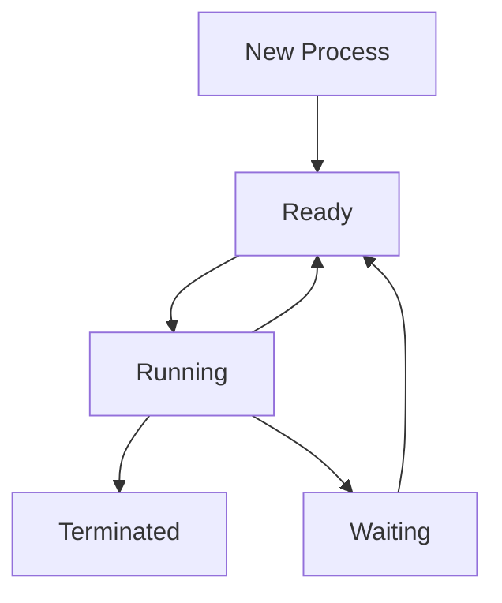
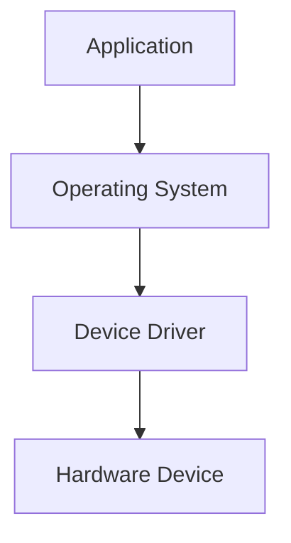
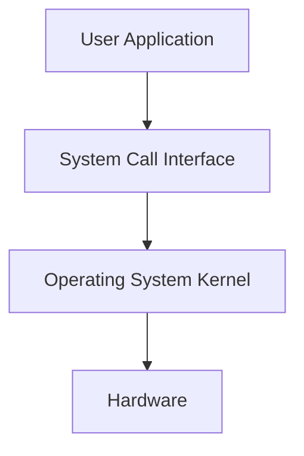

# Operating System Services

## Introduction

An operating system (OS) is the critical software layer that manages computer hardware and provides common services for computer programs. When you turn on your computer and run applications, the operating system works silently in the background, handling everything from memory allocation to file access.

Operating system services are the fundamental capabilities that the OS provides to both users and programs. These services create an environment where applications can execute efficiently while being isolated from the complexities of hardware interaction.

## Core Operating System Services

Let's explore the essential services that modern operating systems provide:

### 1. Process Management

Process management involves creating, scheduling, and terminating processes (running programs). This is perhaps the most crucial service of an operating system.



A process goes through various states during its lifetime:
- **New**: Process is being created
- **Ready**: Process is waiting to be assigned to a processor
- **Running**: Instructions are being executed
- **Waiting**: Process is waiting for some event to occur
- **Terminated**: Process has finished execution

#### Example: Process Creation in C

```c
#include <stdio.h>
#include <unistd.h>

int main() {
    pid_t pid = fork();
    
    if (pid < 0) {
        // Error occurred
        fprintf(stderr, "Fork failed
");
        return 1;
    } else if (pid == 0) {
        // Child process
        printf("Child process with PID: %d
", getpid());
    } else {
        // Parent process
        printf("Parent process with PID: %d created child with PID: %d
", getpid(), pid);
    }
    
    return 0;
}
```

**Sample output:**
```
Parent process with PID: 3456 created child with PID: 3457
Child process with PID: 3457
```

### 2. Memory Management

Memory management coordinates the use of computer memory, allocating portions to various running programs to ensure they run smoothly.

Key responsibilities include:
- Tracking which parts of memory are in use and by whom
- Allocating and deallocating memory space as needed
- Managing swap space (using disk as an extension of RAM)

#### Virtual Memory

Most modern operating systems use virtual memory, which provides an "illusion" of more memory than physically exists by using disk space as an extension of RAM.


#### Example: Memory Allocation in C

```c
#include <stdio.h>
#include <stdlib.h>
#include <string.h>

int main() {
    // Dynamically allocate memory for an array
    int* numbers = (int*)malloc(5 * sizeof(int));
    
    if (numbers == NULL) {
        fprintf(stderr, "Memory allocation failed
");
        return 1;
    }
    
    // Initialize the array
    for (int i = 0; i < 5; i++) {
        numbers[i] = i * 10;
    }
    
    // Print the values
    printf("Allocated memory contains: ");
    for (int i = 0; i < 5; i++) {
        printf("%d ", numbers[i]);
    }
    printf("
");
    
    // Free the allocated memory
    free(numbers);
    
    return 0;
}
```

**Sample output:**
```
Allocated memory contains: 0 10 20 30 40
```

### 3. File System Management

File systems provide a way to organize and store data on storage devices. The operating system manages:
- File creation, deletion, and manipulation
- Directory (folder) organization
- Access control and file permissions
- File metadata (creation time, size, owner, etc.)

#### Common File Operations

- **Create**: Make a new file
- **Delete**: Remove a file
- **Open**: Prepare a file for access
- **Close**: Release file resources
- **Read**: Get data from a file
- **Write**: Store data to a file
- **Seek**: Move to a specific location within a file

#### Example: File Operations in Python

```python
# Writing to a file
with open('example.txt', 'w') as file:
    file.write("This is a line of text.
")
    file.write("This is another line of text.")

# Reading from a file
with open('example.txt', 'r') as file:
    content = file.read()
    print("File content:")
    print(content)

# Appending to a file
with open('example.txt', 'a') as file:
    file.write("
This line was appended.")

# Reading again to see changes
with open('example.txt', 'r') as file:
    updated_content = file.read()
    print("
Updated file content:")
    print(updated_content)
```

**Sample output:**
```
File content:
This is a line of text.
This is another line of text.

Updated file content:
This is a line of text.
This is another line of text.
This line was appended.
```

### 4. Device Management

Device management involves controlling peripheral devices connected to the computer. The operating system:
- Provides a uniform interface for device access
- Manages device drivers
- Allocates devices to processes
- Deallocates devices when no longer needed
- Provides buffering for device I/O

#### Device Drivers

Device drivers are software components that allow the operating system to communicate with hardware devices. They abstract the hardware details and provide a standard interface for the OS.



### 5. Input/Output (I/O) Management

I/O management handles the transfer of data between memory and peripheral devices. This includes:
- Managing data buffers
- Scheduling I/O requests
- Error handling

#### Buffering

Buffering is a technique used to temporarily store data during transfer between devices that operate at different speeds.

#### Example: Buffered I/O in C

```c
#include <stdio.h>

int main() {
    FILE *file;
    char buffer[100];
    
    // Open file for writing
    file = fopen("buffer_example.txt", "w");
    if (file == NULL) {
        printf("Error opening file!
");
        return 1;
    }
    
    // Write to file (data is buffered)
    fputs("This data is placed in a buffer before being written to disk.
", file);
    
    // Force buffer to be written to disk
    fflush(file);
    
    // Close file (automatically flushes buffer)
    fclose(file);
    
    // Open file for reading
    file = fopen("buffer_example.txt", "r");
    if (file == NULL) {
        printf("Error opening file for reading!
");
        return 1;
    }
    
    // Read from file (data is buffered)
    fgets(buffer, sizeof(buffer), file);
    printf("Read from file: %s", buffer);
    
    // Close file
    fclose(file);
    
    return 0;
}
```

**Sample output:**
```
Read from file: This data is placed in a buffer before being written to disk.
```

### 6. Network Management

Modern operating systems provide services for networking, including:
- Implementation of networking protocols (TCP/IP, etc.)
- Network interface management
- Setting up and managing network connections
- Network security

#### Socket Programming

Sockets are endpoints for communication between machines. Operating systems provide socket APIs that applications can use for network communication.

#### Example: Simple TCP Server in Python

```python
import socket

# Create a TCP/IP socket
server_socket = socket.socket(socket.AF_INET, socket.SOCK_STREAM)

# Bind the socket to the address and port
server_address = ('localhost', 8000)
server_socket.bind(server_address)

# Listen for incoming connections
server_socket.listen(1)
print("Server is listening on port 8000...")

# Wait for a connection
connection, client_address = server_socket.accept()
print(f"Connection from {client_address}")

try:
    # Receive data
    data = connection.recv(1024)
    print(f"Received: {data.decode()}")
    
    # Send data
    message = "Hello from server!"
    connection.sendall(message.encode())
    print("Sent response to client")
    
finally:
    # Clean up the connection
    connection.close()
    server_socket.close()
```

### 7. Security Services

Operating systems provide various security services:
- User authentication
- Access control
- Encryption
- Firewall capabilities
- Malware detection and prevention

#### Access Control

Operating systems control which users can access which resources through permissions and access control lists.

#### Example: File Permissions in Unix/Linux

In Unix-like systems, file permissions are represented by a combination of read (r), write (w), and execute (x) permissions for the owner, group, and others.

```bash
# Creating a file
touch myfile.txt

# Setting permissions (read/write for owner, read for group, none for others)
chmod 640 myfile.txt

# Viewing permissions
ls -l myfile.txt
```

**Sample output:**
```
-rw-r----- 1 user group 0 Mar 18 10:30 myfile.txt
```

### 8. User Interface

Operating systems provide interfaces for users to interact with the computer:

#### Command-Line Interface (CLI)

A text-based interface where users type commands to interact with the OS.

#### Graphical User Interface (GUI)

A visual interface with windows, icons, menus, and pointers (WIMP).

#### Example: System Commands

Different operating systems provide different commands for similar operations:

**Windows Command Prompt:**
```
C:\> dir               # List files in directory
C:\> mkdir new_folder  # Create a new directory
C:\> type file.txt     # Display file contents
```

**Unix/Linux Terminal:**
```
$ ls                   # List files in directory
$ mkdir new_folder     # Create a new directory
$ cat file.txt         # Display file contents
```

## System Calls

System calls are the programmatic way in which a computer program requests services from the operating system. They form the interface between user programs and the operating system.



### Common System Calls

| Category | Examples |
|----------|----------|
| Process Control | fork(), exec(), exit(), wait() |
| File Management | open(), read(), write(), close() |
| Device Management | ioctl(), read(), write() |
| Information Maintenance | getpid(), alarm(), sleep() |
| Communication | pipe(), shmget(), mmap() |
| Protection | chmod(), umask(), chown() |

### Example: Using System Calls in C

```c
#include <stdio.h>
#include <fcntl.h>
#include <unistd.h>
#include <string.h>

int main() {
    int fd;
    char buffer[100];
    char message[] = "Writing this using system calls!
";
    
    // Open file using open() system call
    fd = open("syscall_example.txt", O_CREAT | O_WRONLY | O_TRUNC, 0644);
    if (fd < 0) {
        perror("Error opening file");
        return 1;
    }
    
    // Write to file using write() system call
    write(fd, message, strlen(message));
    
    // Close file using close() system call
    close(fd);
    
    // Open file for reading
    fd = open("syscall_example.txt", O_RDONLY);
    if (fd < 0) {
        perror("Error opening file for reading");
        return 1;
    }
    
    // Read from file using read() system call
    int bytes_read = read(fd, buffer, sizeof(buffer) - 1);
    
    // Null-terminate the string
    buffer[bytes_read] = '\0';
    
    // Print the read content
    printf("Read from file using system calls: %s", buffer);
    
    // Close file again
    close(fd);
    
    return 0;
}
```

**Sample output:**
```
Read from file using system calls: Writing this using system calls!
```

## Real-World Applications

Let's look at how these operating system services are used in real-world scenarios:

### 1. Web Browsers

Web browsers use multiple OS services:
- **Process Management**: Modern browsers create separate processes for each tab
- **Memory Management**: Browsers allocate and free memory as tabs are opened and closed
- **File System**: Browsers store cache, cookies, and downloads
- **Network Management**: Browsers establish and manage network connections to web servers
- **Security Services**: Browsers implement sandboxing to isolate potentially malicious web pages

### 2. Database Systems

Database systems heavily rely on OS services:
- **Process Management**: For handling multiple client connections
- **Memory Management**: For efficient caching of frequently accessed data
- **File System**: For persistent storage of data
- **I/O Management**: For optimizing disk access patterns
- **Security Services**: For controlling access to sensitive data

### 3. Mobile Applications

Mobile apps utilize various OS services:
- **Process Management**: For multitasking between apps
- **Memory Management**: For efficient use of limited mobile device memory
- **Device Management**: For accessing camera, GPS, sensors, etc.
- **Network Management**: For internet connectivity and API calls
- **Security Services**: For ensuring app isolation and data protection

## Summary

Operating system services provide the essential foundation that allows applications to run efficiently without having to deal with the complexities of hardware interaction. These services include:

1. **Process Management**: Creating, scheduling, and terminating processes
2. **Memory Management**: Allocating and tracking memory usage
3. **File System Management**: Organizing and accessing stored data
4. **Device Management**: Controlling peripheral hardware
5. **I/O Management**: Handling data transfer between devices
6. **Network Management**: Enabling communication between computers
7. **Security Services**: Protecting the system and its data
8. **User Interface**: Providing ways for users to interact with the computer

Understanding these services is crucial for anyone looking to develop software, as all applications rely on these fundamental capabilities provided by the operating system.

## Exercises

1. Write a simple program in a language of your choice that demonstrates the use of file system services (opening, reading, writing, and closing a file).

2. Research and compare how process management differs between Windows, macOS, and Linux operating systems.

3. Explain how virtual memory works and why it's beneficial, even on systems with large amounts of RAM.

4. Develop a simple client-server application using socket programming to demonstrate network services.

5. Create a program that spawns multiple processes and demonstrates inter-process communication.

## Additional Resources

- **Books**:
  - "Operating System Concepts" by Silberschatz, Galvin, and Gagne
  - "Modern Operating Systems" by Andrew S. Tanenbaum

- **Online Courses**:
  - MIT OpenCourseWare: Operating System Engineering
  - Stanford Online: Introduction to Operating Systems

- **Websites**:
  - The Linux Documentation Project (TLDP)
  - Microsoft Developer Network (MSDN) - Windows documentation

- **Practice**:
  - Set up a virtual machine and experiment with different operating systems
  - Try implementing basic versions of operating system services in a high-level language